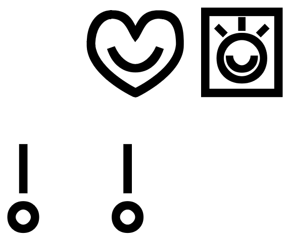

# toki pona

* [nasin toki pi toki pona](nasin-toki.md) *(Gramatiko de Tokipono — Grammar of Toki Pona)*
  * [sitelen pona musi](musi/sitelen/pona/sitelen-pona-musi.md) *(Eksperimentaj Hieroglifoj — Experimental Hieroglyphs)*

|  | 
|:--:| 
| *o pilin pona o pu!* |

## musi

* [ilo toki](musi/ilo-toki.md)
  * *(La Telefono — The Telephone)*
* [lipu jaki pi nimi ilo pi toki Losupan](musi/lipu-jaki-pi-nimi-ilo-pi-toki-losupan.md)
  * *(La Fia Loĵbana Konversacia Libro — The Dirty Hungarian Phrasebook)*
* [sitelen musi](musi/sitelen)
  * *(Memeoj — Memes)*

### musi (o pana e pona)

* [jan Nasa](musi/pk.srt)
  * *(P.K. — P.K.)*
* [soweli Wini Pu en jan pi ale ale ale](musi/soweli-wini-pu-en-jan-pi-ale-ale-ale.md)
  * *(Winnie la Pu — Winnie-The-Pooh and All, All, All)*

