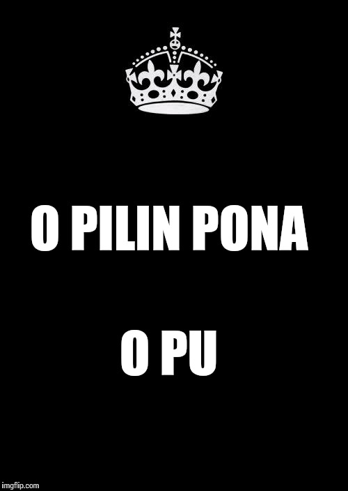

# Toki Pona

This creative work by Stephan Schneider is based on [the official Toki Pona book](http://www.amazon.com/gp/product/0978292308) and website: [http://tokipona.org](http://tokipona.org)

## Grammar

| [Parts of Speech, Word Classes and Dictionary](nasin-nimi.md) |
|:-|
| |
| [Official Toki Pona (ꜱᴏɴᴊᴀ)](pu.md) |
| [Frontier Toki Pona (ᴛᴇᴘᴀɴ)](sin.md) |
| [Traditional Toki Pona (ᴘɪᴊᴇ)](pije.md) |
| [Dialectal Toki Pona (ᴋɪᴘᴏ)](kipo.md) |

