# Toki Pona Dictionary
*(ale pi nimi mute pi toki pona)*

The dictionary below is based on [Toki Pona: The Language of Good](http://www.amazon.com/gp/product/0978292308) by **Sonja Lang**, the creator of **Toki Pona**. It has [deviations](ante.md) and contains contextualisations and translations not included in the [original](http://tokipona.net/tp/janpije/dictionary.php).

Context in **parenthesis** is optional.

| ala | jan pona pi lon ala → jan pona ala |
|:-|:-|
| ᴀᴅᴊᴇᴄᴛɪᴠᴇ (lon -) **false** | *false friend* |

Context in **quotation marks** is mandatory.

| insa | tomo li lon insa pi nena tu. |
|:-|:-|
| ɴᴏᴜɴ ("lon -") **between** | *The house is between two mountains.* |

🤔 — Suggested mandatory context.

| moli | ona li kama moli. → ona li moli. |
|:-|:-|
| ᴀᴅᴊᴇᴄᴛɪᴠᴇ 🤔 (kama -) **dying** | *He died.* |

---

| sitelen | paradigm | word | meaning |
|:-|:-|:-|:-|
|         | [**ɪɴᴛᴇʀᴊᴇᴄᴛɪᴏɴ**](nimi.md#interjection) | mu — **a**, ala | ᴘᴀʀᴛɪᴄʟᴇ **(emphasis, emotion or confirmation)**, indeed → ꜱᴇɴᴛᴇɴᴄᴇ yes |
| 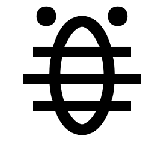    | [**ʟɪꜰᴇ-ꜰᴏʀᴍ ᴀᴅᴊᴇᴄᴛɪᴠᴇ**](nimi.md#life-form-adjective) | **akesi** — soweli | ᴀᴅᴊᴇᴄᴛɪᴠᴇ cold-blooded; not using Toki Pona in a Toki Pona context → ɴᴏᴜɴ **non-cute animal**; **amphibian**, **reptile**; monster |
| 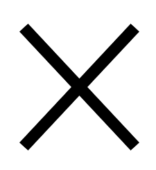      | [**ɪɴᴛᴇʀᴊᴇᴄᴛɪᴏɴ**](nimi.md#interjection) | mu — a, **ala** | ᴘᴀʀᴛɪᴄʟᴇ (negation), **not** → ꜱᴇɴᴛᴇɴᴄᴇ no |
|                                                        | [**ᴄᴏʀʀᴇʟᴀᴛɪᴠᴇ**](nimi.md#correlative) | **ala**, ale, ni, seme, wan | ᴀᴅᴊᴇᴄᴛɪᴠᴇ (lon -) false, **no**, non- → ɴᴏᴜɴ nothing |
|                                                        | [**ɴᴜᴍʙᴇʀ**](nimi.md#number) | **ala**, ale, esun, luka, mute, tu, wan | ᴀᴅᴊᴇᴄᴛɪᴠᴇ 0, **zero** → ɴᴏᴜɴ none |
|     | [**ꜱɪᴍᴘʟᴇ ᴠᴇʀʙ**](nimi.md#simple-verb) | **alasa**, pali, unpa | ᴠᴇʀʙ **to hunt**, **forage** |
|       | [**ᴄᴏʀʀᴇʟᴀᴛɪᴠᴇ**](nimi.md#correlative) | ala, **ale**, ni, seme, wan | ᴀᴅᴊᴇᴄᴛɪᴠᴇ (mute -) **every**; (wan -) **all**, entire, whole → ɴᴏᴜɴ **everything**; **life**, **universe** |
|                                                        | [**ɴᴜᴍʙᴇʀ**](nimi.md#number) | ala, **ale**, esun, luka, mute, tu, wan | ᴀᴅᴊᴇᴄᴛɪᴠᴇ infinite; **100**, 1000 → ɴᴏᴜɴ infinity; huge amount |
|                                                        | [**ꜱɪᴍᴘʟᴇ ᴀᴅᴊᴇᴄᴛɪᴠᴇ**](nimi.md#simple-adjective) | lili — **ale**, mute, suli, wawa | ᴀᴅᴊᴇᴄᴛɪᴠᴇ **abundant**, **countless**, **bountiful**, **plentiful**, ɴᴏᴜɴ **abundance** |
| 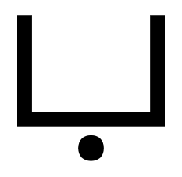     | [**ꜱᴘᴀᴛɪᴀʟ ᴀᴅᴊᴇᴄᴛɪᴠᴇ**](nimi.md#spatial-adjective) | **anpa** — sewi, lawa — noka | ᴀᴅᴊᴇᴄᴛɪᴠᴇ **bowing down**, **downward**, **humble**, **lowly**; **dependent** → ɴᴏᴜɴ area below, ("lon -") under; dependence |
| 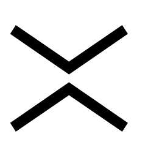     | [**ᴘʀᴇᴘᴏꜱɪᴛɪᴏɴ**](nimi.md#preposition) | **ante** — sama | ᴀᴅᴊᴇᴄᴛɪᴠᴇ **different**, **altered**, **changed**, **other**, ᴘʀᴇᴘᴏꜱɪᴛɪᴏɴ unlike |
|       | [**ᴄᴏɴᴊᴜɴᴄᴛɪᴏɴ**](nimi.md#conjunction) | **anu** — en | ᴘᴀʀᴛɪᴄʟᴇ (alternative), **or** |
|      | [**ꜱᴘᴀᴛɪᴀʟ ᴀᴅᴊᴇᴄᴛɪᴠᴇ**](nimi.md#spatial-adjective) | **awen**, kama, pini | ᴀᴅᴊᴇᴄᴛɪᴠᴇ **enduring**, **kept**, **protected**, **safe**; (- lon) **staying**, **waiting** → ɴᴏᴜɴ ("lon -") during |
|                                                        | [**ᴘʀᴇ-ᴠᴇʀʙ**](nimi.md#pre-verb) | **awen**, kama, pini | ᴠᴇʀʙ to continue → ᴘʀᴇ-ᴠᴇʀʙ **to continue to** |
|         | [**ᴘʜʀᴀꜱᴇ ᴘᴀʀᴛɪᴄʟᴇ**](nimi.md#phrase-particle) | **e**, li, o, pi | ᴘᴀʀᴛɪᴄʟᴇ **(before the direct object)** |
|        | [**ᴄᴏɴᴊᴜɴᴄᴛɪᴏɴ**](nimi.md#conjunction) | anu — **en** | ᴘᴀʀᴛɪᴄʟᴇ **(between multiple subjects)**, (between multiple ɴᴏᴜɴ-ᴘʜʀᴀꜱᴇs belonging to the same ᴘʜʀᴀꜱᴇ ᴘᴀʀᴛɪᴄʟᴇ), and, plus |
| 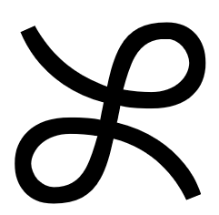     | [**ᴘʀᴇᴘᴏꜱɪᴛɪᴏɴ**](nimi.md#preposition) | **esun**, kepeken, pu | ᴀᴅᴊᴇᴄᴛɪᴠᴇ replacing, ɴᴏᴜɴ exchange, replacement; **business transaction**; **bazaar**, **fair**, **market**, **shop**, ᴘʀᴇᴘᴏꜱɪᴛɪᴏɴ instead of |
|                                                        | [**ɴᴜᴍʙᴇʀ**](nimi.md#number) | ala, ale, **esun**, luka, mute, tu, wan | ᴀᴅᴊᴇᴄᴛɪᴠᴇ 7, seven → ɴᴏᴜɴ sevenfold amount |
|       | [**ꜱɪᴍᴘʟᴇ ɴᴏᴜɴ**](nimi.md#noun) | **ijo**, ilo, jan, tenpo | ɴᴏᴜɴ [**being**](mama/lipu-pi-toki-pona.md#lesson-2), **matter**, **object**, **phenomenon**, [**something**](mama/lipu-pi-toki-pona.md#lesson-2), **thing**; area, location, place; case |
| 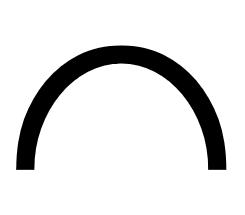      | [**ꜱɪᴍᴘʟᴇ ᴀᴅᴊᴇᴄᴛɪᴠᴇ**](nimi.md#simple-adjective) | pona — **ike**, nasa, pakala, utala | ᴀᴅᴊᴇᴄᴛɪᴠᴇ **bad**, **negative**; (sin -) **irrelevant**, **non-essential** |
|       | [**ꜱɪᴍᴘʟᴇ ɴᴏᴜɴ**](nimi.md#noun) | ijo, **ilo**, jan, tenpo | ɴᴏᴜɴ **device**, **implement**, **machine**, **tool**; body part |
| 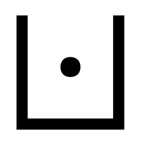     | [**ꜱᴘᴀᴛɪᴀʟ ᴀᴅᴊᴇᴄᴛɪᴠᴇ**](nimi.md#spatial-adjective) | weka — **insa**, monsi, poka, sinpin | ᴀᴅᴊᴇᴄᴛɪᴠᴇ inner → ɴᴏᴜɴ **centre**, **content**, **inside**; ("lon -") **between**; **internal organ**, **stomach** |
|      | [**ᴛʜɪɴɢ ᴀᴅᴊᴇᴄᴛɪᴠᴇ**](nimi.md#thing-adjective) | **jaki** — suwi | ᴀᴅᴊᴇᴄᴛɪᴠᴇ **disgusting**, **obscene**, **sickly**, **toxic**, **unclean**, **unsanitary**, [**yucky**](mama/lipu-pi-toki-pona.md#lesson-1) → ɴᴏᴜɴ dirt, poison, waste |
| 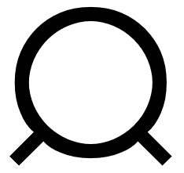      | [**ꜱɪᴍᴘʟᴇ ɴᴏᴜɴ**](nimi.md#noun) | ijo, ilo, **jan**, tenpo | ɴᴏᴜɴ **human being**, **person**, **somebody** |
|      | [**ꜱɪᴍᴘʟᴇ ᴀᴅᴊᴇᴄᴛɪᴠᴇ**](nimi.md#simple-adjective) | **jelo**, laso, loje | ᴀᴅᴊᴇᴄᴛɪᴠᴇ **yellow**, **yellowish** |
|        | [**ꜱɪᴍᴘʟᴇ ᴠᴇʀʙ**](nimi.md#simple-verb) | **jo**, pana | ᴠᴇʀʙ **to carry**, **contain**, **have**, **hold** |
| 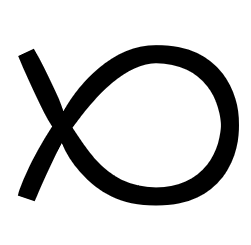     | [**ʟɪꜰᴇ-ꜰᴏʀᴍ ᴀᴅᴊᴇᴄᴛɪᴠᴇ**](nimi.md#life-form-adjective) | **kala**, kasi, pipi, waso | ᴀᴅᴊᴇᴄᴛɪᴠᴇ diving, swimming → ɴᴏᴜɴ **fish**, **marine animal**, **sea creature** |
|    | [**ꜱɪᴍᴘʟᴇ ᴀᴅᴊᴇᴄᴛɪᴠᴇ**](nimi.md#simple-adjective) | **kalama** | ᴀᴅᴊᴇᴄᴛɪᴠᴇ **producing a sound**, ᴠᴇʀʙ **to recite**, **utter aloud** |
| 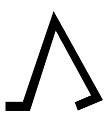     | [**ꜱᴘᴀᴛɪᴀʟ ᴀᴅᴊᴇᴄᴛɪᴠᴇ**](nimi.md#spatial-adjective) | awen, **kama**, pini | ᴀᴅᴊᴇᴄᴛɪᴠᴇ **future**, upcoming; (- lon) **arriving**, **coming**, [**emerging**](mama/lipu-pi-toki-pona.md#preface), **summoned** → ɴᴏᴜɴ ("lon -") before, beginning |
|                                                        | [**ᴘʀᴇ-ᴠᴇʀʙ**](nimi.md#pre-verb) | awen, **kama**, pini | ᴠᴇʀʙ to achieve → ᴘʀᴇ-ᴠᴇʀʙ **to become**; **manage to**, **succeed in** |
| 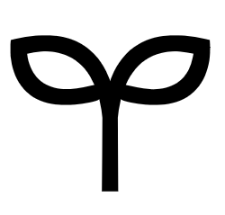     | [**ʟɪꜰᴇ-ꜰᴏʀᴍ ᴀᴅᴊᴇᴄᴛɪᴠᴇ**](nimi.md#life-form-adjective) | kala, **kasi**, pipi, waso | ᴀᴅᴊᴇᴄᴛɪᴠᴇ vegetating → ɴᴏᴜɴ **plant**, **vegetation**; **herb**, **leaf** |
| 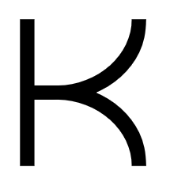      | [**ꜱɪᴍᴘʟᴇ ᴀᴅᴊᴇᴄᴛɪᴠᴇ**](nimi.md#simple-adjective) | **ken**, wile | ᴀᴅᴊᴇᴄᴛɪᴠᴇ **possible** |
|                                                        | [**ᴘʀᴇ-ᴠᴇʀʙ**](nimi.md#pre-verb) | **ken**, olin, open, wile | ᴠᴇʀʙ to allow for → ᴘʀᴇ-ᴠᴇʀʙ **to be able to**, **be allowed to**, **can**, **may** |
| 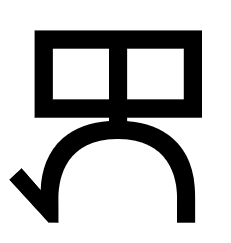  | [**ᴘʀᴇᴘᴏꜱɪᴛɪᴏɴ**](nimi.md#preposition) | esun, **kepeken**, pu | ᴀᴅᴊᴇᴄᴛɪᴠᴇ usufructuary, ᴘʀᴇᴘᴏꜱɪᴛɪᴏɴ **by means of**, **using**, **with** |
|      | [**ᴛʜɪɴɢ ᴀᴅᴊᴇᴄᴛɪᴠᴇ**](nimi.md#thing-adjective) | **kili**, pan | ᴀᴅᴊᴇᴄᴛɪᴠᴇ hanging → ɴᴏᴜɴ **fruit**; [**banana**](mama/lipu-pi-toki-pona.md#lesson-2), [**blueberry**](mama/lipu-pi-toki-pona.md#lesson-2), [**kumquat**](mama/lipu-pi-toki-pona.md#what-is-toki-pona), [**lingonberry**](mama/lipu-pi-toki-pona.md#what-is-toki-pona), [**orange**](mama/lipu-pi-toki-pona.md#lesson-5); **mushroom**, **vegetable**; [**turnip**](mama/lipu-pi-toki-pona.md#what-is-toki-pona) |
|     | [**ᴛʜɪɴɢ ᴀᴅᴊᴇᴄᴛɪᴠᴇ**](nimi.md#thing-adjective) | **kiwen**, ko, kon, telo | ᴀᴅᴊᴇᴄᴛɪᴠᴇ hard → ɴᴏᴜɴ **hard object**, **metal**, **rock**, **stone** |
| 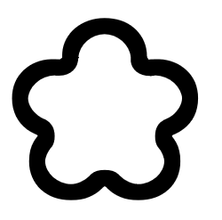       | [**ᴛʜɪɴɢ ᴀᴅᴊᴇᴄᴛɪᴠᴇ**](nimi.md#thing-adjective) | kiwen, **ko**, kon, telo | ᴀᴅᴊᴇᴄᴛɪᴠᴇ semi-solid → ɴᴏᴜɴ **clay**, **clinging form**, **dough**, **semi-solid**, **paste**, **powder** |
|       | [**ᴛʜɪɴɢ ᴀᴅᴊᴇᴄᴛɪᴠᴇ**](nimi.md#thing-adjective) | kiwen, ko, **kon**, telo | ᴀᴅᴊᴇᴄᴛɪᴠᴇ floating, hovering → ɴᴏᴜɴ **air**, **breath**; **essence**, **spirit**; (- insa) meaning, [**soul**](mama/lipu-pi-toki-pona.md#preface); **hidden reality**, **unseen agent** |
| 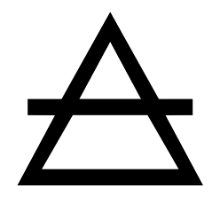     | [**ꜱɪᴍᴘʟᴇ ᴀᴅᴊᴇᴄᴛɪᴠᴇ**](nimi.md#simple-adjective) | **kule** — walo | ᴀᴅᴊᴇᴄᴛɪᴠᴇ **colourful**, **painted**; **pigmented**; brown |
| 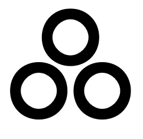   | [**ᴛʜɪɴɢ ᴀᴅᴊᴇᴄᴛɪᴠᴇ**](nimi.md#thing-adjective) | **kulupu** — sijelo | ᴀᴅᴊᴇᴄᴛɪᴠᴇ common, reciprocal → ɴᴏᴜɴ **community**, **company**, **group**, **nation**, relationship, **society**, **tribe**  |
|      | [**ᴛᴏᴏʟ ᴠᴇʀʙ**](nimi.md#tool-verb) | **kute**, lawa, len, luka, lukin, noka, palisa, pilin, poki, selo, tomo, uta | ᴠᴇʀʙ **to hear**, **listen**; (- ale) [**listen to**](mama/lipu-pi-toki-pona.md#lesson-5), **pay attention to**, **obey** → ɴᴏᴜɴ **ear** |
|        | [**ᴘʀᴇ-ᴘʜʀᴀꜱᴇ ᴘᴀʀᴛɪᴄʟᴇ**](nimi.md#pre-phrase-particle) | **la**, taso | ᴘᴀʀᴛɪᴄʟᴇ **(between the context phrase and the main sentence)** |
| 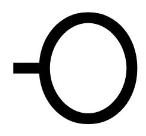     | [**ꜱɪᴍᴘʟᴇ ᴀᴅᴊᴇᴄᴛɪᴠᴇ**](nimi.md#simple-adjective) | **lape**, moli, musi | ᴀᴅᴊᴇᴄᴛɪᴠᴇ **resting**, **sleeping** |
| 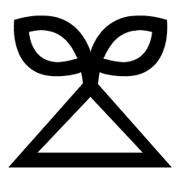     | [**ꜱɪᴍᴘʟᴇ ᴀᴅᴊᴇᴄᴛɪᴠᴇ**](nimi.md#simple-adjective) | jelo, **laso**, loje | ᴀᴅᴊᴇᴄᴛɪᴠᴇ **blue**, **green**; immature |
|      | [**ᴛᴏᴏʟ ᴠᴇʀʙ**](nimi.md#tool-verb) | kute, **lawa**, len, luka, lukin, noka, palisa, pilin, poki, selo, tomo, uta | ᴠᴇʀʙ **to control**, **direct**, **guide**, **lead**, **own**, **plan**, **regulate**, **rule** → ɴᴏᴜɴ **head**, **mind** |
|                                                        | [**ꜱᴘᴀᴛɪᴀʟ ᴀᴅᴊᴇᴄᴛɪᴠᴇ**](nimi.md#spatial-adjective) | anpa — sewi, **lawa** — noka | ᴀᴅᴊᴇᴄᴛɪᴠᴇ upper → ɴᴏᴜɴ highest part, upper area |
|       | [**ᴛᴏᴏʟ ᴠᴇʀʙ**](nimi.md#tool-verb) | kute, lawa, **len**, luka, lukin, noka, palisa, pilin, poki, selo, tomo, uta | ᴠᴇʀʙ to cover; (- ale) hide → ɴᴏᴜɴ **cloth**, **clothing**, **fabric**, **textile**; **cover**, **layer of privacy** |
| 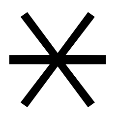     | [**ᴛʜɪɴɢ ᴀᴅᴊᴇᴄᴛɪᴠᴇ**](nimi.md#thing-adjective) | **lete** — seli | ᴀᴅᴊᴇᴄᴛɪᴠᴇ **cold**, **cool**; **uncooked**, **raw** → ɴᴏᴜɴ frost, ice |
| 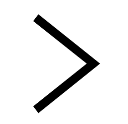       | [**ᴘʜʀᴀꜱᴇ ᴘᴀʀᴛɪᴄʟᴇ**](nimi.md#phrase-particle) | e, **li**, o, pi | ᴘᴀʀᴛɪᴄʟᴇ **(between any subject except mi alone or sina alone and its predicate; also to introduce a new predicate for the same subject)** |
| 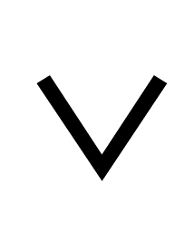     | [**ꜱɪᴍᴘʟᴇ ᴀᴅᴊᴇᴄᴛɪᴠᴇ**](nimi.md#simple-adjective) | **lili** — ale, mute, suli, wawa | ᴀᴅᴊᴇᴄᴛɪᴠᴇ **little**, [**micro-**](mama/lipu-pi-toki-pona.md#preface), **small**, **short**; [**120**](mama/lipu-pi-toki-pona.md#preface), **few**; **a bit**; **young** |
|     | [**ᴛʜɪɴɢ ᴀᴅᴊᴇᴄᴛɪᴠᴇ**](nimi.md#thing-adjective) | **linja** — palisa | ᴀᴅᴊᴇᴄᴛɪᴠᴇ long and flexible → ɴᴏᴜɴ **long and flexible thing**; **cord**, **hair**, **rope**, **thread**, **yarn** |
| 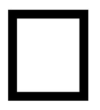     | [**ᴛʜɪɴɢ ᴀᴅᴊᴇᴄᴛɪᴠᴇ**](nimi.md#thing-adjective) | **lipu**, nena, sike | ᴀᴅᴊᴇᴄᴛɪᴠᴇ flat, thin → ɴᴏᴜɴ **flat object**; **card**, [**clay tablet**](mama/lipu-pi-toki-pona.md#what-is-toki-pona), **document**, **paper**, [**piece of paper**](mama/lipu-pi-toki-pona.md#lesson-2), [**postcard**](mama/lipu-pi-toki-pona.md#what-is-toki-pona), **record**, **website**; (mute -) **book**, [**printed book**](mama/lipu-pi-toki-pona.md#what-is-toki-pona) |
|      | [**ꜱɪᴍᴘʟᴇ ᴀᴅᴊᴇᴄᴛɪᴠᴇ**](nimi.md#simple-adjective) | jelo, laso, **loje** | ᴀᴅᴊᴇᴄᴛɪᴠᴇ **red**, **reddish** |
| 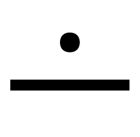      | [**ᴘʀᴇᴘᴏꜱɪᴛɪᴏɴ**](nimi.md#preposition) | **lon**, tan, tawa | ᴀᴅᴊᴇᴄᴛɪᴠᴇ being present, **existing**, **real**, (- a) **true**, ᴘʀᴇᴘᴏꜱɪᴛɪᴏɴ **located at**, **present at** |
|      | [**ᴛᴏᴏʟ ᴠᴇʀʙ**](nimi.md#tool-verb) | kute, lawa, len, **luka**, lukin, noka, palisa, pilin, poki, selo, tomo, uta | ᴠᴇʀʙ to manipulate, touch → ɴᴏᴜɴ **arm**, **hand**, **tactile organ** |
|                                                        | [**ɴᴜᴍʙᴇʀ**](nimi.md#number) | ala, ale, esun, **luka**, mute, tu, wan | ᴀᴅᴊᴇᴄᴛɪᴠᴇ 5, **five** → ɴᴏᴜɴ fivefold amount |
|     | [**ᴛᴏᴏʟ ᴠᴇʀʙ**](nimi.md#tool-verb) | kute, lawa, len, luka, **lukin**, noka, palisa, pilin, poki, selo, tomo, uta | ᴠᴇʀʙ **to examine**, **look at**, **observe**, **read**, [**search**](mama/lipu-pi-toki-pona.md#preface), **see**, **watch** → ɴᴏᴜɴ **eye** |
|                                                        | [**ᴘʀᴇ-ᴠᴇʀʙ**](nimi.md#pre-verb) | **lukin**, pilin, sona | ᴠᴇʀʙ to care for → ᴘʀᴇ-ᴠᴇʀʙ **to seek**, **look for**, **try to** |
|      | [**ᴛʜɪɴɢ ᴀᴅᴊᴇᴄᴛɪᴠᴇ**](nimi.md#thing-adjective) | **lupa**, nasin | ᴀᴅᴊᴇᴄᴛɪᴠᴇ hollow → ɴᴏᴜɴ (- tomo) **door**, **hole**, **orifice**, (- suno) **window** |
|        | [**ᴛʜɪɴɢ ᴀᴅᴊᴇᴄᴛɪᴠᴇ**](nimi.md#thing-adjective) | **ma**, mun | ᴀᴅᴊᴇᴄᴛɪᴠᴇ vast → ɴᴏᴜɴ expanse; **earth**, **land**; **outdoors**, **world**; **country**, **territory**; **soil** |
| 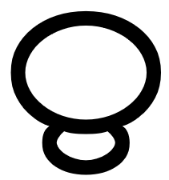     | [**ᴘᴇʀꜱᴏɴ ᴀᴅᴊᴇᴄᴛɪᴠᴇ**](nimi.md#person-adjective) | **mama** | ᴀᴅᴊᴇᴄᴛɪᴠᴇ original → ɴᴏᴜɴ **ancestor**, **parent**; **creator**, **originator**; **caretaker**, **sustainer** |
| 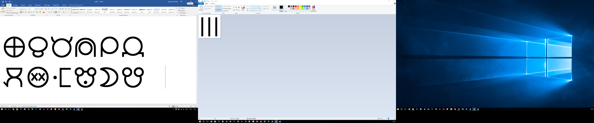     | [**ᴛʜɪɴɢ ᴀᴅᴊᴇᴄᴛɪᴠᴇ**](nimi.md#thing-adjective) | **mani** | ᴀᴅᴊᴇᴄᴛɪᴠᴇ domesticated, mined; valueable → ɴᴏᴜɴ **large domesticated animal**, resource; **cash**, **money**, **savings**, **wealth** |
|      | [**ᴘᴇʀꜱᴏɴ ᴀᴅᴊᴇᴄᴛɪᴠᴇ**](nimi.md#person-adjective) | **meli** — mije | ᴀᴅᴊᴇᴄᴛɪᴠᴇ [**female**](mama/lipu-pi-toki-pona.md#lesson-3), feminine → ɴᴏᴜɴ **female**, **feminine person**, **woman**; **wife** |
|        | [**ᴘʀᴏɴᴏᴜɴ**](nimi.md#noun) | **mi**, ona, sina | ɴᴏᴜɴ **I**/**me**, **we**/**us**, ᴀᴅᴊᴇᴄᴛɪᴠᴇ my, our |
| 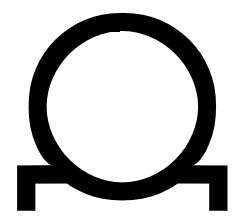     | [**ᴘᴇʀꜱᴏɴ ᴀᴅᴊᴇᴄᴛɪᴠᴇ**](nimi.md#person-adjective) | meli — **mije** | ᴀᴅᴊᴇᴄᴛɪᴠᴇ masculine → ɴᴏᴜɴ **male**, **man**, **masculine person**; **husband** |
|      | [**ᴛʜɪɴɢ ᴠᴇʀʙ**](nimi.md#thing-verb) | **moku** | ᴠᴇʀʙ **to consume**, **drink**, **eat**, **ingest**, **swallow** → ɴᴏᴜɴ mouthful; food |
| 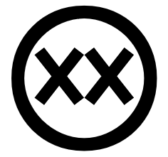     | [**ꜱɪᴍᴘʟᴇ ᴀᴅᴊᴇᴄᴛɪᴠᴇ**](nimi.md#simple-adjective) | lape, **moli**, musi | ᴀᴅᴊᴇᴄᴛɪᴠᴇ **dead**, 🤔 (kama -) **dying** |
|     | [**ꜱᴘᴀᴛɪᴀʟ ᴀᴅᴊᴇᴄᴛɪᴠᴇ**](nimi.md#spatial-adjective) | weka — insa, **monsi**, poka, sinpin | ᴀᴅᴊᴇᴄᴛɪᴠᴇ rear → ɴᴏᴜɴ **back**, ("lon -") **behind**, **rear** |
| 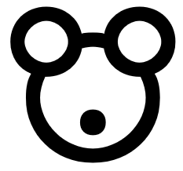       | [**ɪɴᴛᴇʀᴊᴇᴄᴛɪᴏɴ**](nimi.md#interjection) | **mu** — a, ala | ᴘᴀʀᴛɪᴄʟᴇ **(animal noise or communication)**, (indifference), -ish → ꜱᴇɴᴛᴇɴᴄᴇ blah, [**moo**](mama/lipu-pi-toki-pona.md#lesson-1) |
|       | [**ᴛʜɪɴɢ ᴀᴅᴊᴇᴄᴛɪᴠᴇ**](nimi.md#thing-adjective) | ma, **mun** | ᴀᴅᴊᴇᴄᴛɪᴠᴇ sky-walking at night → ɴᴏᴜɴ **moon**, **night sky object**, **star** |
| 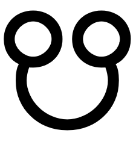     | [**ꜱɪᴍᴘʟᴇ ᴀᴅᴊᴇᴄᴛɪᴠᴇ**](nimi.md#simple-adjective) | lape, moli, **musi** | ᴀᴅᴊᴇᴄᴛɪᴠᴇ **artistic**, **entertaining**, **frivolous**, **playful**, **recreational** |
| 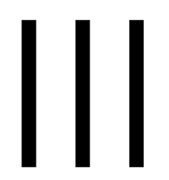     | [**ꜱɪᴍᴘʟᴇ ᴀᴅᴊᴇᴄᴛɪᴠᴇ**](nimi.md#simple-adjective) | lili — ale, **mute**, suli, wawa | ᴀᴅᴊᴇᴄᴛɪᴠᴇ **a lot**, **many**, (- sin) **more**, **much**, **several**, **very**, ɴᴏᴜɴ **quantity** |
|                                                        | [**ɴᴜᴍʙᴇʀ**](nimi.md#number) | ala, ale, esun, luka, **mute**, tu, wan | ᴀᴅᴊᴇᴄᴛɪᴠᴇ 3, three; <i>**three (or more)**</i>, many → ɴᴏᴜɴ threefold amount; set |
|     | [**ꜱɪᴍᴘʟᴇ ᴀᴅᴊᴇᴄᴛɪᴠᴇ**](nimi.md#simple-adjective) | **nanpa** | ᴀᴅᴊᴇᴄᴛɪᴠᴇ to be one's turn, ᴠᴇʀʙ to count, iterate, ɴᴏᴜɴ iteration, **number**, turn |
|                                                        | [**ꜱɪᴍᴘʟᴇ ᴘᴀʀᴛɪᴄʟᴇ**](nimi.md#simple-particle) | **nanpa** | ᴘᴀʀᴛɪᴄʟᴇ **(ordinal number)**, **-th** |
|      | [**ꜱɪᴍᴘʟᴇ ᴀᴅᴊᴇᴄᴛɪᴠᴇ**](nimi.md#simple-adjective) | pona — ike, **nasa**, pakala, utala | ᴀᴅᴊᴇᴄᴛɪᴠᴇ **strange**, **unusual**; **crazy**, **foolish**; **drunk**, **intoxicated** |
|     | [**ᴛʜɪɴɢ ᴀᴅᴊᴇᴄᴛɪᴠᴇ**](nimi.md#thing-adjective) | lupa, **nasin** | ᴀᴅᴊᴇᴄᴛɪᴠᴇ cracked → ɴᴏᴜɴ line, solution; **custom**, **doctrine**, **method**, **path**, **road**, [**system**](mama/lipu-pi-toki-pona.md#preface), **way** |
| 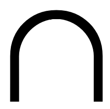     | [**ᴛʜɪɴɢ ᴀᴅᴊᴇᴄᴛɪᴠᴇ**](nimi.md#thing-adjective) | lipu, **nena**, sike | ᴀᴅᴊᴇᴄᴛɪᴠᴇ outstanding, thick → ɴᴏᴜɴ **bump**, **button**, **hill**, key, **mountain**, **nose**, **protuberance** |
|        | [**ᴄᴏʀʀᴇʟᴀᴛɪᴠᴇ**](nimi.md#correlative) | ala, ale, **ni**, seme, wan | ᴀᴅᴊᴇᴄᴛɪᴠᴇ **this**/**that** → ɴᴏᴜɴ this/that one |
|      | [**ᴛʜɪɴɢ ᴠᴇʀʙ**](nimi.md#thing-verb) | **nimi**, sitelen, sona, toki | ᴠᴇʀʙ to define, name → ɴᴏᴜɴ definition, **name**, (mute -) sentence, **word** |
| 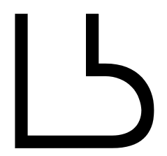     | [**ᴛᴏᴏʟ ᴠᴇʀʙ**](nimi.md#tool-verb) | kute, lawa, len, luka, lukin, **noka**, palisa, pilin, poki, selo, tomo, uta | ᴠᴇʀʙ to step on, kick → ɴᴏᴜɴ **foot**, **leg**, **organ of locomotion** |
|                                                        | [**ꜱᴘᴀᴛɪᴀʟ ᴀᴅᴊᴇᴄᴛɪᴠᴇ**](nimi.md#spatial-adjective) | anpa — sewi, lawa, **noka** | ᴀᴅᴊᴇᴄᴛɪᴠᴇ basic, lower → ɴᴏᴜɴ base, **bottom**, **lowest part** |
|         | [**ᴘʜʀᴀꜱᴇ ᴘᴀʀᴛɪᴄʟᴇ**](nimi.md#phrase-particle) | e, li, **o**, pi | ᴘᴀʀᴛɪᴄʟᴇ **(vocative or imperative)**, (volative), (- kute) **hey**, (sina -) **o** |
| 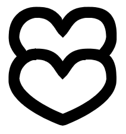     | [**ᴘʀᴇ-ᴠᴇʀʙ**](nimi.md#pre-verb) | ken, **olin**, open, wile | ᴠᴇʀʙ [**to be a fan of**](mama/lipu-pi-toki-pona.md#preface), **have compassion for**, **love**, **respect**, **show affection to** → ᴘʀᴇ-ᴠᴇʀʙ to love to |
| 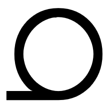      | [**ᴘʀᴏɴᴏᴜɴ**](nimi.md#noun) | mi, **ona**, sina | ɴᴏᴜɴ **he**/him, **it**, **she**/her, **they**/them, ᴀᴅᴊᴇᴄᴛɪᴠᴇ her, his, its, their |
| 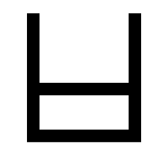     | [**ꜱɪᴍᴘʟᴇ ᴀᴅᴊᴇᴄᴛɪᴠᴇ**](nimi.md#simple-adjective) | **open** — selo | ᴀᴅᴊᴇᴄᴛɪᴠᴇ open, ᴠᴇʀʙ **to open** |
|                                                        | [**ᴘʀᴇ-ᴠᴇʀʙ**](nimi.md#pre-verb) | ken, olin, **open**, wile | ᴠᴇʀʙ to set up, **turn on**; **begin**, **start** → ᴘʀᴇ-ᴠᴇʀʙ to be ready to |
|    | [**ꜱɪᴍᴘʟᴇ ᴀᴅᴊᴇᴄᴛɪᴠᴇ**](nimi.md#simple-adjective) | pona — ike, nasa, **pakala**, utala | ᴀᴅᴊᴇᴄᴛɪᴠᴇ **botched**, **broken**, **damaged**, **harmed**, **messed up** |
|      | [**ꜱɪᴍᴘʟᴇ ᴠᴇʀʙ**](nimi.md#simple-verb) | alasa, **pali**, unpa | ᴠᴇʀʙ **to do**, **take action on**, **work on**; (- ale) **build**, **make**, **prepare** |
| 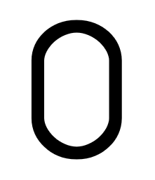   | [**ᴛʜɪɴɢ ᴀᴅᴊᴇᴄᴛɪᴠᴇ**](nimi.md#thing-adjective) | linja — **palisa** | ᴀᴅᴊᴇᴄᴛɪᴠᴇ long and hard → ɴᴏᴜɴ **long hard thing**; **branch**, **rod**, **stick** |
|                                                        | [**ᴛᴏᴏʟ ᴠᴇʀʙ**](nimi.md#tool-verb) | kute, lawa, len, luka, lukin, noka, **palisa**, pilin, poki, selo, tomo, uta | ᴠᴇʀʙ to point to → ɴᴏᴜɴ finger |
|       | [**ᴛʜɪɴɢ ᴀᴅᴊᴇᴄᴛɪᴠᴇ**](nimi.md#thing-adjective) | kili, **pan** | ᴀᴅᴊᴇᴄᴛɪᴠᴇ falling → ɴᴏᴜɴ seed, **cereal**, **grain**; **barley**, **corn**, **oat**, **rice**, **wheat**; **bread**, **pasta** |
| 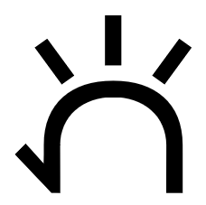     | [**ꜱɪᴍᴘʟᴇ ᴠᴇʀʙ**](nimi.md#simple-verb) | jo, **pana** | ᴠᴇʀʙ **to emit**, **give**, **provide**, **put**, **release**,  **send** |
| 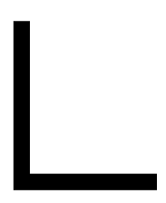       | [**ᴘʜʀᴀꜱᴇ ᴘᴀʀᴛɪᴄʟᴇ**](nimi.md#phrase-particle) | e, li, o, **pi** | ᴘᴀʀᴛɪᴄʟᴇ (between two ɴᴏᴜɴ-ᴘʜʀᴀꜱᴇs), **of** |
| 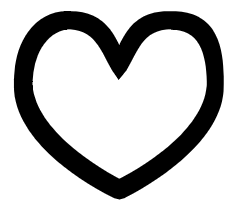    | [**ᴛᴏᴏʟ ᴠᴇʀʙ**](nimi.md#tool-verb) | kute, lawa, len, luka, lukin, noka, palisa, **pilin**, poki, selo, tomo, uta | ᴠᴇʀʙ to empathize, sense ­→ ɴᴏᴜɴ **heart (physical or emotional)** |
|                                                        | [**ᴘʀᴇ-ᴠᴇʀʙ**](nimi.md#pre-verb) | lukin, **pilin**, sona | ᴠᴇʀʙ to feel, 👎 think, ᴀᴅᴊᴇᴄᴛɪᴠᴇ **feeling (an emotion, a direct experience)** → ᴘʀᴇ-ᴠᴇʀʙ to feel (like) |
| 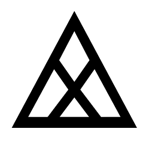   | [**ꜱɪᴍᴘʟᴇ ᴀᴅᴊᴇᴄᴛɪᴠᴇ**](nimi.md#simple-adjective) | **pimeja** — walo | ᴀᴅᴊᴇᴄᴛɪᴠᴇ **black** |
|                                                        | [**ᴛʜɪɴɢ ᴀᴅᴊᴇᴄᴛɪᴠᴇ**](nimi.md#thing-adjective) | **pimeja** — suno | ᴀᴅᴊᴇᴄᴛɪᴠᴇ **dark**, **unlit** → ɴᴏᴜɴ shadow |
|      | [**ꜱᴘᴀᴛɪᴀʟ ᴀᴅᴊᴇᴄᴛɪᴠᴇ**](nimi.md#spatial-adjective) | awen, kama, **pini** | ᴀᴅᴊᴇᴄᴛɪᴠᴇ **ago**, **completed**, **ended**, **finished**, **past** → ɴᴏᴜɴ ("lon -") after, end |
|                                                        | [**ᴘʀᴇ-ᴠᴇʀʙ**](nimi.md#pre-verb) | awen, kama, **pini** | ᴠᴇʀʙ to stop → ᴘʀᴇ-ᴠᴇʀʙ to stop to |
|      | [**ʟɪꜰᴇ-ꜰᴏʀᴍ ᴀᴅᴊᴇᴄᴛɪᴠᴇ**](nimi.md#life-form-adjective) | kala, kasi, **pipi**, waso | ᴀᴅᴊᴇᴄᴛɪᴠᴇ crawling, creeping → ɴᴏᴜɴ **ant**, **bug**, **insect**, **spider** |
| 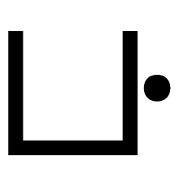     | [**ꜱᴘᴀᴛɪᴀʟ ᴀᴅᴊᴇᴄᴛɪᴠᴇ**](nimi.md#spatial-adjective) | weka — insa, monsi, **poka**, sinpin | ᴀᴅᴊᴇᴄᴛɪᴠᴇ lateral; **nearby** → ɴᴏᴜɴ **hip**, **side**; ("lon -") **next to**, **vicinity**, ("tawa -") than |
|      | [**ᴛᴏᴏʟ ᴠᴇʀʙ**](nimi.md#tool-verb) | kute, lawa, len, luka, lukin, noka, palisa, pilin, **poki**, selo, tomo, uta | ᴠᴇʀʙ to be full of, collect, contain → ɴᴏᴜɴ bladder; **bag**, **bowl**, **box**, **container**, **cup**, **cupboard**, **drawer**, **vessel** |
| 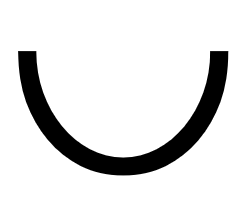     | [**ꜱɪᴍᴘʟᴇ ᴀᴅᴊᴇᴄᴛɪᴠᴇ**](nimi.md#simple-adjective) | **pona** – ike, nasa, pakala, utala | ᴀᴅᴊᴇᴄᴛɪᴠᴇ **good**, **positive**, **useful**; **friendly**, **peaceful**; **simple** |
| 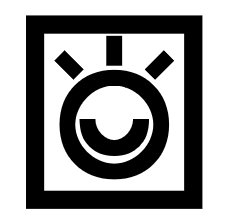       | [**ᴘʀᴇᴘᴏꜱɪᴛɪᴏɴ**](nimi.md#preposition) | esun, kepeken, **pu** | ᴀᴅᴊᴇᴄᴛɪᴠᴇ according; [**holding the Toki Pona book**](mama/lipu-pi-toki-pona.md#preface), **interacting with the Toki Pona book** ᴘʀᴇᴘᴏꜱɪᴛɪᴏɴ according to |
|                                                        | [**ꜱɪᴍᴘʟᴇ ᴘᴀʀᴛɪᴄʟᴇ**](nimi.md#simple-particle) | **Pu** | ᴘᴀʀᴛɪᴄʟᴇ name of the Toki Pona book |
|      | [**ᴘʀᴇᴘᴏꜱɪᴛɪᴏɴ**](nimi.md#preposition) | ante — **sama** | ᴀᴅᴊᴇᴄᴛɪᴠᴇ **same**, **similar**; -self, -selves; **each other**; **fellow**, **peer**, **sibling**, ᴘʀᴇᴘᴏꜱɪᴛɪᴏɴ **as**, **like** |
|      | [**ᴛʜɪɴɢ ᴀᴅᴊᴇᴄᴛɪᴠᴇ**](nimi.md#thing-adjective) | lete — **seli** | ᴀᴅᴊᴇᴄᴛɪᴠᴇ warm; cooked → ɴᴏᴜɴ **chemical reaction**, **fire**, **heat source**; **cooking element** |
| 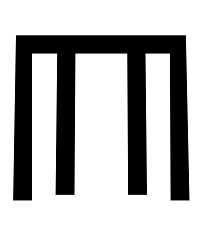     | [**ᴛᴏᴏʟ ᴠᴇʀʙ**](nimi.md#tool-verb) | kute, lawa, len, luka, lukin, noka, palisa, pilin, poki, **selo**, tomo, uta | ᴠᴇʀʙ to form → ɴᴏᴜɴ [**form**](mama/lipu-pi-toki-pona.md#preface), **outer form**, **outer layer**; **bark**, **peel**, **shell**, **skin**; **boundary** |
|                                                        | [**ꜱɪᴍᴘʟᴇ ᴀᴅᴊᴇᴄᴛɪᴠᴇ**](nimi.md#simple-adjective) | open — **selo** | ᴀᴅᴊᴇᴄᴛɪᴠᴇ closed, confined, isolated |
| 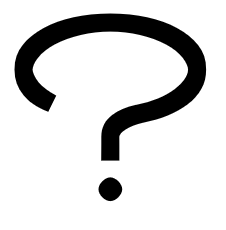     | [**ᴄᴏʀʀᴇʟᴀᴛɪᴠᴇ**](nimi.md#correlative) | ala, ale, ni, **seme**, wan | ᴀᴅᴊᴇᴄᴛɪᴠᴇ **what**, **which** → ɴᴏᴜɴ what, which one |
| 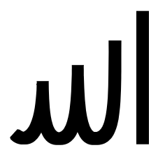     | [**ꜱᴘᴀᴛɪᴀʟ ᴀᴅᴊᴇᴄᴛɪᴠᴇ**](nimi.md#spatial-adjective) | anpa — **sewi**, lawa — noka | ᴀᴅᴊᴇᴄᴛɪᴠᴇ high; **awe-inspiring**, **divine**, **sacred**, **supernatural** → ɴᴏᴜɴ **area above**, 🤔 **highest part**; ("lon -") over, **something elevated**; [**the Divine**](mama/lipu-pi-toki-pona.md#preface) |
|    | [**ᴛʜɪɴɢ ᴀᴅᴊᴇᴄᴛɪᴠᴇ**](nimi.md#thing-adjective) | kulupu — **sijelo** | ᴀᴅᴊᴇᴄᴛɪᴠᴇ individual; alive → ɴᴏᴜɴ **body (of person or animal)**, **torso**; life-form; health, **physical state** |
|      | [**ᴛʜɪɴɢ ᴀᴅᴊᴇᴄᴛɪᴠᴇ**](nimi.md#thing-adjective) | lipu, nena, **sike** | ᴀᴅᴊᴇᴄᴛɪᴠᴇ round or circular; (- suno) **of one year** → ɴᴏᴜɴ **round or circular thing**; **ball**, **circle**, **cycle**, **sphere**, **wheel**, (- suno) year |
|       | [**ᴘʀᴇᴘᴏꜱɪᴛɪᴏɴ**](nimi.md#preposition) | **sin**, taso | ᴀᴅᴊᴇᴄᴛɪᴠᴇ **new**, **fresh**; **additional**, **another**, **extra**, ᴘʀᴇᴘᴏꜱɪᴛɪᴏɴ in addition to, with |
|      | [**ᴘʀᴏɴᴏᴜɴ**](nimi.md#noun) | mi, ona, **sina** | ɴᴏᴜɴ **you**, ᴀᴅᴊᴇᴄᴛɪᴠᴇ your |
| 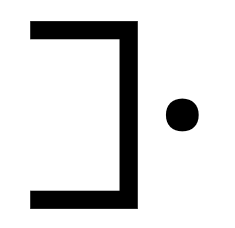   | [**ꜱᴘᴀᴛɪᴀʟ ᴀᴅᴊᴇᴄᴛɪᴠᴇ**](nimi.md#spatial-adjective) | weka — insa, monsi, poka, **sinpin** | ᴀᴅᴊᴇᴄᴛɪᴠᴇ **foremost**, frontal → ɴᴏᴜɴ ("lon -") before, (- sijelo) chest, (- lawa) **face**, **front**, **wall** |
| 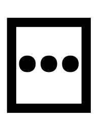  | [**ᴛʜɪɴɢ ᴠᴇʀʙ**](nimi.md#thing-verb) | nimi, **sitelen**, sona, toki | ᴠᴇʀʙ to draw, indicate, project, represent, sculpture → ɴᴏᴜɴ **image**, **picture**, projection, **representation**, sculpture, **symbol**, **mark**, **writing** |
|      | [**ᴛʜɪɴɢ ᴠᴇʀʙ**](nimi.md#thing-verb) | nimi, sitelen, **sona**, toki | ᴠᴇʀʙ [**to be knowledgeable of**](mama/lipu-pi-toki-pona.md#lesson-5), **be wise about**, **have information on**, **know** → ɴᴏᴜɴ knowledge |
|                                                        | [**ᴘʀᴇ-ᴠᴇʀʙ**](nimi.md#pre-verb) | lukin, pilin, **sona** | ᴠᴇʀʙ **to be skilled in** → ᴘʀᴇ-ᴠᴇʀʙ **to know how to** |
| 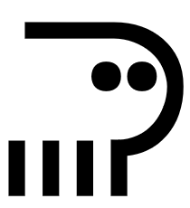   | [**ʟɪꜰᴇ-ꜰᴏʀᴍ ᴀᴅᴊᴇᴄᴛɪᴠᴇ**](nimi.md#life-form-adjective) | akesi — **soweli** | ᴀᴅᴊᴇᴄᴛɪᴠᴇ warm-blooded → ɴᴏᴜɴ **animal**, **beast**, **land mammal**; [**bear**](mama/lipu-pi-toki-pona.md#lesson-2); (ijo -) [**meat**](mama/lipu-pi-toki-pona.md#lesson-5) |
| 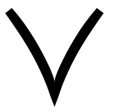     | [**ꜱɪᴍᴘʟᴇ ᴀᴅᴊᴇᴄᴛɪᴠᴇ**](nimi.md#simple-adjective) | lili — ale, mute, **suli**, wawa | ᴀᴅᴊᴇᴄᴛɪᴠᴇ **big**, **heavy**, **large**, **long**, **tall**; **important**; **adult** |
|      | [**ᴛʜɪɴɢ ᴀᴅᴊᴇᴄᴛɪᴠᴇ**](nimi.md#thing-adjective) | pimeja — **suno** | ᴀᴅᴊᴇᴄᴛɪᴠᴇ bright, lit → ɴᴏᴜɴ **sun**; **brightness**, **glow**, **light**, **radiance**, **shine**; **light source** |
|      | [**ꜱᴘᴀᴛɪᴀʟ ᴀᴅᴊᴇᴄᴛɪᴠᴇ**](nimi.md#spatial-adjective) | **supa** | ᴀᴅᴊᴇᴄᴛɪᴠᴇ horizontal → ɴᴏᴜɴ **horizontal surface**, ("lon -") on; **thing to put or rest something on**; bed, chair, shelf, (mute -) stairs, table; ("lon -") lying, sitting |
|      | [**ᴛʜɪɴɢ ᴀᴅᴊᴇᴄᴛɪᴠᴇ**](nimi.md#thing-adjective) | jaki — **suwi** | ᴀᴅᴊᴇᴄᴛɪᴠᴇ **fragrant**, **sweet**; **adorable**, **cute**, **innocent** → ɴᴏᴜɴ sweets |
|       | [**ᴘʀᴇᴘᴏꜱɪᴛɪᴏɴ**](nimi.md#preposition) | lon, **tan**, tawa | ᴀᴅᴊᴇᴄᴛɪᴠᴇ departing, ᴘʀᴇᴘᴏꜱɪᴛɪᴏɴ **because of**, **by**, **from** |
|      | [**ᴘʀᴇᴘᴏꜱɪᴛɪᴏɴ**](nimi.md#preposition) | sin, **taso** | ᴀᴅᴊᴇᴄᴛɪᴠᴇ free, independent, missing; **only**, ᴘʀᴇᴘᴏꜱɪᴛɪᴏɴ free from, independent from, without |
|                                                        | [**ᴘʀᴇ-ᴘʜʀᴀꜱᴇ ᴘᴀʀᴛɪᴄʟᴇ**](nimi.md#pre-phrase-particle) | la, **taso** | ᴘᴀʀᴛɪᴄʟᴇ **but**, **however** |
|      | [**ᴘʀᴇᴘᴏꜱɪᴛɪᴏɴ**](nimi.md#preposition) | lon, tan, **tawa** | ᴀᴅᴊᴇᴄᴛɪᴠᴇ going, **moving**, traveling, ᴘʀᴇᴘᴏꜱɪᴛɪᴏɴ **going to**, **toward**; **for**; **from the perspective of** |
|      | [**ᴛʜɪɴɢ ᴀᴅᴊᴇᴄᴛɪᴠᴇ**](nimi.md#thing-adjective) | kiwen, ko, kon, **telo** | ᴀᴅᴊᴇᴄᴛɪᴠᴇ fluid, liquid, wet → ɴᴏᴜɴ **fluid**, **liquid**, **water**, **wet substance**; **beverage** |
|     | [**ꜱɪᴍᴘʟᴇ ɴᴏᴜɴ**](nimi.md#noun) | ijo, ilo, jan, **tenpo** | ɴᴏᴜɴ **duration**, **moment**, **occasion**, **period**, **situation**, **time** |
|      | [**ᴛʜɪɴɢ ᴠᴇʀʙ**](nimi.md#thing-verb) | nimi, sitelen, sona, **toki** | ᴠᴇʀʙ **to communicate**, **say**, **speak**, **talk**, **use language**; be of the opinion that, mean, **think**, ɴᴏᴜɴ language → ɴᴏᴜɴ message, news |
|      | [**ᴛᴏᴏʟ ᴠᴇʀʙ**](nimi.md#tool-verb) | kute, lawa, len, luka, lukin, noka, palisa, pilin, poki, selo, **tomo**, uta | ᴠᴇʀʙ to protect, shield → ɴᴏᴜɴ skeleton, thorax; [**indoor compartment**](mama/lipu-pi-toki-pona.md#lesson-5), **indoor space**; **building**, [**hall**](mama/lipu-pi-toki-pona.md#lesson-5), **home**, **house**, **room** |
|        | [**ꜱɪᴍᴘʟᴇ ᴀᴅᴊᴇᴄᴛɪᴠᴇ**](nimi.md#simple-adjective) | **tu** — wan | ᴀᴅᴊᴇᴄᴛɪᴠᴇ (wan -) divided, ᴠᴇʀʙ (wan -) to cut, divide |
|                                                        | [**ɴᴜᴍʙᴇʀ**](nimi.md#number) | ala, ale, esun, luka, mute, **tu**, wan | ᴀᴅᴊᴇᴄᴛɪᴠᴇ 2, **two** → ɴᴏᴜɴ twofold amount; pair |
|      | [**ꜱɪᴍᴘʟᴇ ᴠᴇʀʙ**](nimi.md#simple-verb) | alasa, pali, **unpa** | ᴠᴇʀʙ **to have sexual or marital relations with** |
|       | [**ᴛᴏᴏʟ ᴠᴇʀʙ**](nimi.md#tool-verb) | kute, lawa, len, luka, lukin, noka, palisa, pilin, selo, **uta** | ᴠᴇʀʙ [**to kiss**](mama/lipu-pi-toki-pona.md#lesson-18), suck, taste → ɴᴏᴜɴ **jaw**, **lips**, **mouth**, **oral cavity** |
|     | [**ꜱɪᴍᴘʟᴇ ᴀᴅᴊᴇᴄᴛɪᴠᴇ**](nimi.md#simple-adjective) | pona — ike, nasa, pakala, **utala** | ᴀᴅᴊᴇᴄᴛɪᴠᴇ aggressive, ᴠᴇʀʙ **to battle**, **challenge**, **compete against**, provoke, **struggle against** |
|      | [**ꜱɪᴍᴘʟᴇ ᴀᴅᴊᴇᴄᴛɪᴠᴇ**](nimi.md#simple-adjective) | pimeja — **walo** | ᴀᴅᴊᴇᴄᴛɪᴠᴇ **white**, **whitish** |
|                                                        | [**ꜱɪᴍᴘʟᴇ ᴀᴅᴊᴇᴄᴛɪᴠᴇ**](nimi.md#simple-adjective) | kule — **walo** | ᴀᴅᴊᴇᴄᴛɪᴠᴇ **light-coloured**, **pale** |
|       | [**ꜱɪᴍᴘʟᴇ ᴀᴅᴊᴇᴄᴛɪᴠᴇ**](nimi.md#simple-adjective) | tu — **wan** | ᴀᴅᴊᴇᴄᴛɪᴠᴇ **united** |
|                                                        | [**ɴᴜᴍʙᴇʀ**](nimi.md#number) | ala, ale, esun, luka, mute, tu, **wan** | ᴀᴅᴊᴇᴄᴛɪᴠᴇ 1, **one** → ɴᴏᴜɴ onefold amount; singleton |
|                                                        | [**ᴄᴏʀʀᴇʟᴀᴛɪᴠᴇ**](nimi.md#correlative) | ala, ale, ni, seme, **wan** | ᴀᴅᴊᴇᴄᴛɪᴠᴇ specific, **unique** → ɴᴏᴜɴ something specific, something unique; detail, element, member, part |
|      | [**ʟɪꜰᴇ-ꜰᴏʀᴍ ᴀᴅᴊᴇᴄᴛɪᴠᴇ**](nimi.md#life-form-adjective) | kala, kasi, pipi, **waso** | ᴀᴅᴊᴇᴄᴛɪᴠᴇ flying, winging → ɴᴏᴜɴ **bird**, **flying creature**, **winged animal**; [**chicken**](mama/lipu-pi-toki-pona.md#limitations), [**eagle**](mama/lipu-pi-toki-pona.md#limitations) |
|      | [**ꜱɪᴍᴘʟᴇ ᴀᴅᴊᴇᴄᴛɪᴠᴇ**](nimi.md#simple-adjective) | lili — ale, mute, suli, **wawa** | ᴀᴅᴊᴇᴄᴛɪᴠᴇ **powerful**, **strong**; 🤔 (sona -) **confident**, [**reliable**](mama/lipu-pi-toki-pona.md#lesson-5), **sure**; **energetic**, ("tawa -") fast, **intense** |
|      | [**ꜱᴘᴀᴛɪᴀʟ ᴀᴅᴊᴇᴄᴛɪᴠᴇ**](nimi.md#spatial-adjective) | **weka** — insa, monsi, poka, sinpin | ᴀᴅᴊᴇᴄᴛɪᴠᴇ **absent**, **away**; **ignored**, ᴠᴇʀʙ (- e nanpa) to skip, ɴᴏᴜɴ absence, ("lon -") without → ɴᴏᴜɴ ("lon -") away from, distance |
|      | [**ꜱɪᴍᴘʟᴇ ᴀᴅᴊᴇᴄᴛɪᴠᴇ**](nimi.md#simple-adjective) | ken, **wile** | ᴀᴅᴊᴇᴄᴛɪᴠᴇ inevitable, necessary |
|                                                        | [**ᴘʀᴇ-ᴠᴇʀʙ**](nimi.md#pre-verb) | ken, olin, open, **wile** | ᴠᴇʀʙ to decide for → ᴘʀᴇ-ᴠᴇʀʙ **must**, **need**, **require**, **should**, **want**, **wish** |
