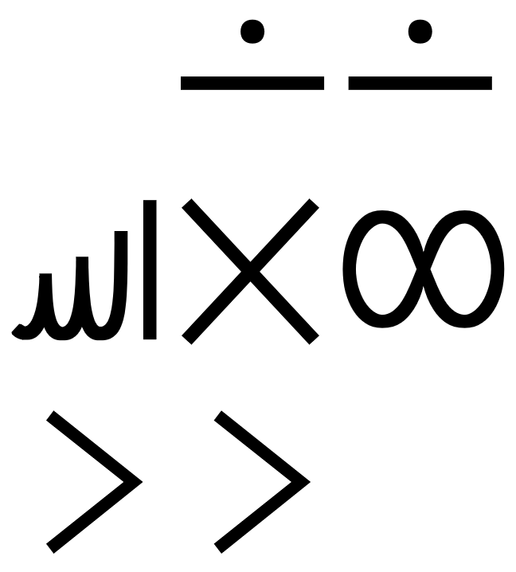
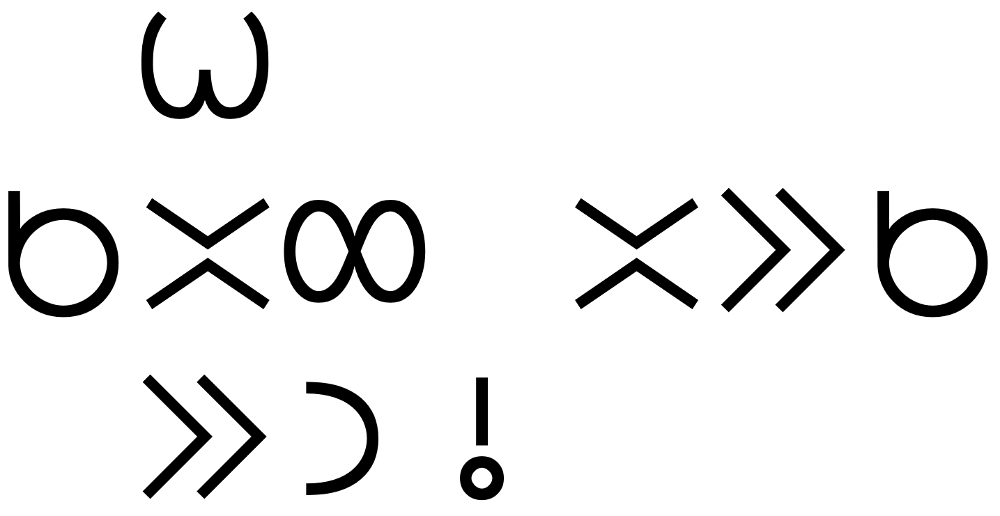
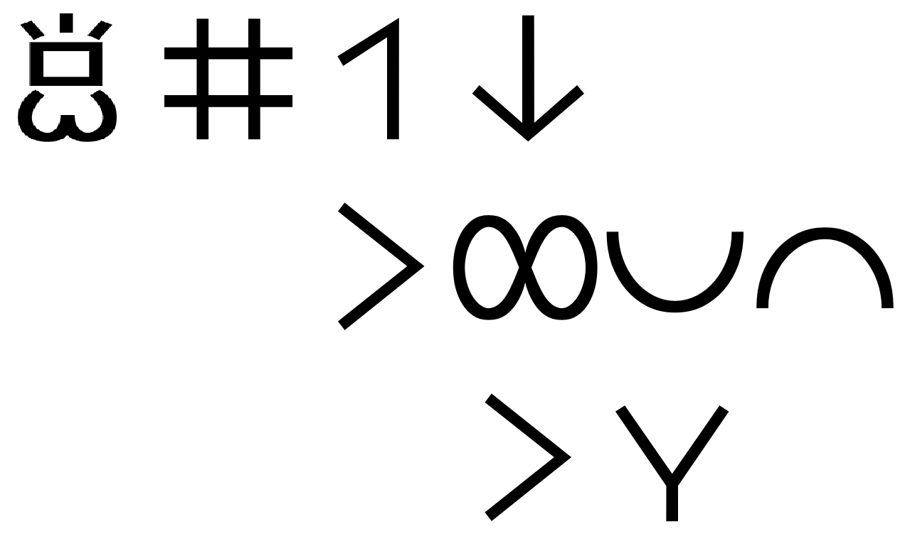
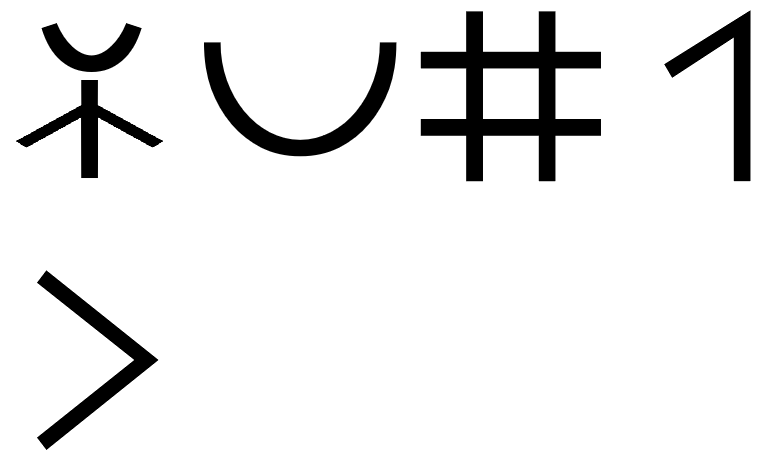
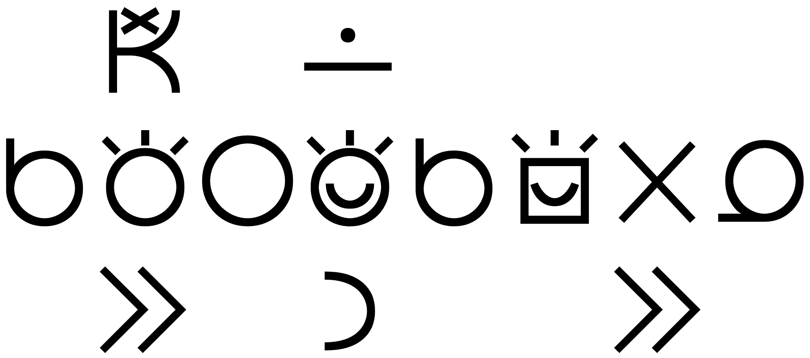

# lipu pi toki pona

## Preface

* toki insa - thought
* ilo lipu - the Web
* 👍 lipu sona - web page, the Web

## What Is Toki Pona?

## Limitations

* waso wawa - eagle
* waso nasa - chicken
* tomo tawa - car
* ilo tawa - car
- kiwen tawa - car, hard object that moves, 👍 projectile

## Lesson 1
*(Letters and Sounds)*

## Lesson 2
*(Words and Sentences)*

## Lesson 3
*(Nouns and Adjectives)*

* tomo suli - palace
* jan pona - friend
* meli lili - girl
* telo suli - sea
* telo kili - juice
* tomo telo - bathroom
* soweli lili - kitten
* jan lili - baby
* kili telo - watermelon

## Lesson 4
*(You and I)*

* tomo soweli - doghouse
* tomo lipu - library

## Lesson 5
*(Verbs)*

* jan toki - messenger
* tomo sona - school
* jan pali - worker

## Lesson 6
*(More Adjectives)*

* jan sona - scholar
* kute ike - to mishear
* 👍 nasa ike - annoying
* jan ala - nobody

## Lesson 7
*(Questions and Answers)*

* ilo toki - telephone
* kala wawa - shark
* ilo moku - spoon

## Lesson 8
*(Prepositions)*

* jan toki - speaker
* jan kute - listener

## Lesson 9
*(Proper Names)*

* ma tomo - city
* nena sewi - hill sanctuary

## Lesson 10
*(Greetings and Feelings)*

* kama pona! - Welcome!
* tawa pona! - Good departure!
* pilin ike - sad
* pona! - Thank you!
* pilin pona - happy

## Lesson 11
*(pi)*

* mije sona - scholar
* tenpo suno ni - today
* pona mute - excellent
* sijelo pona - healthy
* ilo tenpo suno - sundial
* mama mama - grandparents
* tomo tawa - vehicle
* ma kasi - garden
* ma utala - battlefield

## Lesson 12
*(Numbers)*

* jan ale - everyone
* nanpa wan - first
* nanpa tu tu - fourth
* jan utala - warrior
* nanpa luka - fifth
* tu tu - four
* jan ale - everybody

## Lesson 13
*(Pre-Verbs)*

* kama sona - learning
* kama awen lon - settling
* jan lili - children
* tawa lon telo - swimming
* ma mama - motherland

## Lesson 14
*(Colours and la)*

* tenpo pimeja ni - tonight
* soweli wawa - bear
* tenpo suno kama - tomorrow

## Lesson 15
*(Spatial Nouns)*

* 👍 pi noka suli - deep
* telo suli - ocean

## Lesson 16
*(Particles and Perspective)*

* ma mama - fatherland
* nanpa tu - second

## Lesson 17
*(Hunting Adventure)*

* kama tawa tomo jan - to visit someone
* ma kasi - forest
* ilo alasa - bow

## Lesson 18
*(Cooking Adventure)*

* lape lili - napping
* soweli lili - hare
* moku pona - bon appétit

## Lesson 19
*(The Frontier)*

* 👍 o pilin pona o pu!

## Toki Pona Proverbs

* ante li kama. - Times change.
* jan sona - sage
* jan nasa - fool
* jan sona - genius
* jan poka - neighbour
* pali li pana e sona. - One learns by experience.
* kama jo - receive
* wile sona - curious
* (toki e) wile sona - asking questions
* weka e ike - cleanse
* pana e pona - love, take care of

|  | 
|:--| 
| *ale li jo e tenpo.* |

|  | 
|:--| 
| *ale li pona.* | 

|  | 
|:--| 
| *toki pona li toki pona.* | 

|  | 
|:--| 
| *ante li kama.* | 

|  | 
|:--| 
| *ike li kama.* | 

|  | 
|:--| 
| *jan li suli mute. mani li suli lili.* | 

|  | 
|:--| 
| *jan sona li jan nasa.* | 

|  | 
|:--| 
| *lupa meli li mama pi ijo ale.* | 

|  | 
|:--| 
| *mi pona e ale mi, la mi pona e mi.* | 

|  | 
|:--| 
| *nasin pona li mute.* | 

|  | 
|:--| 
| *o olin e jan poka.* | 

|  | 
|:--| 
| *o sona e sina.* | 

|  | 
|:--| 
| *pali li pana e sona.* | 

|  | 
|:--| 
| *pilin pona li pana e sijelo pona.* | 

|  | 
|:--| 
| *sina pana e ike, la sina kama jo e ike.* | 

|  | 
|:--| 
| *wawa li lon insa.* | 

|  | 
|:--| 
| *weka lili li pona tawa lawa.* | 

|  | 
|:--| 
| *wile sona li mute e sona.* | 

|  | 
|:--| 
| *jan lili li sona ala e ike.* | 

|  | 
|:--| 
| *meli li nasa e mije.* | 

|  | 
|:--| 
| *mi weka e ike jan, la mi weka e ike mi.* | 

|  | 
|:--| 
| *nasin ante li pona tawa jan ante.* | 

|  | 
|:--| 
| *telo li pona.* | 

|  | 
|:--| 
| *lape li pona.* | 

|  | 
|:--| 
| *toki li pona.* | 

|  | 
|:--| 
| *o pana e pona tawa ma.* | 

|  | 
|:--| 
| *utala li ike.* | 

## Famous Quotations

|  | 
|:--| 
| *o weka e nimi ike.* | 

|  | 
|:--| 
| *sina sona e toki wan taso, la sina sona ala e toki ni.* | 

|  | 
|:--| 
| *toki sina en pali sina li sama, la sina pilin pona.* | 

|  | 
|:--| 
| *sewi li lon ala, li lon ale.* | 

|  | 
|:--| 
| *sina wile ante e ale, la o ante e sina.* | 

|  | 
|:--| 
| *wile sona nanpa wan li ni: ale li pona anu ike?* | 

|  | 
|:--| 
| *sona pona li ni: o weka e ike.* | 

|  | 
|:--| 
| *nasin pona li pona nanpa wan.* | 

|  | 
|:--| 
| *sina ken ala toki e ijo lon toki pona, la sina sona pona ala e ona.* | 

## Official Toki Pona Dictionary
