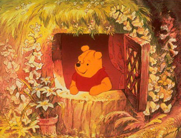

# soweli Wini Pu en jan pi ale ale ale
*jan Alan Alesanta Milen*

___
* jan Kitopa Jopin *(Christopher Robin)*
* pilin pi sin nasa *(surpriziĝas)*

___

**tawa ona la  
luka lon luka la mi tu li kama —  
jan Kitopa Jopin en mi —  
tan ni: mi tu li wile pana e lipu ni tawa sina.  
o toki e ni: sina pilin pi sin nasa anu seme?  
o toki e ni: sina wile e ni taso anu seme?  
ona li ijo sina a  
tan ni: mi tu li olin e sina.**

___
* waso walo *(cigno)*
* toki kulupu *(diras unu al la alia)*
* soweli Etuwa Pe *(Edward Bear)*

___

## kama

sina lukin e sitelen pi lipu ante pi ijo pi jan Kitopa Jopin, la ken la sina sona e ni: tenpo pini la ona li jo e waso walo (anu waso walo li jo e jan Kitopa Jopin, mi sona ala) en ona li pana e nimi "Pu" tawa waso walo ni.
tenpo suli li kama lon pini pi ijo ni: mi tu li toki kulupu e "tawa pona" li awen e nimi tan ni: tawa mi tu la waso walo ni li awen ala wile e ona.
ni la soweli Etuwa Pe toki e ni: ona li wile jo e nimi pi sin nasa, pi ona sama taso. tenpo sama la jan Kitopa Jopin li toki e ni: ona li soweli Wini Pu. a: ona li ona.
pona. mi pana e sona pi soweli Pu. kama la mi pana e sona pi ale ante.

___
* ma sijelo *(zoo)*
* mute wan *(kelko)*
* soweli walo pi luka wawa *(blanka urso)*
* nanpa mute *(tria)*
* mute supa *(ŝtuparo)*

___

jan li lon ma tomo Lantan, la tenpo lili la ona li kama wile tawa ma sijelo.
jan pi mute wan li kama insa ona kepeken lupa "TAWAWINSA" li lukin tawa lon tenpo pi lili mute, lon poka pi tomo sijelo ale, tawa lupa pi tomo sijelo "TAWAWEKA".
taso jan pi suwi sin li tawa pona tawa sijelo li awen lon ona li olin mute e ona.
sama ni la jan Kitopa Jopin li tawa ma sijelo, la ona li tawa soweli walo pi luka wawa li toki pi kalama lili tawa jan sinpin nanpa mute. jan sinpin ni li open e lupa.
mi mute li tawa lon nasin pimeja li tawa sewi lon mute supa, tawa tomo sijelo. tomo ni li kama open. tan insa ona la ijo pimeja pi linja mute li kama.
jan Kitopa Jopin li toki wawa e "soweli pi luka wawa o!" li tawa lon tenpo sama tawa luka ona.
tenpo ni la nimi pi soweli ni pi luka wawa li Wini. ni li pana e sona ni: ona li nimi pona tawa soweli pi luka wawa. taso ni li musi: mi tu li ken ala awen sona e ni: soweli Wini li kama jo e nimi ona tan waso Pu anu waso Pu li kama jo e nimi ona tan soweli Wini. tenpo pini wan la mi tu li sona. taso mi tu li pini sona. ...

___
* soweli pi palisa monsi sike *(porko)*
* kalama pi uta lili *(kriĉas)*
* pilin sona *(certas)*
* poki pi telo sitelen *(inkujo)*

___

mi sitelen e pini pi nimi ni en soweli pi palisa monsi sike li lukin e sewi li toki e ni kepeken kalama pi uta lili: "seme mi li lon?" mi toki e ni: "soweli pona mi pi palisa monsi sike o, ale lipu li toki e ijo sina." ona li toki e ni kepeken kalama pi uta lili: "sama ni la ona li toki e ijo pi soweli Pu." ona li pilin pi lili ike tan ni: tawa ona la jan li pana e lukin pi soweli Pu taso sama ijo suli. sona li ni: soweli Pu li jan pi pona mute tawa jan Kitopa Jopin. jan li ken ala toki e ijo ante. taso jan pi palisa monsi sike li jo e ijo pona mute pi ijo ni, soweli Pu li jo ala e ona, tan ni: jan li tawa tomo sona e soweli Pu, la jan ale li kama sona e ni. taso soweli pi palisa monsi sike li lili ni: ona li ken kama lon poki. ni la jan li ken pilin e ona lon ni: jan li pilin sona ala e ni: esun tu li mute tu tu anu luka tu tu. tenpo la ona li kama weka li lukin wawa e poki pi telo sitelen. kepeken ni la ona li kama sona e mute. soweli Pu li kama sona e lili. jan wan li jo e lawa, jan ante li jo ala e ona, li nimi ona. ni li ni.

tenpo ni la jan ante ale li toki e ni: "seme pi mi mute li lon?" tan ni la ken la mi wile pini sitelen e kama pi lipu ni li wile kama pali e lipu.

*jan A. A. M.*

## wan lipu suli pi nanpa wan

### wan lipu pi nanpa wan la mi kama sona e soweli Wini Pu e pipi kon en toki li kama lon

ni la soweli Etuwa Pe li tawa anpa kepeken mute supa. monsi pi lawa ona li kalama "PUN", "PUN", "PUN" lon monsi pi jan Kitopa Jopin. tawa ona la nasin ni taso la jan li ken tawa anpa kepeken mute supa. taso tenpo pi mute ala la ona li pilin e ni: nasin ante li lon. taso ona li wile pini kalama "PUN" li toki insa.

tenpo ante la ona li pilin e ni: nasin ante li lon ala. taso tenpo ni la ona li kama lon anpa en jan li ken pana e sona pi nimi ona: Wini Pu.

mi kute e nimi ona lon tenpo pi nanpa wan, la mi sama sina li toki e ni: taso tawa mi la ona li mije.

"sama mi." li nimi pi jan Kitopa Jopin.

"sama ni la sina pana e nimi 'Wini' tawa ona."

"ala."

"taso sina toki -- "

"ona li soweli Wini Pu. sina sona e nimi 'pu' anu seme?"

"a, sona, tenpo ni" li nimi mi pi tenpo sama; sina sin o toki e ni, tan ni: ni li ale pi toki sin.

tenpo la soweli Wini Pu li kama lon anpa kepeken mute supa li wile musi. tenpo ante la ona li wile lon sinpin seli li kalama ala li kute e toki. tenpo pimeja kama ni la --

"seme li ijo toki?" li nimi pi jan Kitopa Jopin.

"seme li ijo toki?" li nimi mi.

"o pona suwi o toki e ona wan tawa soweli Wini Pu."

"tawa mi la ken la mi ken" li nimi mi. "toki sama seme li pona tawa ona?"

"toki pi ona sama. ona li soweli pi luka wawa sama ni."

"a, mi sona."

"sama ni la sina pona suwi anu seme?"

"mi lukin" li nimi mi.

sama ni la mi lukin.

___
* ma pi kasi suli *(arbaro)*
* kalama pi uta suli *(murmureganta)*

___

tenpo wan, tenpo pini pi weka mute, tenpo esun pini la soweli Wini Pu li lon ma pi kasi suli li taso li lon anpa pi nimi "Santa".

("nimi 'lon anpa nimi' li sama nimi seme?" li nimi pi wile sona pi jan Kitopa Jopin. "ni li sama nimi 'ona li jo e nimi lon sewi pi lupa tomo li lon anpa'."

"soweli Wini Pu li pilin sona ala" li nimi pi jan Kitopa Jopin.

"tenpo ni la mi pilin sona" li nimi pi kalama pi uta suli.

"sama ni la mi pali sin" li nimi mi.)

___
* pipi kon pi ko suwi *(abelo)*

___

tenpo suno wan la ona li lon ala lon tomo li tawa, la ona li kama lon open lon insa pi ma pi kasi suli. insa pi open ni la kasi suli li lon. tan lawa kasi la kalama "SSS" wawa li lon.

soweli Wini Pu li kama anpa lon noka kasi li lon insa luka e lawa ona li kama toki insa.

tenpo pi nanpa wan la ona li toki insa e ni: "kalama 'SSS' ni li sama nimi ijo. kalama 'SSS' sama ni li kalama 'SSS' li kalama 'SSS' tan ijo li sama nimi ijo. kalama 'SSS' li lon, la jan li pana e kalama 'SSS'. tawa mi la tan ni taso la jan li pana e kalama 'SSS': jan li pipi kon pi ko suwi."

tenpo suli la ona li toki insa. ona li toki e ni: "tawa mi la, tan ni taso la jan li pipi kon pi ko suwi: jan o pali e ko suwi."

ona li kama sinpin li toki e ni: "tan ni taso la jan li pali e ko suwi: mi o ken moku e ona." sama ni la ona li kama lon sewi kepeken kasi suli. ona li tawa sewi li tawa sewi li tawa sewi li toki e kalama musi tawa ona sama. toki pi kalama musi li ni:

*nasa musi li ni, a:  
ko suwi li pona tawa soweli pi luka wawa  
SSS! SSS! SSS!  
mi wile sona e ni: tan seme la ona li sama ni?*

ona li tawa sin tawa sewi li tawa sin li tawa pi sin lili. tenpo sama ni la ona li mama e toki ante pi kalama musi.

*sitelen insa ni li musi e jan: soweli pi luka   wawa li pipi kon pi ko suwi, la  
ona li pali e tomo ona lon noka pi kasi suli.  
kepeken ni la - pipi kon pi ko suwi li soweli pi luka wawa, la -  
mi mute li wile ala kepeken mute supa ni tawa sewi.*

___
* supa *(kuŝanta)*
* mute tu *(ses)*

___

tenpo ni la ona li kama wile supa. tan ni la ona li toki e kalama pi pilin ike. tenpo sama kama la ona li kama lon ni. ona li sinpin lon palisa kasi ni, la ...

KA!

"ike, a!" li nimi pi soweli Pu lon tenpo ni: ona li tawa pakala tawa palisa kasi lon anpa ona.

"mi o jo ala e -- " li nimi ona lon tenpo ni: ona li tawa sin tawa palisa kasi sin lon anpa ona.

"o sona e ni: mi wile taso," li nimi ona lon tenpo ni: lawa li kama lon anpa noka en ona li kama lon palisa kasi ante. "mi wile taso -- "

"ni, a. tawa mi la ken la -- " li nimi ona lon tenpo ni: tenpo sama pi lili mute la ona li tawa lon nasin lon poka pi palisa kasi mute tu sin.

ona li lawa e sona ni, "tawa mi la ale li tan ni," li toki e "tawa pona" tawa palisa kasi pini li tawa sike pi nanpa mute li tawa lon kon tawa kasi. "ale li tan ni: ko suwi li pona ni. a, ike!"

ona li tawa tan kasi li weka e wan kasi tan nena pi sinpin lawa ona li kama toki insa sin. jan pi nanpa wan pi toki sina ona li jan Kitopa Jopin.

("mi anu seme?" li nimi pi jan Kitopa Jopin kepeken kalama uta pi pilin lili. ona li ken ala kama jo e sona ni.

"sina."

jan Kitopa Jopin li toki ala. taso lukin ona li kama suli li kama suli sin. sinpin ona li kama loje li kama loje sin.)

tan ni li soweli Wini Pu li tawa jan pona ona Kitopa Jopin. ona li lon monsi pi lupa laso lon wan ante pi ma pi kasi suli.

"tenpo suno pona, jan Kitopa Jopin o," li nimi ona.

"tenpo suno pona, soweli Wini Pu o," li nimi sina.

"mi wile sona e ni: sina jo e sike kule kon anu seme?"

"sike kule kon?"

"sike kule kon. mi li tawa ni li toki e ni tawa mi sama: 'jan Kitopa Jopin li jo e sike kule kon?' mi toki e ni tawa mi sama.
