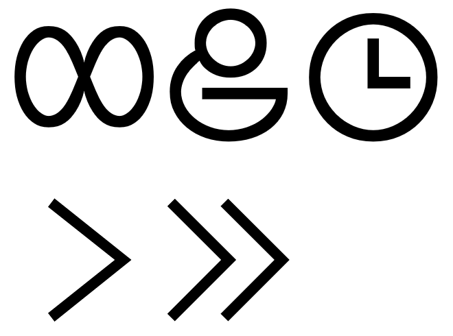
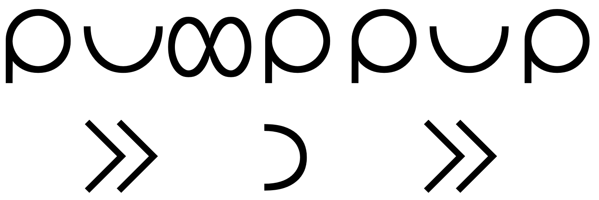
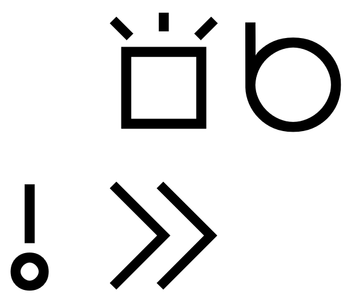
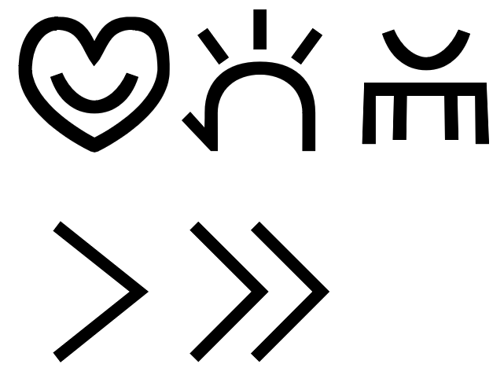
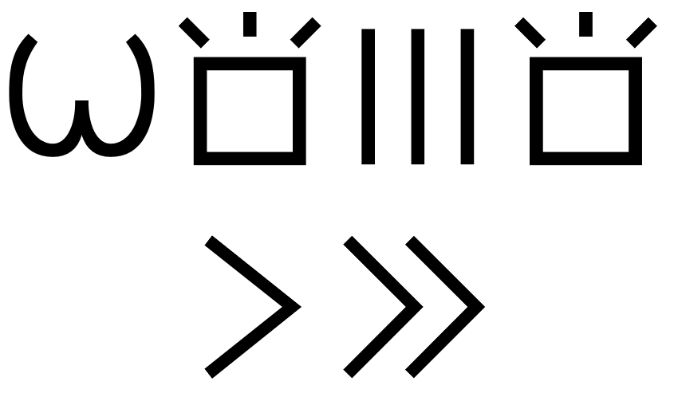
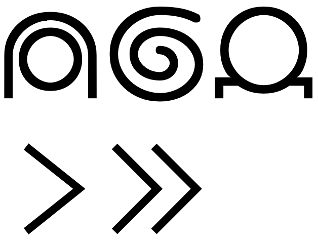
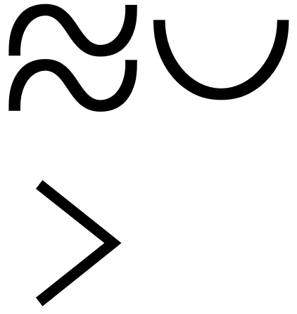
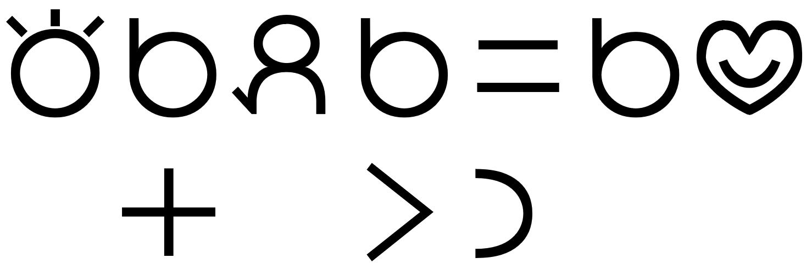
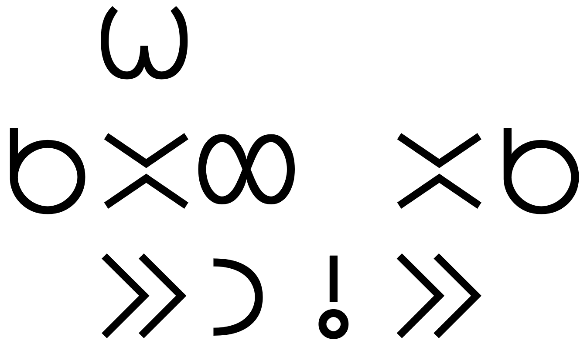
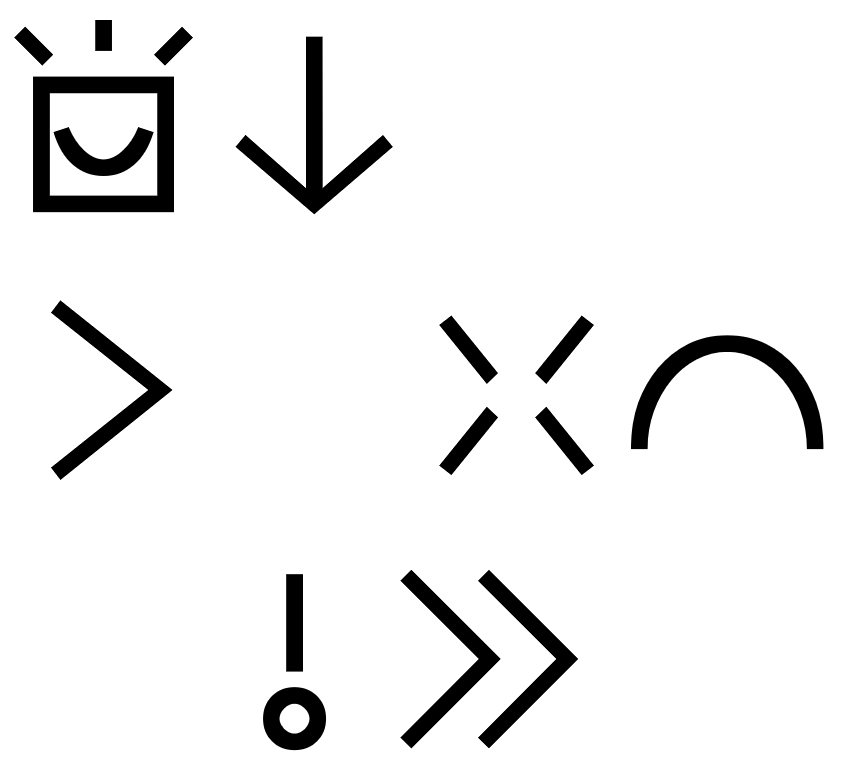

# Sitelen Pona Musi

This creative work by Stephan Schneider is based on [the official Toki Pona book](http://www.amazon.com/gp/product/0978292308) and website: [http://tokipona.org](http://tokipona.org)

These examples illustrate my way of writing [playful hieroglyphs](sin.md#playful-hieroglyphs).

## Toki Pona Proverbs

|  | 
|:--| 
| **ale li jo e tenpo.** |

|  | 
|:--| 
| **ale li pona.** | 

|  | 
|:--| 
| **toki pona li toki pona.** | 

|  | 
|:--| 
| **ante li kama.** | 

|  | 
|:--| 
| **ike li kama.** | 

|  | 
|:--| 
| **jan li suli mute. mani li suli lili.** | 

|  | 
|:--| 
| **jan sona li jan nasa.** | 

|  | 
|:--| 
| **lupa meli li mama pi ijo ale.** | 

|  | 
|:--| 
| **mi pona e ale mi, la mi pona e mi.** | 

|  | 
|:--| 
| **nasin pona li mute.** | 

|  | 
|:--| 
| **o olin e jan poka.** | 

|  | 
|:--| 
| **o sona e sina.** | 

|  | 
|:--| 
| **pali li pana e sona.** | 

|  | 
|:--| 
| **pilin pona li pana e sijelo pona.** | 

|  | 
|:--| 
| **sina pana e ike, la sina kama jo e ike.** | 

|  | 
|:--| 
| **wawa li lon insa.** | 

|  | 
|:--| 
| **weka lili li pona tawa lawa.** | 

|  | 
|:--| 
| **wile sona li mute e sona.** | 

|  | 
|:--| 
| **jan lili li sona ala e ike.** | 

|  | 
|:--| 
| **meli li nasa e mije.** | 

|  | 
|:--| 
| **mi weka e ike jan, la mi weka e ike mi.** | 

|  | 
|:--| 
| **nasin ante li pona tawa jan ante.** | 

|  | 
|:--| 
| **telo li pona.** | 

|  | 
|:--| 
| **lape li pona.** | 

|  | 
|:--| 
| **toki li pona.** | 

|  | 
|:--| 
| **o pana e pona tawa ma.** | 

|  | 
|:--| 
| **utala li ike.** | 

## Famous Quotations

|  | 
|:--| 
| **o weka e nimi ike.** | 

|  | 
|:--| 
| **sina sona e toki wan taso, la sina sona ala e toki ni.** | 

|  | 
|:--| 
| **toki sina en pali sina li sama, la sina pilin pona.** | 

|  | 
|:--| 
| **sewi li lon ala, li lon ale.** | 

|  | 
|:--| 
| **sina wile ante e ale, la o ante e sina.** | 

|  | 
|:--| 
| **wile sona nanpa wan li ni: ale li pona anu ike?** | 

|  | 
|:--| 
| **sona pona li ni: o weka e ike.** | 

|  | 
|:--| 
| **nasin pona li pona nanpa wan.** | 

|  | 
|:--| 
| **sina ken ala toki e ijo lon toki pona, la sina sona pona ala e ona.** | 

