# sitelen pona musi

|  | 
|:--| 
| *ale li jo e tenpo.* |

|  | 
|:--| 
| *ale li pona.* | 

|  | 
|:--| 
| *toki pona li toki pona.* | 

|  | 
|:--| 
| *ante li kama.* | 

| 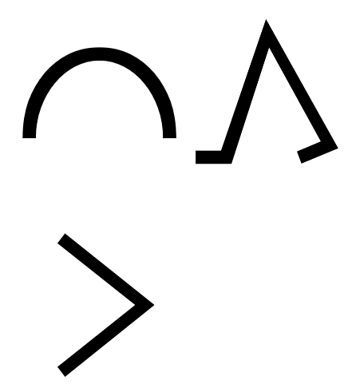 | 
|:--| 
| *ike li kama.* | 

|  | 
|:--| 
| *jan li suli mute. mani li suli lili.* | 

| 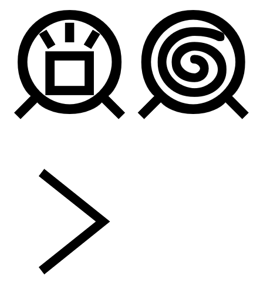 | 
|:--| 
| *jan sona li jan nasa.* | 

| 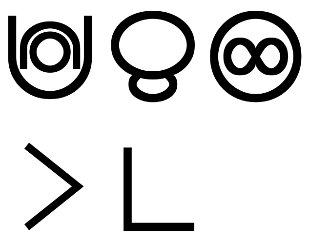 | 
|:--| 
| *lupa meli li mama pi ijo ale.* | 

|  | 
|:--| 
| *mi pona e ale mi, la mi pona e mi.* | 

| 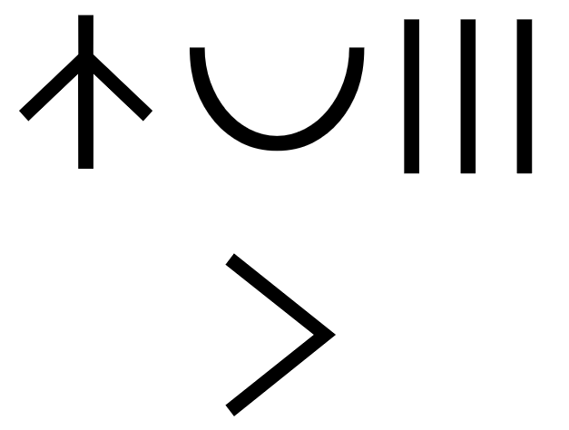 | 
|:--| 
| *nasin pona li mute.* | 

| 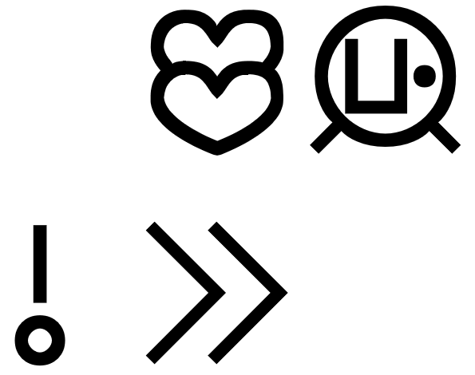 | 
|:--| 
| *o olin e jan poka.* | 

|  | 
|:--| 
| *o sona e sina.* | 

| 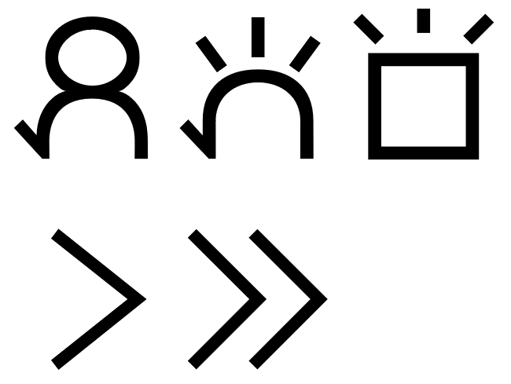 | 
|:--| 
| *pali li pana e sona.* | 

|  | 
|:--| 
| *pilin pona li pana e sijelo pona.* | 

| 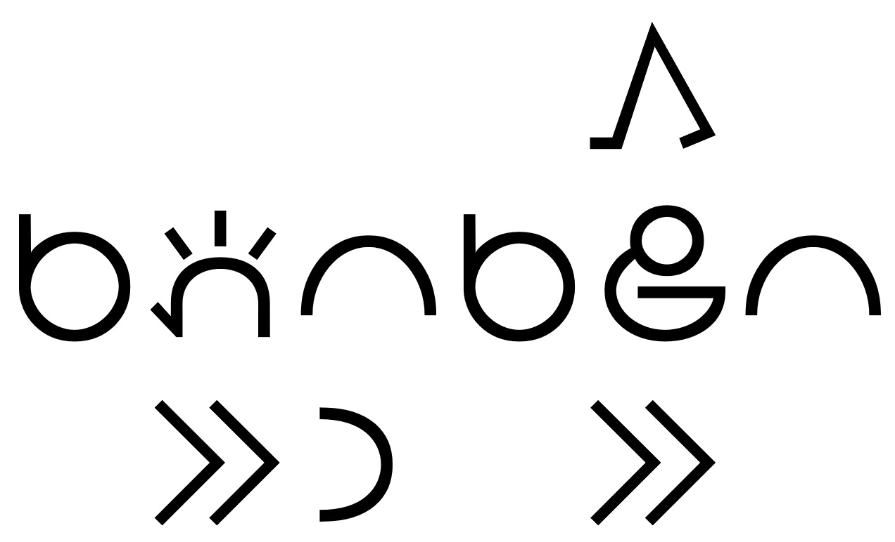 | 
|:--| 
| *sina pana e ike, la sina kama jo e ike.* | 

|  | 
|:--| 
| *wawa li lon insa.* | 

| 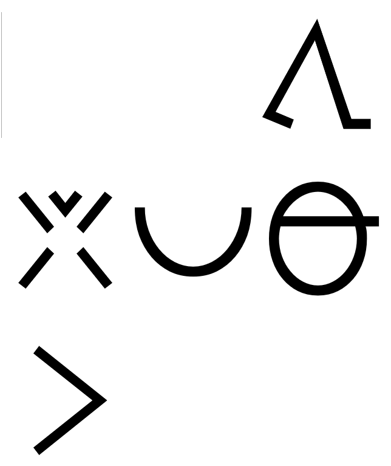 | 
|:--| 
| *weka lili li pona tawa lawa.* | 

|  | 
|:--| 
| *wile sona li mute e sona.* | 

| 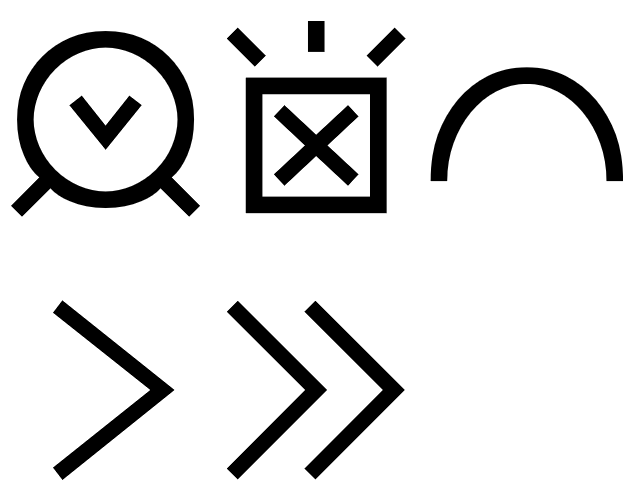 | 
|:--| 
| *jan lili li sona ala e ike.* | 

|  | 
|:--| 
| *meli li nasa e mije.* | 

| 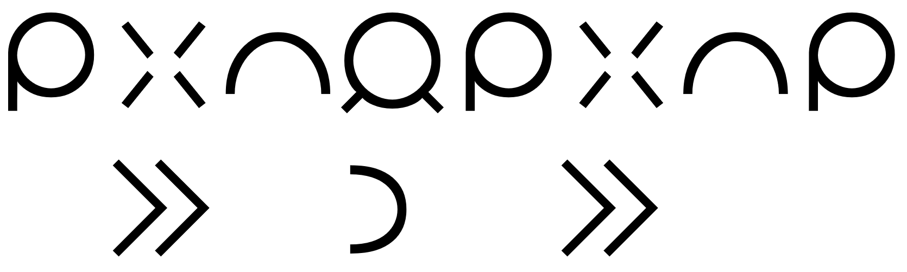 | 
|:--| 
| *mi weka e ike jan, la mi weka e ike mi.* | 

| 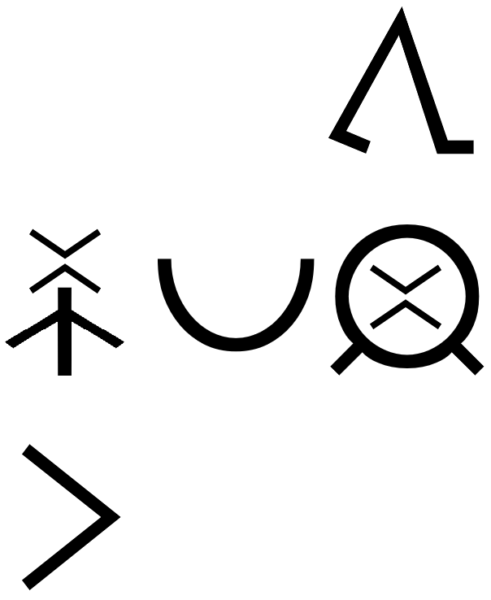 | 
|:--| 
| *nasin ante li pona tawa jan ante.* | 

|  | 
|:--| 
| *telo li pona.* | 

| 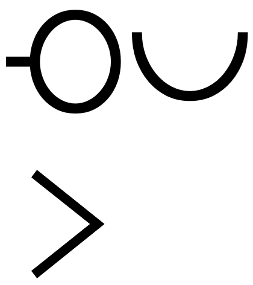 | 
|:--| 
| *lape li pona.* | 

| 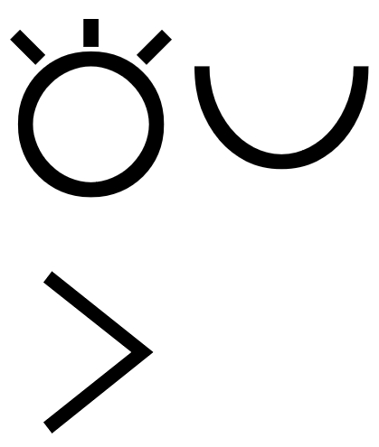 | 
|:--| 
| *toki li pona.* | 

| 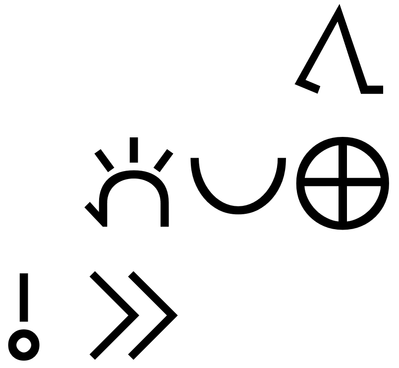 | 
|:--| 
| *o pana e pona tawa ma.* | 

|  | 
|:--| 
| *utala li ike.* | 

---

|  | 
|:--| 
| *o weka e nimi ike.* | 

| 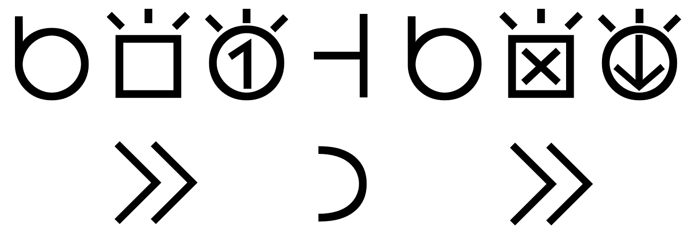 | 
|:--| 
| *sina sona e toki wan taso, la sina sona ala e toki ni.* | 

