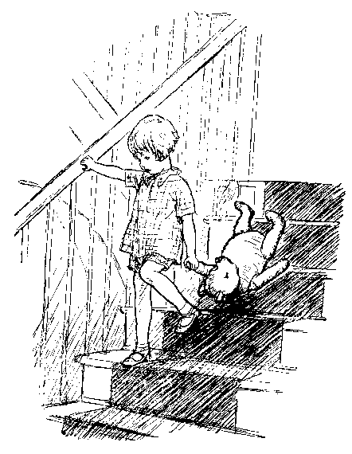
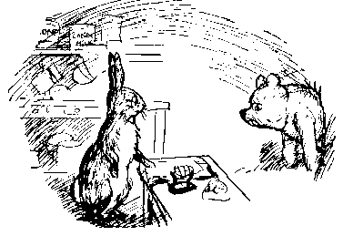

# soweli Wini Pu en jan pi ale ale ale
*jan Alan Alesanta Milen*

[tan toki Inli](http://lib.ru/MILN/pooh.txt_with-big-pictures.html)

___
* jan Kitopa Jopin *(Christopher Robin)*
* pilin pi sin nasa *(surpriziĝas)*

___

**tawa ona la  
luka lon luka la mi tu li kama —  
jan Kitopa Jopin en mi —  
tan ni: mi tu li wile pana e lipu ni tawa sina.  
o toki e ni: sina pilin pi sin nasa anu seme?  
o toki e ni: sina wile e ni taso anu seme?  
ona li ijo sina a  
tan ni: mi tu li olin e sina.**

## kama lipu

___
* waso walo *(cigno)*
* toki kulupu *(diras unu al la alia)*
* soweli pi luka lawa Etuwa *(Edward Bear)*
* awen jo e ijo → awen e ijo *(plu havi ion, teni ion → restigi ion)*

___

sina lukin e sitelen pi lipu ante pi ijo pi jan Kitopa Jopin, la ken la sina sona e ni: tenpo pini la ona li jo e waso walo (anu waso walo li jo e jan Kitopa Jopin, mi sona ala) en ona li pana e nimi "Pu" tawa waso walo ni.
tenpo suli li kama lon pini pi ijo ni: mi tu li toki kulupu e "tawa pona" li awen e nimi tan ni: tawa mi tu la waso walo ni li awen ala wile e ona.
ni la soweli pi luka wawa Etuwa li toki e ni: ona li wile jo e nimi pi sin nasa, pi ona sama taso. tenpo sama la jan Kitopa Jopin li toki e ni: ona li soweli Wini Pu. a: ona li ona.
pona. mi pana e sona pi soweli Pu. kama la mi pana e sona pi ale ante.

___
* ma sijelo *(zoo)*
* mute wan *(kelko)*
* tawa weka *(for, eksteren)*
* nanpa mute *(tria)*
* mute supa *(ŝtuparo)*
* toki wawa *(krias, vokas)*
* awen sona *(memoras)*

___

jan li lon ma tomo Lantan, la tenpo lili la ona li kama wile tawa ma sijelo.
jan pi mute wan li kama insa ona kepeken lupa "TAWAWINSA" li lukin tawa lon tenpo pi lili mute, lon poka pi tomo sijelo ale, tawa lupa pi tomo sijelo "TAWAWEKA".
taso jan pi suwi sin li tawa pona tawa sijelo li awen lon ona li olin mute e ona.
sama ni la jan Kitopa Jopin li tawa ma sijelo, la ona li tawa soweli walo pi luka wawa li toki pi kalama lili tawa jan sinpin nanpa mute. lupa li kama open.
mi tu li tawa lon nasin pimeja li tawa sewi lon mute supa, tawa tomo sijelo. tomo ni li kama open. tan insa ona la ijo pimeja pi linja mute li kama.
jan Kitopa Jopin li toki wawa e "soweli pi luka wawa o!" li tawa lon tenpo sama tawa luka ona.
tenpo ni la nimi pi soweli ni pi luka wawa li Wini. ni li pana e sona ni: ona li toki pona tawa soweli pi luka wawa. taso ni li musi: mi tu li ken ala awen sona e ni: soweli Wini li kama jo e nimi ona tan soweli Pu anu soweli Pu li kama jo e nimi ona tan soweli Wini. tenpo pini wan la mi tu li sona. taso mi tu li pini sona...

___
* soweli lili pi palisa monsi sike → soweli lili *(porketo)*
* toki kepeken uta lili *(kriĉas)*
* pilin sona *(certas)*
* poki pi telo sitelen *(inkujo)*

___

mi ken sitelen e nimi pi mute ni taso tan ni: soweli lili li lukin e sewi li toki e ni kepeken uta lili: "seme mi li lon?" mi toki e ni: "soweli pona mi pi palisa monsi sike o, ale lipu li toki e ijo sina." ona li toki e ni kepeken uta lili: "ni la ona li toki e ijo pi soweli Pu." ona li pilin pi lili ike tan ni: nimi pi soweli Pu li ken kama ijo suli tawa jan. ni li sona: soweli Pu li pona mute tawa jan Kitopa Jopin. jan li ken ala toki e ijo ante. taso soweli lili li jo e ijo pona, soweli Pu li jo ala e ona. jan li ken ala tawa tomo sona e soweli Pu lon ni ala: jan ale kama sona e ni.
taso soweli lili li lili ni: ona li ken kama lon poki.
jan li pilin sona ala e ni, esun tu li luka tu en tu anu luka tu tu, la ona li ken luka e soweli lili li kama sin pilin pona.
tenpo pi mute wan la ona li kama weka li lukin pona e poki pi telo sitelen.
a: ona li kama sona e mute. soweli Pu li kama sona e lili. taso tawa soweli Pu la ni li suli ala. ona li toki e ni: jan wan li jo e lawa, jan ante li jo ala e ona. a: ni.

tenpo ni la jan ante ale li toki e ni: "seme pi mi mute li lon?" tan ni la ken la mi wile pini sitelen e kama pi lipu ni li wile kama pali e lipu sama.

*jan A. A. M.*

## wan lipu nanpa wan: ni la mi mute li kama sona e soweli Wini Pu e pipi kon pi ko suwi en toki li kama

___
* pipi kon pi ko suwi *(abelo, miela aer-insekto)*

___

ni la soweli pi luka wawa Etuwa li tawa anpa kepeken mute supa.
monsi lawa ona li kalama "PUN", "PUN", "PUN" lon monsi pi jan Kitopa Jopin. tawa ona la kepeken nasin ni taso la jan li ken tawa anpa kepeken mute supa. taso tenpo pi mute wan la ona li pilin e ni: nasin ante li lon.
taso ona li ken ala toki insa e ni tan ni: ona li ken ala pini kalama "PUN".

tenpo ante la ona li pilin e ni: nasin ante li lon ala.
taso tenpo ni la ona li lon anpa en en jan li ken kama sona e nimi ona: Wini Pu.

mi kute e nimi ona lon tenpo nanpa wan, la mi sama sina. mi toki e ni: taso tawa mi la ona li mije.

"tawa mi a." li toki pi jan Kitopa Jopin.

"tan ni la sina ken ala pana e nimi 'Wini' tawa ona."

"ala."

"taso sina toki e ni — "

"ona li soweli Wini Pu. seme anu sina sona ala e kon pi nimi 'pu'?"

"a, sona" li toki lon tenpo lili; sama ni la sina o toki e ni tan ni: sina ken kama jo e toki pona ni taso.

tenpo pi mute wan la soweli Wini Pu li kama lon anpa kepeken mute supa li wile musi. tenpo ante la ona li wile kalama ala lon sinpin seli li wile kute e toki. tenpo pimeja kama ni la --

"seme toki li lon?" li toki pi jan Kitopa Jopin.

"seme toki li lon?" li toki mi.

"o pona o toki e wan tawa soweli Wini Pu."

"tawa mi la ken la mi ken" li toki mi. "toki seme li pona tawa ona?"

"toki pi ona sama. ona li soweli ni pi luka wawa."

"a, mi sona."

"ni la sina pona anu seme?"

"mi lukin ni" li toki mi.

ni, mi lukin ni.

___
* ma pi kasi suli *(arbaro)*

___

tenpo wan pini pi weka mute, pini pi tenpo esun pini la soweli Wini Pu li lon ma pi kasi suli li wan taso li lon anpa pi nimi "Santa".

("kon pi nimi 'lon anpa nimi' li seme?" li toki pi wile sona pi jan Kitopa Jopin. "ni li sama nimi 'ona li jo e nimi lon sewi pi lupa tomo li lon anpa'."

"soweli Wini Pu li pilin sona ala" li toki pi jan Kitopa Jopin.

___
* toki kepeken uta suli *(murmuregas)*

___

"tenpo ni la mi pilin sona" li toki kepeken uta suli.

"ni la mi awen pali" li toki mi.)

tenpo suno wan la ona li weka li tawa, la ona li kama lon ma taso lon insa pi ma pi kasi suli.
insa ona la kasi suli li lon.
tan lawa pi kasi suli la kalama "SSS" wawa li kama.

soweli Wini Pu li kama anpa lon noka pi kasi suli li lon luka tu ona e lawa ona li kama toki insa.

tenpo nanpa wan la ona li toki insa e ni: "kon pi kalama 'SSS' ni li lon.
kalama 'SSS' li kama ala tan ala li awen kalama 'SSS' taso ala li jo ala e kon ala.
kalama 'SSS' li lon, la jan a li kalama 'SSS'.
mi sona e ni: jan li kalama 'SSS' tan ni taso: jan ni li pipi kon pi ko suwi."

tenpo suli sin la ona li toki insa li toki e ni: "mi sona e ni: jan li pipi kon pi ko suwi tan ni taso: jan ni li pali e ko suwi."

___
* tawa kepeken noka en luka *(grimpas)*

___

ni la ona li kama sinpin li toki e ni: "mi sona e ni: jan li pali e ko suwi tan ni taso: mi ken moku e ona."
ni la ona li kama tawa lawa pi kasi suli kepeken noka en luka.

ona li tawa sewi li tawa sewi li tawa sewi li kalama musi lili e ni tawa ona sama:

*ni li nasa anu seme?:  
ko suwi li pona tawa soweli pi luka wawa  
SSS! SSS! SSS!  
mi wile sona e ni: tan seme la ona li ni?*

ona li tawa lili li tawa lili li tawa lili.
ni la ona li lon e kalama musi sin.

*ni li sitelen insa musi: soweli pi luka wawa li pipi kon pi ko suwi, la  
ona li lon noka pi kasi suli e tomo ona.  
ni — pipi kon pi ko suwi li soweli pi luka wawa — la  
mi ale li wile ala tawa sewi kepeken mute supa suli ni.*

tenpo ni la ona li kama wile lape.
tan ni la ona li kalama pi pilin ike.
ona li weka pi lili taso tan pini nasin.
ona li ken noka e palisa kasi ni t-a-s-o, la ...

KA!

___
* lon tenpo pi ijo ni → tenpo ni *(dum ties tempo, kiam → dum tiu tempo, kiam)*
* kiwen utala tawa *(batas -n)*

___

"o pana e pona!" li toki pi soweli Pu lon tenpo ni: ona li kiwen utala tawa palisa kasi lon anpa.

"mi ike -- " li toki ona lon tenpo ni: ona li kiwen utala tawa palisa kasi ante lon anpa sin.

"o sona e ni: taso mi wile e ni:" li toki ona lon tenpo ni: lawa li kama lon anpa noka. ona li kiwen utala tawa palisa kasi ante lon anpa sin sin. "taso mi wile e ni: — "

___
* lon poka nasin pi *(preter)*

___

"taso ni li sona: — " li toki ona lon tenpo ni: tenpo pi lili mute la ona li tawa lon poka nasin pi palisa kasi mute tu.

___
* tawa sike *(turniĝas)*
* tawa lon kon *(flugas)*
* palisa utala *(akra pinto)*

___

"tawa mi la ale ni li tan ni:" li toki sona ona lon tenpo ni: ona li toki e "tawa pona" tawa palisa kasi pi nanpa pini li tawa sike lon tenpo mute li tawa lon kon tawa kasi pi palisa utala. "ale li tan ni: tawa jan la ko suwi li pona ni. o pana e pona!"

ona li tawa weka tan kasi pi palisa utala li weka e wan pi palisa utala tan nena pi sinpin lawa ona li kama toki insa lon tenpo sin. jan nanpa wan pi toki insa ona li jan Kitopa Jopin.

("mi?" li toki pi jan Kitopa Jopin tan pilin pi sin nasa. tawa ona la ni li ike sona.)

"sina."

jan Kitopa Jopin li toki ala.
taso lukin ona li kama suli li kama suli sin.
sinpin lawa ona li kama loje li kama loje sin.)

ni la soweli Wini Pu li tawa jan pona ona Kitopa Jopin.
tomo ona li lon wan ante pi ma pi kasi suli li jo e lupa tomo laso.

"tenpo suno pona, jan Kitopa Jopin o" li toki ona.

"tenpo suno pona, soweli Wini Pu o" li toki sina.

___
* sike kon *(balono)*
* lon poka sike pi *(ĉirkaŭ)*

___

"mi wile sona e ni: sina jo e sike kon kule lon poka sike sina anu seme?"

"sike kon kule?"

"sike kon kule. mi tawa ni. mi toki e ni tawa mi sama: 'jan Kitopa Jopin li jo e sike kon kule anu seme?' mi toki e ni tawa mi sama. mi toki insa e ijo pi sike kon. mi kama wile sona."

"tan seme la sina wile e sike kon?" li toki sina.

soweli Wini Pu li lukin tawa poka sike ona li lukin e ni: jan ala li kute. ona li lon uta ona e luka ona li toki kepeken uta suli e ni: "ko suwi!"

"taso jan li ken ala alasa e ko suwi kepeken sike kon!"

"mi ken" li toki pi soweli Pu.

___
* laso kasi *(verda)*
* soweli pi kute suli *(leporo)*
* laso sewi *(blua)*
* lili pi mute ike → lili ike *(tro malgranda)*

___

a, tenpo suno pini la sina lon kulupu musi lon tomo pi jan pona soweli lili.
sina jo e sike kon mute lon kulupu musi ni.
sina jo e sike kon suli pi laso kasi, jan poka pi soweli pi kute suli li jo e wan suli pi laso sewi.
ona li awen e sike kon lon ni li tawa weka tan ni: ona li lili ike li ken ala lon kulupu musi a.
ni la sina tawa tomo sina e wan pi laso kasi e wan pi laso sewi.

___
* pilin lon tenpo suli *(zorgas)*
___

"sina wile e ona seme?" li toki sina tawa soweli Pu. ona li lon luka ona e lawa ona li toki insa li pilin lon tenpo suli.

___
* kama lukin *(trovas, rimarkas)*
* ken *(probablo)*
___

"ni li lon:" li toki ona.
"jan li alasa e ko suwi kepeken sike kon, la ni li suli: tawa pipi kon pi ko suwi la jan li pana ala e sona ni: ona li kama.
tan ni la jan li jo e sike kon pi laso kasi, la tawa ona mute la jan li wan pi kasi suli.
kepeken ni la ona mute li ken ala kama lukin e jan.
jan li jo e sike kon pi laso sewi, la tawa ona mute la jan li wan sewi.
kepeken ni la ona mute li ken ala kama lukin e jan.
mi wile sona e ni: seme li ken suli?"

"seme anu ona li kama lukin e sina lon anpa pi sike kon?" li toki sina.

___
* kon telo lon sewi *(nubo)*

___

"ken anu ken ala" li toki pi soweli Wini Pu.
"tenpo ala la jan li ken kama sona e ijo pi pipi kon pi ko suwi."
tenpo lili la ona li toki insa li toki e ni: "mi o lukin+sama kon-telo-pimeja-lili lon sewi.
kepeken ni la ona mute li ken ala kama sona."

___
* kama *(decidiĝas)*
___

ni la sina o jo e sike kon pi laso sewi" li toki sina. ni li kama.

___
* ken pi ike kama *(danĝero, ebleco de venonta malbono)*
* pini kama e ijo *(ĝis io)*
* lon supa pi *(ĉe la supraĵo de, sur)*
* lon pini pi ijo ni → lon pini ni *(ĉe la fino de tio, post kiam → ĉe tiu fino, post kiam)*
* pini awen luka e ijo → pini awen e ijo *(ne plu tuŝadas ion → ne plu restigas ion)*
* lon weka pi *(disde)*

___

ni la sina tu li tawa weka li jo e sike kon pi laso sewi.
sina li tawa li jo e ilo alasa tan ken pi ike kama, sina pali ni lon tenpo ale.
soweli Wini Pu li tawa ma telo, ona li sona e ona.
ona li anpa lon supa ona li tawa sike li tawa sike li pini kama e ni: selo ona ale li kama pimeja.
pini ni la sike kon li kama suli ale.
sina en soweli Pu li awen e linja.
tenpo lili la sina pini awen e ona.
soweli pi luka wawa Pu li pona lukin li lon kon li tawa sewi li awen lon ni — li lon sewi sama lawa pi kasi suli li lon weka ona.

"pona a!" li toki wawa sina.

"seme anu ni li pona?" li toki wawa pi soweli Wini Pu tawa sina lon anpa.

"sina sama soweli pi luka wawa, ona li awen e sike kon" li toki sina.

___
* pilin akesi *(timas)*

___

soweli Pu li pilin akesi li toki e ni: "seme anu mi sama ala kon telo pimeja lili lon sewi laso?"

"mute ala."

"a, ken la tawa sewi ni la ni li ante.
mi toki a e ni: "tenpo ala la jan li ken kama sona e ijo pi pipi kon pi ko suwi."

___
* pilin e kon pi *(flaras)*

___

kon ala li tawa poka pi kasi suli e ona. tan ni la ona li awen lon ni. ona li ken lukin e ko suwi li ken pilin e kon ona, taso ona li ken ala luka e ko suwi.

pini pi tenpo lili la ona li toki wawa tawa sina lon anpa.

___
* toki kon *(flustras)*

___

"jan Kitopa Jopin o!" li toki kon wawa ona.

"toki!"

___
* pilin pi ken pi ike kama *(suspektas)*

___

"tawa mi la pipi kon pi ko suwi li pilin pi ken pi ike kama."

"ike seme?"

"mi sona ala. taso tan ijo la tawa mi la ona mute li pilin pi ken pi ike kama."

"ken la tawa ona mute la sina wile alasa e ko suwi ona?"

"ken. tenpo ala la jan li ken kama sona e ijo pi pipi kon pi ko suwi."

weka kalama lili sin li lon. pini ona la ona li toki wawa tawa sina lon tenpo sin.

"jan Kitopa Jopin o!"

"a?"

___
* len utala tawa telo tan sewi *(pluvombrelo)*

___

"sina jo e len utala tawa telo tan sewi anu seme?"

"tawa mi la jo."

"mi wile e ni: sina lon ni e ona. sina tawa mute lon nasin sama. sina toki e ni: "mu-mu, tawa mi la telo li kama lon tan sewi."
tawa mi la sina pali ni, la ni li pana e pona ni: mi tu li ken lawa ike e pipi kon pi ko suwi."

___
* a musi *(ridas)*
* toki kalama *(laŭte parolas)*

___

a, sina a musi tawa sina sama e ni: "soweli nasa pi luka wawa o!" taso sina toki kalama ala tan ni: tawa sina la ona li pona suli. tan ni la sina tawa tomo. sina wile e len utala tawa telo tan sewi.

"a, sina kama lon a!" li toki wawa pi soweli Wini Pu tawa anpa lon tenpo ni: sina kama sin lon kasi suli.
"mi kama pilin akesi. mi kama sona e ni: pipi kon pi ko suwi li kama sona e ken pi kama ike."

___
* sinpin *(staras)*

___

"mi o sinpin e len utala tawa telo tan sewi anu seme?" li toki sina.

"sinpin, taso o awen lon tenpo lili. mi o kama lukin e pona pali. pipi kon suli pi ko suwi li pipi lawa taso. mi tu o toki ike e ona. sina lon anpa li ken lukin e pipi lawa anu seme?"

"ala."

"ike. ni la o tawa mute lon nasin sama o toki e ni: "mu-mu, tawa mi la telo li kama lon tan sewi." mi ken pali ni taso: mi pana e kalama musi pi kon telo lon sewi sama kon telo lon sewi... o tawa!"

ni la sina tawa mute lon nasin sama. sina toki e ni: sina wile sona e ni: telo tan sewi li kama anu seme.
tenpo sama la soweli Wini Pu li kalama musi e ni:

___
* pilin suli *(fieras)*

___

*ni li suwi: ijo li kon telo lon sewi  
li kon lon laso sewi  
kon telo lili ale lon sewi  
li kalama musi e ni:  
ni li suwi: ijo li kon telo lon sewi  
li kon lon laso sewi!"  
ona li pilin suli tan ni:  
ona li kon telo lili lon sewi.*

sama tenpo pini ale la pipi kon pi ko suwi li kalama "SSS" ni: ona li pilin pi ken pi ike kama.
a, wan ona li tawa weka tan tomo ona li tawa lon poka sike pi kon telo lon sewi lon tenpo ni: ona li pana e pini pi kalama musi ni.
pipi kon wan pi ko suwi li kama anpa lon nena sinpin pi kon telo lon sewi lon tenpo lili li tawa weka.

"jan Kitopa — a! — Jopin o" li toki wawa pi kon telo lon sewi.

"a?"

"mi pini toki insa.
mi kama sona e ijo pi suli mute.
pipi kon ni pi ko suwi li ike."

"ni?"

"ike, a. tan ni la ni li kama tawa mi: ko suwi ona li ike."

"ni?"

"a. tan ni la mi wile kama sin lon anpa."

"kepeken seme?" li toki sina.

soweli Wini Pu li kama ala sona e ni. ona li weka e luka tan linja, la ona li kiwen utala tawa anpa — PUN.
tawa ona la ni li pona ala.
tan ni la ona li toki insa lon tenpo suli li toki e ni:

"jan Kitopa Jopin o, sina o tan e kiwen utala tawa sike kon, kepeken ilo alasa sina. ona li lon sina anu seme?"

___
* pali sama ni → pali ni *(agas same kiel tio → agas tiel)*

___

"ni li sona: lon" li toki sina. "taso mi pali ni, la ni li pakala e kon sike" li toki sina. "taso sina pali ni ala, la" — li toki pi soweli Pu — "mi wile weka e luka. ni li pakala e mi a."

kepeken nimi ona ni la sina kama sona li lawa e ilo alasa tawa sike kon, kepeken pilin mute li tan e kiwen utala.

"a!" li toki pi soweli Pu.

"mi tawa ijo ante e kiwen utala anu seme?" li toki sina.

"tawa ijo ante ala" — li toki pi soweli Pu — "taso tawa sike kon ala."

___
* pilin ike *(bedaŭras, malĝojas)*

___

"mi pilin ike" li toki sina. sina tan e kiwen utala lon tenpo sin. tenpo ni la sina tawa sike kon e ona. kon li kama weka tan ona lon tenpo suli. soweli Wini Pu li kama lon anpa.

___
* kon tan uta *(elspiro, blovo)*

___

taso luka ona li linja ala tan ni: ona li awen e luka ona lon linja pi sike kon lon tenpo ale.
tan ni la luka ona li awen sinpin lon pini pi tenpo suno esun a.
pipi kon li kama anpa lon nena sinpin ona, la tenpo ale la ona li wile weka e ona kepeken kon tan uta.
tawa mi la — taso mi sona ala — tan ni la nimi ona li Pu.

"ni li pini toki?" li toki pi jan Kitopa Jopin.

"ni li pini pi wan ni. taso wan ante li lon."

"pi ijo pi soweli Pu en mi anu seme?"

"en soweli lili en soweli pi kute suli en sina ale. seme anu sina awen ala sona?"

"mi awen sona. taso mi lukin awen sona, la mi pini sona."

___
* soweli pi nena suli *(elefanto, hefalumpo)*

___

"tenpo suno ni: soweli Pu en soweli lili li wile alasa e soweli pi nena suli."

"ona tu li kama ala alasa e ona anu seme?"

"ala."

___
* lawa *(cerbo)*

___

"soweli Pu li ken ala tan ni: ona li jo ala e lawa. mi kama alasa e ona anu seme?"

"ni li wan toki."

___
* a kepeken lawa *(kapjesas)*

___

jan Kitopa Jopin li a kepeken lawa.

___
* sona awen *(memoro)*

___

"mi awen sona a" — li toki ona — "taso soweli Pu li awen sona ala. tan ni la ona li wile e ni: jan li toki e ona tawa ona, lon tenpo sin, tan ni: kepeken ni la ni li toki lon li sona awen taso ala."

"tawa mi la ni" li toki mi.

___
* a pi pilin ike *(suspiras, vespiras)*
* tan anpa *(leviĝas)*
* pana e pilin ike *(doloras)*

___

jan Kitopa li a pi pilin ike li tan anpa e soweli ona pi luka wawa kepeken noka ona li tawa weka tawa lupa tomo li tawa e soweli Pu lon anpa, lon monsi ona.
lupa tomo la ona li tawa sike li toki e ni: "sina kama anu seme? mi telo e mi."
"mi tan e kiwen utala tawa ona, la mi pana ala e pilin ike tawa ona anu seme?"
"ala."
ona li a kepeken lawa li tawa weka.
pini pi tenpo lili la mi kute e ni: monsi ona la soweli Wini Pu li kalama "PUN", "PUN", "PUN" li tawa sewi kepeken mute supa.

## wan lipu nanpa tu: ni la soweli Pu li tawa tomo pi jan ante li kama lon insa pi ijo lili

___
* kalama musi kepeken uta pi open ala *(zumas)*
* sitelen insa *(inventas, imagas)*
* pona e sijelo kepeken tawa *(sportas)*
* sinpin lukin *(spegulo)*

___

soweli pi luka wawa Etuwa — jan pona ona li sona e nimi ona "Wini Pu" anu "Pu" taso — li tawa lon ma pi kasi suli lon tenpo suno wan li pilin suli li kalama musi kepeken uta pi open ala, tawa ona sama. ona li sitelen insa e kalama musi lon kama pi tenpo suno sama, lon tenpo ni: ona li pona e sijelo kepeken tawa, lon sinpin lukin: "TA-LA-LA, TA-LA-LA." ona li sinpin e ona sama li suli pi mute ale e ona sama. pini ni la: "TA-LA-LA, TA-LA — o pana e pona! — LA." ona li lukin luka e palisa noka. kama pi tenpo suno la ona li moku. pini ni la ona li toki e ni tawa ona sama, lon tenpo mute mute li kama lon insa pi lawa ona e kalama musi. tenpo ni la ona li kalama musi pi pakala ala e ale ona. ona li sama ni:

*TA-LA-LA, TA-LA-LA,  
TA-LA-LA, TA-LA-LA,  
LUN-TUN-SITELUN-TUN.  
SITELITE, SITELITE,  
SITELITE, SITELITE,  
LUN-TUN-TUN-SITELUN.*

___
* ko kiwen *(sablo)*

___

ona li kalama musi tawa ona sama li pilin pona li tawa lon nasin li wile sona e ni: jan ale li pali seme? jan li jan ante, la ni li seme tawa pilin? tenpo ni la ona li kama lon sinpin pi ko kiwen. nena ni la lupa li lon.

"a, a!" li nimi pi soweli Pu. ("LUN-TUN-SITELUN-TUN.") "mi sona e ijo ijo, la kon pi lupa ni li soweli pi kute suli" li toki ona. "kon pi soweli pi kute suli li jan poka" li toki ona. "kon pi jan poka li moku li kute tawa kalama musi mi li ni. LUN-TUN-SITELELUN-TUN."

ni la ona li kama anpa li lon insa lupa e lawa li toki wawa:

"jan li lon tomo anu seme?"

tenpo lili la kalama li kama. pini ona la kalama ala li lon.

"mi toki e ni: jan li lon tomo anu seme?" li toki pi wawa mute, pi soweli Pu.

___
* kalama uta *(voĉo)*
* pi suli pi mute ni → suli ni *(de tiom da grando, tiom granda → tiel granda)*

___

"ala!" li toki pi kalama uta.
ona li toki sin e ni: "sina wile ala toki pi kalama pi suli ni.
mi kute pi pona a e sina lon tenpo nanpa wan."

"ike!" li toki pi soweli Pu.
"jan ala li lon anu seme?"

"jan ala."

soweli Wini Pu li tan lupa e lawa li toki insa lon tenpo wan li toki tawa ona sama e ni: "sona li ni: jan li lon tomo tan ni: jan li toki e ni: 'jan ala.'" ni la tenpo sin la ona li lon insa lupa e lawa li toki e ni: "toki, soweli pi kute suli o, seme anu ni li sina?"

"ala" li toki pi soweli pi kute suli kepeken kalama uta ante, lon tenpo ni.

"taso seme anu ni li kalama uta pi soweli pi kute suli?"

"tawa mi la ala" li toki pi soweli pi kute suli. "ni li wile ala."

"a" li toki pi soweli Pu.

ona li tan lupa e lawa li toki insa lon tenpo sin li lon sin e ona li toki e ni:

"sina ken toki e ni tawa mi anu seme?: soweli pi kute suli li lon seme?"

"ona li tawa tomo pi soweli pi luka wawa Pu, ona li jan pi pona mute tawa ona."

"taso ona li mi!" li toki pi soweli pi luka wawa. ona li pilin pi sin nasa.

"'mi' seme?"

"soweli pi luka wawa Pu."

"sina pilin sona anu seme?" li toki pi soweli pi kute suli. ona li pilin pi sin pi nasa mute.

"mi pilin sona a, a" li toki pi soweli Pu.

"a, ni la o kama lon insa."

___
* lon lupa nasin pi *(tra)*
* lon pini pi tenpo suli *(post longa tempo, finfine)*

___

ni la soweli Pu li tawa kepeken noka en luka lon lupa nasin li kama lon insa lon pini pi tenpo suli.

___
* ni la sina *(jen vi)*

___

"sina toki pona a" li toki pi soweli pi kute suli. ona li lukin e ale ona. "ni la sina. mi pilin pona tan ni."

"tawa sina la ni la jan seme?"

___
* jan mu *(iu ajn)*

___

"mi pilin sona ala. sina sona a e insa pi ma pi kasi suli. jan li ken ala tawa insa tomo e jan mu. moku li pona anu seme?"

___
* ko pi telo mama *(kondensita lakto)*
* pilin pi nasa wawa *(ekscitiĝas)*
* tu ale *(ambaŭ)*
* wile pi mute ike → wile ike *(tro volas, avaras)*

___

tenpo ale la tawa soweli Pu la moku lili lon pini pi kama pi tenpo suno li pona. ona li pilin pi pona mute tan ni: soweli pi kute suli li lon supa e poki li toki e ni: "ko suwi anu ko pi telo mama lon poka pi pan sina?". ona li pilin pi nasa wawa ni: ona li toki sin e ni: "tu ale." ona li wile e ni ala: ona li wile ike. tan ni la ona li toki sin e ni: sina ken awen weka e pan. pini ni la tenpo suli la ona li toki ala... pini ona la ona li kalama musi kepeken uta pi open ala, tawa ona sama, kepeken kalama uta ko a li kama sinpin li luka e luka pi soweli pi kute suli kepeken pilin li toki e ni: ona li wile tawa.

"sina wile anu seme?" li toki suwi pi soweli pi kute suli.

"a," — li toki pi soweli Pu — "mi ken awen lon tenpo sin lon ni..." ona li lukin lukin tawa tomo pi poki moku.

"ni li lon:" — li toki pi soweli pi kute suli — "mi sama li tawa weka."

"a, ni la mi tawa. mi tawa."

"a, tawa pona lon ni: sina pilin sona e ni: sina wile ala e ijo sin."

"ijo sin li lon anu seme?" li toki pi soweli Pu lon tenpo lili.

soweli pi kute suli li weka e len tan poki moku li toki e ni: "ala. lon ala."

"sama ni la tawa mi la ala" li toki pi soweli Pu. ona li a kepeken lawa tawa ona sama.
"a, mi tawa. mi wile tawa."

___
* lukin tan *(provas deigi, tiras)*
* lukin tawa *(provas aligi, puŝas)*

___

ni la ona li kama tawa kepeken noka en luka, tawa weka, tan lupa.
ona li lukin tan e ona sama kepeken luka li lukin tawa e ona kepeken noka.
pini pi tenpo lili la nena sinpin li kama... kute li kama... luka li kama... lawa sinpin li kama.
ni la —

"o pana
  e pona!"
  li toki
    pi soweli Pu.
"mi
  wile tawa monsi."

"a,
ike!"
  li toki
    pi soweli Pu.
"mi
  wile tawa sinpin."

"tu ale
  li ken ala!"
  li toki
    pi soweli Pu.
"o pana
  e pona!
a,
ike!"

___
* pi insa pi open ala → pi open ala *(de fermita eno, plena → fermita)*
* pi insa open → open *(de malfermita eno, malplena → malfermita)*

___

tenpo ni la
sama ni la
soweli
  pi kute suli
  li wile tawa weka.
taso
ona
  li jo
    e lupa
      pi open ala.
tan ni la
ona
  li tawa weka
    kepeken lupa
      pi monsi tomo
  li tawa
    lon poka sike tomo,
    tawa soweli Pu
  li lukin e ona.

___
* lon insa pi lili pi mute ike → lon insa pi lili ike → lon insa ike *(en troe malgranda eno → en mismalgranda eno → en miseno)*

___

"toki!
sina
  lon insa ike
anu
seme?"
  li toki ona.

___
* pilin *(atento)*

___

"a-ala"
  li toki
    pi soweli Pu
    kepeken pilin ala.
"mi
  lape taso.
mi
  toki insa taso.
mi
  kalama musi taso
    kepeken uta
      pi open ala,
  tawa
    mi sama."

"o,
o pana
  e luka."

soweli
  pi luka wawa Pu
  li lukin tawa weka
    e luka.
soweli
  pi kute suli
  li lukin tan e ona
  li lukin tan e ona
  li lukin tan e ona...

"a!"
  li toki wawa
    pi soweli Pu.
"sina
  pana
    e pilin ike."

"ni li lon:"
  li toki
    pi soweli
      pi kute suli.
"sina
  lon insa ike."

___
* pilin utala *(ĉagreniĝas)*
* pi suli pi mute pona → pi suli pona *(sufiĉe granda)*

___

"ale ni li kama" — li toki pi soweli Pu kepeken pilin utala — "tan ni: jan li jo ala e lupa pi sinpin tomo, pi suli pona."

___
* kiwen *(severa)*
* moku pi mute ike → moku ike *(tro manĝas)*

___

"ale ni li kama" — li toki kiwen pi soweli pi kute suli — "tan ni: jan li moku ike.
tenpo la mi toki insa, taso mi wile ala toki kalama e ni:" — li toki pi soweli pi kute suli — "wan pi mi tu li moku ike" li toki pi soweli pi kute suli.
mi sona e ni: mi pali ala." li toki ona.
"ni, ni, mi tawa ni e jan Kitopa Jopin."

___
* wan tu *(duono)*

___

tomo pi jan Kitopa Jopin li lon poka ante pi ma pi kasi suli. ona li tawa sin lon poka pi soweli pi kute suli li lukin e wan tu sinpin pi soweli Pu, la ona li toki e ni: "soweli nasa pi luka wawa o" kepeken kalama uta pi suwi ni: jan ale li pilin sin pi kama pona.

"mi kama toki insa e ni:" — li toki pi soweli pi luka wawa kepeken kalama uta pi pilin ike — "soweli pi kute suli li ken kepeken lupa tomo ona lon tenpo kama ala. ni li ike tawa mi."

"tawa mi a" li toki pi soweli pi kute suli.

"kepeken e lupa tomo ona?" li toki pi jan Kitopa Jopin.
"ni li sona: ona li kepeken lupa tomo ona lon tenpo sin."
"pona" li toki pi soweli pi kute suli.

"mi mute li ken ala tan e sina tawa weka, soweli Pu o, ken la mi mute li wile tawa e sina tawa monsi."

___
* luka kiwen e ijo *(gratas ion)*
* linja uta *(barbo, vangharoj)*
* lon anpa pi selo ma → lon anpa ma *(sub la haŭto de la tero → subtere)*

___

jan soweli pi kute suli li toki insa li luka kiwen e linja uta li toki e ni: jan li tawa monsi e soweli Pu, la ona li lon ni lon tenpo sin. sona li ni: ona li pilin pi pona mute tan ni: ona li lon poka pi soweli Pu. taso jan wan li jo e tomo lon kasi suli, jan ante li jo e tomo lon anpa ma...

"sina toki e ni anu seme?: tenpo ala la mi ken tawa weka?" li toki pi soweli Pu.

___
* kama weka pi mute ike → kama weka ike *(tro foriĝas, malŝpariĝas → misforiĝas ion)*

___

"mi toki e ni: mute li kama. tawa mi la ona li kama weka ike, la ni li pana e pilin ike."

jan Kitopa Jopin li a kepeken lawa.

"ni la ken li wan taso" li toki ona. "mi mute o awen lon tenpo ni: sina kama suli ala lon tenpo sin."

"tenpo ni, jan li kama suli ala, li suli anu seme?" li toki pi soweli Pu, pi pilin akesi.

"tawa mi la ni li sama tenpo suno esun."

___
* lon ale pi tenpo suno esun *(dum tuta semajno, por semajno)*

___

"taso mi ken ala awen lon ni, lon ale pi tenpo suno esun!"

"sina ken a awen lon ni, soweli nasa pi luka wawa o. ni taso li ike pali: sina li kama tan."

___
* kama pi ken ni li pona tawa jan: *(iu esperas, ke)*
* ilo kili *(pendigilo)*
* kili e ijo *(pendigi ion)*
* pana e pona pali *(faciligas, konvenas)*

___

"mi mute li ken lukin e sitelen tawa sina" li toki pi soweli pi kute suli kepeken pilin pona.
"kama pi ken ni taso li pona tawa mi: telo ko kiwen li kama anpa ala" li toki sin ona.
"mi toki e ni, jan pona o: sina lon insa mute pi tomo mi. ni li pona tawa sina anu seme?: mi kepeken e noka sina sama ilo kili tan ni: tawa mi la ona li pali ala.
jan li ken kili e len lon supa ona, la ni li pana e pona pali."

"tenpo suno esun a!" li toki pi soweli Pu, pi pilin ike.
"ijo moku li seme?"

"mi pilin ike tan ni: moku li lon ala." li toki pi jan Kitopa Jopin.
"ni pona pali e ni: sina ken kama sin suli ala. taso mi mute li ken lukin e sitelen tawa sina."

___
* wan telo tan lukin *(akvero disde okulo, okula guto, larmo)*

___

soweli pi luka wawa li kama a pi pilin ike li kama lukin e ni: ona li ken ala tan ni: ona li lon insa pi lili ike ni. wan telo li kama anpa tan lukin ona. ona li toki e ni:

___
* lon poka pi suno ala *(ĉe la flanko de neniu suno, ĉe la sensuna flanko, norde)*
* lon poka suno *(ĉe la flanko de la suno, ĉe la suna flanko, sude)*
___

"ni la sina ken lukin e sitelen pi lipu, ona li pana e wawa anu seme?, li pana e pona e pilin pona tawa soweli pi luka wawa lon insa ike?" ni la ale pi tenpo suno esun la jan Kitopa Jopin li lukin e sitelen pi lipu ni lon poka pi suno ala, soweli pi kute suli li kili e len telo lon poka suno.
pini pi tenpo suno esun la jan Kitopa Jopin li toki e ni: "o!"

___
* sin ni *(aldone al tio, aldone)*

___

ni la ona li kama awen e luka pi soweli Pu. sin ni la soweli pi kute suli li kama awen e jan Kitopa Jopin. sin la jan pona ale pi soweli pi kute suli en jan sama li kama awen e soweli pi kute suli. jan ale li lukin tan e soweli Pu...

tenpo suli la soweli Pu li toki e ni taso: "ike!" ...

e ni: "o!" ...

ni la lon tenpo lili la ona li toki e ni: "PO!"
ni li sama ilo len, ona li kama tan lupa poki.

___
* taso *(sen (io), libera (de io))*

___

jan Kitopa Jopin en soweli pi kute suli en jan pona ale ona en jan sama ale ona li tawa sike tawa monsi... supa ona la soweli Wini Pu li kama — taso!

ni la ona li a kepeken lawa tawa jan pona mute li awen sin tawa lon ma pi kasi suli li kalama musi kepeken uta pi open ala, tawa ona sama.
taso jan Kitopa Jopin li lukin e monsi tawa ona kepeken pilin olin li toki tawa ona sama e ni: "soweli nasa pi luka wawa o!"

## wan lipu nanpa mute: ni la soweli Pu en soweli lili li alasa li alasa pi lili ike e soweli pi kiwen uta wawa

___
* pi lili ike *(tro malmulte, malsufiĉe, preskaŭ)*
* soweli pi kiwen uta wawa *(mamulo de fortaj buŝaj malmolaĵoj, mamulo de fortaj dentoj, mustelo, vuzelo)*
* mama sama *(geonklo)*

___

soweli lili li jo e tomo pi suli mute lon insa pi kasi suli.
kasi suli ni li lon insa pi ma pi kasi suli.
soweli lili li jo e tomo lon insa pi tomo ni.
poka pi tomo ona la lipu suli li lon.
ona li jo e sitelen "JAN PI TAWA AKESI W".
jan Kitopa Jopin li wile sona tan soweli lili e kon ona, la ona li toki e ni: ni li nimi pi mama mama li ijo pi kulupu mama tan kama pi tenpo suli.
jan Kitopa Jopin li toki e ni: jan li ken ala jo e nimi "jan pi tawa akesi W".
soweli lili li toki e ni: jan li ken jo tan ni: mama mama ona li jo.
ale pi nimi ni li "jan pi tawa akesi Wi".
ale pi nimi ni li ni: "jan pi tawa akesi WILIJEN".
mama mama ona li jo e nimi tu tan ken pi ike kama ni: ona li pini jo e wan ona: "JAN PI TAWA IKE" lon pini pi "mama sama", "WILIJEN" lon pini pi "JAN PI TAWA IKE".

"mi jo e nimi tu" li toki pi jan Kitopa Jopin kepeken pilin ala.

___
* pana e pilin sona *(donas certon, pruvas)*

___

"ni. ni li pana e pilin sona" li toki pi soweli lili.

___
* lupa pi tomo jan → lupa tomo jan *(pordo de ies domo → ies pordo de domo)*
* tan ken *(hazarde)*

___

tenpo suno
  pi tenpo lete,
  pi pona lukin la
soweli
  pi palisa monsi sike
  li weka
    e ko lete
    tan sinpin
      pi lupa tomo ona, la
tan ken la
ona
  li lukin
    e sewi.
ni la
soweli Wini Pu
  li lon.
soweli Pu
  li tawa
    lon poka sike
  li tawa
    lon poka sike
  li toki insa
    e ijo
      pi ijo ante.
soweli
  pi palisa monsi sike
  li toki wawa
    tawa ona, la
ona
  li awen tawa a.

"toki!" li toki pi soweli lili. "sina pali seme?"

"mi alasa" li toki pi soweli Pu.

"sina alasa e seme?" li toki pi soweli Pu.

___
* weka sona nasa *(stranga manko de scio, mistero)*

___

"mi lukin e sitelen noka ijo" li toki pi soweli Wini Pu tan weka sona nasa.

"sina lukin e sitelen noka seme?" li toki pi soweli lili. ona li tawa poka.

"mi toki e ni a tawa mi. mi toki e ni tawa mi: seme?"

"tawa sina la, sina toki sin e seme?"

___
* palisa e *(indikas)*

___

"mi wile awen. mi pini kama e ni: mi alasa e ona" li toki pi soweli Wini Pu.
"o lukin e ni."
ona li palisa e anpa lon sinpin.
"sina lukin e seme?"

"sitelen noka" li toki pi soweli lili.
ona li kalama lili kepeken uta lili, tan pilin pi nasa wawa.
"soweli Pu o!
tawa sina la ni li ... ni li ... ni li soweli pi kiwen uta wawa anu seme?"

"ken la ni" li toki pi soweli Pu.
"tenpo wan la ni.
tenpo ante la ala.
tenpo ala la jan li ken kama sona e ijo pi sitelen noka."

___
* tawa lon monsi pi *(iras malantaŭ, sekvas -n)*
* pini tawa *(ĉesas iri, haltas)*
* pilin pi weka sona nasa *(sentas misteron, miras)*

___

pini pi nimi ni pi mute ala la ona li awen lukin e sitelen noka.
soweli lili li lukin e ona lon tenpo pi mute wan li tawa wawa tawa monsi ona.
soweli Wini Pu li pini tawa lon tenpo lili li kama anpa lon sewi pi sitelen noka li pilin pi weka sona nasa.

"seme li lon?" li toki pi soweli lili.

___
* lon poka kulupu *(ĉe reciproka flanko, unu apud la alia, kune)*

___

"ni li ijo nasa" li toki pi soweli pi luka wawa.
"taso tawa mi la tenpo ni la soweli tu li lon.
soweli mu ni li kama lon poka pi soweli mu ante.
soweli tu ni li awen tawa lon poka kulupu.
tawa sina la ni li pona anu seme?: sina tawa lon poka mi — soweli lili o — tan ken ni pi ike kama: ona tu li utala?

soweli lili li luka kiwen e kute li suwi lukin li toki e ni: ona li pali ala lon tenpo suno esun ni li wile kama tan ken ni: ni li lon li soweli pi kiwen uta wawa.

"sina wile toki e ni: ni li soweli tu pi kiwen uta wawa" li toki pi soweli Wini Pu.
soweli lili li toki e ni: taso ona li pali ala lon tenpo suno esun ni.
ni la ona tu li tawa lon poka kulupu.

___
* musi *(amuziĝas, pasigas tempon)*

___

mute lili pi kasi suli anpa li lon ni.
tawa lukin la
soweli tu
  pi kiwen uta wawa
—
ona tu
  li ni la
—
  li tawa
    lon poka sike
      pi mute ni
        pi kasi suli moli.
sama ni la
soweli Pu
  en soweli lili
    pi palisa monsi sike
  li tawa lon poka sike
    pi mute ni
      pi kasi suli moli,
    lon monsi pi ona tu.
soweli
  pi palisa monsi sike
  li musi
  li toki
    e ni
    tawa soweli Pu:
      mama mama
        pi tawa akesi W
        li pini lukin
          e sitelen noka, la
      ona
        li wile weka
          e kiwen
          tan noka, la
      ona
        li pali ona.
sin la
ona
  li toki e ni:
    sike suno pini ona la
    mama mama
      pi tawa akesi W
      li pilin ike
        tan weka kon.
sin la
ona
  li toki
    e ijo ante
      pi pona sona.
soweli Pu
  li pilin
    pi weka sona ni:
      mama mama
        li seme?
      ken la
      ona tu
        li alasa
        e mama mama tu
      anu seme?
      ni la
      ona
        li ken tawa tomo
          e wan ona
        li ken awen
          e ona
      anu seme?
      jan Kitopa Jopin
        li toki
          e seme
            pi ijo ni?
sin la
sitelen noka
  li awen lon sinpin ona...
  
tenpo lili la soweli Wini Pu li pini tawa li pilin pi nasa wawa li palisa e sinpin.
"o lukin!"

___
* noka e anpa li tawa sewi *(saltas)*
* sama *(ŝajnas)*
* pona e sijelo kepeken tawa *(sportas)*

___

"e seme?" li toki pi soweli lili li noka e anpa li tawa sewi.
ona li wile sama ni: ona li pilin akesi ala.
tan ni la ona li noka e anpa li tawa sewi lon tenpo pi wan anu tu.
kepeken ni la ona li sama pona e sijelo kepeken tawa.

"sitelen noka a!" li toki pi soweli Pu.
"soweli nanpa mute li kama lon poka pi tu ante!"
"soweli Pu o!" li toki wawa pi soweli lili.
"tawa sina la ni li soweli pi kiwen uta wawa ante?"

"ala" li toki pi soweli Pu. "tan ni: ona li lon e sitelen ante.
ken wan la ni li soweli tu pi kiwen uta wawa en soweli lili wan pi kiwen uta wawa.
ken ante la ni li soweli lili tu pi kiwen uta wawa en soweli suli wan pi kiwen uta.
mi o awen tawa lon monsi ona."

___
* uta kepeken palisa uta → uta *(gustumas per lango, lekas)*

___

ni la ona tu li awen tawa li pilin lili pi ken ike ni: soweli lon sinpin ona li utala.
soweli lili li wile mute e ni: mama mama T W li lon ni li lon ijo ante ala.
soweli Pu li toki insa e ni: ona li kama lon poka pi jan Kitopa Jopin lon tenpo lili tan ken pi lili ale, tan ni taso: tawa ona la jan Kitopa Jopin li pona mute.
ni la tenpo lili la soweli Wini Pu li pini tawa lon tenpo sin li pana e lete li uta e nena pi sinpin lawa kepeken palisa uta tan ni: ona li pilin seli en akesi pi mute nanpa wan.
soweli tu tu li lon sinpin ona tu!

"sina lukin e ni anu seme? o lukin e sitelen noka ona! soweli mute pi kiwen uta wawa en soweli lili pi kiwen uta wawa. soweli pi kiwen uta wawa li kama lon poka ona!"

tawa jan la ni li lon. sitelen noka li lon. ona li kama lon poka ante lon ni wan li kama wan nasa lon ni ante. taso jan li ken lukin pona e ni lon tenpo pi mute wan: sitelen pi noka tu tu tu li lon.

___
* kama sin awen sona *(rememoras)*

___

"tawa mi la" — li toki pi soweli lili lon tenpo ni: ona sin li uta e nena pi sinpin lawa, taso tawa ona la ni li pana e pilin pi pona lili — "tawa mi la mi kama sin awen sona e ijo. mi kama sin awen sona e ijo, mi pini sona e ona lon tenpo suno pini, mi ken ala pali e ona lon tenpo suno kama. tan ni la mi wile tawa monsi. mi wile pali e ona lon tenpo ni."

"mi tu li pali e ona lon pini pi tenpo suno ni. mi tawa lon poka sina" li toki pi soweli Pu.

"jan li ken ala pali e ona ni lon pini pi tenpo suno" li toki pi soweli lili lon tenpo lili.
"ona li ijo wan pi kama pi tenpo suno.
jan li wile pali e ona lon kama pi tenpo suno.
jan li ken, la ona o pali e ona lon — tawa sina la wan seme pi tenpo suno li lon?"

"poka pi insa pi tenpo suno li lon" li toki pi soweli Wini Pu, ona li lukin e suno.

     "Between, as I was saying, the hours of twelve and twelve five. So, really, dear old Pooh, if you'll excuse me -- What's that." 

"lon — ni li toki mi — insa pi tenpo suno. tan ni la ni la jan pona Pu o, sina wile weka e ike mi, la — seme li lon?"

___
* kalama musi kepeken uta lili *(fajfas)*

___

soweli Pu li lukin e sewi li kute e kalama musi kepeken uta lili lon tenpo sin, la ona li lukin e sewi e palisa pi kasi suli li kama lukin e jan pona ona.

"ni li jan Kitopa Jopin" li toki ona.

"a, ni la sina pona" li toki pi soweli lili.

"sina pona lon poka ona. mi tawa." ona li tawa weka tawa tomo li pilin pona tan ni: ona li pilin pi pona mute tan ni: oni li lon weka pi ken pi ike kama.

jan Kitopa Jopin li kama anpa tan kasi suli ona.

"soweli nasa pi luka wawa o" li toki ona.
"sina pali e seme?
tenpo nanpa wan la sina tawa lon poka sike pi mute pi kasi suli moli.
pini ni la soweli lili li tawa wawa tawa monsi sina.
sina tu li tawa lon poka sike, lon tenpo sin, lon poka kulupu.
sin la sina tu li tawa lon poka sike lon tenpo nanpa tu tu."

"o awen lili" li toki pi soweli Wini Pu, ona li sewi e luka.

ona li kama anpa lon supa li toki insa pi wawa mute. pini ni la ona li lon sitelen luka e luka.
pini ni la ona li luka kiwen e nena pi sinpin lawa lon tenpo tu li kama sinpin.

"lon" li toki pi soweli Wini Pu.

"mi sona lon tenpo ni" li toki pi soweli Wini Pu.

"mi nasa" li toki ona. "mi soweli pi luka wawa, pi lawa pi ala ale."

"sina soweli pi luka wawa, pi pona nanpa wan" li toki suwi pi jan Kitopa Jopin.

___
* pilin pi ken pi pona kama *(esperas, antaŭĝojas)*

___

"mi ni anu seme?" li toki pi soweli Pu, ona li pilin pi ken pi pona kama. ni la ona li kama sin pilin pona lon tenpo lili.

"mu" li toki ona.
"tenpo moku li kama."
ni la ona li tawa tomo tawa moku.

