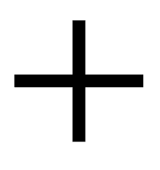
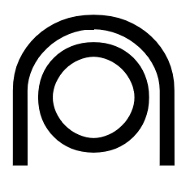
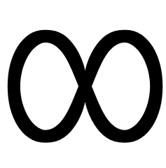

# Toki Pona Word Classes and Parts of Speech
*(nasin nimi)*

This creative work by Stephan Schneider is based on [the official Toki Pona book](http://www.amazon.com/gp/product/0978292308) and website: [http://tokipona.org](http://tokipona.org)

There are two main **ᴡᴏʀᴅ ᴄʟᴀꜱꜱ**es: [ᴄᴏɴᴛᴇɴᴛ ᴡᴏʀᴅ](#content-word)s and [ᴘᴀʀᴛɪᴄʟᴇ](#particle).

| |
|:-|
| [ᴄᴏɴᴛᴇɴᴛ ᴡᴏʀᴅ](#content-word) |
| [ᴘᴀʀᴛɪᴄʟᴇ](#particle) |

This document describes two kinds of rules: ᴘᴜ rules and ᴘᴏɴᴀ rules. ᴘᴜ rules enforce the omission of words:

| (ᴜɴ-ᴘᴜ) toki pi pona ⇒  (ᴘᴜ) toki pona |
|:-|
| *Language of Good* |

ᴘᴏɴᴀ rules purposely limit Toki Pona's expressiveness for the sake of a simpler style. Both ᴘᴜ rules and ᴘᴏɴᴀ rules actually complicate Toki Pona's grammar, yet they are considered ᴍᴀɴᴅᴀᴛᴏʀʏ, and sticking to them is therefore encouraged.

| (ᴜɴ-ᴘᴏɴᴀ) mi wile e ona o musi. ⇒ (ᴘᴏɴᴀ) mi wile e ni: ona li musi. |
|:-|
| *I want her to play.* |

A **ᴡᴏʀᴅ ᴄʟᴀꜱꜱ** determines how (and if) a word can be used as ᴘᴀʀᴛs ᴏꜰ ꜱᴘᴇᴇᴄʜ, i.e. as ɴᴏᴜɴ, ᴀᴅᴊᴇᴄᴛɪᴠᴇ, ᴀᴅᴠᴇʀʙ, ᴠᴇʀʙ, ᴘʀᴇ-ᴠᴇʀʙ, ᴘʀᴇᴘᴏꜱɪᴛɪᴏɴ or ᴘᴀʀᴛɪᴄʟᴇ. The following **ᴡᴏʀᴅ ᴄʟᴀꜱꜱ**es exist:

* [**ᴄᴏɴᴛᴇɴᴛ ᴡᴏʀᴅ**](#content-word)
  * [**ɴᴏᴜɴ**](#noun): [**ᴘʀᴏɴᴏᴜɴ**](#pronoun), [**ᴘᴇʀꜱᴏɴ**](#person), [**ᴛʜɪɴɢ**](#thing) ([**ᴄᴏʀʀᴇʟᴀᴛɪᴠᴇ**](#correlative), [**ᴀʀᴇᴀ**](#area), [**ᴛᴏᴏʟ**](#tool), [**ʟɪꜰᴇ-ꜰᴏʀᴍ**](#life-form))
  * [**ᴍᴏᴅɪꜰɪᴇʀ**](#modifier): [**ɴᴜᴍʙᴇʀ**](#number), [**ᴠᴇʀʙ**](#verb), [**ᴘʀᴇ-ᴠᴇʀʙ**](#pre-verb), [**ᴘʀᴇᴘᴏꜱɪᴛɪᴏɴ**](#preposition)
* [**ᴘᴀʀᴛɪᴄʟᴇ**](#particle)
  * [**ᴘʜʀᴀꜱᴇ ᴍᴀʀᴋᴇʀ**](#phrase-marker): [**ᴍᴏᴏᴅ**](#mood), [**ᴄᴀꜱᴇ**](#case)
  * [**ᴄᴏɴᴊᴜɴᴄᴛɪᴏɴ**](#conjunction): [**ᴀɴᴅ**](#and), [**ᴏʀ**](#or), [**ɪꜰ-ᴛʜᴇɴ**](#if-then)
  * [**ꜱᴏᴜɴᴅ**](#sound): [**ɴᴀᴍᴇ**](#name), [**ɪɴᴛᴇʀᴊᴇᴄᴛɪᴏɴ**](#interjection)

Each [dictionary](nimi-ale.md) entry indicates a word's **ᴡᴏʀᴅ ᴄʟᴀꜱꜱ** and its **ᴡᴏʀᴅ ꜰᴀᴍɪʟʏ** members. Antonyms are separated by a dash (—).

| ꜱɪᴛᴇʟᴇɴ | ᴋᴏɴ |
|:-|:-|
|  | [**ᴍᴏᴅɪꜰɪᴇʀ**](#modifier) **walo** — *kule*, *pimeja*  … |
|  | [**ᴍᴏᴅɪꜰɪᴇʀ**](#modifier) *walo* — **kule**, *pimeja*  … |
|  | [**ᴍᴏᴅɪꜰɪᴇʀ**](#modifier) *walo* — *kule*, **pimeja**  … |

Definitions as provided by [the official Toki Pona dictionary](http://tokipona.net/tp/janpije/dictionary.php) are written in **bold**, whereas translations found in the corpus are written in [**bold and blue**](sonja.md).

| ꜱɪᴛᴇʟᴇɴ | ᴋᴏɴ |
|:-|:-|
|  | [**ᴄᴏɴᴊᴜɴᴄᴛɪᴏɴ**](#conjunction) *anu*, **en**, *la*  ᴘᴀʀᴛɪᴄʟᴇ **(between multiple subjects)**, [**and**](sonja.md#lesson-16) |

Contextual abbreviations are written as *~~strikethroughs~~*.

| ꜱɪᴛᴇʟᴇɴ | ᴋᴏɴ |
|:-|:-|
|  | [**ᴍᴏᴅɪꜰɪᴇʀ**](#modifier) *kalama*, *lape*, **moli**, *musi*  ᴀᴅᴊᴇᴄᴛɪᴠᴇ **dead**, (*~~kama~~ moli*) **dying** |

Derivations according to a word's **ᴡᴏʀᴅ ᴄʟᴀꜱꜱ** are denoted with an arrow (→).

| ꜱɪᴛᴇʟᴇɴ | ᴋᴏɴ |
|:-|:-|
|  | [**ᴘᴇʀꜱᴏɴ**](#person) *mama* — **meli**, *mije*  ɴᴏᴜɴ **female**, **feminine person**, **woman**; **wife** →  ᴀᴅᴊᴇᴄᴛɪᴠᴇ [**female**](sonja.md#lesson-3) |

Semantic completions are written in [*italic and blue*](tepan.md).

| ꜱɪᴛᴇʟᴇɴ | ᴋᴏɴ |
|:-|:-|
|  | [**ᴘᴇʀꜱᴏɴ**](#person) *mama* — *meli*, **mije**  ɴᴏᴜɴ **male**, **man**, **masculine person**; **husband** →  ᴀᴅᴊᴇᴄᴛɪᴠᴇ [*male*](tepan.md) |

When all members of a **ᴡᴏʀᴅ ꜰᴀᴍɪʟʏ** share the same **ᴡᴏʀᴅ ᴄʟᴀꜱꜱ**es, they are listed  	with a plus-sign (+).

| ꜱɪᴛᴇʟᴇɴ | ᴋᴏɴ |
|:-|:-|
|  | [**ᴍᴏᴅɪꜰɪᴇʀ**](#modifier) + [**ᴘʀᴇ-ᴠᴇʀʙ**](#pre-verb) **ken**, *wile*  ᴀᴅᴊᴇᴄᴛɪᴠᴇ **possible** +  ᴘʀᴇ-ᴠᴇʀʙ **to be able to**, **be allowed to**, **can**, **may** |

Synonyms are denoted with a double arrow (⇒).

| ꜱɪᴛᴇʟᴇɴ | ᴋᴏɴ |
|:-|:-|
|  | [**ᴀʀᴇᴀ**](nasin-nimi.md#area) **anpa** — *sewi*, *noka* — *lawa*  ɴᴏᴜɴ (⇒ *noka*) →  ᴀᴅᴊᴇᴄᴛɪᴠᴇ …, **lowly**, … |
|  | [**ᴀʀᴇᴀ**](#area) *anpa* — *sewi*, **noka** — *lawa*  ɴᴏᴜɴ **lowest part**; **bottom**, …; (⇐ *anpa*) [**area below or under**](sonja.md#lesson-15) … →  … |

Extinct synonyms are written as *~~strikethroughs~~*. (Cf. Pije's page of [Extinct Words](http://tokipona.net/tp/janpije/extinctwords.php).)

| ꜱɪᴛᴇʟᴇɴ | ᴋᴏɴ |
|:-|:-|
|  | [**ᴛʜɪɴɢ**](#thing) *lipu*, **nena**, *sike* (⇐ *~~kapa~~*)  ɴᴏᴜɴ **bump**, **hill**, **mountain**, **protuberance**; **button**; (*nena ~~pi sinpin lawa~~*) **nose** →  ᴀᴅᴊᴇᴄᴛɪᴠᴇ *outstanding*, *thick* |

The obsolete synonyms **ali**, **kin**, **namako** and **oko** are written as *~~strikethroughs~~*, too.

| ꜱɪᴛᴇʟᴇɴ | ᴋᴏɴ |
|:-|:-|
|  | [**ɴᴜᴍʙᴇʀ**](#number) *ala*, **ale**, *esun*, *luka*, *mute*, *tu*, *wan* (⇐ *~~ali~~*)  ɴᴏᴜɴ [**infinity**](sonja.md#famous-quotations) →  ᴀᴅᴊᴇᴄᴛɪᴠᴇ [**∞**](sonja.md#lesson-12), **countless**; [**100**](sonja.md#lesson-12) |

# CONTENT WORD
*([nimi](#toki-pona-word-classes-and-parts-of-speech) suli)*

| |
|:-|
| [ɴᴏᴜɴ](#noun) |
| [ᴍᴏᴅɪꜰɪᴇʀ](#modifier) |

**ᴄᴏɴᴛᴇɴᴛ ᴡᴏʀᴅ**s can become any ᴘᴀʀᴛ ᴏꜰ ꜱᴘᴇᴇᴄʜ, except for [ᴘᴀʀᴛɪᴄʟᴇ](#particle)s. (Only [ꜱᴏᴜɴᴅ ᴘᴀʀᴛɪᴄʟᴇ](#sound)s can be both **ᴄᴏɴᴛᴇɴᴛ ᴡᴏʀᴅ**s and [ᴘᴀʀᴛɪᴄʟᴇ](#particle)s.)

## NOUN
*([nimi suli](#content-word) lawa)*

| |
|:-|
| [ᴘʀᴏɴᴏᴜɴ](#pronoun) |
| [ᴘᴇʀꜱᴏɴ](#person) |
| [ᴛʜɪɴɢ](#thing) |

ɴᴏᴜɴs of the **ɴᴏᴜɴ** ᴡᴏʀᴅ ᴄʟᴀꜱꜱ keep their meaning when used as another ᴘᴀʀᴛ ᴏꜰ ꜱᴘᴇᴇᴄʜ.

| ɴᴏᴜɴ jan |
|:-|
| ɴᴏᴜɴ *somebody*  ᴀᴅᴊᴇᴄᴛɪᴠᴇ *somebody's* |

### PRONOUN
*([nimi suli lawa](#noun) sama)*

**ᴘʀᴏɴᴏᴜɴ**s are **ɴᴏᴜɴ**s that refer to the speaker, the listener or a third person (or thing).

| ᴘʀᴏɴᴏᴜɴ sina |
|:-|
| ɴᴏᴜɴ *you*  ᴀᴅᴊᴇᴄᴛɪᴠᴇ *your* |

### PERSON
*([nimi suli lawa](#noun) jan)*

**ᴘᴇʀꜱᴏɴ ɴᴏᴜɴ**s imply **jan**.

| ᴘᴇʀꜱᴏɴ meli |
|:-|
| ɴᴏᴜɴ *somebody female* →  ᴀᴅᴊᴇᴄᴛɪᴠᴇ *female* |

### THING
*([nimi suli lawa](#noun) ijo)*

| |
|:-|
| [ᴄᴏʀʀᴇʟᴀᴛɪᴠᴇ](#correlative) |
| [ᴀʀᴇᴀ](#area) |
| [ᴛᴏᴏʟ](#tool) |
| [ʟɪꜰᴇ-ꜰᴏʀᴍ](#life-form) |

**ᴛʜɪɴɢ ɴᴏᴜɴ**s imply **ijo**.

| ᴛʜɪɴɢ sike |
|:-|
| ɴᴏᴜɴ *something round* →  ᴀᴅᴊᴇᴄᴛɪᴠᴇ *round* |

(In [Frontier Toki Pona](tepan.md), **mute**, **ma**, **ilo** and **sijelo** are **ᴛʜɪɴɢ ɴᴏᴜɴ**s, too. They can be used to express *amount*, *area*, *tool*/*useful* and *life-form*/*alive*.)

#### CORRELATIVE
*([nimi suli lawa ijo](#thing) sama)*

**ᴄᴏʀʀᴇʟᴀᴛɪᴠᴇ ɴᴏᴜɴs** are **ᴛʜɪɴɢ ɴᴏᴜɴ**s, i.e. they imply **ijo**.

| ᴄᴏʀʀᴇʟᴀᴛɪᴠᴇ ale |
|:-|
| ɴᴏᴜɴ *everything* →  ᴀᴅᴊᴇᴄᴛɪᴠᴇ *every* |

After [**pi**](#genitive-case), **ijo** reappears.

| mama pi ijo ale | mama ale |
|:-|:-|
| *parent of everything* | *every parent* |

ꜱᴇɴᴛᴇɴᴄᴇs after the **ᴄᴏʀʀᴇʟᴀᴛɪᴠᴇ** **ni:** can be translated as a ꜱᴜʙᴏʀᴅɪɴᴀᴛᴇ ᴄʟᴀᴜꜱᴇ.

| mi sona e ni: mi anpa. |
|:-|
| ᴍᴀɪɴ ᴄʟᴀᴜꜱᴇ + ꜱᴜʙᴏʀᴅɪɴᴀᴛᴇ ᴄʟᴀᴜꜱᴇ *I know that I'm low.* |

A ꜱᴜʙᴏʀᴅɪɴᴀᴛᴇ ᴄʟᴀᴜꜱᴇ can be formulated like a question ending in a question mark.

| wile sona nanpa wan li ni: ale li pona anu ike? |
|:-|
| *The question number one is whether the universe is good or evil.* |

#### AREA
*([nimi suli lawa ijo](#thing) ma)*

**ᴀʀᴇᴀ ɴᴏᴜɴ**s are **ᴛʜɪɴɢ ɴᴏᴜɴ**s, i.e. they imply **ijo**, meaning *area*.

| ᴀʀᴇᴀ insa |
|:-|
| ɴᴏᴜɴ *innards* →  ᴀᴅᴊᴇᴄᴛɪᴠᴇ *inner* |

#### TOOL
*([nimi suli lawa ijo](#thing) ilo)*

**ᴛᴏᴏʟ ɴᴏᴜɴ**s imply **ilo**.

| ᴛᴏᴏʟ lukin |
|:-|
| ɴᴏᴜɴ *eye* →  ᴠᴇʀʙ *to use eyes on*, *to see* |

#### LIFE-FORM
*([nimi suli lawa ijo](#thing) sijelo)*

**ʟɪꜰᴇ-ꜰᴏʀᴍ ɴᴏᴜɴ**s are **ᴛʜɪɴɢ ɴᴏᴜɴ**s, i.e. they imply **ijo**, meaning *life-form*.

| ʟɪꜰᴇ-ꜰᴏʀᴍ waso |
|:-|
| ɴᴏᴜɴ *flying creature* →  ᴀᴅᴊᴇᴄᴛɪᴠᴇ *flying* |

## MODIFIER
*([nimi suli](#content-word) poka)*

| |
|:-|
| [ɴᴜᴍʙᴇʀ](#number) |
| [ᴠᴇʀʙ](#verb) |
| [ᴘʀᴇ-ᴠᴇʀʙ](#pre-verb) |
| [ᴘʀᴇᴘᴏꜱɪᴛɪᴏɴ](#preposition) |

ᴀᴅᴊᴇᴄᴛɪᴠᴇs of the **ᴍᴏᴅɪꜰɪᴇʀ** ᴡᴏʀᴅ ᴄʟᴀꜱꜱ keep their meaning when used as another ᴘᴀʀᴛ ᴏꜰ ꜱᴘᴇᴇᴄʜ.

| ᴍᴏᴅɪꜰɪᴇʀ pona |
|:-|
| ᴀᴅᴊᴇᴄᴛɪᴠᴇ *good*  ɴᴏᴜɴ *goodness*  ᴠᴇʀʙ *to improve* |

### NUMBER
*([nimi suli poka](#thing) nanpa)*

**ɴᴜᴍʙᴇʀ**s can be used as [ɴᴀᴍᴇ ᴘᴀʀᴛɪᴄʟᴇ](#name)s after **nanpa**.

| ɴᴜᴍʙᴇʀ tu | mute pi ijo tu | tawa musi pi jan tu | toki nanpa tu |
|:-|:-|:-|:-|
| ᴀᴅᴊᴇᴄᴛɪᴠᴇ *two* | *pair* | *pair dance* | *the second language* |

### VERB
*([nimi suli poka](#modifier) luka)*

ᴀᴅᴊᴇᴄᴛɪᴠᴇs of the **ᴠᴇʀʙ** ᴡᴏʀᴅ ᴄʟᴀꜱꜱ keep their meaning. ɴᴏᴜɴs derived from **ᴠᴇʀʙ**s can also mean their [direct object](#accusative-case).

| ᴠᴇʀʙ moku |
|:-|
| ᴠᴇʀʙ *to eat*  ᴀᴅᴊᴇᴄᴛɪᴠᴇ *eating*  ɴᴏᴜɴ *eating* →  ɴᴏᴜɴ *food* |

---

### PRE-VERB
*([nimi suli poka](#modifier) monsi)*

Some ᴠᴇʀʙs allow to be merged with a [ꜱᴜʙᴏʀᴅɪɴᴀᴛᴇ ᴄʟᴀᴜꜱᴇ](#subordinate-clause)'s [predicate](#predicate). Such ᴠᴇʀʙs are auxiliary verbs. ꜱᴏɴᴊᴀ uses the term "ᴘʀᴇ-ᴠᴇʀʙ" for auxiliary verbs.

| ᴀᴅᴊᴇᴄᴛɪᴠᴇ + ᴘʀᴇ-ᴠᴇʀʙ kama | ijo/jan li kama e ni: mi sona e toki pona. → mi kama sona e toki pona. |
|:-|:-|
| ᴀᴅᴊᴇᴄᴛɪᴠᴇ *coming*, ᴠᴇʀʙ *to summon* + ᴘʀᴇ-ᴠᴇʀʙ *to manage to*, ᴠᴇʀʙ *to achieve* | I'm learning Toki Pona. |

| ᴠᴇʀʙ + ᴘʀᴇ-ᴠᴇʀʙ lukin | mi lukin e ni: mi lape. → mi lukin lape. |
|:-|:-|
| ᴠᴇʀʙ *to see* + ᴘʀᴇ-ᴠᴇʀʙ *to try to*, ᴠᴇʀʙ *to care for* | *I try to sleep.* |

### PREPOSITION
*([nimi suli poka](#modifier) palisa)*

ᴘʀᴇᴘᴏꜱɪᴛɪᴏɴs are like [ᴀᴅᴊᴇᴄᴛɪᴠᴇ](#adjective)s with an additional [ɴᴏᴜɴ-ᴘʜʀᴀꜱᴇ](#noun).

| ᴘʀᴇᴘᴏꜱɪᴛɪᴏɴ tawa |
|:-|
| ᴀᴅᴊᴇᴄᴛɪᴠᴇ moving → ᴘʀᴇᴘᴏꜱɪᴛɪᴏɴ going to, towards; for |

ᴘʀᴇᴘᴏꜱɪᴛɪᴏɴᴀʟ ᴘʜʀᴀꜱᴇs follow [ᴘᴀʀᴛɪᴄʟᴇ-ᴘʜʀᴀꜱᴇ](#particle)s.

| mi pana e kili tawa sina. |
|:-|
| *I'm giving you an apple.* |

When used two times in a row as both ᴀᴅᴊᴇᴄᴛɪᴠᴇ and ᴘʀᴇᴘᴏꜱɪᴛɪᴏɴ, the ᴘʀᴇᴘᴏꜱɪᴛɪᴏɴ is dropped. A ᴘᴀʀᴛɪᴄʟᴇ (typically **ala**) can be added to the ᴀᴅᴊᴇᴄᴛɪᴠᴇ, but not another ᴀᴅᴊᴇᴄᴛɪᴠᴇ.

| (ᴜɴ-ᴘᴜ) mi tawa tawa tomo. ⇒ (ᴘᴜ) mi tawa tomo. | (ᴜɴ-ᴘᴜ) mi tawa ala tawa tomo. ⇒ (ᴘᴜ) mi tawa ala tomo. | mi tawa wawa tawa tomo. |
|:-|:-|:-|
| *I'm going home.* | *I'm not going home.* | *I'm running home.* |

ᴘʀᴇᴘᴏꜱɪᴛɪᴏɴs are used only at the end of **predicates**.

| (ᴜɴ-ᴘᴏɴᴀ) jan lon poka ⇒ (ᴘᴏɴᴀ) jan poka | (ᴜɴ-ᴘᴏɴᴀ) jan pi pona tawa lukin ⇒ (ᴘᴏɴᴀ) jan pi pona lukin |
|:-|:-|
| *neighbour* | *beautiful person* |

A **comma** between two ᴘʀᴇᴘᴏꜱɪᴛɪᴏɴᴀʟ ᴘʜʀᴀꜱᴇs can therefore be safely removed.

| (ᴜɴ-ᴘᴏɴᴀ) mi toki tawa sina, lon tomo. ⇒ (ᴘᴏɴᴀ) mi toki tawa sina lon tomo. |
|:-|
| *I'm talking to you at home.* |

# PARTICLE
*([nimi](#toki-pona-word-classes-and-parts-of-speech) lili)*

| |
|:-|
| [ᴘʜʀᴀꜱᴇ ᴍᴀʀᴋᴇʀ](#phrase-marker) |
| [ᴄᴏɴᴊᴜɴᴄᴛɪᴏɴ](#conjunction) |
| [ꜱᴏᴜɴᴅ](#sound) |

## PHRASE MARKER
*([nimi lili](#particle) lawa)*

| |
|:-|
| [ᴍᴏᴏᴅ](#mood): [Indicative Mood](#indicative-mood), [Volative, Vocative and Imperative Mood](#volative-vocative-and-imperative-mood) |
| [ᴄᴀꜱᴇ](#case): [Genitive Case](#genitive-case), [Accusative Case](#accusative-case) |

### Mood

#### Indicative Mood
*([nimi lili lawa](#phrase-marker) "li")*

If the **subject** is just "mi" or "sina", the ᴘᴀʀᴛɪᴄʟᴇ "li" is omitted.

| (ᴜɴ-ᴘᴜ) mi li mije. ⇒ (ᴘᴜ) mi mije. | (ᴜɴ-ᴘᴜ) sina li sin. ⇒ (ᴘᴜ) sina sin. |
|:-|:-|
| *I am a man.* | *You are new.* |

Only ꜱᴇɴᴛᴇɴᴄᴇs can have **predicates**. **Commas** between them can be safely removed.

| (ꜱᴏɴᴊᴀ) ma mama li lili, li lete. ⇒ (ᴘᴏɴᴀ) ma mama li lili li lete. |
|:-|
| *The motherland is small and cold.* |

When there is enough context, the **subject** of a ꜱᴇɴᴛᴇɴᴄᴇ can be omitted in order to answer yes-or-no questions. The answer to a yes-or-now question can be further reduced to the [ɪɴᴛᴇʀᴊᴇᴄᴛɪᴏɴ](#interjection) that modifies the **predicate**.

| ona li mama. ⇒ mama. | ona li mama ala. ⇒ (ᴜɴ-ᴘᴜ) mama ala. ⇒ (ᴘᴜ) ala. |
|:-|:-|
| *She is a parent.* → *Yes.* | *She is not a parent.* → *No.* |

#### Volative, Vocative and Imperative Mood
*([nimi lili lawa](#phrase-marker) "o")*

"sina" can be omitted before the ᴘᴀʀᴛɪᴄʟᴇ "o".

| sina o lukin. → o lukin! | jan Ali o wawa. |
|:-|:-|
| *You should look.* → *Look!* | *Ali should be strong.* |

"kute" can be omitted after the ᴘᴀʀᴛɪᴄʟᴇ "o". ꜱᴏɴᴊᴀ doesn't combine two "o"-ᴘᴀʀᴛɪᴄʟᴇs.

| o kute! → o! | (ᴜɴ-ᴘᴜ) jan Ali o, o wawa! → (ᴘᴜ) jan Ali o wawa! |
|:-|:-|
| *Listen!* → *Hey!* | *Hey Ali, be strong!* |

A **volative** can be expressed by just mentioning the **direct object** (i.e. the words after the ᴘᴀʀᴛɪᴄʟᴇ "e") of a wish.

| sina o jo e moku pona. → moku pona! |
|:-|
| *May you have a good meal.* → *Bon appétit!* |

### Case

#### Genitive Case
*([nimi lili lawa](#phrase-marker) "pi")*

If a **genitive** [ɴᴏᴜɴ-ᴘʜʀᴀꜱᴇ](#noun) (or [ᴀᴅᴊᴇᴄᴛɪᴠᴇ-ᴘʜʀᴀꜱᴇ](#adjective), or **"pi"**-phrase) contains only one [ɴᴏᴜɴ](#noun), the ᴘᴀʀᴛɪᴄʟᴇ "pi" is omitted and the phrase becomes an [ᴀᴅᴊᴇᴄᴛɪᴠᴇ](#adjective).

| jan pi pona mute | (ᴜɴ-ᴘᴜ) toki pi pona → (ᴘᴜ) toki pona |
|:-|:-|
| *a person of much good* → *a very good person* | *a language of good* → *a good language* |

#### Accusative Case
*([nimi lili lawa](#phrase-marker) "e")*

Only ꜱᴇɴᴛᴇɴᴄᴇs can have **predicates** can have **direct objects**. Their **commas** can be safely omitted.

| (ꜱᴏɴᴊᴀ) ona li seli e soweli, e pan. ⇒ (ᴘᴏɴᴀ) ona li seli e soweli e pan. |
|:-|
| *She cooks the meat and the rice.* |

When there is enough context, the **direct object** of a [ᴠᴇʀʙ](#verb) can be omitted. (ꜱᴏɴᴊᴀ calls these omittable objects ["filler objects"](sonja.md#lesson-5).)

| mije li sona e ijo/ni/ona. ⇒ mije li sona. |
|:-|
| *The men know things/that/it.* ⇒ *The men know.* |

## CONJUNCTION
*([nimi lili](#particle) insa)*

| |
|:-|
| [**ᴀɴᴅ**](#and) |
| [**ᴏʀ**](#or) |
| [**ɪꜰ-ᴛʜᴇɴ**](#if-then) |

### AND
*([nimi lili insa](#conjunction) "en")*

### OR
*([nimi lili insa](#conjunction) "anu")*

By means of "anu seme" one can express a yes-no-question. In this case "seme" is an alternative [predicate](#predicate) to "mama".

| ona li mama anu seme? |
|:-|
| *Is she a parent?* |

### IF-THEN
*([nimi lili insa](#conjunction) "la")*

By means of the ᴘᴀʀᴛɪᴄʟᴇ "la", one can start a ꜱᴇɴᴛᴇɴᴄᴇ with a [ᴘʀᴇᴘᴏꜱɪᴛɪᴏɴᴀʟ ᴘʜʀᴀꜱᴇ](#preposition), i.e. a ᴘʀᴇ-ᴘʜʀᴀꜱᴇ.

| sina pana e nimi pona tawa mi tan seme? → tan seme la sina pana e nimi pona tawa mi? |
|:-|
| *Why are you calling me good?* |

Before **la**, the [ᴘʀᴇᴘᴏꜱɪᴛɪᴏɴ](#preposition) **lon** is omitted.

| ona li kama lon tenpo pimeja ni. → (ᴜɴ-ᴘᴜ) lon tenpo pimeja ni la ona li kama. ⇒ (ᴘᴜ) tenpo pimeja ni la ona li kama. |
|:-|
| *She is coming tonight.* → *Tonight, she is coming.* |

Before **la**, **ni** in front of a [ꜱᴜʙᴏʀᴅɪɴᴀᴛᴇ ᴄʟᴀᴜꜱᴇ](#subordinate-clause) is omitted.

| (ᴜɴ-ᴘᴜ) lon ni: mi pona tawa jan, la jan li pona tawa mi. ⇒ (ᴘᴜ) mi pona tawa jan, la jan li pona tawa mi. |
|:-|
| *If I'm good to people, people are good to me.* |

## SOUND
*([nimi lili](#particle) poka)*

### NAME
*([nimi lili poka](#sound) nimi)*

ɴᴀᴍᴇs are tokiponized names or sounds. They always follow a [ɴᴏᴜɴ](#noun). When "pi nimi (pi kalama)" can be infered, **quotation marks** can be omitted.

| ona li jo e nimi "Sonja". | ona li jan pi nimi "Sonja". ⇒ ona li jan Sonja |
|:-|:-|
| *She has the name "Sonja".* | *She is the person called "Sonja".* ⇒ *She is Sonja.* |

[ꜱᴏɴᴊᴀ](sonja.md#the-gospel) removes the **quotations marks**, when the sense remains the same.

| (ᴘᴜ) tan seme la sina pana e nimi "pona" tawa mi? ⇒ (ꜱᴏɴᴊᴀ) tan seme la sina pana e nimi pona tawa mi? |
|:-|
| *Why do you call me good?* |

[ꜱᴏɴᴊᴀ](sonja.md#lesson-12) removes the [ᴘᴀʀᴛɪᴄʟᴇ "pi"](#genitive) before "nanpa" with a [ɴᴜᴍʙᴇʀ ᴀᴅᴊᴇᴄᴛɪᴠᴇ](#number). In this case, "nanpa" itself becomes part of a ꜱɪᴍᴘʟᴇ-ᴘᴀʀᴛɪᴄʟᴇ-ᴘʜʀᴀꜱᴇ.

| toki pi nanpa wan → toki nanpa wan |
|:-|
| *the language with the number one*, *the language of the first turn* → *the language number one* |

...

| sina nanpa wan. |
|:-|
| *You're number one.* |

### INTERJECTION
*([nimi lili poka](#sound) toki)*

ɪɴᴛᴇʀᴊᴇᴄᴛɪᴏɴs are ɴᴀᴍᴇs that imitate a sound. ɪɴᴛᴇʀᴊᴇᴄᴛɪᴏɴs can be used as [ᴠᴇʀʙ](#verb)s meaning "to produce that sound".

| soweli li kalama "mu". ⇒ soweli li mu. | ona li kute e kalama "mu" wawa. ⇒ ona li kute e mu wawa. |
|:-|:-|
| *The animal bleats.* | *She heard a loud bleat.* |

Proper names can be thought of as ɪɴᴛᴇʀᴊᴇᴄᴛɪᴏɴs, i.e. as imitations of the sound of a name. Therefore, "nimi" meaning "kalama" can be omitted.

| nimi ona li nimi "Sonja". ⇒ nimi ona li Sonja. |
|:-|
| *Her name is the name "Sonja".* → *Her name goes "Sonja".*, *Her name is Sonja.* |

One can use ɪɴᴛᴇʀᴊᴇᴄᴛɪᴏɴs as a whole ꜱᴇɴᴛᴇɴᴄᴇ.

| a! |
|:-|
| *Ha!*, *Wow!* |

As the opposite of "ala", the affermative ɪɴᴛᴇʀᴊᴇᴄᴛɪᴏɴ "a" can be safely removed. The comma between a subsequent sentence consisting only of the ɪɴᴛᴇʀᴊᴇᴄᴛɪᴏɴ "a" can therefore be safely removed.

| (ᴜɴ-ᴘᴏɴᴀ) ni li lon a. ⇒ (ᴘᴏɴᴀ) ni li lon. | (ᴜɴ-ᴘᴏɴᴀ) sina suli, a! ⇒ (ᴘᴏɴᴀ) sina suli a! |
|:-|:-|
| *This does exist.* → *This is true.* | *You're tall, wow!* |

