# Parts of Speech, Word Classes and Dictionary
*(nasin nimi)*

This creative work by Stephan Schneider is based on [the official Toki Pona book](http://www.amazon.com/gp/product/0978292308) and website: [http://tokipona.org](http://tokipona.org)

## Parts of Speech and Word Classes

There are two word classes: [content words](#content-word) (i.e. these parts of speech: adjectives, prepositions, verbs, auxiliaries (or "pre-verbs") and nouns) and [particles](#particle) (i.e. these parts of speech: markers, conjunctions and onomatopeia). As a rule of thumb, you can change the part of speech of any content word, but you can't change the part of speech of a particle.

But there are restrictions and loopholes in Toki Pona: auxiliaries (or "pre-verbs") and prepositions can be converted into nouns, adjectives and verbs, but not the other way around. Also, an onomatopeia can be converted into a content word meaning *the name ...* or *the sound ...*, and a content word can be used as an onomatopeia, e.g. **nanpa**.

* [**ᴄᴏɴᴛᴇɴᴛ ᴡᴏʀᴅ**](#content-word)
  * [**ᴀᴅᴊᴇᴄᴛɪᴠᴇ**](#adjective): [**ᴘʀᴇᴘᴏꜱɪᴛɪᴏɴ**](#preposition)
  * [**ᴠᴇʀʙ**](#verb): [**ᴘʀᴇ-ᴠᴇʀʙ**](#pre-verb)
  * [**ɴᴏᴜɴ**](#noun): [**ᴘʀᴏɴᴏᴜɴ**](#pronoun)
  * [**ɴᴏᴜɴ ᴀᴅᴊᴇᴄᴛɪᴠᴇ**](#noun-adjective):
    * [**ᴘᴇʀꜱᴏɴ**](#person), [**ᴏʀɢᴀɴ**](#organ), [**ʟɪꜰᴇ-ꜰᴏʀᴍ**](#life-form)
    * [**ᴛʜɪɴɢ**](#thing), [**ᴄᴏʀʀᴇʟᴀᴛɪᴠᴇ**](#correlative), [**ɴᴜᴍʙᴇʀ**](#number), [**ᴀʀᴇᴀ**](#area)
* [**ᴘᴀʀᴛɪᴄʟᴇ**](#particle)
  * [**ᴍᴀʀᴋᴇʀ**](#marker): [**ᴍᴏᴏᴅ ᴍᴀʀᴋᴇʀ**](#mood-marker), [**ᴄᴀꜱᴇ ᴍᴀʀᴋᴇʀ**](#case-marker)
  * [**ᴄᴏɴᴊᴜɴᴄᴛɪᴏɴ**](#conjunction): [**ᴀɴᴅ**](#and), [**ᴏʀ**](#or), [**ɪꜰ-ᴛʜᴇɴ**](#if-then)
  * [**ᴏɴᴏᴍᴀᴛᴏᴘᴇɪᴀ**](#onomatopeia): [**ɴᴀᴍᴇ**](#name), [**ɪɴᴛᴇʀᴊᴇᴄᴛɪᴏɴ**](#interjection)

## Dictionary
*(nimi ale)*

* ᴄʟᴀꜱꜱɪᴄ
* ᴘɪᴊᴇ
* ᴋɪᴘᴏ

| ꜱɪᴛᴇʟᴇɴ | ᴋᴏɴ |
|:-:|:-|
|  **a** | [**ᴘᴀʀᴛɪᴄʟᴇ: ɪɴᴛᴇʀᴊᴇᴄᴛɪᴏɴ**](#interjection)  ᴘᴀʀᴛɪᴄʟᴇ [**(emotion word)**](pu.md#lesson-10), (⇐ ᴄʟᴀꜱꜱɪᴄ *kin*) **(emphasis or confirmation)**  ᴀᴅᴠᴇʀʙ [**so**](pu.md#lesson-10); [**ha**](pu.md#lesson-10), [**wow**](pu.md#lesson-10), [**yay**](pu.md#lesson-13): (*sama la + a* ⇐ ᴄʟᴀꜱꜱɪᴄ *kin*) *also*, (⇐ ᴄʟᴀꜱꜱɪᴄ *kin*) *indeed*, (*awen la + a* ⇐ ᴘɪᴊᴇ *kin*) *still*, (*sin la + a* ⇐ ᴄʟᴀꜱꜱɪᴄ *kin*) *too*; (⇒ *lon*) |
|  **akesi** | [**ɴᴏᴜɴ ᴀᴅᴊᴇᴄᴛɪᴠᴇ: ʟɪꜰᴇ-ꜰᴏʀᴍ**](#life-form)  ᴀᴅᴊᴇᴄᴛɪᴠᴇ *cold-blooded*, *monstrous*, (ᴋɪᴘᴏ) *treacherous*: (*pipi akesi* ⇐ ᴄʟᴀꜱꜱɪᴄ *akesi*) *arthropod*, (*toki akesi* ⇐ ᴋɪᴘᴏ *powe*) *to deceive*; (⇒ *ike*)  ɴᴏᴜɴ **non-cute animal**; **amphibian**, **reptile**; (⇐ ᴋɪᴘᴏ *monsuta*) *monster*: (*pilin akesi tan* ⇐ ᴋɪᴘᴏ *monsuta e*) *to fear*; (*jan akesi* ⇐ ᴋɪᴘᴏ *monsuta*) *boogeyman*; (*pilin akesi* ⇐ ᴋɪᴘᴏ *monsuta*) *fear* |
|  **ala** | [**ᴘᴀʀᴛɪᴄʟᴇ: ɪɴᴛᴇʀᴊᴇᴄᴛɪᴏɴ**](#interjection)  ᴘᴀʀᴛɪᴄʟᴇ *(negation)*  ᴀᴅᴠᴇʀʙ **not**  ɴᴏᴜɴ [**nothingness**](pu.md#lesson-6) |
| | [**ɴᴏᴜɴ ᴀᴅᴊᴇᴄᴛɪᴠᴇ: ɴᴜᴍʙᴇʀ**](#number)  ᴀᴅᴊᴇᴄᴛɪᴠᴇ **zero**, [**0**](pu.md#lesson-12); **no**: (*ijo ala* ⇐ ᴄʟᴀꜱꜱɪᴄ *ala*) [**nothing**](pu.md#chapter-of-sincerity)  ɴᴏᴜɴ [**zero**](pu.md#famous-quotations) |
|  **alasa** | [**ᴠᴇʀʙ**](#verb)  ᴠᴇʀʙ **to hunt**, **forage**; (⇒ ᴋɪᴘᴏ *lukin*)  ɴᴏᴜɴ (ᴋɪᴘᴏ) *prey* |
|  **ale** | [**ɴᴏᴜɴ ᴀᴅᴊᴇᴄᴛɪᴠᴇ: ᴄᴏʀʀᴇʟᴀᴛɪᴠᴇ**](#correlative) ⇐ *~~ali~~*  ᴀᴅᴊᴇᴄᴛɪᴠᴇ  (*~~mute~~ ale*) **all**, **every**; (*~~wan~~ ale*) **all**  ɴᴏᴜɴ **everything**; (⇒ *ma*) |
| | [**ɴᴏᴜɴ ᴀᴅᴊᴇᴄᴛɪᴠᴇ: ɴᴜᴍʙᴇʀ**](#number)  ᴀᴅᴊᴇᴄᴛɪᴠᴇ [**∞**](pu.md#lesson-12), **countless**  ɴᴏᴜɴ [**infinity**](pu.md#famous-quotations); [**100**](pu.md#lesson-12) |
| | [**ɴᴏᴜɴ ᴀᴅᴊᴇᴄᴛɪᴠᴇ: ᴛʜɪɴɢ**](#thing)  ᴀᴅᴊᴇᴄᴛɪᴠᴇ **abundant**, **bountiful**, **plentiful**  ɴᴏᴜɴ **abundance**; **life**, **universe** |
|  **anpa** | [**ɴᴏᴜɴ ᴀᴅᴊᴇᴄᴛɪᴠᴇ: ᴀʀᴇᴀ**](#area)  ᴀᴅᴊᴇᴄᴛɪᴠᴇ (⇒ *noka*): (*kama anpa*) **downward**; **bowing down**; *deep*  ɴᴏᴜɴ (⇒ *noka*); *abyss*; (⇐ ᴋɪᴘᴏ *apeja*) *hell* |
| | [**ɴᴏᴜɴ ᴀᴅᴊᴇᴄᴛɪᴠᴇ: ᴛʜɪɴɢ**](#thing)  ᴀᴅᴊᴇᴄᴛɪᴠᴇ **humble**, **lowly**; **dependent**; (⇐ ᴋɪᴘᴏ *apeja*) *guilty*, *shameful*;  ᴠᴇʀʙ *to conquer*; (⇐ ᴋɪᴘᴏ *apeja*) *to condemn*, *punish*;  ɴᴏᴜɴ [**powerlessness**](pu.md#short-obligatory-prayer); (⇐ ᴋɪᴘᴏ *apeja*) *guilt*, *shame*  ɴᴏᴜɴ (⇐ ᴋɪᴘᴏ *apeja*) *devil* |
|  **ante** | [**ᴘʀᴇᴘᴏꜱɪᴛɪᴏɴ**](#preposition)  ᴘʀᴇᴘᴏꜱɪᴛɪᴏɴ (⇒ *poka*); (⇒ *poka* ⇐ *esun*)  ᴀᴅᴊᴇᴄᴛɪᴠᴇ **altered**, **changed**, **different**; (⇐ *esun*) *else*, *exchanged*, **other**; (⇐ *esun* ⇐ *sin*) *replaced*  ɴᴏᴜɴ (*~~kama~~ ante*) [**change**](pu.md#toki-pona-proverbs) |
| 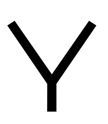 **anu** | [**ᴘᴀʀᴛɪᴄʟᴇ: ᴄᴏɴᴊᴜɴᴄᴛɪᴏɴ**](#conjunction)  ᴘᴀʀᴛɪᴄʟᴇ *(alternative)*, **or** |
| 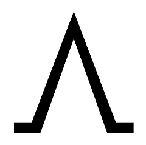 **awen** | [**ᴘʀᴇ-ᴠᴇʀʙ**](#pre-verb)  ᴘʀᴇ-ᴠᴇʀʙ **to continue to**  ᴀᴅᴊᴇᴄᴛɪᴠᴇ *continuous* |
| | [**ɴᴏᴜɴ ᴀᴅᴊᴇᴄᴛɪᴠᴇ: ᴀʀᴇᴀ**](#area)  ᴀᴅᴊᴇᴄᴛɪᴠᴇ **enduring**, **kept**; (*~~pi tenpo~~ awen*) *present*; (*~~pi nanpa~~ awen*) *current*; (*awen ~~lon~~*) **staying**; (⇐ *open*) **waiting**; (*ken awen* ⇐ *tomo*) **protected**, **safe**;  ᴠᴇʀʙ (⇐ *tomo*) [**to help in peril**](pu.md#short-obligatory-prayer), [**protect**](pu.md#lesson-15) |  ɴᴏᴜɴ (⇒ *tenpo*)
|  **e** | [**ᴘᴀʀᴛɪᴄʟᴇ: ᴍᴀʀᴋᴇʀ**](#case-marker)  ᴘᴀʀᴛɪᴄʟᴇ **(before the direct ᴏʙᴊᴇᴄᴛ)** |
|  **en** | [**ᴘᴀʀᴛɪᴄʟᴇ: ᴄᴏɴᴊᴜɴᴄᴛɪᴏɴ**](#conjunction)  ᴘᴀʀᴛɪᴄʟᴇ **(between multiple ꜱᴜʙᴊᴇᴄᴛs)**, [**and**](pu.md#lesson-16) |
|  **esun** | [**ᴘʀᴇᴘᴏꜱɪᴛɪᴏɴ**](#preposition)  ᴘʀᴇᴘᴏꜱɪᴛɪᴏɴ (⇒ *ante*)  ᴀᴅᴊᴇᴄᴛɪᴠᴇ (⇒ *ante*); (⇒ *ante* ⇐ *sin*)  ɴᴏᴜɴ (*~~kama~~ esun*) *exchange*; (*esun ~~pali~~*) **business transaction**; (*~~tomo~~ esun*) **shop**; (*~~ma~~ esun*) **bazaar**, **fair**, **market** |
| | [**ɴᴏᴜɴ ᴀᴅᴊᴇᴄᴛɪᴠᴇ: ɴᴜᴍʙᴇʀ**](#number)  ᴀᴅᴊᴇᴄᴛɪᴠᴇ *7*, *seven*  ɴᴏᴜɴ *septet*: (*sike esun*) *week* |
| 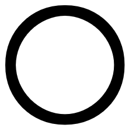 **ijo** | [**ɴᴏᴜɴ**](#noun)  ɴᴏᴜɴ [**being**](pu.md#lesson-2), **matter**, **object**, **phenomenon**, [**something**](pu.md#lesson-2), **thing**;  ᴀᴅᴊᴇᴄᴛɪᴠᴇ *something's* |
|  **ike** | [**ᴀᴅᴊᴇᴄᴛɪᴠᴇ**](#adjective)  ᴀᴅᴊᴇᴄᴛɪᴠᴇ **bad**, [**harmful**](pu.md#toki-pona-proverbs), [**needless**](pu.md#famous-quotations), **negative**; (⇐ *akesi*) [**hostile**](pu.md#famous-quotations); (*~~sin~~ ike*) **irrelevant**, **non-essential**;  ɴᴏᴜɴ [**bad things**](pu.md#toki-pona-proverbs), [**evil**](pu.md#toki-pona-proverbs), [**fault**](pu.md#toki-pona-proverbs), [**negativity**](pu.md#toki-pona-proverbs), [**non-essentials**](pu.md#famous-quotations) |
| 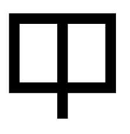 **ilo** | [**ɴᴏᴜɴ ᴀᴅᴊᴇᴄᴛɪᴠᴇ: ᴛʜɪɴɢ**](#thing)  ᴀᴅᴊᴇᴄᴛɪᴠᴇ (⇒ *pona*)  ɴᴏᴜɴ **device**, **implement**, **machine**, **tool** |
|  **insa** | [**ɴᴏᴜɴ ᴀᴅᴊᴇᴄᴛɪᴠᴇ: ᴀʀᴇᴀ**](#area)  ᴀᴅᴊᴇᴄᴛɪᴠᴇ *central*; *inner*  ɴᴏᴜɴ **centre**: (*lon insa*) **between**, (*lon ~~insa~~*) [**(tangentially) between**](pu.md#famous-quotations); **inside**: (*lon insa*) [**within**](pu.md#toki-pona-proverbs), (*lon ~~insa~~*) [**in**](pu.md#lesson-8) |
| | [**ɴᴏᴜɴ ᴀᴅᴊᴇᴄᴛɪᴠᴇ: ᴛʜɪɴɢ**](#thing)  ᴀᴅᴊᴇᴄᴛɪᴠᴇ *internal*  ɴᴏᴜɴ **content** |
| | [**ɴᴏᴜɴ ᴀᴅᴊᴇᴄᴛɪᴠᴇ: ᴏʀɢᴀɴ**](#organ)  ᴀᴅᴊᴇᴄᴛɪᴠᴇ *intermediary*; (⇐ *nasin*) *connecting*, *continuous*   ɴᴏᴜɴ **internal organ**: **stomach**, [**womb**](pu.md#lesson-15); (*~~nasin pi~~ insa palisa*) *joint*; (⇐ *nasin*) *connection*  ᴠᴇʀʙ (⇐ *nasin*) *to connect* |
| 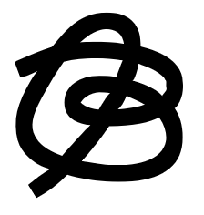 **jaki** | [**ɴᴏᴜɴ ᴀᴅᴊᴇᴄᴛɪᴠᴇ: ᴛʜɪɴɢ**](#thing)  ᴀᴅᴊᴇᴄᴛɪᴠᴇ *bitter*, **disgusting**, **obscene**, **sickly**, **toxic**, **unclean**, **unsanitary**, [**yucky**](pu.md#lesson-1)  ɴᴏᴜɴ *dirt*, *poison*, *waste* |
|  **jan** | [**ɴᴏᴜɴ**](#noun)  ɴᴏᴜɴ [**folks**](pu.md#toki-pona-proverbs), [**guy**](pu.md#lesson-9), **human being**, **person**/[**people**](pu.md#lesson-9), **somebody**;  ᴀᴅᴊᴇᴄᴛɪᴠᴇ [**somebody's**](pu.md#toki-pona-proverbs) |
|  **jan** | [**ᴀᴅᴊᴇᴄᴛɪᴠᴇ**](#adjective)  ᴀᴅᴊᴇᴄᴛɪᴠᴇ **yellow**, (*jelo ~~mu~~*) **yellowish** |
|  **jo** | [**ᴠᴇʀʙ**](#verb)  ᴠᴇʀʙ **to have**; **carry**, **contain**, **hold**; (*kama jo e ijo tan*) *fetch*, *pick*  ɴᴏᴜɴ *property* |
|  **kala** | [**ɴᴏᴜɴ ᴀᴅᴊᴇᴄᴛɪᴠᴇ: ʟɪꜰᴇ-ꜰᴏʀᴍ**](#life-form)  ᴀᴅᴊᴇᴄᴛɪᴠᴇ *diving*, *swimming*  ɴᴏᴜɴ **fish**, **marine animal**, **sea creature** |
|  **kalama** | [**ᴀᴅᴊᴇᴄᴛɪᴠᴇ**](#adjective)  ᴀᴅᴊᴇᴄᴛɪᴠᴇ [**producing a sound**](pu.md#errata)  ᴠᴇʀʙ **to recite**, **utter aloud**  ɴᴏᴜɴ [**noise**](pu.md#lesson-18) |
|  **kama** | [**ᴘʀᴇ-ᴠᴇʀʙ**](#pre-verb)  ᴘʀᴇ-ᴠᴇʀʙ **to become**: (*kama ~~lon~~*) **arriving**, **being summoned**, **coming**; (*kama ~~pini~~*) **manage to**, **succeed in**  ᴀᴅᴊᴇᴄᴛɪᴠᴇ *successful* |
| | [**ɴᴏᴜɴ ᴀᴅᴊᴇᴄᴛɪᴠᴇ: ᴀʀᴇᴀ**](#area)  ᴀᴅᴊᴇᴄᴛɪᴠᴇ [**emerging**](pu.md#preface): (*~~pi tenpo~~ kama*) **future**, (*~~pi nanpa~~ kama*) *next*;  ᴠᴇʀʙ (⇒ *open)*  ɴᴏᴜɴ (⇒ *open*) |
|  **kasi** | [**ɴᴏᴜɴ ᴀᴅᴊᴇᴄᴛɪᴠᴇ: ʟɪꜰᴇ-ꜰᴏʀᴍ**](#life-form)  ᴀᴅᴊᴇᴄᴛɪᴠᴇ *vegetating*; *growing*  ɴᴏᴜɴ **plant**, **vegetation**; **herb**, **leaf** |
|  **ken** | [**ᴘʀᴇ-ᴠᴇʀʙ**](#pre-verb)  ᴘʀᴇ-ᴠᴇʀʙ **to be able to**, **be allowed to**, **can**, **may**  ᴀᴅᴊᴇᴄᴛɪᴠᴇ **possible** |
|  **kepeken** | [**ᴘʀᴇᴘᴏꜱɪᴛɪᴏɴ**](#preposition)  ᴘʀᴇᴘᴏꜱɪᴛɪᴏɴ **by means of**, **using**, **with**  ᴀᴅᴊᴇᴄᴛɪᴠᴇ *usufructuary* |
|  **kili** | [**ɴᴏᴜɴ ᴀᴅᴊᴇᴄᴛɪᴠᴇ: ᴛʜɪɴɢ**](#thing)  ᴀᴅᴊᴇᴄᴛɪᴠᴇ *hanging*  ɴᴏᴜɴ **fruit**; [**banana**](pu.md#lesson-2), [**blueberry**](pu.md#lesson-2), [**kiwi**](pu.md#lesson-4), [**kumquat**](pu.md#what-is-toki-pona), [**lingonberry**](pu.md#what-is-toki-pona), [**orange**](pu.md#lesson-5); **mushroom**, **vegetable**; [**turnip**](pu.md#what-is-toki-pona) |
|  **kiwen** | [**ɴᴏᴜɴ ᴀᴅᴊᴇᴄᴛɪᴠᴇ: ᴛʜɪɴɢ**](#thing)  ᴀᴅᴊᴇᴄᴛɪᴠᴇ *hard*, *sharp*; *rigid*  ɴᴏᴜɴ **hard object**: *bone*, **metal**, **rock**, **stone** |
|  **ko** | [**ɴᴏᴜɴ ᴀᴅᴊᴇᴄᴛɪᴠᴇ: ᴛʜɪɴɢ**](#thing)  ᴀᴅᴊᴇᴄᴛɪᴠᴇ *semi-solid*  ɴᴏᴜɴ **semi-solid**: **clay**, **clinging form**, **dough**, **paste**, **powder** |
|  **kon** | [**ɴᴏᴜɴ ᴀᴅᴊᴇᴄᴛɪᴠᴇ: ᴛʜɪɴɢ**](#thing)  ᴀᴅᴊᴇᴄᴛɪᴠᴇ *floating*, *hovering*  ɴᴏᴜɴ **air**, **breath**; **essence**, **spirit**; [**meaning**](pu.md#preface), [**soul**](pu.md#preface); **hidden reality**, **unseen agent** |
|  **kule** | [**ᴀᴅᴊᴇᴄᴛɪᴠᴇ**](#adjective)  ᴀᴅᴊᴇᴄᴛɪᴠᴇ **colourful**, **painted**; **pigmented**; (⇐ *~~kapesi~~*) *brown*, (*kule ~~mu~~*) *brownish* |
|  **kulupu** | [**ɴᴏᴜɴ ᴀᴅᴊᴇᴄᴛɪᴠᴇ: ᴛʜɪɴɢ**](#thing)  ᴀᴅᴊᴇᴄᴛɪᴠᴇ (⇒ *sama*)  ɴᴏᴜɴ *relationship*; (*kulupu ~~jan~~*) **community**, **company**, **group**, **nation**, **society**, **tribe**; (⇐ *lawa*) *arrangement*, *organization*; (⇐ *mute*) *trio*; *multitude*, *set* |
| 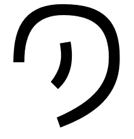 **kute** | [**ɴᴏᴜɴ ᴀᴅᴊᴇᴄᴛɪᴠᴇ: ᴏʀɢᴀɴ**](#organ)  ɴᴏᴜɴ **ear**;  ᴠᴇʀʙ **to hear**, **listen**; (*kute ~~insa~~*) [**listen to**](pu.md#lesson-5), **pay attention to**, **obey** |
|  **la** | [**ᴘᴀʀᴛɪᴄʟᴇ: ᴄᴏɴᴊᴜɴᴄᴛɪᴏɴ**](#conjunction)  ᴘᴀʀᴛɪᴄʟᴇ **(between the ᴄᴏɴᴛᴇxᴛ ᴘʜʀᴀꜱᴇ and the ᴍᴀɪɴ ꜱᴇɴᴛᴇɴᴄᴇ)**, [**(separates ᴄᴏɴᴛᴇxᴛ from ᴍᴀɪɴ ꜱᴇɴᴛᴇɴᴄᴇ)**](pu.md#lesson-14) |
|  **lape** | [**ᴀᴅᴊᴇᴄᴛɪᴠᴇ**](#adjective)  ᴀᴅᴊᴇᴄᴛɪᴠᴇ **resting**, **sleeping**;  ɴᴏᴜɴ [**sleep**](pu.md#toki-pona-proverbs) |
|  **laso** | [**ᴀᴅᴊᴇᴄᴛɪᴠᴇ**](#adjective)  ᴀᴅᴊᴇᴄᴛɪᴠᴇ **blue**, (*laso ~~mu~~*) *bluish*, **green**, (*laso ~~mu~~*) *greenish*; *immature*; (⇒ *walo*) |
|  **lawa** | [**ɴᴏᴜɴ ᴀᴅᴊᴇᴄᴛɪᴠᴇ: ᴀʀᴇᴀ**](#area)  ᴀᴅᴊᴇᴄᴛɪᴠᴇ (⇒ *sewi*); (⇒ *sewi* ⇒ *nanpa wan*)  ɴᴏᴜɴ (⇒ *sewi*) |
| | [**ɴᴏᴜɴ ᴀᴅᴊᴇᴄᴛɪᴠᴇ: ᴏʀɢᴀɴ**](#organ)  ɴᴏᴜɴ **head**; **mind**;  ᴠᴇʀʙ **to control**, **direct**, **guide**, **lead**, **own**, **plan**, **regulate**, **rule**; *arrange*, *organize*;  ɴᴏᴜɴ (⇒ *kulupu*);  ɴᴏᴜɴ [**guidance**](pu.md#toki-pona-proverbs) |
| 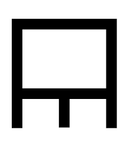 **len** | [**ɴᴏᴜɴ ᴀᴅᴊᴇᴄᴛɪᴠᴇ: ᴏʀɢᴀɴ**](#organ)  ᴀᴅᴊᴇᴄᴛɪᴠᴇ *covering*  ɴᴏᴜɴ *fur*; **cloth**, **clothing**, **fabric**, **textile**, [**vest**](pu.md#lesson-17); **cover**, **layer of privacy**;  ᴠᴇʀʙ *to hide* |
|  **lete** | [**ɴᴏᴜɴ ᴀᴅᴊᴇᴄᴛɪᴠᴇ: ᴛʜɪɴɢ**](#thing)  ᴀᴅᴊᴇᴄᴛɪᴠᴇ **cold**, **cool**; **uncooked**, **raw**  ɴᴏᴜɴ *frost*, *ice* |
|  **li** | [**ᴘᴀʀᴛɪᴄʟᴇ: ᴍᴀʀᴋᴇʀ**](#mood-marker)  ᴘᴀʀᴛɪᴄʟᴇ *(indicative)*, **(between any ꜱᴜʙᴊᴇᴄᴛ except mi alone or sina alone and its ᴘʀᴇᴅɪᴄᴀᴛᴇ; also to introduce a new ᴘʀᴇᴅɪᴄᴀᴛᴇ for the same ꜱᴜʙᴊᴇᴄᴛ)** |
|  **lili** | [**ɴᴏᴜɴ ᴀᴅᴊᴇᴄᴛɪᴠᴇ: ᴛʜɪɴɢ**](#thing)  ᴀᴅᴊᴇᴄᴛɪᴠᴇ **little**, [**micro-**](pu.md#preface), [**narrow**](pu.md#lesson-13), **small**, **short**; (*~~pi tenpo~~ lili*) [**momentary**](pu.md#toki-pona-proverbs), [**temporary**](pu.md#toki-pona-proverbs); [**120**](pu.md#preface), **few**; **a bit**: (*tu lili e ijo*) *to half something*; (*~~pi sike suno~~ lili*) **young**; (⇒ *pona*)  ɴᴏᴜɴ (⇐ *~~kipisi~~*) *building block*, *detail*, *element*, *member*, *unit*; *part*, *particle*, *piece* |
|  **linja** | [**ɴᴏᴜɴ ᴀᴅᴊᴇᴄᴛɪᴠᴇ: ᴛʜɪɴɢ**](#thing)  ᴀᴅᴊᴇᴄᴛɪᴠᴇ *long and flexible*  ɴᴏᴜɴ [**long flexible thing**](pu.md#errata): *chain*, **cord**, (*linja ~~lawa~~*) **hair**, **rope**, [**string**](pu.md#lesson-17), **thread**, **yarn**; *curve, line; row*; (⇒ *palisa*) |
|  **lipu** | [**ɴᴏᴜɴ ᴀᴅᴊᴇᴄᴛɪᴠᴇ: ᴛʜɪɴɢ**](#thing)  ᴀᴅᴊᴇᴄᴛɪᴠᴇ *flat*, *thin*  ɴᴏᴜɴ **flat object**: (*~~mute~~ lipu*) **book**, **card**, [**clay tablet**](pu.md#what-is-toki-pona), **document**, **paper**, [**piece of paper**](pu.md#lesson-2), [**postcard**](pu.md#what-is-toki-pona), [**printed book**](pu.md#what-is-toki-pona), **record**, **website**; *plane* |
|  **loje** | [**ᴀᴅᴊᴇᴄᴛɪᴠᴇ**](#adjective)  ᴀᴅᴊᴇᴄᴛɪᴠᴇ **red**, (*loje ~~mu~~*) **reddish** |
|  **lon** | [**ᴘʀᴇᴘᴏꜱɪᴛɪᴏɴ**](#preposition)  ᴘʀᴇᴘᴏꜱɪᴛɪᴏɴ [**at**](pu.md#lesson-8), **located at**, **present at**; [**in the context of**](pu.md#lesson-14): (*lon ni:* = , *la*) [**if**](pu.md#lesson-14), [**when**](pu.md#lesson-14); (⇐ *sama* ⇐ *pu*) *according to*, *along*  ᴀᴅᴊᴇᴄᴛɪᴠᴇ [**existing**, **real**; (*~~pi ijo pi ijo~~ lon*) **true**](pu.md#errata);  ᴀᴅᴠᴇʀʙ (⇐ a) *yes* |
|  **luka** | [**ɴᴏᴜɴ ᴀᴅᴊᴇᴄᴛɪᴠᴇ: ᴀʀᴇᴀ**](#area)  ᴀᴅᴊᴇᴄᴛɪᴠᴇ *reachable*  ɴᴏᴜɴ *range* |
| | [**ɴᴏᴜɴ ᴀᴅᴊᴇᴄᴛɪᴠᴇ: ᴏʀɢᴀɴ**](#organ)  ɴᴏᴜɴ **arm**, [**fingers**](pu.md#writings-of-baháulláh), **hand**, **tactile organ**;  ᴠᴇʀʙ *to touch* |
| | [**ɴᴏᴜɴ ᴀᴅᴊᴇᴄᴛɪᴠᴇ: ɴᴜᴍʙᴇʀ**](#number)  ᴀᴅᴊᴇᴄᴛɪᴠᴇ [**5**](pu.md#lesson-12), **five**  ɴᴏᴜɴ *quintet* |
|  **lukin** | [**ɴᴏᴜɴ ᴀᴅᴊᴇᴄᴛɪᴠᴇ: ᴏʀɢᴀɴ**](#organ)  ɴᴏᴜɴ (⇐ *~~oko~~*) **eye**;  ᴠᴇʀʙ **to look at**, **see**; (*lukin ~~wawa~~*) **examine**, **observe**, **read**, [**search**](pu.md#preface), **watch** |
| | [**ᴘʀᴇ-ᴠᴇʀʙ**](#pre-verb)  ᴘʀᴇ-ᴠᴇʀʙ **try to**; (⇐ ᴋɪᴘᴏ *alasa*) [**to seek to**](pu.md#lesson-13): (*lukin jo*) [**to look for**](pu.md#errata)  ᴠᴇʀʙ *to care for* |
| 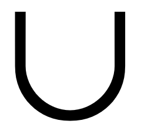 **lupa** | [**ɴᴏᴜɴ ᴀᴅᴊᴇᴄᴛɪᴠᴇ: ᴛʜɪɴɢ**](#thing)  ᴀᴅᴊᴇᴄᴛɪᴠᴇ *concave*, *empty*, *hollow*  ɴᴏᴜɴ *cave*, **orifice**: (*lupa meli*) [**womb**](pu.md#toki-pona-proverbs); (⇐ *open*) *entrance*, **hole**: (*lupa ~~tomo~~*) **door**, (*lupa ~~suno~~*) **window** |
|  **ma** | [**ɴᴏᴜɴ ᴀᴅᴊᴇᴄᴛɪᴠᴇ: ᴀʀᴇᴀ**](#area)  ᴀᴅᴊᴇᴄᴛɪᴠᴇ *contextual*, *outside*; *firm*, *fixed*  ɴᴏᴜɴ **outdoors**: *context*, **world**; *area* (⇐ ale); (*~~sike~~ ma*) [**planet**](pu.md#toki-pona-proverbs)  ᴠᴇʀʙ *to orient*, *tie* |
| | [**ɴᴏᴜɴ ᴀᴅᴊᴇᴄᴛɪᴠᴇ: ᴛʜɪɴɢ**](#thing)  ɴᴏᴜɴ **earth**, **land**, **soil**; (*ma ~~jan~~*) **country**, **territory** |
|  **mama** | [**ɴᴏᴜɴ ᴀᴅᴊᴇᴄᴛɪᴠᴇ: ᴘᴇʀꜱᴏɴ**](#person)  ᴀᴅᴊᴇᴄᴛɪᴠᴇ (*mama* ⇐ *sijelo e ijo*) [**birth-giving**](pu.md#chapter-of-sincerity); (*jo e mama* ⇐ *sijelo*) [**being born**](pu.md#chapter-of-sincerity); *of origin*  ɴᴏᴜɴ **parent**; (*mama ~~mije~~*) [**father**](pu.md#the-gospel), (*mama ~~meli~~*) *mother*; **ancestor**; **caretaker**, **sustainer**; **creator**, **originator**; (⇐ *~~tan~~*) *origin* |
|  **mani** | [**ɴᴏᴜɴ ᴀᴅᴊᴇᴄᴛɪᴠᴇ: ᴛʜɪɴɢ**](#thing)  ᴀᴅᴊᴇᴄᴛɪᴠᴇ *domesticated*, *refined*; *valueable*  ɴᴏᴜɴ **large domesticated animal**; **cash**, **money**, **savings**, **wealth** |
|  **meli** | [**ɴᴏᴜɴ ᴀᴅᴊᴇᴄᴛɪᴠᴇ: ᴘᴇʀꜱᴏɴ**](#person)  ᴀᴅᴊᴇᴄᴛɪᴠᴇ [**female**](pu.md#lesson-3)  ɴᴏᴜɴ **female**, **feminine person**, **woman**; **wife** |
| 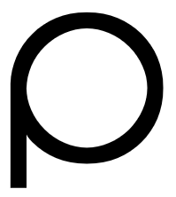 **mi** | [**ɴᴏᴜɴ**](#pronoun)  ɴᴏᴜɴ **I**/**me**/[**myself**](pu.md#toki-pona-proverbs), **we**/**us**/*ourselves*;  ᴀᴅᴊᴇᴄᴛɪᴠᴇ *my*, *our* |
|  **mije** | [**ɴᴏᴜɴ ᴀᴅᴊᴇᴄᴛɪᴠᴇ: ᴘᴇʀꜱᴏɴ**](#person)  ᴀᴅᴊᴇᴄᴛɪᴠᴇ *male*  ɴᴏᴜɴ **male**, **man**, **masculine person**; **husband** |
|  **moku** | [**ᴠᴇʀʙ**](#verb)  ᴠᴇʀʙ **to consume**, **drink**, **ingest**, **swallow**; **eat**;  ɴᴏᴜɴ [**the act of eating**](pu.md#lesson-5)  ɴᴏᴜɴ [**food**](pu.md#lesson-5) |
|  **moli** | [**ᴀᴅᴊᴇᴄᴛɪᴠᴇ**](#adjective)  ᴀᴅᴊᴇᴄᴛɪᴠᴇ **dead**: (*kama moli*) **dying** |
| 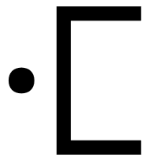 **monsi** | [**ɴᴏᴜɴ ᴀᴅᴊᴇᴄᴛɪᴠᴇ: ᴀʀᴇᴀ**](#area)  ᴀᴅᴊᴇᴄᴛɪᴠᴇ *rear*  ɴᴏᴜɴ [**area behind**](pu.md#lesson-15), **back**, **rear**: (*lon monsi*) **behind** |
| | [**ɴᴏᴜɴ ᴀᴅᴊᴇᴄᴛɪᴠᴇ: ᴛʜɪɴɢ**](#thing)  ᴀᴅᴊᴇᴄᴛɪᴠᴇ *dorsal*  ɴᴏᴜɴ **back**; *backbone*;  ᴠᴇʀʙ *to endorse* |
|  **mu** | [**ᴘᴀʀᴛɪᴄʟᴇ: ɪɴᴛᴇʀᴊᴇᴄᴛɪᴏɴ**](#interjection)  ᴘᴀʀᴛɪᴄʟᴇ **(animal noise or communication)**; *(indifference)*  ᴀᴅᴠᴇʀʙ (*~~mu~~*) *-ish*, *sort-of*; [**cock-a-doodle-doo**](pu.md#lesson-11), [**moo**](pu.md#lesson-1); *blah* |
|  **mun** | [**ɴᴏᴜɴ ᴀᴅᴊᴇᴄᴛɪᴠᴇ: ᴛʜɪɴɢ**](#thing)  ᴀᴅᴊᴇᴄᴛɪᴠᴇ *orbiting*, *sky-walking*  ɴᴏᴜɴ **night sky object**: **moon**, **star** |
|  **musi** | [**ɴᴏᴜɴ ᴀᴅᴊᴇᴄᴛɪᴠᴇ: ᴛʜɪɴɢ**](#thing)  ᴀᴅᴊᴇᴄᴛɪᴠᴇ **artistic**, **entertaining**, **frivolous**, **playful**, **recreational**  ɴᴏᴜɴ *game*;  ᴠᴇʀʙ *to play with* |
|  **mute** | [**ɴᴏᴜɴ ᴀᴅᴊᴇᴄᴛɪᴠᴇ: ᴛʜɪɴɢ**](#thing)  ᴀᴅᴊᴇᴄᴛɪᴠᴇ [**3+**](pu.md#lesson-12), [**20**](pu.md#lesson-12), **a lot**, **many**, **several**;  ᴀᴅᴠᴇʀʙ **much**, **very**; (*mute ~~sin~~*) **more**;  ᴠᴇʀʙ [**to multiply**](pu.md#toki-pona-proverbs)  ɴᴏᴜɴ *amount*, **quantity** |
| | [**ɴᴏᴜɴ ᴀᴅᴊᴇᴄᴛɪᴠᴇ: ɴᴜᴍʙᴇʀ**](#number)  ᴀᴅᴊᴇᴄᴛɪᴠᴇ (⇐ *~~tuli~~*) *3*, *three*;  ɴᴏᴜɴ (⇒ *kulupu*) |
|  **nanpa** | [**ɴᴏᴜɴ ᴀᴅᴊᴇᴄᴛɪᴠᴇ: ᴀʀᴇᴀ**](#area)  ᴀᴅᴊᴇᴄᴛɪᴠᴇ *to be one's turn*  ɴᴏᴜɴ *one's turn*; (*nanpa wan* ⇐ *sewi* ⇐ *lawa*) *main*, [**most fundamental**](pu.md#toki-pona-proverbs); *priority*; (*~~nimi~~ nanpa*) **numbers**;  ᴠᴇʀʙ *to iterate*; *count*; *calculate* |
| | [**ᴘᴀʀᴛɪᴄʟᴇ: ɴᴀᴍᴇ**](#name)  ᴘᴀʀᴛɪᴄʟᴇ **(ordinal number)**, **-th** |
| 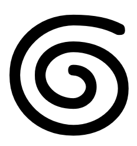 **nasa** | [**ᴀᴅᴊᴇᴄᴛɪᴠᴇ**](#adjective)  ᴀᴅᴊᴇᴄᴛɪᴠᴇ **strange**, [**unconventional**](pu.md#toki-pona-proverbs), **unusual**; (*~~pi sona~~ nasa*) **crazy**, **foolish**; (*~~pi pilin~~ nasa*) **drunk**, **intoxicated** |
|  **nasin** | [**ɴᴏᴜɴ ᴀᴅᴊᴇᴄᴛɪᴠᴇ: ᴀʀᴇᴀ**](#area)  ᴀᴅᴊᴇᴄᴛɪᴠᴇ (⇒ *insa*)  ɴᴏᴜɴ (⇒ *insa*); *dimension*; *passage*, **path**, **road**, [**street**](pu.md#lesson-9), **way**; *direction*; **custom**, **doctrine**, **method**, [**system**](pu.md#preface), [**way of doing things**](pu.md#toki-pona-proverbs);  ᴠᴇʀʙ (⇒ *insa*) |
|  **nena** | [**ɴᴏᴜɴ ᴀᴅᴊᴇᴄᴛɪᴠᴇ: ᴛʜɪɴɢ**](#thing)  ᴀᴅᴊᴇᴄᴛɪᴠᴇ *convex*, *full*, *outstanding*, *thick*  ɴᴏᴜɴ (⇐ *~~kapa~~*) **bump**, **hill**, **mountain**, **protuberance**; **button**; (*nena ~~pi sinpin lawa~~*) **nose** |
| 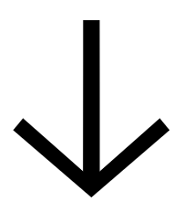 **ni** | [**ɴᴏᴜɴ ᴀᴅᴊᴇᴄᴛɪᴠᴇ: ᴄᴏʀʀᴇʟᴀᴛɪᴠᴇ**](#correlative)  ᴀᴅᴊᴇᴄᴛɪᴠᴇ **that**, **this**  ɴᴏᴜɴ (*ni:*) [**the following**](pu.md#lesson-17) |
| 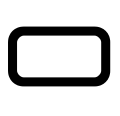 **nimi** | [**ᴠᴇʀʙ**](#verb)  ɴᴏᴜɴ **name**; **word**  ᴠᴇʀʙ *to call*, *define* |
|  **noka** | [**ɴᴏᴜɴ ᴀᴅᴊᴇᴄᴛɪᴠᴇ: ᴀʀᴇᴀ**](#area)  ᴀᴅᴊᴇᴄᴛɪᴠᴇ *bottom*; (⇐ *anpa*) *low, lower*  ɴᴏᴜɴ **lowest part**; **bottom**, [**foundation**](pu.md#lesson-15): (*lon noka*) [**at the bottom of**](pu.md#lesson-15); (⇐ *anpa*) [**area below or under**](pu.md#lesson-15): (*lon noka*) *below*, *under*; *depending on* |
| | [**ɴᴏᴜɴ ᴀᴅᴊᴇᴄᴛɪᴠᴇ: ᴏʀɢᴀɴ**](#organ)  ᴀᴅᴊᴇᴄᴛɪᴠᴇ *stable*; *ordinary*, *usual*  ɴᴏᴜɴ **foot**, **leg**, **organ of locomotion**;  ᴠᴇʀʙ *to step on*, *kick* |
|  **o** | [**ᴘᴀʀᴛɪᴄʟᴇ: ᴍᴀʀᴋᴇʀ**](#mood-marker)  ᴘᴀʀᴛɪᴄʟᴇ *(deontic)* **(vocative or imperative)**, [**(call or command)**](pu.md#lesson-10), [**(shows who is being called or addressed; command or request; wish or desire)**](pu.md#lesson-10), **hey**, **o** |
|  **olin** | [**ᴠᴇʀʙ**](#verb)  ᴠᴇʀʙ [**to be a fan of**](pu.md#preface), **have compassion for**, **love**, **respect**, **show affection to**;  ɴᴏᴜɴ *love*;  ᴀᴅᴊᴇᴄᴛɪᴠᴇ [**beloved**](pu.md#lesson-18) |
|  **ona** | [**ɴᴏᴜɴ**](#pronoun)  ɴᴏᴜɴ (⇐ *~~iki~~*) **he**/*him*, **it**, **she**/*her*, **they**/*them*;  ᴀᴅᴊᴇᴄᴛɪᴠᴇ (⇐ *~~iki~~*) *her*, *his*, *its*, *their* |
|  **open** | [**ᴘʀᴇ-ᴠᴇʀʙ**](#pre-verb)  ᴘʀᴇ-ᴠᴇʀʙ *to be ready to*  ᴀᴅᴊᴇᴄᴛɪᴠᴇ *ready*;  ᴠᴇʀʙ *to let*, *set up*, **turn on** |
| | [**ɴᴏᴜɴ ᴀᴅᴊᴇᴄᴛɪᴠᴇ: ᴀʀᴇᴀ**](#area)  ᴀᴅᴊᴇᴄᴛɪᴠᴇ *accessible*, *open*; (⇒ *awen*);  ᴠᴇʀʙ **to open**, [**unseal**](pu.md#writings-of-baháulláh); (⇐ *kama*) **begin**, **start**;  ɴᴏᴜɴ (⇒ *lupa*); (⇐ *kama*) *beginning*, *start*: (*lon ~~open pi~~*) *before*, (*tan ~~open pi~~*) *for*, *since ... ago*, (*tawa ~~open pi~~*) *until* |
|  **pakala** | [**ᴀᴅᴊᴇᴄᴛɪᴠᴇ**](#adjective)  ᴀᴅᴊᴇᴄᴛɪᴠᴇ **botched**, **broken**, **damaged**, **harmed**, **messed up** |
|  **pali** | [**ɴᴏᴜɴ ᴀᴅᴊᴇᴄᴛɪᴠᴇ: ᴛʜɪɴɢ**](#thing)  ᴀᴅᴊᴇᴄᴛɪᴠᴇ *busy*, *serious*  ɴᴏᴜɴ *business*, *work*;  ᴠᴇʀʙ **to do**, **take action on**, **work on**; (*pali e ~~kama pi~~*) **build**, **make**, **prepare**;  ɴᴏᴜɴ [**action**](pu.md#toki-pona-proverbs) |
|  **palisa** | [**ɴᴏᴜɴ ᴀᴅᴊᴇᴄᴛɪᴠᴇ: ᴛʜɪɴɢ**](#thing)  ᴀᴅᴊᴇᴄᴛɪᴠᴇ *long and hard*  ɴᴏᴜɴ **long hard thing**: [**antler**](pu.md#lesson-17), *bone*, **branch**, **rod**, **stick**; *column*; (*palisa uta* ⇐ *linja uta*) *tongue* |
| | [**ɴᴏᴜɴ ᴀᴅᴊᴇᴄᴛɪᴠᴇ: ᴏʀɢᴀɴ**](#organ)  ɴᴏᴜɴ *finger*;  ᴠᴇʀʙ *to point at; identify* |
|  **pan** | [**ɴᴏᴜɴ ᴀᴅᴊᴇᴄᴛɪᴠᴇ: ᴛʜɪɴɢ**](#thing)  ᴀᴅᴊᴇᴄᴛɪᴠᴇ *fallen*, *dropped*; *sown*  ɴᴏᴜɴ *seed*; **cereal**, **grain**; **barley**, **corn**, **oat**, **rice**, **wheat**; **bread**, **pasta** |
|  **pana** | [**ᴠᴇʀʙ**](#verb)  ᴠᴇʀʙ **to emit**, **give**, [**grant**](pu.md#toki-pona-proverbs), **provide**, (*pana e ijo lon*) **put**, **release**, (*pana e ijo tawa*) **send**, [**send out**](pu.md#toki-pona-proverbs), [**serve**](pu.md#lesson-14)  ɴᴏᴜɴ *gift* |
|  **pi** | [**ᴘᴀʀᴛɪᴄʟᴇ: ᴍᴀʀᴋᴇʀ**](#case-marker)  ᴘᴀʀᴛɪᴄʟᴇ [**(divides a second ɴᴏᴜɴ ᴘʜʀᴀꜱᴇ that describes a first ɴᴏᴜɴ ᴘʜʀᴀꜱᴇ)**](pu.md#lesson-11), **of** |
|  **pilin** | [**ɴᴏᴜɴ ᴀᴅᴊᴇᴄᴛɪᴠᴇ: ᴏʀɢᴀɴ**](#organ)  ɴᴏᴜɴ **heart (physical or emotional)**;  ᴠᴇʀʙ *to sense*;  ᴀᴅᴊᴇᴄᴛɪᴠᴇ **feeling (a direct experience)** |
| | [**ᴘʀᴇ-ᴠᴇʀʙ**](#pre-verb)  ᴘʀᴇ-ᴠᴇʀʙ *to feel like*: (*pilin ~~wile~~ utala*) *to be angry*  ᴠᴇʀʙ *to have the impression that*, [**think**](pu.md#writings-of-baháulláh);  ᴀᴅᴊᴇᴄᴛɪᴠᴇ **feeling (an emotion)** |
|  **pimeja** | [**ᴀᴅᴊᴇᴄᴛɪᴠᴇ**](#adjective)  ᴀᴅᴊᴇᴄᴛɪᴠᴇ **black**, (*pimeja ~~mu~~*) *blackish*; (⇐ *~~kapesi~~*) *grey* |
| | [**ɴᴏᴜɴ ᴀᴅᴊᴇᴄᴛɪᴠᴇ: ᴛʜɪɴɢ**](#thing)  ᴀᴅᴊᴇᴄᴛɪᴠᴇ **dark**, **unlit**  ɴᴏᴜɴ *shadow* |
|  **pini** | [**ᴘʀᴇ-ᴠᴇʀʙ**](#pre-verb)  ᴘʀᴇ-ᴠᴇʀʙ *to stop -ing*  ᴀᴅᴊᴇᴄᴛɪᴠᴇ *stopped*; (⇐ *selo*) *closed* |
| | [**ɴᴏᴜɴ ᴀᴅᴊᴇᴄᴛɪᴠᴇ: ᴀʀᴇᴀ**](#area)  ᴀᴅᴊᴇᴄᴛɪᴠᴇ **ago**, **completed**, **ended**, **finished**: (*~~pi tenpo~~ pini*) **past**; (*~~pi nanpa~~ pini*) *last*, *previous*  ɴᴏᴜɴ *end*: (*lon ~~pini pi~~*) *after*, *in the end*, (*tan ~~pini pi~~*) *since* |
|  **pipi** | [**ɴᴏᴜɴ ᴀᴅᴊᴇᴄᴛɪᴠᴇ: ʟɪꜰᴇ-ꜰᴏʀᴍ**](#life-form)  ᴀᴅᴊᴇᴄᴛɪᴠᴇ *crawling*, *creeping*  ɴᴏᴜɴ **ant**, **bug**, **insect**, **spider** |
|  **poka** | [**ɴᴏᴜɴ ᴀᴅᴊᴇᴄᴛɪᴠᴇ: ᴀʀᴇᴀ**](#area)  ᴀᴅᴊᴇᴄᴛɪᴠᴇ [**nearby**](pu.md#errata); (*poka ~~sike~~*) *surrounding*  ɴᴏᴜɴ [**area beside**](pu.md#lesson-15), **vicinity**: (*lon poka*) **next to**, (*lon ~~poka~~* ⇐ *~~kan~~*) *among*, [**with**](pu.md#lesson-8); (*poka ~~sike~~*) *area surrounding*: (*lon poka ~~sike~~*) *around*; (*lon poka ante* ⇐ *ante*) *than*, *unlike*; (*lon poka ante* ⇐ *ante* ⇐ *esun*) *instead of* |
| | [**ɴᴏᴜɴ ᴀᴅᴊᴇᴄᴛɪᴠᴇ: ᴛʜɪɴɢ**](#thing)  ᴀᴅᴊᴇᴄᴛɪᴠᴇ *lateral*  ɴᴏᴜɴ **side**, (*~~mute pi~~ poka tu tu sama* ⇐ *~~leko~~*) *square*; (*poka ~~sijelo~~*) **hip** |
|  **poki** | [**ɴᴏᴜɴ ᴀᴅᴊᴇᴄᴛɪᴠᴇ: ᴏʀɢᴀɴ**](#organ)  ɴᴏᴜɴ **bag**, **bowl**, **box**, **container**, **cup**, **cupboard**, **drawer**, **vessel**; *bladder*;  ᴠᴇʀʙ *to contain* |
|  **pona** | [**ᴀᴅᴊᴇᴄᴛɪᴠᴇ**](#adjective)  ᴀᴅᴊᴇᴄᴛɪᴠᴇ [**beneficial**](pu.md#toki-pona-proverbs), [**beautiful**](pu.md#toki-pona-proverbs), **good**: [**of good**](pu.md#lesson-11), [**great**](pu.md#toki-pona-proverbs), [**OK**](pu.md#toki-pona-proverbs), **positive**, [**right**](pu.md#lesson-14); **friendly**, **peaceful**; (⇒ *suwi* ⇐ *soweli*); (⇐ *ilo*) **useful**; (⇐ *lili* ⇐ *~~pasila~~*) *basic*, *elementary*, *primitive*, **simple**;  ᴠᴇʀʙ [**to improve**](pu.md#lesson-6), [**tidy up**](pu.md#lesson-18);  ɴᴏᴜɴ [**good**](pu.md#lesson-10), [**peace**](pu.md#lesson-10), [**simplicity**](pu.md#famous-quotations), [**sophistication**](pu.md#famous-quotations) |
|  **pu** | [**ᴘʀᴇᴘᴏꜱɪᴛɪᴏɴ**](#preposition)  ᴘʀᴇᴘᴏꜱɪᴛɪᴏɴ (⇒ *sama* ⇒ *lon*)  ᴀᴅᴊᴇᴄᴛɪᴠᴇ *compatible*, *compliant*; (*pu ~~lipu Pu~~*) **interacting with the official Toki Pona book** |
| | [**ᴘᴀʀᴛɪᴄʟᴇ: ɴᴀᴍᴇ**](#name)  ᴘᴀʀᴛɪᴄʟᴇ *name of the official Toki Pona book*: (*lipu Pu*) *the official Toki Pona book*, *Pu* |
| 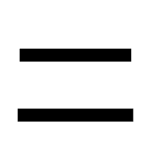 **sama** | [**ᴘʀᴇᴘᴏꜱɪᴛɪᴏɴ**](#preposition)  ᴘʀᴇᴘᴏꜱɪᴛɪᴏɴ **as**, **like**; (⇒ *lon* ⇐ *pu*)  ᴀᴅᴊᴇᴄᴛɪᴠᴇ **same**, **similar**; (*~~pi kulupu~~ sama*) **fellow**, *in common*, *shared*: (*jan ~~pi kulupu~~ sama*) **peer**, (*jan ~~pi kulupu mama~~ sama* ⇐ *~~pata~~*) **sibling**; (⇐ *kulupu*) **each other**, *reciprocal*; *-self*, *-selves*;  ɴᴏᴜɴ [**harmony**](pu.md#famous-quotations) |
| 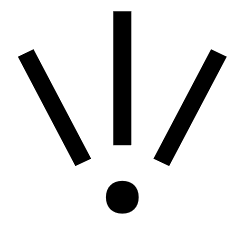 **seli** | [**ɴᴏᴜɴ ᴀᴅᴊᴇᴄᴛɪᴠᴇ: ᴛʜɪɴɢ**](#thing)  ᴀᴅᴊᴇᴄᴛɪᴠᴇ *hot*, *warm*; *cooked*  ɴᴏᴜɴ **chemical reaction**, **fire**, **heat source**; **cooking element**;  ᴠᴇʀʙ [**to cook**](pu.md#lesson-18) |
|  **selo** | [**ɴᴏᴜɴ ᴀᴅᴊᴇᴄᴛɪᴠᴇ: ᴏʀɢᴀɴ**](#organ)  ᴀᴅᴊᴇᴄᴛɪᴠᴇ (⇒ *pini*)  ɴᴏᴜɴ [**form**](pu.md#preface), **outer form**, **outer layer**; **bark**, **peel**, **shell**, **skin**; **boundary** |
|  **seme** | [**ɴᴏᴜɴ ᴀᴅᴊᴇᴄᴛɪᴠᴇ: ᴄᴏʀʀᴇʟᴀᴛɪᴠᴇ**](#correlative)  ᴀᴅᴊᴇᴄᴛɪᴠᴇ **what**, **which**  ɴᴏᴜɴ [**what**](pu.md#lesson-7), *which one* |
|  **sewi** | [**ɴᴏᴜɴ ᴀᴅᴊᴇᴄᴛɪᴠᴇ: ᴀʀᴇᴀ**](#area)  ᴀᴅᴊᴇᴄᴛɪᴠᴇ *high*; (⇐ *lawa*) *upper*; (⇒ *nanpa wan* ⇐ *lawa*)  ɴᴏᴜɴ **area above**: (*lon sewi*) *above*, *over*; **something elevated**; [**sky**](pu.md#lesson-15); *heaven*; (⇐ *lawa*) **highest part**: (*lon sewi*) *at the top of* |
| | [**ɴᴏᴜɴ ᴀᴅᴊᴇᴄᴛɪᴠᴇ: ᴛʜɪɴɢ**](#thing)  ᴀᴅᴊᴇᴄᴛɪᴠᴇ **awe-inspiring**, **divine**, **sacred**, **supernatural**  ɴᴏᴜɴ [**the Divine**](pu.md#preface), [**that which is divine**](pu.md#lesson-6), [**God**](pu.md#lesson-6), [**the Lord**](pu.md#the-torah) |
|  **sijelo** | [**ɴᴏᴜɴ ᴀᴅᴊᴇᴄᴛɪᴠᴇ: ᴏʀɢᴀɴ**](#organ)  ᴀᴅᴊᴇᴄᴛɪᴠᴇ *alive*, *healthy*, *surviving*;  ɴᴏᴜɴ [**health**](pu.md#lesson-13), **physical state**; *configuration*, *mode*  ɴᴏᴜɴ *life-form*; **body (of person or animal)**, **torso**;  ᴠᴇʀʙ (⇒ *mama pi*) |
|  **sike** | [**ɴᴏᴜɴ ᴀᴅᴊᴇᴄᴛɪᴠᴇ: ᴛʜɪɴɢ**](#thing)  ᴀᴅᴊᴇᴄᴛɪᴠᴇ *round*; (⇒ *pini*);  ᴠᴇʀʙ *to fulfil*: (*sike e ~~sike~~ suno*) *to have one's birthday*  ɴᴏᴜɴ **round or circular thing**: **ball**, **circle**, **sphere**, **wheel**; **cycle**; *age*; *lap*: (*~~sike~~ suno*) *year*;  ᴀᴅᴊᴇᴄᴛɪᴠᴇ (*sike ~~suno~~*) **of one year**, (*pi sike ~~suno~~ mute* ⇐ *~~majuna~~*) *old* |
|  **sin** | [**ᴘʀᴇᴘᴏꜱɪᴛɪᴏɴ**](#preposition)  ᴘʀᴇᴘᴏꜱɪᴛɪᴏɴ *in addition to*, *with*  ᴀᴅᴊᴇᴄᴛɪᴠᴇ **new**, **fresh**; (⇐ *~~namako~~*) **additional**, **another**, **extra**; *artificial*, *enhanced*; (⇒ *esun* ⇒ *ante*) |
|  **sina** | [**ɴᴏᴜɴ**](#pronoun)  ɴᴏᴜɴ **you**/*thou*/*thee*/[**thyself**](pu.md#toki-pona-proverbs); [**the person who**](pu.md#famous-quotations);  ᴀᴅᴊᴇᴄᴛɪᴠᴇ *your*/[**thy**](pu.md#toki-pona-proverbs) |
|  **sinpin** | [**ɴᴏᴜɴ ᴀᴅᴊᴇᴄᴛɪᴠᴇ: ᴀʀᴇᴀ**](#area)  ᴀᴅᴊᴇᴄᴛɪᴠᴇ **foremost**  ɴᴏᴜɴ [**area in front**](pu.md#lesson-15): (*lon sinpin*) [**in front of**](pu.md#lesson-15) |
| | [**ɴᴏᴜɴ ᴀᴅᴊᴇᴄᴛɪᴠᴇ: ᴛʜɪɴɢ**](#thing)  ᴀᴅᴊᴇᴄᴛɪᴠᴇ *upright*, *vertical*  ɴᴏᴜɴ **front**, **wall**; (*sinpin ~~sijelo~~*) [**chest**](pu.md#lesson-15), (*sinpin ~~lawa~~*) **face**;  ᴠᴇʀʙ (⇐ *~~pake~~*) *to block*; *to confront*, *face* |
|  **sitelen** | [**ᴠᴇʀʙ**](#verb)  ᴠᴇʀʙ *to draw*, *indicate*, *project*, *represent*, *sculpture*  ɴᴏᴜɴ **image**, **picture**, *projection*, **representation**, *sculpture*, **symbol**, **mark**, **writing** |
|  **sona** | [**ᴠᴇʀʙ**](#verb)  ᴠᴇʀʙ **to be skilled in**; [**to be knowledgeable of**](pu.md#lesson-5), **be wise about**, **have information on**, **know**, (*~~toki e~~ sona*) [**testify**](pu.md#short-obligatory-prayer)  ɴᴏᴜɴ [**insight**](pu.md#writings-of-baháulláh), *knowledge*, [**wisdom**](pu.md#toki-pona-proverbs) |
| | [**ᴘʀᴇ-ᴠᴇʀʙ**](#pre-verb)  ᴘʀᴇ-ᴠᴇʀʙ **to know how to** |
|  **soweli** | [**ɴᴏᴜɴ ᴀᴅᴊᴇᴄᴛɪᴠᴇ: ʟɪꜰᴇ-ꜰᴏʀᴍ**](#life-form)  ᴀᴅᴊᴇᴄᴛɪᴠᴇ *warm-blooded*; (⇒ *pona* ⇒ *suwi*)  ɴᴏᴜɴ *cute animal*; **animal**, **beast**, **land mammal**; [**badger**](pu.md#lesson-12), [**hare**](pu.md#lesson-18), [**moose**](pu.md#lesson-17); (⇐ *~~kijetesantakalu~~*) *Procyonidae*; [**meat**](pu.md#lesson-5) |
|  **suli** | [**ɴᴏᴜɴ ᴀᴅᴊᴇᴄᴛɪᴠᴇ: ᴛʜɪɴɢ**](#thing)  ᴀᴅᴊᴇᴄᴛɪᴠᴇ **big**, **heavy**, **large**, **long**, **tall**; **important**; *responsible*; **adult**;  ᴠᴇʀʙ [**enlarge**](pu.md#lesson-6)  ɴᴏᴜɴ *cargo*; *role* |
| 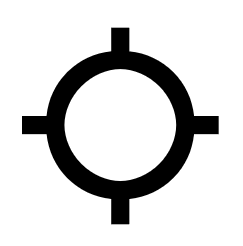 **suno** | [**ɴᴏᴜɴ ᴀᴅᴊᴇᴄᴛɪᴠᴇ: ᴛʜɪɴɢ**](#thing)  ᴀᴅᴊᴇᴄᴛɪᴠᴇ *bright*;  ɴᴏᴜɴ **brightness**, **glow**, **light**, **radiance**, **shine**  ɴᴏᴜɴ **sun**; **light source** |
|  **supa** | [**ɴᴏᴜɴ ᴀᴅᴊᴇᴄᴛɪᴠᴇ: ᴀʀᴇᴀ**](#area)  ᴀᴅᴊᴇᴄᴛɪᴠᴇ *horizontal*, *parallel*  ɴᴏᴜɴ *horizon*, **horizontal surface**: (*lon supa*) *on* |
| | [**ɴᴏᴜɴ ᴀᴅᴊᴇᴄᴛɪᴠᴇ: ᴛʜɪɴɢ**](#thing)  ᴀᴅᴊᴇᴄᴛɪᴠᴇ *sustaining*  ɴᴏᴜɴ **thing to put or rest something on**: (*lon supa*) *lying on*, *sitting on*; [**sofa**](pu.md#lesson-18); (*supa sinpin* ⇐ *~~leko~~*) *block*; (*supa noka*) *step*; (*~~mute pi~~ supa noka* ⇐ *~~leko~~*) *ladder*, *stairs* |
|  **suwi** | [**ɴᴏᴜɴ ᴀᴅᴊᴇᴄᴛɪᴠᴇ: ᴛʜɪɴɢ**](#thing)  ᴀᴅᴊᴇᴄᴛɪᴠᴇ **fragrant**, **sweet**; **adorable**, **cute**; (⇐ *pona* ⇐ *soweli*) **innocent**  ɴᴏᴜɴ [**sweets**](pu.md#lesson-16) |
| 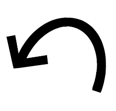 **tan** | [**ᴘʀᴇᴘᴏꜱɪᴛɪᴏɴ**](#preposition)  ᴘʀᴇᴘᴏꜱɪᴛɪᴏɴ **because of**, **by**, **from**  ᴀᴅᴊᴇᴄᴛɪᴠᴇ (⇒ *tawa*) |
|  **taso** | [**ᴘʀᴇᴘᴏꜱɪᴛɪᴏɴ**](#preposition)  ᴘʀᴇᴘᴏꜱɪᴛɪᴏɴ *free from*, *independent from*, *without*; (*taso ~~ni la~~*) **but**, **however**  ᴀᴅᴊᴇᴄᴛɪᴠᴇ *just*, **only** |
| 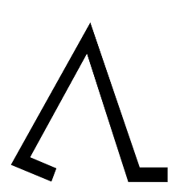 **tawa** | [**ᴘʀᴇᴘᴏꜱɪᴛɪᴏɴ**](#preposition)  ᴘʀᴇᴘᴏꜱɪᴛɪᴏɴ **going to**, [**to**](pu.md#lesson-8), [**moving to**](pu.md#lesson-8), **toward**, [**towards**](pu.md#lesson-8); **for**; **from the perspective of**  ᴀᴅᴊᴇᴄᴛɪᴠᴇ **moving**, (*tawa ~~wawa~~*) [**running**](pu.md#lesson-17), (*~~kama~~ tawa* ⇐ *tan*) [**leaving**](pu.md#phrase-book): [**departure**](pu.md#lesson-10) |
|  **telo** | [**ɴᴏᴜɴ ᴀᴅᴊᴇᴄᴛɪᴠᴇ: ᴛʜɪɴɢ**](#thing)  ᴀᴅᴊᴇᴄᴛɪᴠᴇ *wet*  ɴᴏᴜɴ **fluid**, **liquid**, (*telo ~~suli~~*) [**lake**](pu.md#lesson-9), **water**, **wet substance**; **beverage**;  ᴠᴇʀʙ [**to water**](pu.md#lesson-11) |
|  **tenpo** | [**ɴᴏᴜɴ ᴀᴅᴊᴇᴄᴛɪᴠᴇ: ᴀʀᴇᴀ**](#area)  ᴀᴅᴊᴇᴄᴛɪᴠᴇ *ephemeral*, *provisional*, *transitory*  ɴᴏᴜɴ **moment**, **occasion**, **period**, **situation**, **time**: (*lon tenpo*) *for*; (⇐ *awen*) **duration**: (*lon tenpo*) *as long as*, [**during**](pu.md#lesson-14), *while* |
|  **toki** | [**ᴠᴇʀʙ**](#verb)  ᴠᴇʀʙ **to communicate**, [**explain**](pu.md#famous-quotations), **say**, **speak**; **think**;  ᴀᴅᴊᴇᴄᴛɪᴠᴇ [**talking**, **using language**](pu.md#errata);  ɴᴏᴜɴ [**communication**](pu.md#toki-pona-proverbs), [**speech**](pu.md#lesson-5); [**language**](pu.md#lesson-5): (*lon toki*) [**in**](pu.md#lesson-8), [**something that you speak**](pu.md#lesson-5)  ɴᴏᴜɴ *message*, (*toki ~~pi ijo sin~~*) *news* |
| 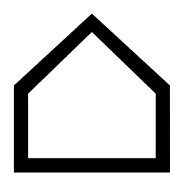 **tomo** | [**ɴᴏᴜɴ ᴀᴅᴊᴇᴄᴛɪᴠᴇ: ᴏʀɢᴀɴ**](#organ)  ɴᴏᴜɴ *roof*, *shelter*; **indoor space**: **building**, **home**, **house**, **room**, [**shed**](pu.md#lesson-14)  ᴠᴇʀʙ (⇒ *awen*) |
|  **tu** | [**ɴᴏᴜɴ ᴀᴅᴊᴇᴄᴛɪᴠᴇ: ɴᴜᴍʙᴇʀ**](#number)  ᴀᴅᴊᴇᴄᴛɪᴠᴇ [**2**](pu.md#lesson-12), **two**: (*tu tu* ⇐ *~~po~~*) *four*  ɴᴏᴜɴ *pair* |
| 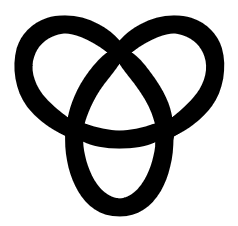 **unpa** | [**ᴠᴇʀʙ**](#verb)  ᴠᴇʀʙ [**to have sex with**](pu.md#errata) |
| 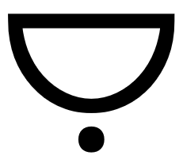 **uta** | [**ɴᴏᴜɴ ᴀᴅᴊᴇᴄᴛɪᴠᴇ: ᴏʀɢᴀɴ**](#organ)  ɴᴏᴜɴ **jaw**, **lips**, **mouth**, **oral cavity**;  ᴠᴇʀʙ [**to kiss**](pu.md#lesson-18), *suck*, *taste* |
|  **utala** | [**ᴀᴅᴊᴇᴄᴛɪᴠᴇ**](#adjective)  ᴀᴅᴊᴇᴄᴛɪᴠᴇ *aggressive*;  ᴠᴇʀʙ *to attack*, **battle**, **challenge**, **compete against**, [**fight**](pu.md#lesson-9), *provoke*, **struggle against**;  ɴᴏᴜɴ [**battle**](pu.md#lesson-14), [**fighting**](pu.md#toki-pona-proverbs) |
|  **walo** | [**ᴀᴅᴊᴇᴄᴛɪᴠᴇ**](#adjective)  ᴀᴅᴊᴇᴄᴛɪᴠᴇ **white**, (*walo ~~mu~~*) **whitish**; **light-coloured**, (⇐ *laso*) **pale** |
| 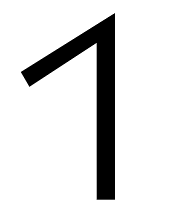 **wan** | [**ɴᴏᴜɴ ᴀᴅᴊᴇᴄᴛɪᴠᴇ: ɴᴜᴍʙᴇʀ**](#number)  ᴀᴅᴊᴇᴄᴛɪᴠᴇ [**1**](pu.md#lesson-12), **one**; (*wan ~~ale~~*) **united**  ɴᴏᴜɴ *singleton* |
| | [**ɴᴏᴜɴ ᴀᴅᴊᴇᴄᴛɪᴠᴇ: ᴄᴏʀʀᴇʟᴀᴛɪᴠᴇ**](#correlative)  ᴀᴅᴊᴇᴄᴛɪᴠᴇ (*~~wan~~*) [**certain**](pu.md#the-gospel), *specific*; **unique** |
|  **waso** | [**ɴᴏᴜɴ ᴀᴅᴊᴇᴄᴛɪᴠᴇ: ʟɪꜰᴇ-ꜰᴏʀᴍ**](#life-form)  ᴀᴅᴊᴇᴄᴛɪᴠᴇ *flying*, *winging*  ɴᴏᴜɴ **bird**, **flying creature**, **winged animal** |
|  **wawa** | [**ɴᴏᴜɴ ᴀᴅᴊᴇᴄᴛɪᴠᴇ: ᴛʜɪɴɢ**](#thing)  ᴀᴅᴊᴇᴄᴛɪᴠᴇ **energetic**; **powerful**, [**stable**](pu.md#lesson-15), **strong**; [**independent**](pu.md#chapter-of-sincerity); (*~~sona~~ wawa*) [**dependable**](pu.md#lesson-4), [**reliable**](pu.md#lesson-5), **sure**; (*~~toki~~ wawa*) **confident**; (*~~kalama~~ wawa*) [**loud**](pu.md#lesson-17), **intense**;  ᴠᴇʀʙ [**strengthen**](pu.md#lesson-6); (*wawa e ~~toki~~ ni:*) [**to bear witness that**](pu.md#writings-of-baháulláh)  ɴᴏᴜɴ [**might**](pu.md#writings-of-baháulláh), [**power**](pu.md#writings-of-baháulláh); *force* |
| 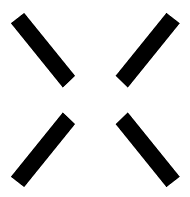 **weka** | [**ɴᴏᴜɴ ᴀᴅᴊᴇᴄᴛɪᴠᴇ: ᴀʀᴇᴀ**](#area)  ᴀᴅᴊᴇᴄᴛɪᴠᴇ **absent**, **away**, *remote*; **ignored**, *isolated*;  ɴᴏᴜɴ [**isolation**](pu.md#toki-pona-proverbs);  ᴠᴇʀʙ [**to eliminate**](pu.md#famous-quotations), [**erase**](pu.md#toki-pona-proverbs), [**omit**](pu.md#famous-quotations), [**remove**](pu.md#toki-pona-proverbs)  ɴᴏᴜɴ *distance*: (*lon weka pi*) *away from* |
| | [**ɴᴏᴜɴ ᴀᴅᴊᴇᴄᴛɪᴠᴇ: ᴛʜɪɴɢ**](#thing)  ᴀᴅᴊᴇᴄᴛɪᴠᴇ *vast*  ɴᴏᴜɴ *space*; *vacuum*, *void* |
|  **wile** | [**ᴘʀᴇ-ᴠᴇʀʙ**](#pre-verb)  ᴘʀᴇ-ᴠᴇʀʙ **must**, **need**, **require**, **should**, **want**, **wish**; (*tan wile ijo la* = *wile*) *to be bound to*, *can't help but*  ᴀᴅᴊᴇᴄᴛɪᴠᴇ *inevitable*, *necessary*;  ᴠᴇʀʙ *to enforce*;  ɴᴏᴜɴ *necessity* |

## CONTENT WORD
*([nimi](#parts-of-speech-and-word-classes) suli)*

| |
|:-|
| [ᴀᴅᴊᴇᴄᴛɪᴠᴇ](#adjective): [ᴘʀᴇᴘᴏꜱɪᴛɪᴏɴ](#preposition) |
| [ᴠᴇʀʙ](#verb): [ᴘʀᴇ-ᴠᴇʀʙ](#pre-verb) |
| [ɴᴏᴜɴ](#noun): [ᴘʀᴏɴᴏᴜɴ](#pronoun) |
| [ɴᴏᴜɴ ᴀᴅᴊᴇᴄᴛɪᴠᴇ](#noun-adjective) |

### ADJECTIVE
*([nimi suli](#content-word) poka)*

* *pona* — *ike*, *nasa*, *pakala*, *utala*
* *jelo*, *laso*, *loje*
* *kalama*
* *walo* — *kule*, *pimeja*
* *lape*, *moli*

| |
|:-|
| [ᴘʀᴇᴘᴏꜱɪᴛɪᴏɴ](#preposition) |

| ᴀᴅᴊᴇᴄᴛɪᴠᴇ pona |
|:-|
| ᴀᴅᴊᴇᴄᴛɪᴠᴇ *peaceful* |

#### PREPOSITION
*([nimi suli poka](#adjective) palisa)*

* *ante* ⇐ *esun* — *sama* ⇐ *pu*
* *lon* ⇐ *kepeken* — *tan*, *tawa*
* *sin* — *taso*

You can convert any ᴘʀᴇᴘᴏꜱɪᴛɪᴏɴ into an ᴀᴅᴊᴇᴄᴛɪᴠᴇ meaning *being ...* omitting its argument.

| ᴘʀᴇᴘᴏꜱɪᴛɪᴏɴ tawa |
|:-|
| ᴘʀᴇᴘᴏꜱɪᴛɪᴏɴ *towards*  ᴀᴅᴊᴇᴄᴛɪᴠᴇ *being towards* = *going* |

A prepositional phrase can only be used at the end of a sentence.

| mi pana e kala tawa ona. |
|:-|
| *I give fish to her.* |

When a ᴘʀᴇᴘᴏꜱɪᴛɪᴏɴ is used both as ᴀᴅᴊᴇᴄᴛɪᴠᴇ and ᴘʀᴇᴘᴏꜱɪᴛɪᴏɴ, the ᴘʀᴇᴘᴏꜱɪᴛɪᴏɴ is omitted.

| mi tawa ~~tawa~~ sina. |
|:-|
| *I am going towards you.* |

### VERB
*([nimi suli](#content-word) luka)*

* *alasa*, *moku*
* *jo*, *pana*
* *nimi*, *sitelen*, *toki*
* *olin*, *unpa*
* *sona* + [ᴘʀᴇ-ᴠᴇʀʙ](#pre-verb)
 
| |
|:-|
| [ᴘʀᴇ-ᴠᴇʀʙ](#pre-verb) |

You can convert any ᴀᴅᴊᴇᴄᴛɪᴠᴇ into a ᴠᴇʀʙ meaning *to make ...*.

| ᴀᴅᴊᴇᴄᴛɪᴠᴇ pona |
|:-|
| ᴀᴅᴊᴇᴄᴛɪᴠᴇ *peaceful*  ᴠᴇʀʙ *to make peaceful* = *to pacify* |

You can convert any ᴠᴇʀʙ into an ᴀᴅᴊᴇᴄᴛɪᴠᴇ meaning *who ...*.

| ᴠᴇʀʙ moku |
|:-|
| ᴠᴇʀʙ *to eat*  ᴀᴅᴊᴇᴄᴛɪᴠᴇ *who eats* = *eating* |

#### PRE-VERB
*([nimi suli luka](#verb) poka)*

* *awen*, *kama* — *open*, *pini* + [ᴀʀᴇᴀ](#area)
* *ken*, *wile*
* *lukin*, *pilin* + [ᴏʀɢᴀɴ](#organ)
* *sona* + [ᴠᴇʀʙ](#verb)

When the ᴍᴀɪɴ ᴄʟᴀᴜꜱᴇ describes the modality of the ꜱᴜʙᴏʀᴅɪɴᴀᴛᴇ ᴄʟᴀᴜꜱᴇ with an ᴀᴅᴊᴇᴄᴛɪᴠᴇ, the ᴍᴀɪɴ ᴄʟᴀᴜꜱᴇ's ᴀᴅᴊᴇᴄᴛɪᴠᴇ can become the ꜱᴜʙᴏʀᴅɪɴᴀᴛᴇ ᴄʟᴀᴜꜱᴇ's ᴘʀᴇ-ᴠᴇʀʙ.

| ᴘʀᴇ-ᴠᴇʀʙ ken | ni li ken: mi toki. → mi ken toki. |
|:-|:-|
| ᴘʀᴇ-ᴠᴇʀʙ *can*  ᴀᴅᴊᴇᴄᴛɪᴠᴇ *possible* | *I can talk.* |

When ᴍᴀɪɴ ᴄʟᴀᴜꜱᴇ and ꜱᴜʙᴏʀᴅɪɴᴀᴛᴇ ᴄʟᴀᴜꜱᴇ share the same ꜱᴜʙᴊᴇᴄᴛ, the ᴍᴀɪɴ ᴄʟᴀᴜꜱᴇ's ᴠᴇʀʙ can become the ꜱᴜʙᴏʀᴅɪɴᴀᴛᴇ ᴄʟᴀᴜꜱᴇ's ᴘʀᴇ-ᴠᴇʀʙ.

| ᴘʀᴇ-ᴠᴇʀʙ sona | mi sona e ~~(nasin)~~ ni: mi toki. → mi sona toki. |
|:-|:-|
| ᴘʀᴇ-ᴠᴇʀʙ *to know how to*  ᴠᴇʀʙ *to know* | *I know how to talk.* |

### NOUN
*([nimi suli](#content-word) lawa)*

* *ijo*, *jan*

| |
|:-|
| [ᴘʀᴏɴᴏᴜɴ](#pronoun) |

You can convert any ᴀᴅᴊᴇᴄᴛɪᴠᴇ into a ɴᴏᴜɴ meaning *the state of being ...*.

| ᴀᴅᴊᴇᴄᴛɪᴠᴇ pona |
|:-|
| ᴀᴅᴊᴇᴄᴛɪᴠᴇ *peaceful*  ɴᴏᴜɴ *the state of being peaceful* = *peace* |

You can convert any ᴠᴇʀʙ via an ᴀᴅᴊᴇᴄᴛɪᴠᴇ into a ɴᴏᴜɴ meaning *the act of ...*.
| ᴠᴇʀʙ moku |
|:-|
| ᴠᴇʀʙ *to eat*  ᴀᴅᴊᴇᴄᴛɪᴠᴇ *eating*  ɴᴏᴜɴ *the state of being eating* = *the act of eating* |

You can convert any ᴠᴇʀʙ into a ɴᴏᴜɴ meaning *something that you ...*.

| ᴠᴇʀʙ moku |
|:-|
| ᴠᴇʀʙ *to eat*  ɴᴏᴜɴ *something that you eat* = *food* |

You can convert any ɴᴏᴜɴ into an ᴀᴅᴊᴇᴄᴛɪᴠᴇ meaning *of ...* or into a ᴠᴇʀʙ meaning *to use ... on*.

| ɴᴏᴜɴ jan | ᴀᴅᴊᴇᴄᴛɪᴠᴇ seli |
|:-|:-|
| ɴᴏᴜɴ *someone*  ᴀᴅᴊᴇᴄᴛɪᴠᴇ *of someone* = *someone's* | ᴀᴅᴊᴇᴄᴛɪᴠᴇ *hot*  ɴᴏᴜɴ *that which is hot* = *fire*  ᴠᴇʀʙ *to use fire on* = *to cook* |

#### PRONOUN
*([nimi suli lawa](#noun) sama)*

* *ona* — *mi*, *sina*

| ɴᴏᴜɴ sina |
|:-|
| ɴᴏᴜɴ *you*  ᴀᴅᴊᴇᴄᴛɪᴠᴇ *of you* = *your* |

### NOUN ADJECTIVE
*([nimi suli](#content-word) poka pi [nimi suli lawa](#noun))*

| |
|:-|
| [ᴘᴇʀꜱᴏɴ](#person) |
| [ᴏʀɢᴀɴ](#organ) |
| [ʟɪꜰᴇ-ꜰᴏʀᴍ](#life-form) |
| |
| [ᴛʜɪɴɢ](#thing) |
| [ᴄᴏʀʀᴇʟᴀᴛɪᴠᴇ](#correlative) |
| [ɴᴜᴍʙᴇʀ](#number) |
| [ᴀʀᴇᴀ](#area) |

You can convert any ɴᴏᴜɴ ᴀᴅᴊᴇᴄᴛɪᴠᴇ into a ɴᴏᴜɴ meaning *that which is ...*. Its specific usage can be looked up in the [Dictionary](#dictionary).

| ɴᴏᴜɴ ᴀᴅᴊᴇᴄᴛɪᴠᴇ sewi |
|:-|
| ᴀᴅᴊᴇᴄᴛɪᴠᴇ *divine*  ɴᴏᴜɴ *that which is divine* = *God* |

#### PERSON
*([nimi suli poka](#noun-adjective) jan)*

* *mama* — *meli*, *mije*

| ɴᴏᴜɴ ᴀᴅᴊᴇᴄᴛɪᴠᴇ: ᴘᴇʀꜱᴏɴ meli |
|:-|
| ᴀᴅᴊᴇᴄᴛɪᴠᴇ *female*  ɴᴏᴜɴ *feminine person* = *woman* |

#### ORGAN
*([nimi suli poka](#noun-adjective) ilo)*

* *insa*, *len*, *poki*, *tomo*
* *kute*, *palisa*, *selo*, *sijelo*, *uta*
* *lawa*, *luka* — *noka* + [ᴀʀᴇᴀ](#area)
* *lukin*, *pilin* + [ᴘʀᴇ-ᴠᴇʀʙ](#pre-verb)

| ɴᴏᴜɴ ᴀᴅᴊᴇᴄᴛɪᴠᴇ: ᴏʀɢᴀɴ lukin |
|:-|
| ᴀᴅᴊᴇᴄᴛɪᴠᴇ *light-sensitive*  ɴᴏᴜɴ *light-sensitive organ* = *eye*  ᴠᴇʀʙ *to use eyes on* = *to see* |

#### LIFE-FORM
*([nimi suli poka](#noun-adjective) sijelo)*

* *akesi* — *soweli*
* *kala*, *kasi*, *pipi*, *waso*

| ɴᴏᴜɴ ᴀᴅᴊᴇᴄᴛɪᴠᴇ: ʟɪꜰᴇ-ꜰᴏʀᴍ waso |
|:-|
| ᴀᴅᴊᴇᴄᴛɪᴠᴇ *swimming*  ɴᴏᴜɴ *swimming life-form* = *fish* |

#### THING
*([nimi suli poka](#noun-adjective) ijo)*

* *anpa* — *sewi*, *supa* + [ᴀʀᴇᴀ](#area)
* *insa* — *ma* + [ᴀʀᴇᴀ](#area)
* *jaki* — *suwi*
* *kili*, *pan*
* *kiwen*, *ko*, *kon*, *telo*
* *kulupu*, *sijelo*
* *lete* — *seli*
* *lili* — *ale*, *ilo*, *mani*, *mute*, *suli*, *wawa*
* *linja* — *palisa*
* *lipu* — *lupa*, *nena*
* *monsi* — *sinpin* + [ᴀʀᴇᴀ](#area)
* *mun*, *sike*
* *musi* — *pali*
* *pimeja* — *suno*
* *poka* — *weka* + [ᴀʀᴇᴀ](#area)

| ɴᴏᴜɴ ᴀᴅᴊᴇᴄᴛɪᴠᴇ: ᴛʜɪɴɢ sike |
|:-|
| ᴀᴅᴊᴇᴄᴛɪᴠᴇ *round*  ɴᴏᴜɴ *round thing* = *circle*, *ball* |

#### CORRELATIVE
*([nimi suli poka](#noun-adjective) sama)*

* *ale*, *ni*, *seme*, *wan*

| ɴᴏᴜɴ ᴀᴅᴊᴇᴄᴛɪᴠᴇ: ᴄᴏʀʀᴇʟᴀᴛɪᴠᴇ ale |
|:-|
| ᴀᴅᴊᴇᴄᴛɪᴠᴇ *every*  ɴᴏᴜɴ *every thing* = *everything* |

You can convert any ᴄᴏʀʀᴇʟᴀᴛɪᴠᴇ into an ᴀᴅᴊᴇᴄᴛɪᴠᴇ meaning *of ...* using **pi ijo**.

| ɴᴏᴜɴ ᴘʜʀᴀꜱᴇ mama pi ijo ale |
|:-|
| ɴᴏᴜɴ ᴘʜʀᴀꜱᴇ *parent of everything* |

Sentences described by the correlative **ni** act like subordinate clauses.

| ꜱᴇɴᴛᴇɴᴄᴇ mi sona e ni: mi anpa. |
|:-|
| ᴍᴀɪɴ ᴄʟᴀᴜꜱᴇ + ꜱᴜʙᴏʀᴅɪɴᴀᴛᴇ ᴄʟᴀᴜꜱᴇ *I know that I'm powerless.* |

You can convert any ᴄᴏʀʀᴇʟᴀᴛɪᴠᴇ into an ᴀᴅᴊᴇᴄᴛɪᴠᴇ meaning *doing ...*.

| ꜱᴇɴᴛᴇɴᴄᴇ ona li seme? |
|:-|
| ꜱᴇɴᴛᴇɴᴄᴇ *What is she doing?* |

#### NUMBER
*([nimi suli poka](#noun-adjective) nanpa)*

* *ala*, *ale*, *esun*, *luka*
* *mute*, *tu*, *wan*

| ɴᴏᴜɴ ᴀᴅᴊᴇᴄᴛɪᴠᴇ: ɴᴜᴍʙᴇʀ tu |
|:-|
| ᴀᴅᴊᴇᴄᴛɪᴠᴇ *two*  ɴᴏᴜɴ *two things* = *pair* |

#### AREA
*([nimi suli poka](#noun-adjective) pi ijo ale)*

* *anpa* — *sewi*, *supa* + [ᴛʜɪɴɢ](#thing)
* *awen*, *kama* — *open*, *pini* + [ᴘʀᴇ-ᴠᴇʀʙ](#pre-verb)
* *insa* — *ma* + [ᴛʜɪɴɢ](#thing)
* *lawa*, *luka* — *noka* + [ᴏʀɢᴀɴ](#organ)
* *monsi* — *sinpin* + [ᴛʜɪɴɢ](#thing)
* *nasin* — *nanpa*, *tenpo*
* *poka* — *weka* + [ᴛʜɪɴɢ](#thing)

| ɴᴏᴜɴ ᴀᴅᴊᴇᴄᴛɪᴠᴇ: ᴀʀᴇᴀ insa |
|:-|
| ᴀᴅᴊᴇᴄᴛɪᴠᴇ *inner*  ɴᴏᴜɴ *inner area* = *innards* |

## PARTICLE
*([nimi](#parts-of-speech-and-word-classes) lili)*

| |
|:-|
| [ᴍᴀʀᴋᴇʀ](#marker): [ᴍᴏᴏᴅ ᴍᴀʀᴋᴇʀ](#mood), [ᴄᴀꜱᴇ ᴍᴀʀᴋᴇʀ](#case) |
| [ᴄᴏɴᴊᴜɴᴄᴛɪᴏɴ](#conjunction): [ᴀɴᴅ](#and), [ᴏʀ](#or), [ɪꜰ-ᴛʜᴇɴ](#if-then) |
| [ᴏɴᴏᴍᴀᴛᴏᴘᴇɪᴀ](#onomatopeia): [ɴᴀᴍᴇ](#name), [ɪɴᴛᴇʀᴊᴇᴄᴛɪᴏɴ](#interjection) |

ᴘᴀʀᴛɪᴄʟᴇs can only be used as ᴘᴀʀᴛɪᴄʟᴇs. (Only [ᴏɴᴏᴍᴀᴛᴏᴘᴇɪᴀ](#onomatopeia)s can be both ᴘᴀʀᴛɪᴄʟᴇs and [ᴄᴏɴᴛᴇɴᴛ ᴡᴏʀᴅ](#content-word)s.)

### MARKER
*([nimi lili](#particle) lawa)*

| |
|:-|
| [ᴍᴏᴏᴅ ᴍᴀʀᴋᴇʀ](#mood): [ɪɴᴅɪᴄᴀᴛɪᴠᴇ ᴍᴏᴏᴅ](#indicative), [ᴅᴇᴏɴᴛɪᴄ ᴍᴏᴏᴅ](#deontic) |
| [ᴄᴀꜱᴇ ᴍᴀʀᴋᴇʀ](#case): [ɢᴇɴɪᴛɪᴠᴇ ᴄᴀꜱᴇ](#genitive), [ᴀᴄᴄᴜꜱᴀᴛɪᴠᴇ ᴄᴀꜱᴇ](#accusative) |

#### MOOD MARKER

| |
|:-|
| [ɪɴᴅɪᴄᴀᴛɪᴠᴇ ᴍᴏᴏᴅ](#indicative): **li** |
| [ᴅᴇᴏɴᴛɪᴄ ᴍᴏᴏᴅ](#deontic): **o** |
 
##### INDICATIVE
*([nimi lili lawa](#marker) "li")*

The ᴍᴏᴏᴅ ᴍᴀʀᴋᴇʀ **li** marks the ᴘʀᴇᴅɪᴄᴀᴛᴇ of a ꜱᴇɴᴛᴇɴᴄᴇ as ɪɴᴅɪᴄᴀᴛɪᴠᴇ.

| ona li mama. | ona li mama ala. |
|:-|:-|
| *She is a parent.* | *She is not a parent.* |

When there is enough context, a ꜱᴇɴᴛᴇɴᴄᴇ can be reduced to its ᴍᴀɪɴ ᴠᴇʀʙ or even to the [ɪɴᴛᴇʀᴊᴇᴄᴛɪᴏɴ](#interjection) that modifies it.

| ona li mama anu seme? | ona li mama. → mama. | ona li mama ala. → mama ala. → ala. |
|:-|:-|:-|
| *Is she a parent?* | *Yes.* | *No.* |

If the ꜱᴜʙᴊᴇᴄᴛ is just **mi** or **sina**, the ᴍᴏᴏᴅ ᴍᴀʀᴋᴇʀ **li** is omitted.

| mi mije. | sina sin. |
|:-|:-|
| *I am a man.* | *You are new.* |

##### DEONTIC
*([nimi lili lawa](#marker) "o")*

The ᴍᴏᴏᴅ ᴍᴀʀᴋᴇʀ **o** marks a ꜱᴇɴᴛᴇɴᴄᴇ as ᴅᴇᴏɴᴛɪᴄ (i.e. ᴠᴏʟɪᴛɪᴠᴇ, ᴠᴏᴄᴀᴛɪᴠᴇ or ɪᴍᴘᴇʀᴀᴛɪᴠᴇ).

| ᴠᴏʟɪᴛɪᴠᴇ mi o moku e ijo pona. |
|:-|
| *I should eat good things.* |

**sina** is omitted in an ɪᴍᴘᴇʀᴀᴛɪᴠᴇ ꜱᴇɴᴛᴇɴᴄᴇ.

| ᴠᴏʟɪᴛɪᴠᴇ sina o moku. → ɪᴍᴘᴇʀᴀᴛɪᴠᴇ o moku! |
|:-|
| *You should eat.* → *Eat!* |

ᴠᴏᴄᴀᴛɪᴠᴇ ꜱᴇɴᴛᴇɴᴄᴇs don't have a ᴘʀᴇᴅɪᴄᴀᴛᴇ.

| ᴠᴏᴄᴀᴛɪᴠᴇ jan Ali o! |
|:-|
| *Hey Ali!* |

A combination of ᴠᴏᴄᴀᴛɪᴠᴇ and ɪᴍᴘᴇʀᴀᴛɪᴠᴇ is always replaced by a ᴠᴏʟɪᴛɪᴠᴇ.

| ᴠᴏᴄᴀᴛɪᴠᴇ + ɪᴍᴘᴇʀᴀᴛɪᴠᴇ jan Ali o, o wawa! → ᴠᴏʟɪᴛɪᴠᴇ jan Ali o wawa! |
|:-|
| *Hey Ali, be strong!* |

A ᴠᴏʟɪᴛɪᴠᴇ can be reduced to the ᴏʙᴊᴇᴄᴛ of the ꜱᴇɴᴛᴇɴᴄᴇ, expressing a *wish*.

| ᴠᴏʟɪᴛɪᴠᴇ sina o jo e moku pona. → moku pona! |
|:-|
| *May you have a good meal.* → *Bon appétit!* |

#### CASE MARKER

| |
|:-|
| [ɢᴇɴɪᴛɪᴠᴇ ᴄᴀꜱᴇ](#genitive): **pi** |
| [ᴀᴄᴄᴜꜱᴀᴛɪᴠᴇ ᴄᴀꜱᴇ](#accusative): **e** |

##### GENITIVE
*([nimi lili lawa](#marker) "pi")*

The ᴄᴀꜱᴇ ᴍᴀʀᴋᴇʀ **pi** marks a ɴᴏᴜɴ ᴘʜʀᴀꜱᴇ that can be translated as a ɢᴇɴɪᴛɪᴠᴇ or as an ᴀᴅᴊᴇᴄᴛɪᴠᴇ. A ꜱᴇɴᴛᴇɴᴄᴇ shouldn't have more than one ɢᴇɴɪᴛɪᴠᴇ ᴘʜʀᴀꜱᴇ.

| jan pi pona mute |
|:-|
| *a person of much good* → *a very good person* |

When the ɴᴏᴜɴ ᴘʜʀᴀꜱᴇ consists of only one [ɴᴏᴜɴ](#noun), the ᴄᴀꜱᴇ ᴍᴀʀᴋᴇʀ **pi** is omitted.

| toki pona |
|:-|
| *the language of good* → *the good language* |

##### ACCUSATIVE
*([nimi lili lawa](#marker) "e")*

The ᴄᴀꜱᴇ ᴍᴀʀᴋᴇʀ **e** marks a ɴᴏᴜɴ ᴘʜʀᴀꜱᴇ as an ᴀᴄᴄᴜꜱᴀᴛɪᴠᴇ, i.e. the ᴍᴀɪɴ ᴠᴇʀʙ's ᴏʙᴊᴇᴄᴛ.

When there is enough context, the ᴏʙᴊᴇᴄᴛ of a [ᴠᴇʀʙ](#verb) can be omitted.

| mije li sona e ijo/ni/ona. → mije li sona. |
|:-|
| *The men know things/that/it.* → *The men know.* |

### CONJUNCTION
*([nimi lili](#particle) insa)*

| |
|:-|
| [ᴀɴᴅ](#and) |
| [ᴏʀ](#or) |
| [ɪꜰ-ᴛʜᴇɴ](#if-then) |

#### AND
*([nimi lili insa](#conjunction) "en")*

The ᴄᴏɴᴊᴜɴᴄᴛɪᴏɴ **en** means *and*. It combines two ɴᴏᴜɴ ᴘʜʀᴀꜱᴇs into one.

| ᴄᴏɴᴊᴜɴᴄᴛɪᴏɴ en | utala en pona |
|:-|:-|
| ᴘᴀʀᴛɪᴄʟᴇ *and* | *War and Peace* |

In ꜱᴇɴᴛᴇɴᴄᴇs, the ᴄᴏɴᴊᴜɴᴄᴛɪᴏɴ **en** can be used only between ꜱᴜʙᴊᴇᴄᴛs.

| taso mije en meli li pali li pilin pona. |
|:-|
| *But men and women are working and are happy.* |

#### OR
*([nimi lili insa](#conjunction) "anu")*

The ᴄᴏɴᴊᴜɴᴄᴛɪᴏɴ **anu** means *or*. It combines two ɴᴏᴜɴ ᴘʜʀᴀꜱᴇs into one.

| ᴄᴏɴᴊᴜɴᴄᴛɪᴏɴ anu | pona anu ike |
|:-|:-|
| ᴘᴀʀᴛɪᴄʟᴇ *or* | *friendly or hostile* |

In yes-no-questions, the ᴄᴏɴᴊᴜɴᴄᴛɪᴏɴ **anu** is omitted between a negative and a positive ᴍᴀɪɴ ᴠᴇʀʙ.

| ona li mama anu seme? → ona li mama ala ~~anu~~ mama? |
|:-|
| *Is she a parent?* |

#### IF-THEN
*([nimi lili insa](#conjunction) "la")*

The ᴄᴏɴᴊᴜɴᴄᴛɪᴏɴ **la** can be put between the ᴄᴏɴᴛᴇxᴛ ᴘʜʀᴀꜱᴇ, i.e. a [ᴘʀᴇᴘᴏꜱɪᴛɪᴏɴᴀʟ ᴘʜʀᴀꜱᴇ](#preposition), and the ᴍᴀɪɴ ꜱᴇɴᴛᴇɴᴄᴇ.

| sina pana e nimi pona tawa mi tan seme? → tan seme la sina pana e nimi pona tawa mi? |
|:-|
| *Why are you calling me good?* |

Before **la**, the [ᴘʀᴇᴘᴏꜱɪᴛɪᴏɴ](#preposition) **lon** is omitted.

| ona li kama lon tenpo pimeja ni. → ~~lon~~ tenpo pimeja ni la ona li kama. |
|:-|
| *She is coming tonight.* → *Tonight, she is coming.* |

Before **la**, the [ᴄᴏʀʀᴇʟᴀᴛɪᴠᴇ](#correlative) **ni:** in front of a ꜱᴜʙᴏʀᴅɪɴᴀᴛᴇ ᴄʟᴀᴜꜱᴇ is omitted together with **lon**. In this case, **la** can be translated as *if ... then*.

| jan li pona tawa mi lon ni: mi pona tawa jan. → ~~lon ni:~~ mi pona tawa jan, la jan li pona tawa mi. |
|:-|
| *People are good to me, if I'm good to people.* → *If I'm good to people, people are good to me.* |

### ONOMATOPEIA
*([nimi lili](#particle) poka)*

| |
|:-|
| [ɴᴀᴍᴇ](#name) |
| [ɪɴᴛᴇʀᴊᴇᴄᴛɪᴏɴ](#interjection) |

ᴏɴᴏᴍᴀᴛᴏᴘᴇɪᴀs are ɴᴀᴍᴇs and ɪɴᴛᴇʀᴊᴇᴄᴛɪᴏɴs. They can be both ᴘᴀʀᴛɪᴄʟᴇs and [ᴄᴏɴᴛᴇɴᴛ ᴡᴏʀᴅ](#content-word)s when used without **kalama**.

| nimi ona li kalama "Sonja". → nimi ona li Sonja. | ona li kute e kalama "mu" wawa. → ona li kute e mu wawa. |
|:-|:-|
| *Her name goes "Sonja".* → *Her name is Sonja.* | *She heard a loud bleat.* |

#### NAME

[ɴᴜᴍʙᴇʀ](#number)s can be used as ɴᴀᴍᴇs after **nanpa**. (Plus, the [ɴᴏᴜɴ ᴀᴅᴊᴇᴄᴛɪᴠᴇ](#noun-adjective) **nanpa** itself can be used as a ɴᴀᴍᴇ.)

| sina nanpa wan. | toki nanpa wan |
|:-|:-|
| *You're number one.* | *the first language* |

#### INTERJECTION

* *mu* — *a*, *ala*

ᴘʀᴇᴘᴏꜱɪᴛɪᴏɴs and ᴘʀᴇ-ᴠᴇʀʙs can be modified by ɪɴᴛᴇʀᴊᴇᴄᴛɪᴏɴs.

| ɪɴᴛᴇʀᴊᴇᴄᴛɪᴏɴ a! | o kepeken ala ilo ike. | mi sona ala toki. |
|:-|:-|:-|
| ɪɴᴛᴇʀᴊᴇᴄᴛɪᴏɴ *Wow!* | *Don't use bad tools.* | *I don't know how to talk.* |

