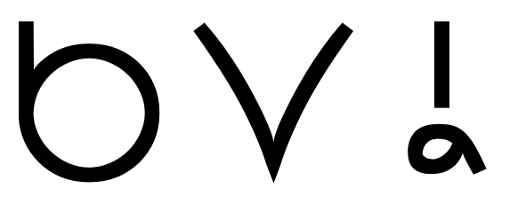
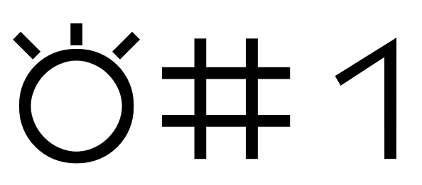
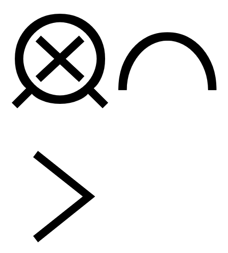
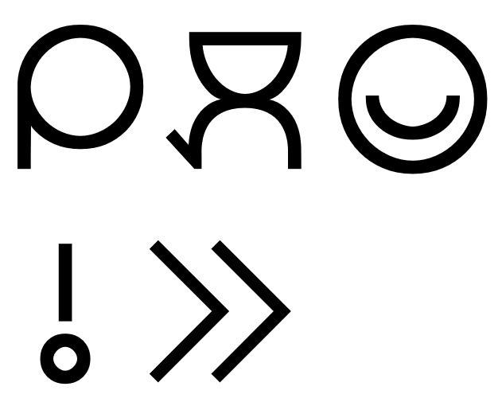
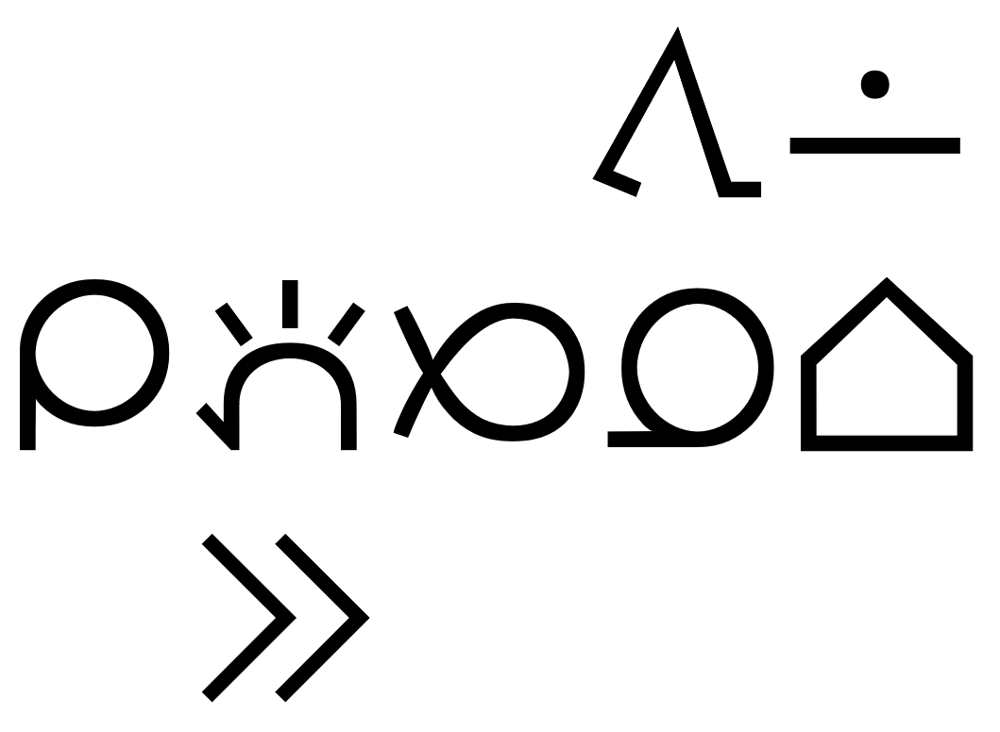
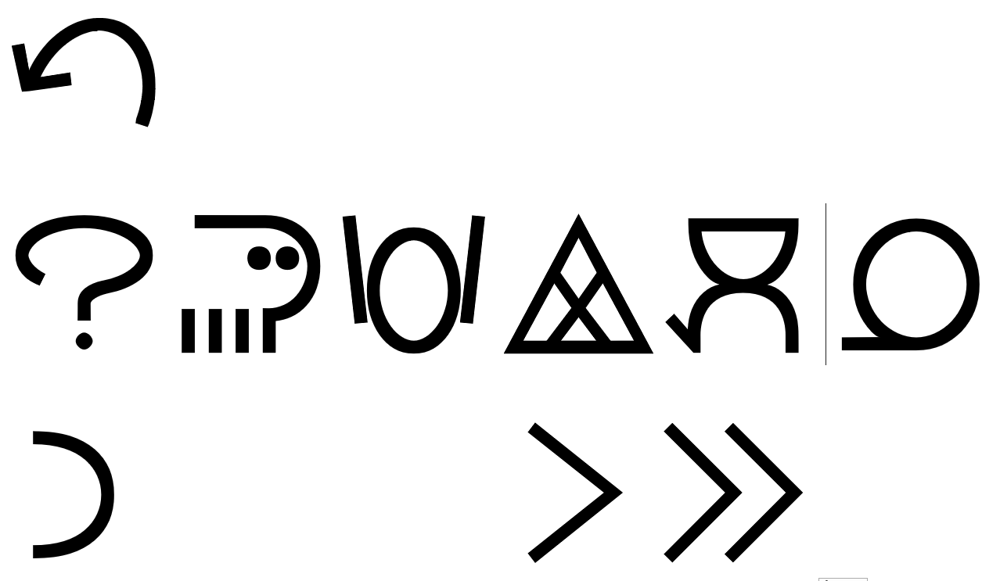
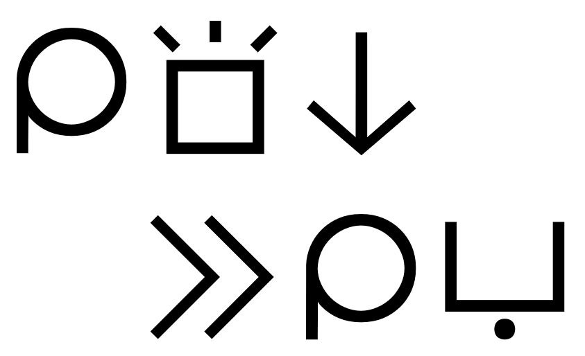
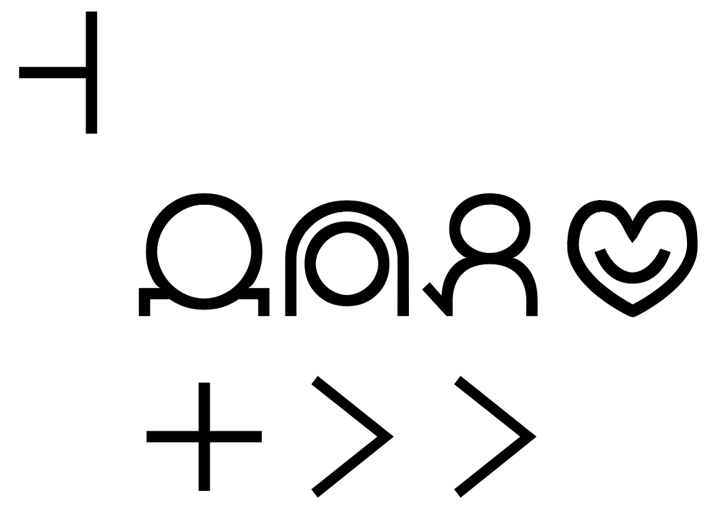

# nasin toki pi toki pona
*(Gramatiko de Tokipono — Grammar of Toki Pona)*

| nasin toki pi toki pona |
|:-:|
| [toki suli](#toki-suli) |
| [toki kulupu](#toki-kulupu) |
| [toki sin](#toki-sin) |
| [ale pi nimi mute](#ale-pi-nimi-mute) |

 wan lipu "[toki lili](#toki-lili)" li toki e nasin toki pi jan ale pi toki pona e nasin pona pi jan **Sonja**.  
 La sekcio "[Kerna Lingvaĵo](#toki-lili)" traktas la lingvouzon de ĉiuj tokiponistoj kaj la "ponan" stilon de **Sonja**.  
 The section "[Core Language](#toki-lili)" treats the way every Toki Pona speaker uses the language and **Sonja**'s "pona" style.

* ***sina*** ~~li~~ sin. *(Vi estas nova. — You are new.)*
  * → ***sina*** sin.
  
 wan lipu "[toki namako](#toki-namako)" li toki e nasin toki sin pi jan **Sonja** lon lipu suli pi toki pona.  
 La sekcio "[Aldona Lingvaĵo](#toki-namako)" traktas la aldonan lingvouzon de **Sonja** en la Oficiala Libro de Tokipono.  
 The section "[Additional Language](#toki-namako)" treats **Sonja**'s additional way of using the language in the Official Toki Pona Book.

* ona li pana e ***telo*** tawa kasi. *(Ŝi donas akvon al la planto. — She gives water to the plant.)*
  * → ona li ***telo*** e kasi. *(Ŝi akvumas la planton. — She waters the plant.)*

 wan lipu "[toki musi](#toki-musi)" li toki e nasin toki pi jan ala. taso tawa mi la ona li pona lon poka pi [toki lili](#toki-lili).  
 La sekcio "[Eksperimenta Lingvaĵo](#toki-musi)" traktas lingvouzojn, kiuj ne estas aplikataj, sed kiuj laŭ mi harmonias kun la "[Kerna Lingvaĵo](#toki-lili)".  
 The section "[Experimental Language](#toki-musi)" treats ways of using the language, which seem to me to be in harmony with the "[Core Language](#toki-lili)", but which are not applied.

* o ***luka*** ala e seli! *(Ne tuŝu la fajron! — Don't touch the fire!)*

 wan lipu "[toki nasa](#toki-nasa)" li toki e nasin toki sin pi jan nasa ni: ona li wile ante e toki pona.  
 La sekcio "[Stranga Lingvaĵo](#toki-nasa)" traktas la aldonan lingvouzon de tokiponidistoj.  
 The section "[Strange Language](#toki-nasa)" treats the additional way of how speakers of Toki Pona dialects use the language.
 
* mi tawa ~~lon~~ ***poka*** sina. *(Mi iras kun vi. — I am going with you.)*
  * → mi tawa ***poka*** sina.

 wan lipu "[toki sin](#toki-sin)" li toki e toki ante tan toki pona.  
 La sekcio "[Novaj Lingvoj](#toki-sin)" traktas aliajn lingvojn derivitajn de Tokipono.  
 The section "[New Languages](#toki-sin)" treats other languages derived from Toki Pona.

* ***eju zen!*** *(Saluton! — Hello!)*
* ***tokon!*** *(Saluton! — Hello!)*

 wan lipu "[ale pi nimi mute](#ale-pi-nimi-mute)" li kepeken [toki lili](#toki-lili) li kepeken [toki musi](#toki-musi). ona li [ale *ala* pi nimi mute, tan lipu suli pi toki pona](http://tokipona.net/tp/janpije/dictionary.php). ona li pana e [sona ni: nimi li tan seme](http://ucteam.ru/toki-pona/) :e sona pi [nimi moli](http://tokipona.net/tp/janpije/extinctwords.php).  
 La sekcio "[Vortaro](#ale-pi-nimi-mute)" uzas la [Kernan Lingvaĵon](#toki-lili) kaj la [Eksperimentan Lingvaĵon](#toki-musi). Ĝi *ne* estas la [Oficiala Vortaro](http://tokipona.net/tp/janpije/dictionary.php). Ĝi montras la [etimologion de la vortoj](http://ucteam.ru/toki-pona/) kaj [mortintajn vortojn](http://tokipona.net/tp/janpije/extinctwords.php).  
 The section "[Dictionary](#ale-pi-nimi-mute)" uses the [Core Language](#toki-lili) and the [Experimental Language](#toki-musi). It is *not* the [Official Dictionary](http://tokipona.net/tp/janpije/dictionary.php). It indicates the [etymology of words](http://ucteam.ru/toki-pona/) and  [extinct words](http://tokipona.net/tp/janpije/extinctwords.php).

---

# toki suli
*(Oficiala Lingvaĵo — Official Language)*

| [↑](#nasin-toki-pi-toki-pona) |
|:-:|
| [toki lili](#toki-lili) |
| [toki namako](#toki-namako) |

## toki lili
*(Kerna Lingvaĵo — Core Language)*

| [↑](#toki-suli) |
|:-:|
| [nimi lili](#nimi-lili) |
| [nimi suli](#nimi-suli) |
| [sitelen pona](#sitelen-pona) |

 [nimi lili](#nimi-lili) en [nimi suli](#nimi-suli) li lon.  
 Estas [partikuloj](#nimi-lili) kaj [radikaj vortoj](#nimi-suli).  
 There are [particles](#nimi-lili) and [content words](#nimi-suli).

### nimi lili
*(Partikuloj — Particles)*

| [↑](#toki-lili) |
|:-:|
| [nimi lili luka](#nimi-lili-luka) |
| [nimi lili pi luka ala](#nimi-lili-pi-luka-ala) |

 kama en pini pi **nimi lili** "[li](#nimi-lili-li)", "[e](#nimi-lili-e)", "[o](#nimi-lili-o)", "[pi](#nimi-lili-pi)", "[en](#nimi-lili-en-anu)", "[anu](#nimi-lili-en-anu)" la [nimi suli](#nimi-suli) li lon.  
 Antaŭ kaj malantaŭ la **partikuloj** "[li](#nimi-lili-li)", "[e](#nimi-lili-e)", "[o](#nimi-lili-o)", "[pi](#nimi-lili-pi)", "[en](#nimi-lili-en-anu)", "[anu](#nimi-lili-en-anu)" estas [radikaj vortoj](#nimi-suli).  
 Before and after the **particles** "[li](#nimi-lili-li)", "[e](#nimi-lili-e)", "[o](#nimi-lili-o)", "[pi](#nimi-lili-pi)", "[en](#nimi-lili-en-anu)", "[anu](#nimi-lili-en-anu)" are [content words](#nimi-suli).

* jan ***pi*** toki pona ***o*** toki ***e*** ni: sina ***en*** mi ***li*** sona ***e*** toki sama ***anu*** seme? *(Diru, tokiponisto, ĉu vi kaj mi konas la saman lingvon? — Tell me, Tokiponan, do you and I know the same language?)*

 pini pi **nimi lili** "[la](#nimi-lili-la)" la [mute nimi](#mute-nimi) li lon. pini ona li lon kama pi **nimi lili** "[la](#nimi-lili-la)".  
 Malantaŭ la **partikulo** "[la](#nimi-lili-la)" estas [frazo](#mute-nimi). Ĝia fino estas antaŭ la **partikulo** "[la](#nimi-lili-la)".  
 After the **particle** "[la](#nimi-lili-la)" is a [sentence](#mute-nimi). Its end is before the **particle** "[la](#nimi-lili-la)".

* tan seme ***la*** sina pu? *(Kial vi konsultas la Oficialan Libron de Tokipono? — Why do you interact with the Official Toki Pona Book?)*

 sin la [nimi lili toki](#nimi-lili-toki) en [nimi lili kalama](#nimi-lili-kalama) li [nimi lili](#nimi-lili). [nimi lili toki](#nimi-lili-toki) li lon pini pi [nimi lawa](#nimi-lawa). [nimi lili kalama](#nimi-lili-kalama) li ken kama [nimi poka](#nimi-poka) pi [nimi poka luka](#nimi-poka-luka) a.  
 Aldone, [citaĵoj](#nimi-lili-toki) kaj [interjekcioj](#nimi-lili-kalama) estas [partikuloj](#nimi-lili). [Citaĵo](#nimi-lili-toki) estas malantaŭ [substantivo](#nimi-lawa). [Interjekcio](#nimi-lili-kalama) povas fariĝi [modifilo](#nimi-poka) eĉ de [prepozicio](#nimi-poka-luka).  
 In addition, [quotes](#nimi-lili-toki) en [interjections](#nimi-lili-kalama) are [particles](#nimi-lili). [Quotes](#nimi-lili-toki) are after [nouns](#nimi-lawa). [Interjections](#nimi-lili-kalama) can become [modifiers](#nimi-poka) even of [prepositions](#nimi-poka-luka).

* ona li jo e nimi "***Sonja***". *(Ŝi havas la nomon "Sonja". — She has the name "Sonja".)*
* sina suli ***a***! *(Vi estas ja granda! — You're so tall!)*
* sina kepeken ***ala*** toki pona. *(Vi ne uzas Tokiponon. — You don't use Toki Pona.)*

 nimi "nanpa" li ken kama wan pi [nimi lili toki](#nimi-lili-toki). ken la tan ni la jan **Sonja** li pana e nimi sama tawa nimi "nanpa".  
 "nanpa" povas fariĝi parto de [citaĵo](#nimi-lili-toki). Eble tial **Sonja** donas al "nanpa" la saman nomon.  
 "nanpa" can become a part of a [qutation](#nimi-lili-toki). Maybe this is why **Sonja** calls "nanpa" in the same way.

* sina nanpa ***wan***. *(Vi estas la numero unu. — You're number one.)*
* toki ***nanpa wan***. *(la lingvo numero unu — the language number one)*

 jan **Sonja** li pana e nimi sama tawa nimi "seme", "taso". taso lipu ni la nimi tu ni li [nimi suli](#nimi-suli): nimi "seme" li [nimi poka palisa](#nimi-poka-palisa), nimi "taso" li [nimi poka luka musi](#nimi-poka-luka-musi).   
 **Sonja** nomas same la vortojn "seme", "taso". Sed en tiu ĉi libro, tiuj du vortoj estas [radikaj vortoj](#nimi-suli): "seme" estas [korelativo](#nimi-poka-palisa) kaj "taso" estas [eksperimenta prepozicio](#nimi-poka-luka-musi).  
 **Sonja** calls the words "seme", "taso" in the same way. But in this book, these two words are [content words](#nimi-suli): "seme" is a [correlative](#nimi-poka-palisa) and "taso" is an [experimental preposition](#nimi-poka-luka-musi).

#### nimi lili luka
*(Transitivaj Partikuloj — Transitive Particles)*

| [↑](#nimi-lili) |
|:-:|
| [li](#nimi-lili-li) |
| [e](#nimi-lili-e) |
| [o](#nimi-lili-o) |
| [pi](#nimi-lili-pi) |
| [en](#nimi-lili-en-anu) |
| [anu](#nimi-lili-en-anu) |
| [la](#nimi-lili-la) |

##### nimi lili "li"
*(Subjekto kaj Predikato — Subject and Predicate)*

 nimi lon kama pi **nimi lili** "li" li nimi "mi" taso anu nimi "sina" taso, la **nimi lili** "li" li kama weka.  
 Se la subjekto (t.e. la vortoj antaŭ la **partikulo** "li") estas nura "mi" aŭ nura "sina", la **partikulo** "li" malaperas.  
 If the subject (i.e. the words before the **particle** "li") is just "mi" or "sina", the **particle** "li" disappears.

* ***mi*** ~~li~~ mije. *(Mi estas viro. — I am a man.)*
  * → ***mi*** mije.
* ***sina*** ~~li~~ sin. *(Vi estas nova. — You are new.)*
  * → ***sina*** sin.

 [mute nimi](#mute-nimi) li ken jo e **nimi lili** "li" mute. **sitelen nanpa** ona li ken kama weka.  
 [Frazo](#mute-nimi) povas havi plurajn predikatojn (t.e. la vortoj malantaŭ la **partikulo** "li"). Iliaj **komoj** povas malaperi.  
 A [sentence](#mute-nimi) can have multiple predicates (i.e. the words after the **particle** "li"). Their **commas** can disappear.

* ma mama ***li*** lili, ***li*** lete. *(La patrujo estas malgranda kaj malvarma. — The motherland is small and cold.)*
  * → ma mama ***li*** lili ***li*** lete.

 jan li ken toki sin kepeken nimi lon pini taso pi **nimi lili** "li".  
 Oni povas respondi per nura predikato (t.e. la vortoj malantaŭ la **partikulo** "li").  
 One can reply by just a predicate (i.e. the words after the **particle** "li").

* ~~ni li~~ ***pona***! *(Dankon! — Thanks!)*
  * → ***pona***!
* ~~ona li~~ ***mama***. *(Jes. (Ŝi estas gepatro.) — Yes. (She is a parent.))*
  * → ***mama***.

##### nimi lili "e"
*(Rekta Objekto — Direct Object)*

 nimi "ijo" taso li lon pini pi **nimi lili** "e", la ona li ken kama weka.  
 Nura "ijo" kiel rekta objekto (t.e. la vortoj malantaŭ la **partikulo** "e") povas malaperi.  
 Plain "ijo" as the direct object (i.e. the words after the **particle** "e") can disappear.

* mije li sona ***e ijo***. *(La viro scias aferojn. — The man knows things.)*
  * → mije li sona. *(La viro scias. — The man knows.)*

 nimi lon pini pi **nimi lili** "li" li ken jo e **nimi lili** "e" mute. ***sitelen nanpa*** ona li ken kama weka.  
 Predikato (t.e. la vortoj malantaŭ la **partikulo** "li") povas havi plurajn rektajn objektojn (t.e. la vortoij malantaŭ la **partikulo** "e"). Iliaj ***komoj*** povas malaperi.  
 A predicate (i.e. the words after the **particle** "li") can have multiple direct objects (i.e. the words after the **particle** "e"). Their ***commas*** can disappear.

* ona li seli ***e*** soweli, ***e*** pan. *(Ŝi kuiras la viandon kaj la rizon. — She cooks the meat and the rice.)*
  * → ona li seli ***e*** soweli ***e*** pan.

 jan li ken toki e wile kepeken nimi lon pini taso pi **nimi lili** "e".  
 Oni povas komuniki deziron per nura rekta objekto (t.e. la vortoj malantaŭ la **partikulo** "e").  
 One can express a desire by just a direct object (i.e. the words after the **particle** "e").

* ~~tawa pona sina la mi wile e~~ ***moku pona***. *(Mi bondeziras al vi bonan manĝon. — I wish you a good meal.)*
  * → ***moku pona***! *(Bonan apetiton! — Bon appétit!)*

##### nimi lili "o"
*(Volativo, Vokativo kaj Imperativo — Volative, Vocative and Imperative)*

 kama pi **nimi lili** "o" la nimi "sina" li ken kama weka.  
 "sina" povas malaperi antaŭ la **partikulo** "o".  
 "sina" can disappear before the **particle** "o".

* sina ***o*** lukin. *(Vi rigardu. — You should look.)*
  * → ***o*** lukin! *(Rigardu! — Look!)*

 pini pi **nimi lili** "o" la nimi "kute" li ken kama weka.  
 "kute" povas malaperi malantaŭ la **partikulo** "o".  
 "kute" can disappear after the **particle** "o".

* jan pona ***o*** kute. *(Amiko aŭskultu. — A friend should listen.)*
  * → jan pona ***o***! *(Ho amiko! — Hey friend!)*

 jan **Sonja** li kepeken ala **nimi lili** "o" tu.  
 **Sonja** ne kombinas du **partikulojn** "o".  
 **Sonja** doesn't combine two "o"-**particles**.

* jan Ali ***o*** wawa. *(Ali estu forta. — Ali should be strong.)*
* jan Ali ***o***, ***o*** wawa. *(Ho Ali, estu forta. — Hey Ali, be strong.)*
  * → jan Ali ***o*** wawa.

##### nimi lili "pi"
*(Genitivo — Genitive)*

 nimi lon pini pi **nimi lili** "pi" li [nimi lawa](#nimi-lawa) wan taso, la **nimi lili** "pi" li kama weka. kepeken ni la [nimi lawa](#nimi-lawa) ni li kama [nimi poka](#nimi-poka).  
 Se genitiva frazero (t.e. la vortoj malantaŭ la **partikulo** "pi") konsistas el nur unu [substantivo](#nimi-lawa), la **partikulo** "pi" malaperas. Tiele, tiu [substantivo](#nimi-lawa) fariĝas [modifilo](#nimi-poka).  
 If a genitive phrase (i.e. the words after the **particle** "pi") consists of only one [noun](#nimi-lawa), the **particle** "pi" disappears. So, that [noun](#nimi-lawa) becomes a [modifier](#nimi-poka).

* toki ~~pi~~ pona *(lingvo de bono, bona lingvo — a language of good, a good language)*
  * → toki pona
* toki ***pi*** pona mute *(tre bona lingvo — a very good language)*

 jan **Sonja** li kepeken ala **nimi lili** "pi" lon poka pi **nimi lili** "pi" ante.  
 **Sonja** ne uzas genitivan frazeron (t.e. vortoj malantaŭ **partikulo** "pi") kombine kun alia genitiva frazero.  
 **Sonja** doesn't use genitive phrases (i.e. words after a **particle** "pi") combined with other genitive phrases.

* ni li tomo ***pi*** telo nasa ***pi*** jan pona. *(Tio estas la domo de biero de amiko. — This is the house of a friend's beer.)*
  * → ni li tomo ***pi*** telo nasa. jan pona li ***jo*** e telo nasa ni.
* ni li tomo ***pi*** telo nasa, ***pi*** jan pona. *(Tio estas trinkejo de amiko. — This is a friend's bar.)*
  * → ni li tomo ***pi*** telo nasa. jan pona li ***jo*** e tomo ni.

##### nimi lili "en", "anu"
*(Konjunkcioj — Conjunctions)*

 **nimi lili** "en" li ken lon nimi lon kama taso pi **nimi lili** "li".  
 La **partikulo** "en" povas esti nur en la subjekto (t.e. la vortoj antaŭ la **partikulo** "li").  
 The **particle** "en" can only come in the subject (i.e. the words before the **particle** "li").

* toki sina ***en*** pali sina li sama. *(Via parolo kaj via ago estas samaj. — What you say and what you do are the same.)*

 poka pi **nimi lili** "anu" la nimi "ni" lon kama pi [mute nimi](#mute-nimi) en **sitelen nanpa** li kama weka.  
 Apud la **partikulo** "anu", "ni" antaŭ [frazo](#mute-nimi) kaj la **komoj** malaperas.  
 Next to the **particle** "anu", "ni" before a [sentence](#mute-nimi) and the **commas** disappear.

* ~~ni,~~ ona li mama ~~,~~ ***anu*** seme? *(Ĉu ŝi estas gepatro? — Is she a parent?)*
  * → ona li mama ***anu*** seme?

 kama nimi la pini pi nimi sama lon poka pi nimi "ala" la **nimi lili** "anu" li kama weka.  
 Antaŭ vortoj kaj malantaŭ la samaj vortoj negitaj, la **partikulo** "anu" malaperas.  
 In front of words and after the same words negated, the **particle** "anu" disappears.

* ona li ***mama ala*** ~~anu~~ ***mama***? *(Ĉu ŝi estas gepatro? — Is she a parent?)*
  * → ona li ***mama ala mama***?

##### nimi lili "la"
*(Kunteksta Frazero — Contextual Fragment)*

 kepeken **nimi lili** "la" la [nimi poka luka](#nimi-poka-luka) li ken kama lon kama pi [mute nimi](#mute-nimi).  
 Per la **partikulo** "la", [prepozicio](#nimi-poka-luka) povas aperi ĉe la komenco de [frazo](#mute-nimi).  
 By means of the **particle** "la", a [preposition](#nimi-poka-luka) can appear at the beginning of a [sentence](#mute-nimi).

* sina pana e nimi "pona" tawa mi ***tan*** seme? *(Kial vi nomas min bona? — Why are you calling me good?)*
  * → ***tan*** seme ***la*** sina pana e nimi "pona" tawa mi?

 kama pi [mute nimi](#mute-nimi) la [nimi poka luka](#nimi-poka-luka) "lon" li kama weka.  
 Komence de [frazo](#mute-nimi), la [prepozicio](#nimi-poka-luka) "lon" malaperas.  
 At the beginning of a [sentence](#mute-nimi), the [preposition](#nimi-poka-luka) "lon" disappears.

* ona li kama ***lon*** tenpo pimeja ni. *(Ŝi venas tiun ĉi nokton. — She is coming tonight.)*
  * ~~lon~~ tenpo pimeja ***la*** ona li kama. *(Ĉi-nokte, ŝi venas. — Tonight, she is coming.)*
    * tenpo pimeja ***la*** ona li kama.

 nimi "ni" lon kama pi [mute nimi](#mute-nimi) li lon poka pi [mute nimi poka](#mute-nimi-poka), la nimi "ni" li kama weka.  
 Se "ni" komence de [frazo](#mute-nimi) akompanas [subfrazon](#mute-nimi-poka), "ni" malaperas.  
 If "ni" at the beginning of a [sentence](#mute-nimi) accompanies a [subordinate clause](#mute-nimi-poka), "ni" disappears.

* jan li pona tawa mi ***lon ni***: mi pona tawa jan. *(Homoj estas bonaj al mi, se mi estas bona al homoj. — People are good to me, if I'm good to people.)*
  * ~~ni,~~ mi pona tawa jan, ***la*** jan li pona tawa mi. *(Se mi estas bona al homoj, homoj estas bonaj al mi. — If I'm good to people, people are good to me.)*
    * → mi pona tawa jan, ***la*** jan li pona tawa mi.

#### nimi lili pi luka ala
*(Netransitivaj Partikuloj — Intransitive Particles)*

| [↑](#nimi-lili) |
|:-:|
| [nimi lili toki](#nimi-lili-toki) |
| [nimi lili kalama](#nimi-lili-kalama) |

##### nimi lili toki
*(Citaĵoj — Quotes)*

 **nimi lili toki** li lon insa pi sitelen toki.  
 **Citaĵo** estas inter citiloj.  
 **Quotations** are inside quotation marks.

* nimi "***Epelanto***" *(la vorto "Esperanto" — the word "Esperanto")*

 **sitelen toki** lon poka pi nimi "nimi" anu nimi "kalama" li ken kama weka.  
 **Citiloj** kun "nimi" aŭ "kalama" povas malaperi.  
 **Quotation marks** with "nimi" or "kalama" can disappear.

* toki pi nimi "***Epelanto***" *(Esperanto — Esperanto)*
  * → toki ***Epelanto***

 jan **Sonja** li weka e [nimi lili "pi"](#nimi-lili-pi) lon kama pi nimi "nanpa" lon poka pi [nimi poka palisa nanpa](#nimi-poka-palisa-nanpa). jan **Pije** li weka ala e [nimi lili "pi"](#nimi-lili-pi) ni.  
 **Sonja** forigas la [partikulon "pi"](#nimi-lili-pi) antaŭ "nanpa" kun [numeralo](#nimi-poka-palisa-nanpa). **Pije** ne forigas tian [partikulon "pi"](#nimi-lili-pi).  
 **Sonja** removes the [particle "pi"](#nimi-lili-pi) before "nanpa" with a [numeral](#nimi-poka-palisa-nanpa). **Pije** doesn't remove such a [particle "pi"](#nimi-lili-pi).

* lipu ***pi nanpa tu*** *(la karto kun la numero du, la dua karto — the card with the number two, the second card)*
  * → lipu ***nanpa tu*** *(la karto numero du, la dua karto — the card number two, the second card)*

##### nimi lili kalama
*(Interjekcio — Interjection)*

 jan li ken toki e pilin kepeken **nimi lili kalama** taso.  
 Oni povas esprimi emocion per nura **interjekcio**.  
 One can express an emotion by means of a plain **interjection**.

* ***a***! *(Ha!, Ho! — Ha!, Wow!)*
* ***mu***! *(Bla! — Blah!)*

 nimi "ala" li ken kama **nimi lili kalama**. **nimi lili kalama** li ken tawa.  
 "ala" povas fariĝi **interjekcio**. **Interjekcioj** povas moviĝi.  
 "ala" can become an **interjection**. **Interjections** can move.

* ***ala***! *(Ne! — No!)*
* o kepeken ilo ike ***ala***. *(Uzu neniujn malĝustajn instrumentojn. — Don't use any wrong tools.)*
  * o kepeken — ***ala*** — ilo ike. *(Ne uzu la malĝustajn instrumentojn. — Don't use the wrong tools.)*
    * → o kepeken ***ala*** ilo ike.
* sina suli, ***a***! *(Vi estas granda, ho! — You are tall, wow!)*
  * sina suli — ***a***! *(Vi estas ja granda! — You are so tall!)*
    * → sina suli ***a***!

 **nimi lili kalama** li ken kama [nimi lawa pali](#nimi-lawa-pali).  
 **Interjekcio** povas fariĝi [aga substantivo](#nimi-lawa-pali).  
 An **interjection** can become a [action noun](#nimi-lawa-pali).

* soweli li ~~kalama~~ "***mu***". *(La besto blekas. — The animal bleats.)*
  * → soweli li ***mu***.
* ona li kute e ~~nimi~~ ***"mu"*** wawa. *(Li aŭdis laŭtan blekon. — He heard a loud bleat.)*
  * → ona li kute e ***mu*** wawa.

### nimi suli
*(Radikaj Vortoj — Content Words)*

| [↑](#toki-lili) |
|:-:|
| [nimi lawa](#nimi-lawa) |
| [nimi wawa](#nimi-wawa) |
| [nimi poka](#nimi-poka) |
| [nimi pona](#nimi-pona) |
| [mute nimi](#mute-nimi) |

 **nimi suli** wan taso li [nimi lawa](#nimi-lawa).  
 Sola **radika vorto** estas [substantivo](#nimi-lawa).  
 A sole **content word** is a [noun](#nimi-lawa).

* ***jan*** *(iu, persono — someone, person)*

 pini pi [nimi lawa](#nimi-lawa) la **nimi suli** wan taso li [nimi poka](#nimi-poka).  
 Malantaŭ [substantivo](#nimi-lawa), sola **radika vorto** estas [modifilo](#nimi-poka).  
 After a [noun](#nimi-lawa), a sole **content word** is a [modifier](#nimi-poka).

* jan ***pona*** *(iu bona, bona persono, amiko — someone good, good person, friend)*

 [nimi lawa](#nimi-lawa) en [nimi poka](#nimi-poka) ona li sama [nimi lawa](#nimi-lawa) wan li ken jo e [nimi poka](#nimi-poka) sin.  
 [Substantivo](#nimi-lawa) kaj ĝia [modifilo](#nimi-poka) estas kiel unu [substantivo](#nimi-lawa) kaj povas havi aldonan [modifilon](#nimi-poka).  
 A [noun](#nimi-lawa) and its [modifier](#nimi-poka) are like one [noun](#nimi-lawa) and can have an additional [modifier](#nimi-poka).

* jan pona ***mi*** *(mia amiko — my friend)*

 pini pi **nimi lili** "[pi](#nimi-lili-pi)" la [nimi lawa](#nimi-lawa) li sama [nimi poka](#nimi-poka).  
 Malantaŭ **partikulo** "[pi](#nimi-lili-pi)", [substantivo](#nimi-lawa) estas kiel [modifilo](#nimi-poka).  
 After a **particle** "[pi](#nimi-lili-pi)", a [noun](#nimi-lawa) is like a [modifier](#nimi-poka).

* tomo ***pi jan pona mi*** *(la domo de mia amiko — my friend's house)*
* toki ***pi pona mute*** *(lingvo de multa bono, tre bona lingvo — a language of much good, a very good language)*

 pini pi **nimi lili** "[li](#nimi-lili-li)" la [nimi lawa](#nimi-lawa) li [nimi wawa](#nimi-wawa).  
 Malantaŭ **partikulo** "[li](#nimi-lili-li)", [substantivo](#nimi-lawa) estas [verbo](#nimi-wawa).  
 After a **particle** "[li](#nimi-lili-li)", a [noun](#nimi-lawa) is a [verb](#nimi-wawa).

* ona ***li jan pona mi***. *(Ŝi estas mia amiko. — She is a friend of mine.)*

#### nimi lawa
*(Substantivoj — Nouns)*

| [↑](#nimi-suli) |
|:-:|
| [nimi lawa esun](#nimi-lawa-esun) |
| [nimi lawa pona](#nimi-lawa-pona) |
| [nimi lawa ijo](#nimi-lawa-ijo) |
| [nimi lawa jan](#nimi-lawa-jan) |
| [nimi lawa pali](#nimi-lawa-pali) |
| [nimi lawa ilo](#nimi-lawa-ilo) |
| [nimi lawa sijelo](#nimi-lawa-sijelo) |

 [nimi lawa](#nimi-lawa) li jo e kon sin, la ona li lon [ale pi nimi mute](#ale-pi-nimi-mute) lon poka pi sitelen *([LAWA](#nimi-lawa))*.  
 Se [substantivo](#nimi-lawa) havas aldonan signifon, ĝi estas en la [vortaro](#ale-pi-nimi-mute) apud la marko *([LAWA](#nimi-lawa))*.  
 If a [noun](#nimi-lawa) has an additional meaning, it is in the [dictionary](#ale-pi-nimi-mute) next to the mark-up *([LAWA](#nimi-lawa))*.

* suwi *(dolĉeco — sweetness)*
  * → ***suwi*** *(dolĉaĵo — sweets)*

##### nimi lawa esun
*(Pronomoj — Pronouns)*

* ***mi*** *(mi, ni — I, we)*
* ***sina*** *(vi — you)*
* ***ona*** *(ŝi, li, ĝi, ili — she, he, it, they)*

##### nimi lawa pona
*(Simplaj Substantivoj — Simple Nouns)*

* ***ijo*** *(io — something)*
* ***jan*** *(iu — somebody)*

##### nimi lawa ijo
*(Aĵaj Substantivoj — Thing Nouns)*

* ***suwi*** *(dolĉa — sweet)*
  * ~~ijo~~ ***suwi*** *(io dolĉa, dolĉaĵo — something sweet, sweets)*
    * → ***suwi***
* ***insa*** *(ena — inner)*
  * ~~ijo~~ ***insa*** *(io ena, centro — something on the inside, center)*
    * → ***insa***

##### nimi lawa jan
*(Ulaj Substantivoj — Person Nouns)*

* ***meli*** *(ina — female)*
  * ~~jan~~ ***meli*** *(iu ina, virino — someone female, woman)*
    * → ***meli***

##### nimi lawa pali
*(Agaj Substantivoj — Action Nouns)*

* ***moku*** *(manĝi — to eat)*
  * ~~ijo~~ ***moku*** *(manĝaĵo, manĝo — something to eat, food)*
    * → ***moku***

##### nimi lawa ilo
*(Ilaj Substantivoj — Tool Nouns)*

* ***lukin*** *(vidi — to see)*
  * ~~ilo~~ ***lukin*** *(organo por vidi, okulo — organ for seeing, eye)*
    * → ***lukin***

##### nimi lawa sijelo
*(Korpaj Substantivoj — Body Nouns)*

* ***kala*** *(fiŝo — fish)*

#### nimi wawa
*(Verboj — Verbs)*

| [↑](#nimi-suli) |
|:-:|
| [nimi wawa luka](#nimi-wawa-luka) |
| [nimi wawa poka](#nimi-wawa-poka) |

 [nimi wawa](#nimi-wawa) li [nimi lawa esun](#nimi-lawa-esun) ala, la ona li ken sama [nimi poka](#nimi-poka) pi nimi lon kama pi **nimi lili** "[li](#nimi-lili-li)".  
 Se la [verbo](#nimi-wawa) ne estas [pronomo](#nimi-lawa-esun), ĝi povas esti kiel [modifilo](#nimi-poka) de la subjekto (t.e. la vortoj antaŭ la **partikulo** "[li](#nimi-lili-li)").  
 If the [verb](#nimi-wawa) is not a [pronoun](#nimi-lawa-esun), it can be like a [modifier](#nimi-poka) of the subject (i.e. the words before the **particle** "[li](#nimi-lili-li)").

* toki ***li pona mute***. *(Lingvoj estas multe da bono. — Languages are much goodness.)*
  * → toki ***li pona mute***. *(Lingvoj estas tre bonaj. — Languages are very good.)*

#### nimi wawa luka
*(Transitivaj Verboj — Transitive Verbs)*

 [nimi wawa](#nimi-wawa) li jo e **nimi lili** "[e](#nimi-lili-e)", la ona li **nimi wawa luka**.  
 Se [verbo](#nimi-wawa) havas **rektan objekton** (t.e. vortoj malantaŭ **partikulo** "[e](#nimi-lili-e)"), ĝi estas **transitiva verbo**.  
 If a [verb](#nimi-lili) has a **direct object** (i.e. words after a **particle** "[e](#nimi-lili-e)"), it is a **transitive verb**.

* mi ***pona e mi***. *(Mi plibonigas min. — I improve myself.)*

 [nimi wawa](#nimi-wawa) **luka** li jo e kon sin, la kon sin ni li lon [ale pi nimi mute](#ale-pi-nimi-mute) lon poka pi sitelen *([E](#nimi-wawa-luka))*.  
 Se **transitiva** [verbo](#nimi-wawa) havas aldonan signifon, tiu aldona signifo estas en la [vortaro](#ale-pi-nimi-mute) apud la marko *([E](#nimi-wawa-luka))*.  
 If a **transitive** [verb](#nimi-wawa) and has an additional meaning, this additional meaning is in the [dictionary](#ale-pi-nimi-mute) next to the mark-up *([E](#nimi-wawa-luka))*.

* sona mi *(mia scio — my knowledge)*
* mi ***sona e toki pona***. *(Mi konas Tokiponon. — I know Toki Pona.)*

#### nimi wawa poka
*(Helpaj Verboj — Auxiliary Verbs)*

 [nimi pona](#nimi-pona) en nimi "e ni: ..." li ken kama **nimi wawa poka**.  
 [Simpla vorto](#nimi-pona) kaj la vortoj "e ni: ..." povas fariĝi **helpa verbo**.  
 A [simple word](#nimi-pona) and the words "e ni: ..." can become an **auxiliary verb**.

* mi ken ~~e ni: mi~~ lape. *(Mi ebligas, ke mi dormas. → Mi povas dormi. — I enable that I sleep. → I can sleep.)*
  * mi ken lape.

 [nimi wawa luka](#nimi-wawa-luka) en nimi "e nasin ni: kepeken ona la ... ken kama" li ken kama **nimi wawa poka**.  
 [Transitiva verbo](#nimi-wawa-luka) kaj la vortoj "e nasin ni: kepeken ona la ... ken kama" povas fariĝi **helpa verbo**.  
 A [transitive verb](#nimi-wawa-luka) and the words "e nasin ni: kepeken ona la ... ken kama" can become an **auxiliary verb**.

* mi lukin ~~e nasin ni: kepeken ona la mi ken kama~~ lape. *(Mi ekzamenas kiel mi povas sukcesi dormi. → Mi provas dormi. — I examine how I can manage to sleep.)*
  * mi lukin lape.

#### nimi poka
*(Modifiloj — Modifiers)*

| [↑](#nimi-suli) |
|:-:|
| [nimi poka palisa](#nimi-poka-palisa) |
| [nimi poka luka](#nimi-poka-luka) |

##### nimi poka palisa
*(Korelativoj — Correlatives)*

* ***ala***, ***ale***, ***ni***, ***seme*** *(neniu, ĉiu, tiu (ĉi), kiu — no, every, that/this, which)*
  * jan ***ala***, jan ***ale***, jan ***ni***, jan ***seme*** *(neniu, ĉiu, tiu (ĉi), kiu — no one, everyone, that/this one, who)*
  * ~~ijo~~ ***ala***, ~~ijo~~ ***ale***, ~~ijo~~ ***ni***, ~~ijo~~ ***seme*** *(nenio, ĉio, tio (ĉi), kio — nothing, everything,  that/this thing, what)*
    * → ***ala***, ***ale***, ***ni***, ***seme***

 pini pi **nimi lili** "pi" la nimi "ijo" lon kama pi **nimi poka palisa** li ken kama sin.  
 En genitiva frazero (t.e. la vortoj malantaŭ la **partikulo** "pi"), "ijo" antaŭ **korelativo** povas reaperi.  
 In a genitive clause (i.e. the words behind the **particle** "pi"), "ijo" before a **correlative** can reappear.

* mama ***ale*** *(ĉiu gepatro, ĉîes gepatro — every parent, everything's parent)*
  * → mama ***pi ijo ale*** *(gepatro de ĉio — parent of everything)*

 nimi "ijo" li jo e kon pi nimi "tenpo" anu "ma"/"tomo", la ona li ken kama weka lon pini pi **nimi lili** "pi".  
 Kiam "ijo" havas la signifon de "tempo" aŭ "loko", ĝi povas malaperi en genitiva frazero (t.e. la vortoj malantaŭ la **partikulo** "pi").  
 When "ijo" has the meaning of "time" or "place", it can disappear in a genitive clause (i.e. the words after the **particle** "pi").

* toki ni *(tiu lingvo — that language)*
* toki pi **ma** ni *(la lingvo de tiu lando — that country's language)*
* toki pi **ma** ni: jan pona mi lon ona *(la lingvo de tiu lando, kie estas miaj amikoj — the language of the country where my friends are)*
* toki pi **ijo** ni: jan pona mi li lon ona *(la lingvo de kie estas miaj amikoj — the language of where my friends are)*
* toki pi ~~ijo~~ ni *(la loka lingvo, la lingvo de tiu loko, la tiea lingvo — the local language, the language of that place, the language there)*
  * → toki ni

 pini pi [nimi lawa](#nimi-lawa) la jan **Sonja** li weka e [nimi poka luka](#nimi-poka-luka) "sama" a.  
 Malantaŭ [substantivo](#nimi-lawa), **Sonja** malaperigas ankaŭ la [prepozicion](#nimi-poka-luka) "sama".  
 After a [noun](#nimi-lawa), **Sonja** makes also the [preposition](#nimi-poka-luka) "sama" disappear.

* tomo ni li suli ***sama*** ni. *(Tiu domo estas granda kiel tiu. Tiu domo estas granda kiel tio. Tiu domo estas tiel granda. — This house is big like this one. This house is big like that. This house is so big.)*
* tomo pi suli ***sama*** ni *(tiom granda domo — a house that big)*
  * → tomo pi suli ni *(domo de tiu grando, tiel granda domo — house of that size, such a big house)*

###### nimi poka palisa nanpa
*(Numeraloj — Numerals)*

 nimi "ala", "wan", "tu", "luka", "ale" li ken kama **nimi poka palisa nanpa**.  
 "ala", "wan", "tu", "luka" kaj "ale" povas fariĝi **numeraloj**.  
 "ala", "wan", "tu", "luka" and "ale" can become **numerals**.

* luka ***wan*** li jo e palisa ***luka***. *(Unu mano havas kvin fingrojn. — One hand has five fingers.)*

 [nimi poka](#nimi-poka) li ken jo e kon sin nanpa, la ona li [nimi poka palisa nanpa](#nimi-poka-palisa-nanpa) li lon [ale pi nimi mute](#ale-pi-nimi-mute) lon poka pi sitelen *([NANPA](#nimi-poka-palisa-nanpa))*.  
 Se [modifilo](#nimi-poka) povas havi la aldonan signifon de numero, ĝi estas [numeralo](#nimi-poka-palisa-nanpa) kaj estas en la [vortaro](#ale-pi-nimi-mute) apud la marko *([NANPA](#nimi-poka-palisa-nanpa))*.  
 If a [modifier](#nimi-poka) can have the additional meaning of a number, it is a [numeral](#nimi-poka-palisa-nanpa) and is in the [dictionary](#ale-pi-nimi-mute) next to the mark-up *([NANPA](#nimi-poka-palisa-nanpa))*.

* toki wan *(unika lingvo — a unique language)*
  * → toki ***wan*** *(unu lingvo — one languge)*

##### nimi poka luka
*(Prepozicioj — Prepositions)*

 [nimi poka](#nimi-poka) li lon kama pi [nimi lawa](#nimi-lawa), la ona li [nimi poka luka](#nimi-poka-luka) li lon [ale pi mute nimi](#ale-pi-mute-nimi) lon poka pi sitelen *([LUKA](#nimi-poka-luka))*.  
 Se [modifilo](#nimi-poka) estas antaŭ [substantivo](#nimi-lawa), ĝi estas [prepozicio](#nimi-poka-luka) kaj estas en la [vortaro](#ale-pi-mute-nimi) apud la marko *([LUKA](#nimi-poka-luka))*.  
 If a [modifier](#nimi-poka) is before a [noun](#nimi-lawa), it is a [preposition](#nimi-poka-luka) and is in the [dictionary](#ale-pi-mute-nimi) next to the mark-up *([LUKA](#nimi-poka-luka))*.

* tomo tawa *(moviĝanta ĉambro, aŭto — moving room, car)*
* toki pona li pona mute ***tawa*** jan pona mi. *(Mia amiko tre ŝatas Tokiponon. — My friend likes Toki Pona very much.)*

 **nimi suli** li jo e [nimi lili](#nimi-lili) (anu **nimi poka**), la **nimi poka luka** li lon pini.  
 Kiam **radika vorto** havas [partikulon](#nimi-lili) (aŭ **modifilon**), la **prepozicio** estas ĉe la fino.  
 When a **content word** has a **particle** (or a **modifier**), the **preposition** is at the end.

* mi pana ***e*** kili ***tawa*** sina. *(Mi donas la pomon al vi. — I'm giving you the apple.)*

 [nimi wawa](#nimi-wawa) en **nimi poka luka** li sama, la [nimi wawa](#nimi-wawa) li kama weka.  
 Se [verbo](#nimi-wawa) kaj **prepozicio** estas la samaj, la [verbo](#nimi-wawa) malaperas.  
 If a [verb](#nimi-wawa) and a **preposition** estas the same, the [verb](#nimi-wawa) disappears.

* mi ~~tawa~~ ***tawa*** tomo seli. *(Mi iras al la kuirejo. — I'm going to the kitchen.)*
  * → mi ***tawa*** tomo seli.

 jan **Sonja** li kepeken **nimi poka luka** lon pini taso pi [mute nimi](#mute-nimi). tan ni la jan **Sonja** li weka e **sitelen nanpa** lon **nimi poka luka** tu. sin la ona li kepeken **nimi poka** (anu **nimi lili** "[e](#nimi-lili-e)") li kepeken ala **nimi poka luka**.  
 **Sonja** uzas **prepoziciojn** nur fine de [frazo](#mute-nimi). Tial **Sonja** ellasas la **komon** ĉe du **prepozicioj**. Aldone, ŝi uzas **modifilon** (aŭ la **partikulon** "[pi](#nimi-lili-pi)" anstataŭ **prepozicio**.  
 **Sonja** uses **prepositions** only at the end of a [sentence](#mute-nimi). Because of that, **Sonja** removes the **comma** between two **prepositions**. In addition, she uses **modifiers** (or the **particle** "[pi](#nimi-lili-pi)") instead of **prepositions**.

* jan pona ***sama sina*** li lon ma tomo mi. *(Amiko kiel vi estas en mia urbo.)*
  * → jan pona li lon ma tomo mi. ona li ***sama sina***.
* mi tawa ***kepeken*** tomo tawa, ***tan*** tomo sona, ***tawa*** tomo sina. *(Mi iras per biciklo de la lernejo al via hejmo. — I'm going by bike from school to your house.)*
  * → mi tawa ***kepeken*** tomo tawa ***tan*** tomo sona ***tawa*** tomo sina.
* jan ~~lon~~ ***poka*** *(najbaro — neighbor)*
  * → jan ***poka***
* pona ~~tawa~~ ***lukin*** *(bona laŭ la okulo, bona por vidado, vidinda → bela — good according to the eye, good for seeing, worth seeing → beautiful)*
  * → pona ***lukin***
* pona ~~tawa~~ ***moku*** *(bona por manĝado, manĝinda → bongusta — good for eating, worth eating → delicious)*
  * → pona ***moku***

#### nimi pona
*(Simplaj Vortoj — Simple Words)*

 [nimi suli](#nimi-suli) li kama nimi ante li kama ala jo e kon sin, la ona li **nimi pona**.  
 Se [radika vorto](#nimi-suli) fariĝas alia vorto kaj ne ricevas aldonan signifon, ĝi estas **simpla vorto**.  
 If a [content word](#nimi-suli) becomes another word and doesn't recieve an additional meaning, it is a **simple word**.

* mi ***wawa***. *(Mi estas forta. — I am strong.)*
* telo li ***wawa*** e mi. *(Akvo fortigas min. — Water strengthens me.)*
* ***wawa*** li lon insa. *(Forto estas ene. — Strength lies within.)*

#### mute nimi
*(Frazoj — Sentences)*

##### mute nimi poka
*(Subfrazoj — Subordinate Clauses)*

 jan **Sonja** li kepeken **mute nimi poka** lon pini taso pi **mute nimi**. ni la **sitelen nanpa** li kama **sitelen palisa**. **mute nimi pi wile sona** li ken **mute nimi poka**. sitelen toki ona li ken kama weka.  
 **Sonja** uzas **subfrazojn** nur fine de **frazo**. Tiam, **komo** fariĝas **dupunkto**. **Demanda frazo** povas esti **subfrazo**. Ĝiaj citiloj povas malaperi.  
 **Sonja** uses **subordinate clauses** only at the end of a **sentence**. In this case, the **comma** becomes a **colon**. A question can be a subordinate clause. Its quotation marks can disappear.  

* mi sona e ni: ***mi anpa***. *(Mi scias, ke mi estas malalta. — I know that I am low.)*
* wile sona nanpa wan li ni: "***ale li pona anu ike***?" *(La demando numero unu estas, ĉu la universo estas bona aŭ malica. — The question number one is whether the universe is good or evil.)*
  * → wile sona nanpa wan li ni: ***ale li pona anu ike***?

### sitelen pona
*(Hieroglifoj — Hieroglyphs)*

 [nimi lawa](#nimi-lawa) en [nimi poka](#nimi-poka) ona nanpa wan li kama wan.  
 [Substantivo](#nimi-lawa) kaj ĝia unua [adjektivo](#nimi-poka) fariĝas unu.  
 [nouns](#nimi-lawa) and their first [adjective](#nimi-poka) become one.

|  |   | 
|:--:|:--:| 
| *toki pona* | [*sitelen pona musi*](musi/sitelen/pona/sitelen-pona-musi.md) |

 [nimi lili kalama](#nimi-lili-kalama) li lon poka.  
 [Interjekcio](#nimi-lili-kalama) estas apude.  
 [Interjections](#nimi-lili-kalama) are adjacent.  

|  | 
|:--:| 
| *sina suli a!* |

 [nimi lili toki](#nimi-lili-toki) li lon poka.  
 [Citaĵo](#nimi-lili-toki) estas apude.  
 [Quotations](#nimi-lili-toki) are adjacent.  

|  |  | 
|:--:|:--:| 
| *ma Kanata* | *toki nanpa wan* |

## toki namako
*(Aldona Lingvaĵo — Additional Language)*

| [↑](#toki-suli) |
|:-:|
| [nimi lili namako](#nimi-lili-namako) |
| [nimi suli namako](#nimi-suli-namako) |

### nimi lili namako
*(Aldonaj Partikuloj — Additional Particles)*

#### nimi lili "e" namako
*(Aldona Akuzativo — Additional Accusative)*

 nimi lon pini pi nimi "pana e" li ken kama [nimi wawa luka](#nimi-wawa-luka).  
 La rekta objekto de "pana" povas fariĝi [transitiva verbo](#nimi-wawa-luka).  
 The direct object of "pana" can become a [transitive verb](#nimi-wawa-luka).

* ona li ***telo*** e kasi. *(ŝi malsekigas la planton. — She makes the plant wet.)*
* ona li pana e ***telo*** tawa kasi. *(Ŝi donas akvon al la planto. — She gives water to the plant.)*
  * → ona li ***telo*** e kasi. *(Ŝi akvumas la planton. — She waters the plant.)*

 lon poka pi nimi "utala" la nimi "tawa" li ken kama [nimi lili "e"](#nimi-lili-e).  
 Kun "utala", "tawa" povas fariĝi la [partikulo "e"](#nimi-lili-e).  
 With "utala", "tawa" can become the [particle "e"](#nimi-lili-e).

* ona li ***utala e*** jan ike. *(Ŝi provokas/atakas la malamikon. — She is provoking/attacking the enemy.)*
* ona li ***utala tawa*** jan ike. *(Ŝi batalas la malamikon. — She fights the enemy.)*
  * → ona li ***utala e*** jan ike.

 nimi "lon poka pi" li ken kama [nimi lili "e"](#nimi-lili-e).  
 "lon poka pi" povas fariĝi la [partikulo "e"](#nimi-lili-e).  
 "lon poka pi" can become the [particle "e"](#nimi-lili-e).

* ona li ***unpa e*** jan ni. *(Ŝi seksumigas tiun personon.)*
* ona li ***unpa lon poka pi*** jan ni. *(Ŝi seksumas kun tiu persono.)*
  * → ona li ***unpa e*** jan ni.

### nimi suli namako
*(Aldonaj Radikaj Vortoj — Additional Content Words)*

| [↑](#toki-namako) |
|:-:|
| [nimi poka palisa nanpa namako](#nimi-poka-palisa-nanpa-namako) |

#### nimi poka palisa nanpa namako
*(Aldonaj Numeraloj — Additional Numerals)*

 [nimi poka palisa nanpa](#nimi-poka-palisa-nanpa) tu la **sitelen nanpa** li ken kama weka.  
 Ĉe du [numeraloj](#nimi-poka-palisa-nanpa), la **komo** povas malaperi.  
 With two [numerals](#nimi-poka-palisa-nanpa), the **comma** can disappear.

* palisa ***luka***, ***tu*** *(kvin fingroj kaj du → sep fingroj — five fingers and two → seven fingers)*
  * → palisa ***luka tu***

#### nimi poka namako
*(Aldonaj Modifiloj — Additional Numerals)*

# toki kulupu
*(Komunuma Lingvaĵo — Community Language)*

| [↑](#nasin-toki-pi-toki-pona) |
|:-:|
| [toki musi](#toki-musi) |
| [toki nasa](#toki-nasa) |

## toki musi
*(Eksperimenta Lingvaĵo — Experimental Language)*

| [↑](#toki-kulupu) |
|:-:|
| [nimi lili musi](#nimi-lili-musi) |
| [nimi suli musi](#nimi-suli-musi) |
| [sitelen musi pi poka nimi](#sitelen-musi-pi-poka-nimi) |
| [sitelen pona musi](#sitelen-pona-musi) |

### nimi lili musi

| [↑](#toki-musi) |
|:-:|
| [nimi lili "li" musi](#nimi-lili-li-musi) |
| [nimi lili kalama musi](#nimi-lili-kalama-musi) |

#### nimi lili "li" musi
*(Eksperimentaj Subjekto kaj Predikato — Experimental Subject and Predicate)*

 lon pini pi nimi "mi" anu nimi "sina" la [nimi lili "li"](#nimi-lili-li) li kama weka ala lon ni: [nimi lili "li"](#nimi-lili-li) nanpa tu li lon.  
 Malantaŭ "mi" aŭ "sina" la [partikulo "li"](#nimi-lili-li) ne malaperas, se estas dua [partikulo "li"](#nimi-lili-li).  
 After "mi" or "sina" the [particle "li"](#nimi-lili-li) doesn't disappear, if there is a second [particle "li"](#nimi-lili-li).

* mi lukin mute. mi sona lili. *(Mi vidas multe kaj scias malmulte. — I am seeing much and knowing little.)*
  * → mi ***li*** lukin mute ***li*** sona lili.

#### nimi lili kalama musi
*(Eksperimentaj Interjekcioj — Experimental Interjections)*

 [nimi lili kalama](#nimi-lili-kalama) li ken jo e kon pi [nimi poka](#nimi-poka) tan [nimi lili kalama](#nimi-lili-kalama) sama.  
 [Interjekcio](#nimi-lili-kalama) povas havi la signifon de la [modifilo](#nimi-poka) derivita de ĉi [interjekcio](#nimi-lili-kalama).  
 An [interjection](#nimi-lili-kalama) can have the meaning of the [modifier](#nimi-poka) derived from that very [interjection](#nimi-lili-kalama).

* ***a***, sina suli. *(Jes, vi estas granda. — Yes, you are tall.)*

### nimi suli musi
*(Eksperimentaj Radikaj Vortoj — Experimental Content Words)*

| [↑](#toki-musi) |
|:-:|
| [nimi poka musi](#nimi-poka-musi) |
| [nimi wawa musi](#nimi-wawa-musi) |
| [nimi lawa musi](#nimi-lawa-musi) |

#### nimi poka musi
*(Eksperimentaj Modifiloj — Experimental Modifiers)*

| [↑](#nimi-suli-musi) |
|:-:|
| [nimi poka palisa nanpa musi](#nimi-poka-palisa-nanpa-musi) |
| [nimi poka luka musi](#nimi-poka-luka-musi) |

 nimi tu sama li jo e kon pi [nimi poka](#nimi-poka) "a".  
 Du samaj vortoj havas la signifon de la [modifilo](#nimi-poka) "a".  
 Two same words have the meaning of the [modifier](#nimi-poka) "a".

* sina ***suli suli***! *(Vi estas vere alta! — You are really tall!)*

 [nimi lawa](#nimi-lawa) "ijo" en [nimi poka luka](#nimi-poka-luka) "tawa" en [nimi wawa luka](#nimi-wawa-luka).  
 Pasivo.  
 Passive.

* ***ijo*** ~~tawa~~ lukin *(io por la okulo, io por vidado — something for the eye, something to see)*
  * ***ijo*** lukin *(vidaĵo, videnda — must-see)*
* ***pona*** lukin *(vidinda, bela — beautiful)*
  * ***ike*** lukin *(malvidinda, malbela — ugly)*
* ***insa*** lukin *(videbla, vidata — visible, being seen)*
  * ***weka*** lukin *(malvidebla, ne vidata — invisible, not being seen)*
* ***open*** lukin *(travidebla, transparenta — transparent)*
  * ***selo*** lukin *(maltravidebla, maltransparenta — opaque)*

##### nimi poka palisa musi
*(Eksperimentaj Korelativoj — Experimental Correlatives)*

* mi sona e ni: sina toki pona tan seme. *(Mi scias, kial vi tokiponumas. — I know why you speak Toki Pona.)*

##### nimi poka palisa nanpa musi
*(Eksperimentaj Numeraloj — Experimental Numerals)*

 nimi "mute", "esun" li [nimi poka palisa nanpa](#nimi-poka-palisa-nanpa) musi.  
 "mute" kaj "esun" estas eksperimentaj [numeraloj](#nimi-poka-palisa-nanpa).  
 "mute" and "esun" are experimental [numerals](#nimi-poka-palisa-nanpa).

* tenpo suno ***esun*** *(sep tagoj — seven days)*

 [nimi poka palisa nanpa](#nimi-poka-palisa-nanpa) li ken kama [nimi lawa](#nimi-lawa).  
 [Numeralo](#nimi-poka-palisa-nanpa) povas fariĝi [substantivo](#nimi-lawa).  
 A [numeral](#nimi-poka-palisa-nanpa) can become a [noun](#nimi-lawa).

* mi jo e kili tu. ***wan*** ona li loje. ***wan*** ante li jelo. *(Mi havas du pomojn. Unu el ili estas ruĝa. La alia estas flava. — I have two apples. One of them is red. The other one is yellow.)*

 [nimi lili "en"](#nimi-lili-en-anu) li ken lon [nimi poka palisa nanpa](#nimi-poka-palisa-nanpa) tu.  
 La [konjunkcio "en"](#nimi-lili-en-anu) povas esti ĉe du [numeraloj](#nimi-poka-palisa-nanpa).  
 The [conjunction "en"](#nimi-lili-en-anu) can be with two [numerals](#nimi-poka-palisa-nanpa).

* tenpo suno esun tu *(du semajnoj — two weeks)*
* tenpo suno ***luka tu en tu tu*** *(dek kvar tagoj — fourteen days)*

 kepeken nimi pi nanpa lili en nimi pi nanpa suli la jan li ken toki e nanpa lon ala, e nanpa lon wan.  
 Pere de numeralo de malgranda kvanto kaj numeralo de granda kvanto oni povas esprimi kvanton inter nulo kaj unu.  
 By means of a numeral of a small quantity and a numeral of a big quantity one can express a quantity between zero and one.

* mi pana e ***wan wan pi tu tu*** tawa sina. *(Mi donas al vi unu kvaronon. — I give you one quarter.)*
* mi pana e ***wan mute pi tu tu*** tawa sina. *(Mi donas al vi tri kvaronojn. — I give you three quarters.)*

| # | 5^ | | 10^ | |
|:-:|:-:|:-:|:-:|:-:|
| 1 | 1 | wan | 1 | wan |
| 2 | 2 | tu | 2 | tu |
| 3 | 3 | mute | 3 | mute |
| 4 | 2×2 | tu tu | 2×2 | tu tu |
| 5 | 5 | luka | 5 | luka |
| 6 | 3×2 | mute tu | 5 + 1 | luka en wan |
| 7 | 7 | esun | 5 + 2 | luka en tu |
| 8 | 2×2×2 | tu tu tu | 5 + 3 | luka en mute |
| 9 | 3×3 | mute mute | 5 + 2×2 | luka en tu tu |
| 10 | 5×2 | luka tu | 5×2 | luka tu |
| ... | ... | ... | ... | ... |
| 15 | 5×2 + 5 | luka tu en luka | 5×3 | luka mute |
| 20 | 5×2×2 | luka tu tu | 5×2×2 | luka tu tu |
| 25 | 5×2×2 + 5 | luka tu tu en luka | 5×5 | luka luka |
| 30 | 5×2×3 | luka tu mute | 5×5 + 5 | luka luka en luka |
| 35 | 5×2×3 + 5 | luka tu mute en luka | 5×5 + 5×2 | luka luka en luka tu |
| 40 | 5×2×2×2 | luka tu tu tu | 5×5 + 5×3 | luka luka en luka mute |
| 45 | 5×2×2×2 + 5 | luka tu tu tu en luka | 5×5 + 5×2×2 | luka luka en luka tu tu |
| 50 | 5×2×5 | luka tu luka | 5×5×2 | luka luka tu |
| ... | ... | ... | ... | ... |
| 75 | 5×2×7 + 5 | luka tu esun en luka | 5×5×3 | luka luka mute |
| 100 | 5×2×5×2 | luka tu luka tu | 5×5×2×2 | luka luka tu tu |
| 125 | 5×2×5×2 + 5×2 + 5 | luka tu luka tu en luka tu tu en luka | 5×5×5 | luka luka luka |
| ... | ... | ... | ... | ... |
| 250 | 5×2×5×2×2 + 5×2×5 | luka tu luka tu tu en luka tu luka | 5×5×5×2 | luka luka luka tu |
| 375 | 5×2×5×2×3 + 5×2×7 + 5 | luka tu luka tu mute en luka tu esun en luka | 5×5×5×3 | luka luka luka mute |
| 500 | 5×2×5×2×5 | luka tu luka tu luka | 5×5×5×2×2 | luka luka luka tu tu |
| 625 | 5×2×5×2×3×2 + 5×2×2 + 5 | luka tu luka tu mute tu en luka tu tu en luka | 5×5×5×5 | luka luka luka luka |
| ... | ... | ... | ... | ... |
| 2001 | 5×2×5×2×5×2×2 + 1 | luka tu luka tu luka tu tu en wan | 5×5×5×5×3 + 5×5×5 + 1 | luka luka luka luka mute en luka luka luka en wan

 kon pi poka ante, pi nimi "nanpa wan" li nimi "nanpa ale".  
 La malo de "nanpa wan" estas "nanpa ale".  
 The opposite of "nanpa wan" is "nanpa ale".

* sina ***nanpa wan*** *(Vi estas la unua. — You're the first.)*
* sina ***nanpa ale*** *(Vi estas la lasta. — You're the last.)*

 linja pi nanpa esun la wan linja kama li "nanpa kama", wan linja awen li "nanpa awen", wan linja pini li "nanpa pini".  
 En atendovico la venonta vicero estas "nanpa kama", la estanta vicero estas "nanpa awen" kaj la pasinta vicero estas "nanpa pini".  
 In a row, the one whose turn it's going to be is "nanpa kama", the one whose turn it is is "nanpa awen" and the one whose turn it has been is "nanpa pini".

* mi ***nanpa kama*** *(Estos mia vico. — It's going to be my turn.)*
* mi ***nanpa awen*** *(Estas mia vico. — It's my turn.)*
* mi ***nanpa pini*** *(Estis mia vico. — It's been my turn.)*

 ilo sona li pali lon tenpo mute, la ona li "nanpa sin" e ona.  
 Kiam komputilo plurfoje plenumas algoritmon, ĝi iteracias ("nanpa sin") e ona.  
 When a computer fulfills an algorithm multiple times, it iterates ("nanpa sin") it.

* ilo sona li ***nanpa sin*** e pali. *(La komputilo ripetas la taskon. La komputilo iteracias la algoritmon. — The computer repeats the task. The computer iterates the algorithm.)*

##### nimi poka luka musi
*(Eksperimentaj Prepozicioj — Experimental Prepositions)*

 nimi "ante", "pu", "taso" li [nimi poka luka](#nimi-poka-luka) musi.  
 "ante", "pu" kaj "taso" estas eksperimentaj [prepozicioj](#nimi-poka-luka).  
 "ante", "pu" and "taso" are experimental [prepositions](#nimi-poka-luka).

* mi utala ala tawa wile sina. *(Mi estas en harmonio kun vi. — I am in harmony with you.)*
  * → mi ***pu*** sina.
* ona li sama ala sina. *(Ŝi estas diversa ol vi. — She is different from you.)*
  * → ona li ***ante*** sina.
    * ona li suli ***ante*** sina. *(Ŝi estas pli alta ol vi. — She is taller than you.)*
* sina jo ala e mi. *(Vi ne havas min. — You don't have me.)*
  * → mi ***taso*** sina. *(Mi estas libera de vi. — I am free from you.)*
    * mi pali lili. taso ni la mi wile lape. *(Mi apenaŭ laboris. Sendepende de tio, mi bezonas dormi. — I hardly worked. Independent from that I need to sleep.)*

 nimi "taso ni la" li ken kama "taso".  
 "taso ni la" povas fariĝi "taso".  
 "taso ni la" can become "taso".

* ***taso ni la*** mije en meli li pali li pilin pona. *(Sendepende de tio, viroj kaj virinoj laboras kaj estas gajaj. — Independent from that, men and women work and are happy.)*
  * → ***taso*** mije en meli li pali li pilin pona. *(Sed viroj kaj virinoj laboras kaj estas gajaj. — But men and women work and are happy.)*

 [nimi poka luka](#nimi-poka-luka) "lon" li ken jo e kon pi [nimi poka luka](#nimi-poka-luka) "ante".  
 La [prepozicio](#nimi-poka-luka) "lon" povas havi la signifon de la [prepozicio](#nimi-poka-luka) "ante".  
 The [preposition](#nimi-poka-luka) "lon" can have the meaning of the [preposition](#nimi-poka-luka) "ante".

* ona li suli ***lon*** sina. *(Ŝi estas pli alta ol vi. — She is taller than you.)*
  * → sina la ona li suli.

#### nimi wawa musi
*(Eksperimentaj Verboj — Experimental Verbs)*

##### nimi wawa poka musi
*(Eksperimentaj Helpaj Verboj — Experimental Auxiliary Verbs)*

 [nimi pona](#nimi-pona) "pini" li ken kama [nimi wawa poka](#nimi-wawa-poka) **musi**.  
 La [simpla vorto](#nimi-pona) "pini" povas fariĝi **eksperimenta** [helpa verbo](#nimi-wawa-poka).  
 The [simple word](#nimi-pona) "pini" can become an **experimental** [auxiliary verb](#nimi-wawa-poka).

* mi ***pini jo*** e lipu. *(Mi ĉesis havi la libron. Mi perdis la libron. — I ceased to have the book. I lost the book.)*

 [nimi poka luka](#nimi-poka-luka) en nimi "ni: ..." li ken kama [nimi wawa poka](#nimi-wawa-poka).  
 [prepozicio](#nimi-poka-luka) kaj la vortoj "ni: ..." povas fariĝi [helpa verbo](#nimii-wawa-poka).  
 A [preposition](#nimi-poka-luka) and the words "ni: ..." can become an [auxiliary verb](#nimi-wawa-poka).

* mi ***tan*** pini sona. *(Mi estas forgesinta. — I have forgotten.)*
* mi ***lon*** awen sona. *(Mi estas memoranta. — I am remembering.)*
* mi ***tawa*** kama sona. *(Mi estas lernonta. — I am about to learn.)*
* mi ***kepeken*** kama sona. *(Mi kutimas lerni. — I am used to learn.)*
* mi ***sama*** kama sona. *(Mi simulas lerni. — I simulate to learn.)*

#### nimi lawa musi
*(Eksperimentaj Substantivoj — Experimental Nouns)*

| [↑](#nimi-suli-musi) |
|:-:|
| [nimi lawa ijo musi](#nimi-lawa-ijo-musi) |
| [nimi lawa jan musi](#nimi-lawa-jan-musi) |
| [nimi lawa ilo musi](#nimi-lawa-ilo-musi) |
| [nimi lawa sijelo musi](#nimi-lawa-sijelo-musi) |
| [nimi lawa mun musi](#nimi-lawa-mun-musi) |

##### nimi lawa ijo musi
*(Eksperimentaj Aĵaj Vortoj — Experimental Thing Words)*

 nimi "ilo", "kili", "kon", "kulupu", "lipu", "lupa", "ma", "mani", "mun", "nanpa", "nasin", "nena", "nimi", "palisa", "sijelo", "sin", "sitelen", "telo", "tenpo", "weka" li [nimi lawa ijo](#nimi-lawa-ijo) **musi**.  
 "ilo", "kili", "kon", "kulupu", "lipu", "lupa", "ma", "mani", "mun", "nanpa", "nasin", "nena", "nimi", "palisa", "sijelo", "sin", "sitelen", "telo", "tenpo" kaj "weka" estas **eksperimentaj** [aĵaj vortoj](#nimi-lawa-ijo).  
 "ilo", "kili", "kon", "kulupu", "lipu", "lupa", "ma", "mani", "mun", "nanpa", "nasin", "nena", "nimi", "palisa", "sijelo", "sin", "sitelen", "telo", "tenpo" kaj "weka" are **experimental** [thing words](#nimi-lawa-ijo).

* lipu ***ilo*** *(utila libro — a useful book)*

##### nimi lawa jan musi
*(Eksperimentaj Ulaj Vortoj — Experimental Person Words)*

 nimi "akesi", "mama", "soweli" li [nimi lawa jan](#nimi-lawa-jan) **musi**.  
 "akesi", "mama" kaj "soweli" estas **eksperimentaj** [ulaj vortoj](#nimi-lawa-jan).  
 "akesi", "mama" and "soweli" are **experimental** [person words](#nimi-lawa-jan).

* mi en sina li toki ***kulupu***. *(Mi kaj vi parolas unu al la alia. — You and I talk to one another.)*

##### nimi lawa ilo musi
*(Eksperimentaj Ilaj Vortoj — Experimental Tool Words)*

 nimi "len", "luka", "noka", "palisa", "poki", "selo", "tomo", "uta" li [nimi lawa ilo](#nimi-lawa-ilo) **musi**.  
 "len", "luka", "noka", "palisa", "poki", "selo", "tomo" kaj "uta" estas **eksperimentaj** [ilaj vortoj](#nimi-lawa-ilo).  
 "len", "luka", "noka", "palisa", "poki", "selo", "tomo" and "uta" are **experimental** [tool words](#nimi-lawa-ilo).

* o ***luka*** ala e seli! *(Ne tuŝu la fajron! — Don't touch the fire!)*

##### nimi lawa sijelo musi
*(Eksperimentaj Korpaj Vortoj — Experimental Body Words)*

 nimi "esun" li [nimi lawa sijelo](#nimi-lawa-sijelo) **musi**.  
 "esun" estas **eksperimenta** [korpa vorto](#nimi-lawa-sijelo).  
 "esun" is an **experimental** [body word](#nimi-lawa-sijelo).

* jan lawa ***esun*** *(vicprezidanto — vice president)*

##### nimi lawa mun musi
*(Eksperimentaj Vortoj pri Ĉielirantaj Objektoj — Experimental Words of Skywalking Objects)*

 **nimi mun** li ken [nimi poka](#nimi-poka) taso.  
 **Vortoj pri ĉielirantaj objektoj** povas esti nur [modifiloj](#nimi-poka).  
 **Words of skywalking objects** can only be [modifiers](#nimi-poka).

* tenpo suno ***Mun*** la, tenpo suno ***Kiwen*** la jan li ken lukin e loje pi mun ***Seli***. *(De lundo ĝis vendredo, oni povas vidi la ruĝon de marso. — From Monday to Friday one can see the red of Mars.)*

#### sitelen musi pi poka nimi
*(Eksperimenta Interpunkcio — Experimental Punctuation)*

 pini pi mute nimi la nimi pi kon sin li lon pini pi sitelen pi ijo kama.  
 Fine de frazo, signif-aldonaj vortoj estas post dupunkto.  
 At the end of a sentence, words that add meaning are after a colon.

* jan li pona tawa mi lon ni: mi pona tawa jan. *(Homoj estas bonaj por mi, se mi estas bona por homoj. — People are good to me, if I am good to people.)*

 sama ni la insa pi [mute nimi](#mute-nimi) la **sitelen palisa** anu **sitelen nanpa** li ken kama.  
 Ankaŭ ene de [frazo](#mute-nimi), **dupunktoj** aŭ **komoj** povas aperi.  
 Also inside a [sentence](#mute-nimi), **colons** or **commas** can appear.

* tan ni: mi pona tawa jan :la jan li pona tawa mi. *(Ĉar mi estas bona por homoj, homoj estas bonaj por mi. — Because I am good to people, people are good to me.)*
  * → tan ni, mi pona tawa jan, la jan li pona tawa mi.

 pini pi [nimi wawa poka](#nimi-wawa-poka) la **sitelen pi ijo sin** li ken kama.  
 Post [helpa verbo](#nimi-wawa-poka) povas aperi **plus-signo**.  
 After an [auxiliary verb](#nimi-wawa-poka) a **plus sign** can appear.

* mi wile+lape. *(Mi bezonas dormi. — I need to sleep.)*

 [nimi lili "pi"](#nimi-lili-pi) weka li ken jo e **sitelen pi ijo weka**.  
 Modifilo (t.e. la vortoj malantaŭ la [partikulo "pi"](#nimi-lili-pi)) povas havi **minus-signon**.  
 A modifier (i.e. the words after the [particle "pi"](#nimi-lili-pi)) can have a **minus sign**.

* tomo-tawa-sina *(via aŭto — your car)*

 pini pi mute nimi la [nimi poka luka](#nimi-poka-luka) li ken jo e **sitelen pi ijo weka**.  
 Fine de frazo, [prepozicio](#nimi-poka-luka) povas havi **minus-signon**.  
 At the end of a sentence, a [preposition](#nimi-poka-luka) can have a **minus sign**.

* mi pana e lipu - tawa sina. *(Mi donas la libron al vi. — I am giving the book to you.)*

 [nimi lili toki](#nimi-lili-toki) li ken jo e **sitelen palisa**.  
 [Citaĵo](#nimi-lili-toki) povas havi **dupunkton**.  
 [Quotations](#nimi-lili-toki) can have a **colon**.

* jan:Sonja *(Sonja — Sonja)*
* sina nanpa:wan. *(Vi estas numero unu. — You are number one.)*
* toki:nanpa:wan *(la unua lingvo — the first language)*

#### sitelen pona musi
*(Eksperimentaj Hieroglifoj — Experimental Hieroglyphs)*

 [nimi lili luka](#nimi-lili-luka) li lon anpa.  
 [Transitiva partikulo](#nimi-lili-luka) estas sube.  
 [Transitive particles](#nimi-lili-luka) are below.

|  |  |  |  |
|:--:|:--:|:--:|:--:|
| *ale li pona.* | *jan ala li ike.* | *mi o moku e ijo pona.* | *o kute e mama sina.* |

 [nimi poka luka](#nimi-poka-luka) li lon sewi.  
 [Prepozicio](#nimi-poka-luka) estas supre.  
 [Prepositions](#nimi-poka-luka) are above.

|  |  |  |  |
|:--:|:--:|:--:|:--:| 
| *mi lon tomo.* | *wawa li lon insa.* | *mi pana e kala tawa ona lon tomo.* | *tan seme la soweli wawa pimeja li moku e ona?* |

 [nimi wawa poka](#nimi-wawa-poka) li lon sewi.  
 [Helpa verbo](#nimi-wawa-poka) estas supre.  
 [Auxiliary Verbs](#nimi-wawa-poka) are above.

|  |
|:--:| 
| *mi kama sona e toki pona.* |

 [mute nimi poka](#mute-nimi-poka) li lon anpa pi nimi "ni".  
 [Subfrazo](#mute-nimi-poka) estas sub "ni".  
 [Subordinate clauses](#mute-nimi-poka) are below "ni".

|  |
|:--:| 
| *mi sona e ni: mi anpa.* |

 nimi "ni" li weka, la [mute nimi poka](#mute-nimi-poka) li lon ala anpa.  
 Se "ni" mankas, la [subfrazo](#mute-nimi-poka) ne estas sube.  
 If "ni" is missing, the [subordinate clause](#mute-nimi-poka) is not below.

|  |
|:--:| 
| ~~lon ni,~~ *mi pona tawa jan, la jan li pona tawa mi.* |

 nimi "taso" li lon sewi.  
 "taso" estas supre.  
 "taso" is above.

|  |
|:--:| 
| *taso mije en meli li pali li pilin pona.* |

 [nimi lawa esun](#nimi-lawa-esun) en [nimi lawa pona](#nimi-lawa-pona) li kama ala wan pi [nimi lawa](#nimi-lawa) ante.  
 [Pronomoj](#nimi-lawa-esun) kaj [simplaj substantivoj](#nimi-lawa-pona) ne fariĝas parto de alia [substantivo](#nimi-lawa).  
 [Pronouns](#nimi-lawa-esun) and [simple nouns](#nimi-lawa-pona) don't become part of another [noun](#nimi-lawa).

|  |
|:--:| 
| *mi weka e ike jan, la mi weka e ike mi.* |

## toki nasa
*(Stranga Lingvaĵo — Strange Language)*

| [↑](#toki-kulupu) |
|:-:|
| [nimi lili nasa](#nimi-lili-nasa) |
| [nimi suli nasa](#nimi-suli-nasa) |
| [sitelen nasa pi poka nimi](#sitelen-nasa-pi-poka-nimi) |

### nimi lili nasa
*(Strangaj Partikuloj — Strange Particles)*

| [↑](#toki-nasa) |
|:-:|
| [nimi lili "li" nasa](#nimi-lili-li-nasa) |
| [nimi lili "o" nasa](#nimi-lili-o-nasa) |
| [nimi lili "pi" nasa](#nimi-lili-pi-nasa) |
| [nimi lili "la" nasa](#nimi-lili-la-nasa) |
| [nimi lili "en", "anu" nasa](#nimi-lili-en-anu-nasa) |

#### nimi lili "li" nasa
*(Strangaj Subjekto kaj Predikato — Strange Subject and Predicate)*

 jan **Pije** li weka e [nimi lili "li"](#nimi-lili-li) nanpa wan taso lon pini pi nimi "mi" anu nimi "sina".  
 **Pije** forigas nur la unuan [partikulon "li"](#nimi-lili-li) post "mi" aŭ "sina".  
 **Pije** removes only the first [particle "li"](#nimi-lili-li) after "mi" or "sina".

* mi lukin mute. mi sona lili. *(Mi vidas multe kaj scias malmulte. — I am seeing much and knowing little.)*
* mi ~~li~~ lukin mute li sona lili.
  * → mi lukin mute li sona lili.

#### nimi lili "o" nasa
*(Strangaj Volativo, Vokativo kaj Imperativo — Strange Volative, Vocative and Imperative)*

* ~~ni~~ o ~~kama:~~ sina lape pona. *(Ke vi dormu bone. — May you sleep well.)*
  * → o sina lape pona.

#### nimi lili "pi" nasa
*(Stranga Genitivo — Strange Genitive)*

 jan **Pije** li [nimi wawa](#nimi-wawa) e [nimi lili "pi"](#nimi-lili-pi) lon poka pi [nimi lawa esun](#nimi-lawa-esun).  
 **Pije** [verbigas](#nimi-wawa) la [partikulon "pi"](#nimi-lili-pi) kun [pronomo](#nimi-lawa-esun).  
 **Pije** turns the [particle "pi"](#nimi-lili-pi) with a [pronoun](#nimi-lawa-esun) into a [verb](#nimi-wawa).

* ni li ijo mi. *(Tio apartenas al mi. — This belongs to me.)*
  * → ni li ***pi mi***. *(Tio estas mia. — This is mine.)*
 
 jan **Pije** li [nimi lili "pi"](#nimi-lili-pi) e [nimi lili "e"](#nimi-lili-e) lon kama pi [nimi lawa](#nimi-lawa) ni: kon ona li nasin.  
 **Pije** igas la [partikulon "e"](#nimi-lili-e) la [partikulo "pi"](#nimi-lili-pi) antaŭ substantivo, kiu signifas direkton.  
 **Pije** turns the [particle "e"](#nimi-lili-e) into the [particle "pi"](#nimi-lili-pi) before a noun, which means a direction.

* sina lukin ***e sewi***. *(Vi rigardas supren. — You look up.)*
  * → sina lukin ***sewi***.

 [nimi lili "e"](#nimi-lili-e) li ken kama [nimi lili "pi"](#nimi-lili-pi).  
 La [partikulo "e"](#nimi-lili-e) povas fariĝi la [partikulo "pi"](#nimi-lili-pi).  
 The [particle "e"](#nimi-lili-e) can become the [particle "pi"](#nimi-lili-pi).

* mi ante ***e toki pi*** sitelen tawa. *(Mi tradukas la filmon. — I translate the movie.)*
  * → mi ante ***toki e*** sitelen tawa.

 [nimi lili "pi"](#nimi-lili-pi) li ken kama weka.  
 La [partikulo "pi"](#nimi-lili-pi) povas malaperi.  
 The [particle "pi"](#nimi-lili-pi) can disappear.

* tomo telo nasa *(stranga necesejo — strange bathroom)*
* tomo ~~pi~~ telo nasa *(trinkejo — pub)*
  * tomo telo nasa

#### nimi lili "la" nasa
*(Stranga Kunteksta Frazero — Strange Contextual Fragment)*

 tenpo ala la jan **Pije** li nimi poka palisa nanpa wan e [nimi poka luka](#nimi-poka-luka) lon kama pi **nimi lili** "[la](#nimi-lili-la)". tan ni la, [nimi poka luka](#nimi-poka-luka) li ken sama [nimi lawa](#nimi-lawa) tawa lukin, taso ona li jo e kon pi nimi "ijo" lon pini pi [nimi poka luka](#nimi-poka-luka) ni.  
 **Pije** neniam uzas [prepozicion](#nimi-poka-luka) kiel la unuan vorton en **kunteksta frazero** (t.e. la vortoj antaŭ la **partikulo** "[la](#nimi-lili-la)"). Tial, [prepozicio](#nimi-poka-luka) povas ŝajni [substantivo](#nimi-lawa), sed kun la signifo de "ijo" kiel argumento de tiu [prepozicio](#nimi-poka-luka).  
 **Pije** never uses [prepositions](#nimi-poka-luka) as the first word in a **contextual fragment** (i.e. the words before the [particle "la"](#nimi-lili)). Therefore, a [preposition](#nimi-poka-luka) may seem like a [noun](#nimi-lawa), but with the meaning of "ijo" as an argument of that [preposition](#nimi-poka-luka).

* sina pu ***tan*** jan pona. *(Vi legas la Libron pro amiko. — You read the Book because of a friend.)*
  * ***tan*** jan pona la sina pu.
    * → ***tan pi*** jan pona la sina pu.
      * → sina pu ***lon tan pi*** jan pona.

#### nimi lili "en", "anu" nasa
*(Strangaj Konjunkcioj — Strange Conjunctions)*

 **sitelen nanpa** li ken kama [nimi lili](#nimi-lili-en-anu) nasa ["en"](#nimi-lili-en-anu).  
 **Komo** povas fariĝi stranga [konjunkcio "en"](#nimi-lili-en-anu).  
 A **comma** can become a strange [conjunction "en"](#nimi-lili-en-anu).

* tomo pi telo nasa, pi jan pona. *(trinkejo de amiko — a friend's bar)*
  * → tomo pi telo nasa ***en*** pi jan pona.

 nimi lon kama pi [nimi lili "li"](#nimi-lili-li) li jo e [nimi lili](#nimi-lili-en-anu) nasa ["en"](#nimi-lili-en-anu). [nimi lili](#nimi-lili-en-anu) nasa ["en"](#nimi-lili-en-anu) nanpa wan li weka.  
 Subjekto (t.e. la vortoj antaŭ la [partikulo "li"](#nimi-lili-li) havas la strangan [partikulon "en"](#nimi-lili-en-anu). La unua [partikulo "en"](#nimi-lili-en-anu) mankas.  
 The Subject (i.e. the words before the [particle "li"](#nimi-lili-li) has the strange [particle "en"](#nimi-lili-en-anu). The first [particle "en"](#nimi-lili-en-anu) is missing.

* ~~en~~ sina ***en*** mi li jan pona. *(Vi kaj mi estas amikoj. — You and I are friends.)*
  * → sina ***en*** mi li jan pona.

### nimi suli nasa
*(Strangaj Radikaj Vortoj — Strange Content Words)*

| [↑](#toki-nasa) |
|:-:|
| [nimi wawa nasa](#nimi-wawa-nasa) |
| [nimi poka nasa](#nimi-poka-nasa) |
| [mute nimi nasa](#mute-nimi-nasa) |

#### nimi wawa nasa
*(Strangaj Verboj — Strange Verbs)*

##### nimi wawa poka nasa
*(Strangaj Helpaj Verboj — Strange Auxiliary Verbs)*

 nimi "pana" li ken kama [nimi wawa poka](#nimi-wawa-poka).  
 "pana" povas fariĝi [helpa verbo](#nimi-wawa-poka).  
 "pana" can become an [auxiliary verb](#nimi-wawa-poka).

* mi ***pana*** e sona pi toki pona tawa sina. *(Mi instruas Tokiponon al vi.)*
  * mi ***pana*** sona e toki pona tawa sina.

 **nimi wawa luka** ale li ken kama [nimi wawa poka](#nimi-wawa-poka).  
 Ĉiu transitiva verbo povas fariĝi [helpa verbo](#nimi-wawa-poka).  
 Every transitive verb can become an [auxiliary verb](#nimi-wawa-poka).

* mi ***olin e ni: mi*** kama sona e jan pona sina. *(Mi amas konatiĝi kun via amiko. — I love to get to know your friend.)*
  * → mi ***olin*** kama sona e jan pona sina.

 [nimi wawa poka](#nimi-wawa-poka) "kama" en [nimi suli](#nimi-suli) "pini" li ken kama weka.  
 La [helpa verbo](#nimi-wawa-poka) "kama" kaj la [radika vorto](#nimi-suli) "pini" povas malaperi.  
 The [auxiliary verb](#nimi-wawa-poka) "kama" and the [content word](#nimi-suli) "pini" can disappear.

* ona li ~~kama~~ ***lape*** lon ~~pini pi~~ tenpo lili. *(Ŝi endormiĝos post mallonga tempo. Ŝi baldaŭ dormos. Ŝi rapide endormiĝas. — She will sleep after a short period of time. She will sleep soon. She falls asleep quickly.)*
  * → ona li ***lape*** lon tenpo lili.

#### nimi poka nasa
*(Strangaj Modifiloj — Strange Modifiers)*

##### nimi poka luka nasa
*(Strangaj Prepozicioj — Strange Prepositions)*

 kama pi nimi lili "[la](#nimi-lili-la)" la [nimi poka luka](#nimi-poka-luka) li ken kama weka.  
 En kunteksta frazero (t.e. antaŭ la partikulo "[la](#nimi-lili-la)") [prepozicio](#nimi-poka-luka) povas malaperi.  
 In a contextual phrase (i.e. before the particle "[la](#nimi-lili-la)"), [prepositions](#nimi-poka-luka) can disappear.

* ***~~tawa~~*** mi ***la*** sina jan pona. *(Laŭ mi, vi estas bona persono. — From my point of view, you are a good person.)*
  * → mi ***la*** sina jan pona.

 jan **Pije** li weka e [nimi poka luka](#nimi-poka-luka) "tawa" lon kama pi nimi "lukin".  
 **Pije** forigas la [prepozicion](#nimi-poka-luka) "tawa" antaŭ "lukin".  
 **Pije** removes the [preposition](#nimi-poka-luka) "tawa" before "lukin".

* sina ***~~tawa~~*** lukin sama waso. *(Vi aspektas kiel birdo. — You look like a bird.)*
  * → sina lukin sama waso.

 kama pi nimi "pilin" la nimi "ike tan" li ken kama weka.  
 Antaŭ "pilin", "ike tan" povas malaperi.  
 Before "pilin", "ike tan" can disappear.
  
* sina pilin ~~ike tan~~ utala. *(Vi malbone empatias pro batalo. → Vi estas kolera. — You are empathizing badly because of struggle. → You are angry.)*
  * → sina pilin utala.

 nimi "lon ... (pi)" li ken kama [nimi poka luka](#nimi-poka-luka).  
 "lon ... (pi)" povas fariĝi [prepozicio](#nimi-poka-luka).  
 "lon ... (pi)" can become a [preposition](#nimi-poka-luka).

* mi tawa poka sina. *(Mi iras proksimen al vi. — I'm getting closer to you.)*
* mi tawa ~~lon~~ ***poka*** sina. *(Mi iras kun vi. — I'm going with you.)*
  * → mi tawa ***poka*** sina.

 [nimi poka luka](#nimi-poka-luka) "kepeken" li kama [nimi wawa](#nimi-wawa), la jan **Pije** li kepeken ona lon poka pi [nimi lili "e"](#nimi-lili-e).  
 Kiam la [prepozicio](#nimi-poka-luka) "kepeken" fariĝas [verbo](#nimi-wawa), **Pije** uzas ĝin kun la [partikulo "e"](#nimi-lili-e).  
 When the [preposition](#nimi-poka-luka) "kepeken" becomes a [verb](#nimi-wawa), **Pije** uses it with the [particle "e"](#nimi-lili-e).

* mi ***kepeken*** ilo. *(Mi uzas la instrumenton. — I use the instrument.)*
  * → mi ***kepeken e*** ilo.

 [nimi poka luka](#nimi-poka-luka) li kama [nimi lawa](#nimi-lawa), la kon ona li kama sama ni pi nimi "ijo" lon pini pi [nimi poka luka](#nimi-poka-luka) ni. jan **Pije** li kepeken [nimi poka luka](#nimi-poka-luka) "tan" lon nasin ni.   
 Kiam [prepozicio](#nimi-poka-luka) fariĝas [substantivo](#nimi-lawa), ĝia signifo povas fariĝi sama al tiu de "ijo" malantaŭ tiu [prepozicio](#nimi-poka-luka). **Pije** uzas la [prepozicion](#nimi-poka-luka) "tan" en tiu maniero.  
 When a [preposition](#nimi-poka-luka) becomes a [noun](#nimi-lawa), its meaning can become that of the word "ijo" after that [preposition](#nimi-poka-luka). **Pije** uses the [preposition](#nimi-poka-luka) "tan" in this way.

* mi sona ala e ni: ***tan*** seme la sina pu ala. *(Mi ne scias kial vi ne studas la Libron. — I don't know why you're not interacting with the Book.)*
  * → mi sona ala e ***tan*** pi ijo ni: sina pu ala.
* ona li tawa e ~~ona~~ ***sama***. *(Ĝi movas sin mem. — It moves itself.)*
  * → ona li tawa e ***sama***.

#### mute nimi nasa
*(Strangaj Frazoj — Strange Sentences)*

##### mute nimi poka nasa
*(Strangaj Subfrazoj — Strange Subordinate Clauses)*

 kama pi [mute nimi poka](#mute-nimi-poka) li ken kama weka. tan ni la [nimi wawa poka](#nimi-wawa-poka) en [nimi poka luka](#nimi-poka-luka) li ken kama [nimi lawa](#nimi-lawa).  
 La komenco de [subfrazo](#mute-nimi-poka) povas malaperi. Tial, [helpaj verboj](#nimi-wawa-poka) kaj [prepozicioj](#nimi-poka-luka) povas fariĝi [substantivoj](#nimi-lawa).  
 The beginning of a [subordinate clause](#mute-nimi-poka) can disappear. Therefore, [auxiliary verbs](#nimi-wawa-poka) and [prepositions](#nimi-poka-luka) can become [nouns](#nimi-lawa).  

* jan ni: ona li tawa tomo *(tiu persono, kiu venas hejmen — that person, who comes home)*
* jan pi ~~ijo ni:~~ ona li tawa tomo *(iu, kiu venas hejmen — someone, who comes home)*
  * → jan pi ~~ona~~ li tawa tomo *(iu venanta hejmen — someone coming home)*
    * → jan pi ~~li~~ tawa tomo *(hejmen-venanto — home-comer)*
	  * → jan pi tawa tomo
* jan ni: ona li kama sona (e toki pona) *(tiu persono, kiu lernas (Tokiponon) — that person, who is studying (Toki Pona))*
* jan pi ~~ijo ni:~~ ona li kama sona (e toki pona) *(iu, kiu studas (Tokiponon) — someone, who is studying (Toki Pona))*
  * → jan pi ~~ona~~ li kama sona (e toki pona) *(iu studanta (Tokiponon) — someone studying (Toki Pona))*
    * → jan pi ~~li~~ kama sona (e toki pona) *(studanto de (Tokipono) — a student (of Toki Pona))*
      * → jan pi kama sona (e toki pona)

### sitelen nasa pi poka nimi
*(Stranga Interpunkcio — Strange Punctuation)*

 jan **Pije** li weka e **sitelen nanpa** lon kama pi **nimi lili** "[la](#nimi-lili-la)".  
 **Pije** ellasas la komon antaŭ la **partikulo** "[la](#nimi-lili-la)".  
 **Pije** leaves out the **comma** before the **particle** "[la](#nimi-lili-la)".

* mi pona tawa jan, ***la*** jan li pona tawa mi. *(Se mi estas bona al homoj, homoj estas bonaj al mi. — If I'm good to people, people are good to me.)*
  * → mi pona tawa jan ***la*** jan li pona tawa mi.

 tenpo ale la jan **Pije** li kepeken **sitelen nanpa** lon kama pi nimi "taso".  
 **Pije** neniam uzas **komon** antaŭ "taso".  
 **Pije** never uses a **comma** before "taso".

* mi wile lukin e tomo mi, ***taso*** mi jo ala e tenpo. *(Mi volas vidi mian domon, sed mi ne havas tempon. — I want to see my house, but I don't have time.)*
  * → mi wile lukin e tomo mi. ***taso*** mi jo ala e tenpo. *(Mi volas vidi mian domon. Sed mi ne havas tempon. — I want to see my house. But I don't have time.)*

# toki sin
*(Novaj Lingvoj — New Languages)*

| [↑](#nasin-toki-pi-toki-pona) |
|:-:|
| [eju zen bona](#eju-zen-bona) |
| [pona toko](#pona-toko) |
| [tok siŋ](#tok-siŋ) |

## eju zen bona
*(Ejuzenbona — Eyu Zen Bona)*

 nimi li ken ante.  
 Vortoj povas esti diversaj.  
 Words can differ.

* ~~anu~~ → ***an*** *(aŭ — or)*

 wan nimi poka palisa nanpa wan li ken ala jo e kalama "i" anu kalama "u". wan nimi ante li ken ala jo e kalama "e" anu kalama "o".  
 La unua silabo ne povas havi la vokalon "i" aŭ "u". La aliaj silaboj ne povas havi la vokalon "e" aŭ "o".  
 The first syllable can not have the vowel "i" or "u". The other syllables can not have the vowel "e" or "o".

* ~~nimi~~ → ***nemi*** *(vorto — word)*
* ~~kulupu~~ → ***kolupu*** *(grupo — group)*

 nimi "akesi", "jelo", "kala", "kasi", "kepeken", "la", "laso", "loje", "moku", "pali", "pana", "pimeja", "pipi", "pu", "soweli", "tan", "tawa", "toki", "walo", "waso" li weka.  
 "akesi", "jelo", "kala", "kasi", "kepeken", "la", "laso", "loje", "moku", "pali", "pana", "pimeja", "pipi", "pu", "soweli", "tan", "tawa", "toki", "walo" kaj "waso" estas for.  
 "akesi", "jelo", "kala", "kasi", "kepeken", "la", "laso", "loje", "moku", "pali", "pana", "pimeja", "pipi", "pu", "soweli", "tan", "tawa", "toki", "walo" and "waso" are gone.

* ona li ~~moku~~ e pan. → ona le ***alun ota*** e pan. *(Ŝi manĝas la rizon. — She eats the rice.)*

 kalama **[np]** li kama **[mp]** li jo e sitelen "**mp**".  
 La sono **[np]** fariĝas **[mp]** kaj havas la literojn "**mp**".  
 The sound **[np]** becomes **[mp]** and has the letters "**mp**".

* ~~tenpo~~ → ***tempu*** *(tempo — time)*

 kalama lon kama pi kalama **[i]** li kama ante tan kalama **[p]**, **[t]**, **[k]** tawa kalama **[f]**, **[ĉ]**, **[ĥ]**.  
 La sono antaŭ **[i]** povas varii de **[p]**, **[t]**, **[k]** al **[f]**, **[ĉ]**, **[ĥ]**.  
 The sound in front of **[i]** can vary from **[p]**, **[t]**, **[k]** to **[f]**, **[ĉ]**, **[ĥ]**.

* ~~pipi~~ → ***pefi*** *(insekto — insect)*
* ~~kasi~~ → ***kaci*** *(planto — plant)*
* ~~poki~~ → ***poxi*** *(flanko — side)*

 kalama nanpa wan pi [nimi poka](#nimi-poka) li ken kama ante.  
 La unua sono de [modifilo](#nimi-poka) povas varii.  
 The sound of a [modifier](#nimi-poka) can vary.

* ~~jan pona~~ → ***jen bona*** *(amiko — friend)*
* ~~tomo sina~~ → ***tomu zena*** *(via domo — your house)*
* ~~telo kili~~ → ***telu geli*** *(suko — juice)*

## Pona Toko
*(Ponatoko — Pona Toko)*

 toki **Ponatoko** li jo e nimi pi **toki pona** e nasin sitelen pi **toki pona**, taso ona li jo e kalama pi toki **Epelanto** e pini nimi pi toki **Epelanto**.  
 **Pona Toko** havas la vortojn kaj la ortografion de **Tokipono**, sed ĝi havas la akcentadon kaj la finaĵojn de **Esperanto**.  
 **Pona Toko** has the words and the orthography of **Toki Pona**, but it has the syllable stress and the endings of **Esperanto**.

* ***niun sunan tenpon mi pone tokas.*** *(tenpo suno ni la mi toki pona.)*

 nimi "selo" en "poki" li jo e sijelo nimi "ŝel" en "bok" lon toki Ponatoko.  
 La tokiponaj vortoj "selo" kaj "poki" havas la radikojn "ŝel" kaj "bok" en Pona Toko.  
 The Toki Pona words "selo" and "poki" have the stems "ŝel" and "bok" in Pona Toko.

* ***sela ŝelo*** *(selo seli)*
* ***poka boko*** *(poki poka)*

 sijelo nimi "est" en nimi "la" taso tan toki Epelanto li tawa toki Ponatoko.  
 Nure la radiko "est" kaj la vorto "la" el Esperanto move to Pona Toko.  
 Only the stem "est" and the word "la" from Esperanto move to Pona Toko.

* ***la*** poka jano estas sona jano. *(jan poka li jan sona.)*
* jano ***estas*** lon sona tomo. *(jan li lon tomo sona.)*

 [nimi suli](#nimi-suli) pi toki Ponatoko li ken jo e kalama wan taso.  
 Ponatoka [radiko](#nimi-suli) povas konsisti nur el unu sono.  
 A Pona Toko [stem](#nimi-suli) can consist of only one sound.

* mi ***jas*** mutan tenpon. *(mi jo e tenpo mute.)*

 [nimi lawa esun](#nimi-lawa-esun) "mi", "sina", "ona" li jo e pini nimi "-i".  
 La [pronomoj](#nimi-lawa-esun) "mi", "sina" kaj "ona" havas la finaĵon "-i".  
 The [pronouns](#nimi-lawa-esun) "mi", "sina" and "ona" have the ending "-i".

* ***sini*** sinas. *(sina sin.)*

 [nimi lawa](#nimi-lawa) lon pini pi [nimi lili toki](#nimi-lili-toki) li ken kama weka.  
 [Substantivo](#nimi-lawa) malantaŭ [citaĵo](#nimi-lili-toki) povas malaperi.  
 A [noun](#nimi-lawa) after a [quotation](#nimi-lili-toki) can disappear.

* la ***Sonja***-jano *(jan Sonja)*
  * → ***Sonja***

 [nimi poka palisa nanpa](#nimi-poka-palisa-nanpa) li jo e pini nimi "-u".  
 [Numeraloj](#nimi-poka-palisa-nanpa) havas la finaĵon "-u".  
 [Numerals](#nimi-poka-palisa-nanpa) have the ending "-u".

* la kulupo estas wana. *(kulupu li wan)*
  * jan wanu *(jan wan)*
    * toko wanua → toko nanpo wanu *(toki nanpa wan)*

 [nimi poka palisa](#nimi-poka-palisa) "ala", "ale", "ni", "seme" tan toki pona li nimi Tapejoto lon **Pona Toko**.  
 La tokiponaj [korelativoj](#nimi-poka-palisa) "ala", "ale", "ni" kaj "seme" estas tabelvortoj en **Pona Toko**.  
 The Toki Pona [correlatives](#nimi-poka-palisa) "ala", "ale", "ni" and "seme" are table words in **Pona Toko**.

* ***semeal*** oni estas nie? *(tan seme la ona li lon ni?)*
  * → ***tan semeo*** oni estas lon nio?

 [nimi poka luka](#nimi-poka-luka) li pini kepeken kalama pi open ala.  
 [Prepozicio](#nimi-poka-luka) finiĝas per konsonanto.  
 A [preposition](#nimi-poka-luka) ends in a consonant.

* sini estas ***sam*** mi. *(sina sama mi.)*
* mi estas ***taw*** tomo. *(mi tawa tomo.)*

 ale pi [nimi lili kalama](#nimi-lili-kalama) li lon **Pona Toko**.  
 [Interjekcioj](#nimi-lili-kalama) estas tutaj en **Pona Toko**.  
 [Interjections](#nimi-lili-kalama) are in **Pona Toko** as a whole.

* sowelo ***muas***. *(soweli li mu.)*

## tok siŋ
*(Toksingo — Tok Sing)*

 kalama "n" li kama "ŋ" lon pini nimi. kalama "ji" en kalama "ti" li lon.  
 La sono "n" fariĝas "ŋ" ĉe la fino de vorto. La sonoj "ji" kaj "ti" ekzistas.  
 The sound "n" becomes "ŋ" at the end of a word. There are the sounds "ji" and "ti".

* pilin → **piliŋ** *(koro — heart)*

### kama ante pi nimi lawa
*(Deklinacio — Declension)*

||toki|sin|sina|kon|ko|tomo|tawa|ijo|lete|
|-|-|-|-|-|-|-|-|-|-|
||tok|siŋ|sin|koŋ|k|tom|taw|ij|let|
|e|toke|siŋe|sine|koŋe|ke|tome|tawe|ije|lete|
|pi|toki|siŋi|sini|koŋi|ki|tomi|tawi|iji|leti|

* lipu mute → liput → lipus *(libroj — books)*
* jan mute → jant → jans *(personoj — people)*

||lipu mute|jan mute|
|-|-|-|
||lipus|jans|
|**e**|lipuse|janse|
|**pi**|lipusi|jansi|

### kama ante pi nimi wawa
*(Konjugacio — Conjugation)*

||toki|oliŋ|
|-|-|-|
|**mi wan**|tokim|olim|
|**mi mute**|tokims|olims|
|**sina wan**|tokis|olis|
|**sina mute**|tokiste|oliste|
|**ona wan**|tokin|olin|
|**ona mute**|tokinte|olinte|

* ***Jom*** tome taw poni mut. *(Mi havas tre bonan aŭton. — I have a very good car.)*

---

# ale pi nimi mute
*(Vortaro — Dictionary)*

*  **a** ***[ha]*** *([KALAMA](#nimi-lili-kalama))* ≠ **ala** - emfaza, emocia, konfirma interjekcio: ha → ja, eĉ, efektive — emotional interjection: ha → so, even, indeed
  * *([KALAMA°](#nimi-lili-kalama-musi))* - jes — yes
  * *([POKA°](#nimi-poka-musi))* - konfirmita, efektiva, vera — confirmed, actual, true
  * *([PALISA°](#nimi-poka-palisa-musi))*
    * *([POKA°](#nimi-poka-musi))* - certa, specifa — a certain, a specific
    * *([LAWA°](#nimi-lawa-musi))* - certaĵo, specifaĵo — something certain, something specific
*  **akesi** ***[hagedis]*** *([JAN°](#nimi-lawa-jan-musi))* = **sijelo lete**
  * *([LAWA](#nimi-lawa))* - malvarmsanga animaĵo: reptilo, amfibio, monstro, krimulo — cold-blooded animated being: reptile, amphibian, monster, criminal
  * *([POKA°](#nimi-poka-musi))* - malvarmsanga — cold-blooded
*  **ala** ***[ara]*** *([KALAMA°](#nimi-lili-kalama-musi))* ≠ **a** - malkonfirma interjekcio: ne — unconfirming interjection: no
  * *([POKA](#nimi-poka))* - malvera — false
  * *([PALISA](#nimi-poka-palisa))*
    * *([POKA](#nimi-poka))* - neniu — no
      * *([NANPA](#nimi-poka-palisa-nanpa))*
	    * *([POKA](#nimi-poka))* - nul — zero
    * *([LAWA](#nimi-lawa))* - nenio — nothing
*  **alasa** ***[a-la-ŝas]*** *([PALI°](#nimi-lawa-pali))*
  * *([LAWA°](#nimi-lawa-musi))* - io por ĉasi, io por kolekti: foraĝo — something to hunt, something to collect: forage
  * *([E](#nimi-wawa-luka))* - ĉasi, kolekti — to hunt, to collect
*  **ale** ***[alle]*** *([PONA](#nimi-pona))*
  * *([POKA](#nimi-poka))* - tuta — entire, whole
  * *([PALISA](#nimi-poka-palisa))*
    * *([POKA](#nimi-poka))* - ĉiu — every
      * *([NANPA](#nimi-poka-palisa-nanpa))* - senfine — countless
    * *([LAWA](#nimi-lawa))* - ĉio, ĉiom — everything, the whole
      * *(... LAWA°)* - tuta, ĉiom da — whole, all of
*  **ali** ⇒ **ale**
*  **anpa** ***[an-bas]*** *([PONA](#nimi-pona))* - malalta, kliniĝi, klinsaluti — low, bending, bowing
  * *(lon ... pi)* ≠ **lon sewi pi** - sub — under
*  **ante** ***[ander]*** *([LUKA°](#nimi-poka-luka-musi))*
  * *(LUKA°)* - ol — than
    * *([LAWA!](#nimi-poka-luka-nasa))* - io alia — something different
  * *([POKA](#nimi-poka))* - alia — different
  * *(lon poka ... pi°)* - ĉe la alia flanko de, trans — at the other side of, beyond
*  **anu** ~~an~~ ***[an]*** *([LILI](#nimi-lili-en-anu))* - aŭ — or
*  **apeja** ⇒ **jaki**
*  **awen** ***[hawen]*** *([PONA](#nimi-pona))* - daŭra, daŭrigita — enduring, kept
  * *(... ~~lon~~)* - daŭre ĉeestanta → atendi, resti — continuously being present → waiting, staying
    * *(~~ken~~ ...+)* - rajtanta resti → protektita, savita — allowed to stay → protected, safe
	  * *([E+](#nimi-wawa-luka-namako))* ⇒ **tomo** - protekti — to protect
  * *([WAWA POKA](#nimi-wawa-poka))* - daŭrigi ke  → plu- — to continue to
*  **e** ***[he?]*** *([LILI](#nimi-lili-e))* - -n — (accusative)
*  **en** ***[en]*** *([LILI](#nimi-lili-en-anu))* - kaj — and
*  **esun** ***[edẑum]*** *([SIJELO°](#nimi-lawa-sijelo-musi))*
  * *([LAWA](#nimi-lawa))* - interŝanĝanta organizo: metabolo, vendejo, merkato, ekonomio — exchanging organism: metabolism, shop, market, economy
    * *([NANPA°](#nimi-poka-palisa-nanpa-musi))*
	  * *([POKA°](#nimi-poka-musi))* - sep — seven
  * *([E°](#nimi-wawa-luka-musi))* - interŝanĝi — exchange
    * *([E°](#nimi-wawa-luka-musi) ~~kepeken toki~~)* - interŝanĝi per parolo: promesi — exchange with talking: promise
  * *([LUKA°](#nimi-poka-luka))*
    * *(LUKA°)* - anstataŭ — in exchange for, instead of
      * *([LAWA!](#nimi-poka-luka-nasa))* - anstataŭaĵo — substitute
    * *([POKA°](#nimi-poka-musi))* - anstataŭa — substitute
*  **ijo** ***[io]*** *([LAWA PONA](#nimi-lawa-pona))*
  * *([LAWA](#nimi-lawa))* - io — something
  * *([POKA](#nimi-poka))* - de io: ies — of something: something's
  * *(... pi)* - pri — about
  * *(... [PALI°](#nimi-lawa-pali))* - -ata, -enda — being -ed, to be -ed
*  **ike** ~~ikeja~~ ***[ilkeä]*** *([PONA](#nimi-pona))* ≠ **pona** - malbona, superflua — bad, superfluous
*  **iki** ⇒ **ona**
*  **ilo** *([IJO°](#nimi-lawa-ijo-musi))*
  * *([LAWA](#nimi-lawa))* - io utila: ilo — something useful: tool
  * *([POKA°](#nimi-poka-musi))* - utila — useful
*  **insa** ***[insajt]*** *([IJO](#nimi-lawa-ijo))* ≠ **weka**
  * *([LAWA](#nimi-lawa))* - io interna, io centra: mezo — something internal, something central: middle
    * *(lon nasin ... pi°)* - tra — through
    * *(lon ale ... pi°)* - ĉie en — throughout
    * *(tan ale ... pi°)* - de ĉie en, tra — throughout
	* *(lon ...)* - ene — inside
      * *(lon ... [PALI°](#nimi-lawa-pali))* - ...-ata — being ...-ed
  * *([POKA](#nimi-poka))* - interna, centra — internal, central
*  **jaki** ***[jakki]*** *([PONA](#nimi-pona))* ≠ **pona** - malpura, fia, senhonora — dirty, disgusting, dishonored
*  **jan** ~~jen~~ ***[jen]*** *([LAWA PONA](#nimi-lawa-pona))*
  * *([LAWA](#nimi-lawa))* - iu — someone
  * *([POKA](#nimi-poka))* - de iu: ies — of someone: someone's
*  **jelo** ***[jello]*** *([PONA](#nimi-pona))* = **kule suno** - flava — yellow
*  **jo** ***[jow]*** *([PALI](#nimi-lawa-pali))*
  * *([LAWA](#nimi-lawa))* - io por havi: propraĵo — something to have: property
  * *([E](#nimi-wawa-luka))* - havi — to have
*  **kala** ***[kala]*** *([SIJELO](#nimi-lawa-sijelo))* = **sijelo telo**
  * *([LAWA](#nimi-lawa))* - naĝanta vivaĵo: fiŝo, baleno — swimming organism: fish, baleno
  * *([POKA°](#nimi-poka-musi))* - naĝanta — swimming
*  **kalama** ***[galama]*** *([PONA](#nimi-pona))* - sonanta — sounding
*  **kama** ***[kam-ap]*** *([PONA](#nimi-pona))* - alvena, okaza — arriving, happening
  * *([WAWA POKA](#nimi-wawa-poka))* - alvenigi ke, okazigi ke → -iĝ-, sukcesi — to make arrive that, to make happen that → to become, to succeed
  * *(lon ... pi°)* - antaŭ — before
*  **kan** ⇒ **lon poka pi**, **kepeken poka pi**, **lon poka kulupu pi**
*  **kapa** ⇒ **nena**
*  **kapesi** ⇒ **pimeja**, **pimeja walo**, **loje laso**
*  **kasi** ***[kasvi]*** *([SIJELO](#nimi-lawa-sijelo))* = **sijelo ma**
  * *([LAWA](#nimi-lawa))* - kreskanta vivaĵo: planto — growing organism: plant
  * *([POKA°](#nimi-poka-musi))* - kreskanta — growing
  * *([MUN°](#nimi-lawa-mun-musi))*
    * *(TOKI°)* - jupitera, ĵaŭda — jupiter's, thursday's
*  **ken** ***[ken]*** *([PONA](#nimi-pona))* - ebla — possible
  * *([WAWA POKA](#nimi-wawa-poka))* - ebligi ke → povi, kapabli, rajti — to make possible that → can, to be able to, to be allowed to
*  **kepeken** ***[xebrewken]*** *([LUKA](#nimi-poka-luka))* = **awen lon**
  * *(LUKA)* - per — by means of
    * *([LAWA!](#nimi-poka-luka-nasa))* - rimedo — means
  * *([POKA](#nimi-poka))* - uzanta — using
  * *([WAWA POKA°](#nimi-wawa-poka-musi))* - kutimi — to be used to
*  **kijetesantakalu** ***[kierteishäntäkarhu]*** ⇒ **soweli**
*  **kili** ***[xili]*** *([IJO°](#nimi-lawa-ijo-musi))*
  * *([LAWA](#nimi-lawa))* - io pendanta: frukto, legomo, fungo — something hanging: fruit, vegetable, mushroom
    * *(lon ... pi°)* - depende de — depending on
  * *([POKA°](#nimi-poka-musi))* - pendanta — hanging
*  **kin** ⇒ **a**
*  **kinkaju** ⇒ **kijetesantakalu**
*  **kipisi e** ⇒ **tu e**
*  **kiwen** ***[kiven]*** *([IJO](#nimi-lawa-ijo))*
  * *([LAWA](#nimi-lawa))* - io malmola: ŝtono — something hard: stone
  * *([POKA](#nimi-poka))* - malmola — hard
  * *([MUN°](#nimi-mun-musi))*
    * *(TOKI°)* - venusa, vendreda — venus's, friday's
*  **ko** ***[gow]*** *([IJO](#nimi-lawa-ijo))*
  * *([LAWA](#nimi-lawa))* - io duon-malmola: pasto, pulvoro, polvo — something semi-solid: dough, powder, dust
    * *(... pi selo ala°)* ne-formita duon-malmolaĵo, pulvoro, polvo — un-formed semi-solid something, powder, dust
    * *(... selo°)* formita duon-malmolaĵo, pasto — formed semi-solid something, dough
  * *([POKA](#nimi-poka))* - duon-malmola — semi-solid
*  **kon** ***[kong]*** *([IJO°](#nimi-lawa-ijo-musi))*
  * *([LAWA](#nimi-lawa))* - io ŝvebanta: aero, spirito, esenco, kaŝita realo — something hovering: air, spirit, essence, hidden reality
    * *(pi ~~kon~~ suli)* - grava — important
  * *([POKA°](#nimi-poka-musi))* - ŝvebanta — hovering
*  **kule** ***[kuler]*** *([PONA](#nimi-pona))* - kolora — colorful
*  **kulupu** ***[grup]*** *([IJO°](#nimi-lawa-ijo-musi))*
  * *([LAWA](#nimi-lawa))* - reciproka aĵo: interrilato, komunumo, kompanio, grupo, nacio, socio, tribo — something reciprocal: relation, community, company, group, nation, society, tribe
    * *([LAWA°](#nimi-lawa-musi))* - svarmo — swarm
    * *(lon ...)* - kune — together
  * *([POKA°](#nimi-poka-musi))* - reciproka, de unu al la alia — reciprocal, of one another
  * *([LAWA!](#nimi-lawa-nasa))* = **mute** - aro — set
*  **kute** ~~ekute~~ ***[ekute]*** *([ILO](#nimi-lawa-ilo))*
  * *([LAWA](#nimi-lawa))* - organo por aŭdi: orelo — organ for hearing: ear
  * *([E](#nimi-wawa-luka))* - aŭdi, obei — to hear, to obey
*  **la** ***[la]*** *([LILI](#nimi-lili-la))* = **lon** - (kunteksta frazero) — (contextual phrase)
*  **lape** ***[slape]*** *([PONA](#nimi-pona))* - dormanta, ripozanta — sleeping, resting
*  **laso** ~~la~~ ***[glas]*** *([PONA](#nimi-pona))* = **kule kasi**, **kule sewi** - blua, verda — blue, green
*  **lawa** ***[glava]*** *([ILO](#nimi-lawa-ilo))*
  * *([LAWA](#nimi-lawa))* - organo por gvidi: kapo — organ for guiding: head
    * *(lon ... pi°)* ≠ **lon noka pi** - supre de — at the top of
  * *([E](#nimi-wawa-luka))* - gvidi — to guide
*  **leko** ***[lego?]*** ⇒ **((mute) nena pi) sike ala**
*  **len** ***[leng]*** *([ILO°](#nimi-lawa-ilo-musi))*
  * *([LAWA](#nimi-lawa))* - instrumento por kovri: vesto, kovrilo, privateco — instrument for covering: cloth, cover, privacy
  * *([E°](#nimi-wawa-luka-musi))* - kovri, kaŝi — to cover, to hide
*  **lete** ***[frette]*** *([PONA](#nimi-pona))* - malvarma, kruda — cold, raw
*  **li** ***[li]*** *([LILI](#nimi-lili-li))* - (predikato) — (predikato)
*  **lili** ***[lik-lik]*** *([PONA](#nimi-pona))* ≠ **mute, suli, wawa** - malgranda, malmulta — small, few
*  **linja** ***[linja]*** *([IJO](#nimi-lawa-ijo))*
  * *([LAWA](#nimi-lawa))* - io longa kaj fleksebla: kordo, haro, ŝnuro, fadeno — something long and flexible: cord, hair, rope, thread
  * *([POKA](#nimi-poka))* - longa kaj fleksebla — long and flexible
*  **lipu** ***[lippu]*** *([IJO°](#nimi-lawa-ijo-musi))* ≠ **nena**
  * *([LAWA](#nimi-lawa))* - io plata: karto, dokumento, papero, dosiero — something flat: card, document, paper, file
    * *([LAWA](#nimi-lawa))* = **mute lipu**
  * *([POKA](#nimi-poka))* - plata — flat
*  **loje** ***[roje]*** *([PONA](#nimi-pona))* = **kule uta** - ruĝa — red
*  **lon** ~~alon~~ ***[along]*** *([LUKA](#nimi-poka-luka))*
  * *(LUKA)* - ĉe, laŭ, en, kun — at, along, in, with
    * *([LAWA!](#nimi-poka-luka-nasa))* - ĉirkaŭaĵo — environment
  * *([POKA](#nimi-poka))* - ĉeestanta, ekzistanta — being present, existing
  * *([WAWA POKA°](#nimi-wawa-poka-musi))* - esti -anta — to be -ing
  * *([POKA+](#nimi-poka-namako))* ⇒ **a** - reala, vera — real, true
*  **luka** ***[ruka]*** *([ILO°](#nimi-lawa-ilo-musi))*
  * *([LAWA](#nimi-lawa))* - organo por tuŝi: mano, brako — organ for touching: hand, arm
    * *([NANPA](#nimi-poka-palisa-nanpa))*
	  * *([POKA](#nimi-poka))* - kvin — five
  * *([E°](#nimi-wawa-luka-musi))* - tuŝi — to touch
*  **lukin** ***[luk-him]*** *([ILO](#nimi-lawa-ilo))*
  * *([LAWA](#nimi-lawa))* - organo por vidi, organo por ekzameni: okulo — organ for seeing, organ for examining: eye
    * *(kepeken ... tawa°)* - antaŭ, ĉe, kontraŭ — before, against, facing
  * *([E](#nimi-wawa-luka))* - vidi, ekzameni — to see, to examine
    * *([WAWA POKA](#nimi-wawa-poka))* - ekzameni kiel povi sukcesi → provi — to examine how to be able to succeed → to try to
*  **lupa** ***[klupa]*** *([IJO°](#nimi-lawa-ijo-musi))* ≠ **poki**
  * *([LAWA](#nimi-lawa))* - io kava, io malplena: truo, pordo — something hollow, something empty: hole, door
  * *([POKA](#nimi-poka))* - kava, malplena — hollow, empty
*  **ma** ***[maa]*** *([IJO°](#nimi-lawa-ijo-musi))*
  * *([LAWA](#nimi-lawa))* - io vasta: tero, grundo, lando, kampo, mondo, teritorio, ekstero, spaco — something vast: earth, soil, land, field, world, territory, outdoors, space
  * *([POKA](#nimi-poka))* - vasta — vast
  * *([MUN°](#nimi-mun-musi))*
    * *(TOKI°)* - saturna, sabata — saturn's, saturday's
*  **majuna** ***[maljuna]*** ⇒ **suli**, **pi tenpo suli**
*  **mama** ***[mama]*** *([JAN°](#nimi-lawa-jan-musi))*
  * *([LAWA](#nimi-lawa))* - protektanta animaĵo: gepatro — protecting animated being: parent
  * *([POKA](#nimi-poka))* - protektanta — protecting
*  **mani** ***[mani]*** *([IJO°](#nimi-lawa-ijo-musi))*
  * *([LAWA+](#nimi-lawa-namako))* - io malsovaĝigita: granda malsovaĝigita besto — something domesticated: large domesticated animal
  * *([POKA°](#nimi-poka-musi))* - malsovaĝigita — domesticated
    * *([IJO°](#nimi-lawa-ijo-musi))*
      * *([LAWA](#nimi-lawa))* - io valora: mono, ŝparaĵo, riĉo — something valueable: money, savings, wealth
      * *([POKA°](#nimi-poka-musi))* - valora — valueable
*  **meli** ***[meri]*** *([JAN](#nimi-lawa-jan))*
  * *([LAWA](#nimi-lawa))* - ina animaĵo: virino, edzino — female animated being: woman, wife
  * *([POKA](#nimi-poka))* - ina — female
*  **mi** ***[mi]*** *([ESUN](#nimi-lawa-esun))*
  * *([LAWA](#nimi-lawa))* - mi, ni — I, we
  * *([POKA](#nimi-poka))* - de mi, de ni: mia, nia — of me, of us: my, our
*  **mije** ***[mies]*** *([JAN](#nimi-lawa-jan))*
  * *([LAWA](#nimi-lawa))* - vira animaĵo: viro, edzo — male animated being: man, husband
  * *([POKA](#nimi-poka))* - vira — male
*  **moku** ***[mogu]*** *([PALI](#nimi-lawa-pali))* = **pana e ijo tawa uta**
  * *([LAWA](#nimi-lawa))* - io por manĝi, io por trinki, io por gluti: manĝo — something to eat, something to drink, something to swallow: food
  * *([E](#nimi-wawa-luka))* - manĝi, trinki, gluti — to eat, to drink, to swallow
*  **moli** ~~muli~~ ***[murir]*** *([PONA](#nimi-pona))* - mortinta, malviva — dead
*  **monsi** ***[mon-ĉi]*** *([IJO](#nimi-lawa-ijo))*
  * *([LAWA](#nimi-lawa))* - malantaŭo — back
    * *(lon ... pi)* ≠ **lon sinpin pi** - malantaŭ — behind
  * *([POKA](#nimi-poka))* - malantaŭa — rear
*  **monsuta** ***[monsta]*** ⇒ **akesi**
*  **mu** ***[mu]*** *([KALAMA](#nimi-lili-kalama))* - indiferenta interjekcio: bla, miaŭ — indifferent interjection: blah, meeow
  * *([KALAMA°](#nimi-lili-kalama-musi))* - ĉiuokaze, nu — whatever, well
  * *([PALISA](#nimi-poka-palisa))*
    * *([POKA°](#nimi-poka-musi))* - ajna, arbitra — any, arbitrary
    * *([LAWA°](#nimi-lawa-musi))* - ajnaĵo, zozo — anything, thingy
*  **mun** ***[mun]*** *([IJO°](#nimi-lawa-ijo-musi))*
  * *([LAWA](#nimi-lawa))* - io ĉielpromenanta, io orbitanta: luno, stelo — something sky-walking, something orbiting: moon, star
    * *([LAWA°](#nimi-lawa-musi))* - pikselo, punkto — pixel, point
    * *(sama ... pi°)* - ĉirkaŭ — around
  * *([POKA°](#nimi-poka-musi))* - ĉielpromenanta, orbitanta — sky-walking, orbiting
    * *([POKA°](#nimi-poka-musi))* - piksela, punkta: nul-dimensia — pixel-, point-, zero-dimensional
  * *([MUN°](#nimi-mun-musi))*
    * *(TOKI°)* - luna, lunda — moon's, monday's
*  **musi** ~~amusi~~ ***[amuzi]*** *([PALI°](#nimi-lawa-pali-musi))*
  * *([LAWA°](#nimi-lawa-musi))* - io por ludi: ludo — something to play: game
  * *([E°](#nimi-wawa-luka-musi))* - ludi — to play
*  **mute** ***[multe]*** *([PONA](#nimi-pona))* ≠ **lili** - plura, multa, multe da (io ne-nombrebla), tre — multiple, many, much of (something non-countable), very
  * *([NANPA°](#nimi-poka-palisa-nanpa-musi))* - tri — three
    * *([LAWA°](#nimi-lawa-musi))* - triopo, aro — set
*  **namako** ⇒ **sin**
*  **nanpa** ***[namba]*** *([IJO°](#nimi-lawa-ijo-musi))*
  * *([LAWA](#nimi-lawa))* - io nombrita, io kalkulita — something counted, something calculated
  * *([POKA°](#nimi-poka-musi))* - nombrita, kalkulita — counted, calculated
*  **nasa** ***[nasaw]*** *([PONA](#nimi-pona))* ≠ **pona** - stranga, freneza, ebria — strange, crazy, intoxicated
*  **nasin** ***[naĉin]*** *([IJO°](#nimi-lawa-ijo-musi))*
  * *([LAWA](#nimi-lawa))* - io interkonektanta: vojo, pado, strato, metodo, kutimo, doktrino — something interconnecting: way, path, street, method, custom, doctrine
  * *([POKA°](#nimi-poka-musi))* - interkonektanta — interconnecting
*  **nena** ***[nenä]*** *([IJO°](#nimi-lawa-ijo-musi))* ≠ **lipu**
  * *([LAWA](#nimi-lawa))* - io elstara, io eksterordinara: ĝibo, butono, monto — something outstanding, something extraordinary: bump, button, mountain
    * *(... ~~pi sinpin lawa~~+)* - nazo — nose
  * *([POKA°](#nimi-poka-musi))* - elstara, eksterordinara — outstanding, extraordinary
*  **ni** ***[ni]*** *([PALISA](#nimi-poka-palisa))*
  * *([LAWA](#nimi-lawa))* - tio (ĉi) — that thing, this thing
  * *([POKA](#nimi-poka))* - tiu (ĉi) — that, this
*  **nimi** ***[nimi]*** *([IJO°](#nimi-lawa-ijo-musi))*
  * *([LAWA](#nimi-lawa))* - io atribuita: nomo, vorto — something attributed: name, word
  * *([POKA°](#nimi-poka-musi))* - atribuita — attributed
*  **noka** ***[noga]*** *([ILO°](#nimi-lawa-ilo-musi))*
  * *([LAWA](#nimi-lawa))* - organo por paŝi, organo por treti: piedo, gambo — organ for stepping, organ for kicking: foot, leg
    * *(lon ... pi)* - ĉe la malsupro de — at the bottom of
  * *([E°](#nimi-wawa-luka-palisa))* - paŝi, treti — to step, to kick
*  **o** ***[ho]*** *([LILI](#nimi-lili-o))* - (volativo), (imperativo), (vocativo) — (volative), (imperative), (vocative)
*  **oko** ⇒ **lukin**
*  **olin** ***[volim]*** *([PALI](#nimi-lawa-pali))*
  * *([LAWA](#nimi-lawa))* - io por ami — something to love
  * *([E](#nimi-wawa-luka))* - ami — to love
*  **ona** ***[ona]*** *([ESUN](#nimi-lawa-esun))*
  * *([LAWA](#nimi-lawa))* - ŝi, li, ĝi, ili — she, he, it, they
  * *([POKA](#nimi-poka))* - de ŝi, de li, de ĝi, de ili: ŝia, lia, ĝia, ilia — of her, of him, of it, of them: her, his, its, their
*  **open** ***[open]*** *([PONA](#nimi-pona))* - malfermita, inaŭgurita, preta, ŝaltita — open, inaugurated, ready, turned on
  * *(... [PALI°](#nimi-lawa-pali))* - tra-ebla — through-able
  * *([WAWA POKA°](#nimi-wawa-poka-musi))* - pretigi ke → preti — to make ready that → to be ready
*  **pakala** ***[bagar-ap]*** *([PONA](#nimi-pona))* ≠ **pona** - damaĝita, lezita — damaged, harmed
*  **pake e** ⇒ **len e lupa pi**, **selo e**
*  **pali** ***[fari]*** *([PALI](#nimi-lawa-pali))* = **luka e ijo**
  * *([LAWA](#nimi-lawa))* - io por priagi, io por prilabori: laboro, tasko — something to take action on, something to work on: work, task
    * *([PALI+](#nimi-lawa-pali-namako))* ⇒ **kama** - aperigi, okazigi → krei, konstrui — to make, to build
    * *([PALI+](#nimi-lawa-pali-namako))* ⇒ **open** - pretigi → prepari — to prepare
  * *([E](#nimi-wawa-luka))* - priagi, prilabori — to take action on, to work on
*  **palisa** ***[palica]*** *([IJO°](#nimi-lawa-ijo-musi))*
  * *([LAWA](#nimi-lawa))* - io longa kaj malmola: branĉo, bastono — something long and hard: branch, stick
  * *([POKA](#nimi-poka))* - longa kaj malmola — long and hard
  * *([ILO°](#nimi-lawa-ilo-musi))*
    * *([LAWA](#nimi-lawa))* - organo por celi: fingro — organ for aiming: finger
    * *([E°](#nimi-wawa-luka))* - celi — to aim
*  **pan** ***[pan]*** *([IJO°](#nimi-lawa-ijo-musi))*
  * *([LAWA](#nimi-lawa))* - io esenca, io kerna: semo, rizo — seed, rice
    * *([LAWA°](#nimi-lawa-musi))* - principo — principle
    * *(~~moku~~ ...)* - sema manĝaĵo, panherbaĵo: pano, nudeloj — cerials: bread, pasta
  * *([POKA°](#nimi-poka-musi))* - esenca, kerna
*  **pana** ***[?]*** *([PALI](#nimi-lawa-pali))*= **luka sin**
  * *([LAWA](#nimi-lawa))* - io por doni, io por provizi, io por publiki: dateno — something to give, something to provide, something to publish: data
  * *([E](#nimi-wawa-luka))* - doni, provizi, publikigi — to give, to provide, to publish
*  **pasila** ***[facila]*** ⇒ **pona pali**
*  **pata** ⇒ **jan sama**
*  **pi** ***[bilong]*** *([LILI](#nimi-lili-pi))* - (genitivo) — (genitive)
*  **pilin** ***[fil-him]*** *([ILO](#nimi-lawa-ilo))*
  * *([LAWA](#nimi-lawa))* - organo por senti, empatii: koro — organ for feeling, empathizing: heart
    * *(lon poka ...°)* - ĉe la flanko de la koro: maldekstra — at the heart's side: left
  * *([E](#nimi-wawa-luka))* - senti, empatii — to feel, to empathize
*  **pimeja** ***[pimeä]*** *([PONA](#nimi-pona))* = **kule ala** - malhela, nigra — dark, black
*  **pini** ***[fini]*** *([PONA](#nimi-pona))* - finita, pasinta — finished, past
  * *([WAWA POKA°](#nimi-wawa-poka-musi))* - fini ke → ĉesi — to stop that → to cease
  * *(lon ... pi°)* - malantaŭ — after
*  **pipi** ~~pipite~~ ***[bibitte]*** *([SIJELO](#nimi-lawa-sijelo))* = **sijelo noka**
  * *([LAWA](#nimi-lawa))* - rampanta vivaĵo: insekto — crawling organism: insect
  * *([POKA°](#nimi-poka-musi))* - rampanta — crawling
*  **po** ⇒ **tu tu**
*  **poka** ***[boka]*** *([IJO](#nimi-lawa-ijo))*
  * *([LAWA](#nimi-lawa))* - io apuda: flanko — something lateral: side
    * *(lon ... pi)* - apud, kune kun — next to, together with
	  * *(kepeken ... pi°)* - kune kun — together with
      * *(lon ... kulupu pi°)* - kune kun — together with
    * *(lon ... tu pi°)* - inter (du) — between (two)
    * *(lon ... mute pi°)* - inter (multaj) — between (many)
    * *(lon nasin ... pi°)* - preter — past
  * *([POKA](#nimi-poka))* - apuda, akompananta — lateral, accompanying
  * *([LUKA!](#nimi-poka-luka-nasa))* ⇒ **kan**
*  **poki** ***[bokis]*** *([ILO°](#nimi-lawa-ilo-musi))* ≠ **lupa**
  * *([LAWA](#nimi-lawa))* - organo por enhavi, esti plena: veziko, ujo, ingo — organ for containing, being full: bladder, container
  * *([E°](#nimi-wawa-luka-musi))* - esti plena je — to be full of
*  **pona** ***[bona]*** *([PONA](#nimi-pona))* ≠ **ike, jaki, nasa, pakala, utala** - bona, amika, simpla — good, friendly, simple
  * *(... [PALI](#nimi-lawa-pali))* - -inda — worth -ing
  * *(lon nasin ...°)* - rekta — direct
*  **powe** ⇒ **toki ike**, **toki akesi**
*  **pu** ***[buk]*** *([LUKA°](#nimi-poka-luka-musi))*
  * *(LUKA°)* - sekvante -n, kongrue kun, harmonie kun, laŭ, depende de — following, in agreement with, in harmony with, according to, depending on
    * *([LAWA!](#nimi-poka-luka-nasa))* - interagaĵo, la Oficiala Libro de Tokipono — object of interaction, the Official Toki Pona Book
  * *([POKA](#nimi-poka))* - sekvanta, kongrua, harmonia, laŭa, dependanta — following, being in agreement, being in harmony, being in accordance, depending
    * *(... ~~lipu suli pi toki pona~~+)* - interaganta kun la Oficiala Libro de Tokipono — interacting with the Official Toki Pona Book
*  **sama** ***[sama]*** *([LUKA](#nimi-poka-luka))*
  * *(LUKA)* - kiel — like
    * *([LAWA!](#nimi-poka-luka-nasa))* - la sama — the same
  * *([POKA](#nimi-poka))* - egala, sama, mem — alike, same, self
    * *(~~pi kulupu mama~~ ...)* - parenca — related
  * *([WAWA POKA°](#nimi-wawa-poka-musi))* - simuli, ŝajnigi — to simulate, to pretend
*  **seli** ***[cxeli]*** *([PONA](#nimi-pona))* - varma, arda — warm, hot
  * *([MUN°](#nimi-mun-musi))*
    * *(TOKI°)* - marsa, marda — mars's, tuesday's
*  **selo** ***[ŝelo]*** *([ILO°](#nimi-lawa-ilo-musi))*
  * *([LAWA](#nimi-lawa))* - organo por formi, fermi: haŭto, ŝelo — organ for forming, closing: skin, shell
    * *(lon ... pi°)* - sur, koncerne -n — on, affecting
  * *([E°](#nimi-wawa-luka-musi))* - formi, fermi — to form, to close
  * *([IJO°](#nimi-lawa-ijo-musi))*
    * *([POKA°](#nimi-lawa-musi))* - lima — limiting, bounding
    * *([LAWA°](#nimi-lawa-musi))* - limo — limit, boundary
*  **seme** ~~senme~~ ***[ŝenme]*** *([PALISA](#nimi-poka-palisa))*
  * *([POKA](#nimi-poka))* - kiu — which
  * *([LAWA](#nimi-lawa))* - kio — what
*  **sewi** ***[sevit]*** *([IJO](#nimi-lawa-ijo))*
  * *([POKA](#nimi-poka))* - supera — superior
  * *([LAWA](#nimi-lawa))* - io supera: ĉielo, Dio — something superior: heaven, God
    * *(lon ... pi)* ≠ **lon anpa pi** - super, sur — over, on
	* *([IJO°](#nimi-lawa-ijo-musi))*
	  * *([POKA°](#nimi-poka-musi))* - neatingebla, sankta — unreachable, holy
	  * *([LAWA](#nimi-lawa))* - io sankta: Ĉielo, Dio — something holy: Heaven, God
  * *([IJO+](#nimi-lawa-ijo-namako))*
    * *([POKA+](#nimi-poka-namako))* - supra — top, highest
    * *([LAWA+](#nimi-lawa-namako))* - supro — top, highest part
	  * *(lon ... pi+)* ≠ **lon noka pi** ⇒ **lon lawa pi** - supre de — at the highest part
*  **sijelo** ***[tijelo]*** *([IJO°](#nimi-lawa-ijo-musi))*
  * *([LAWA](#nimi-lawa))* - io organizita: vivaĵo, korpo — something organized: organism, body
    * *([LAWA°](#nimi-lawa-musi))* - besto — animal
  * *([POKA°](#nimi-poka-musi))* - organizita — organized
    * *([LAWA°](#nimi-lawa-musi))* - fizika stato — physical state
*  **sike** ***[sirkel]*** *([IJO](#nimi-lawa-ijo))*
  * *([LAWA](#nimi-lawa))* - io ronda: globo, cirklo, ciklo, sfero, rado — something round: ball, circle, cycle, sphere, wheel
    * *(... ~~suno~~+)* - jaro — year
  * *([POKA](#nimi-poka))* - ronda — round
    * *([POKA°](#nimi-poka-musi))* - kompletigita, plenumita — completed, accomplished
      * *(lon poka ... pi°)* - ĉirkaŭ — around
      * *(lon nasin poka ... pi°)* - ĉirkaŭ -n — around
	  * *(tenpo ...°)* - ciklo, fojo — cycle, time
	    * *(~~tenpo~~ ...+)*
	    * *(tenpo ~~...~~+)*
    * *([WAWA POKA°](#nimi-wawa-poka-musi))* - plenumi ke → tute — to fulfill that → completely
	  * *(... e ~~sike~~ suno+)* - kompletigi jaron, havi sian naskiĝtagon — to complete a year, to have one's birthday
*  **sin** ***[ŝin]*** *([IJO°](#nimi-lawa-ijo-musi))*
  * *([LAWA°](#nimi-lawa-musi))* - kroma situacio, iteracio — additional situation, iteration
    * *(lon ...°)* - denove — again
    * *(tawa ...°)* - re- — back
  * *([POKA](#nimi-poka))* - plia, aldona, nova, freŝa — another, additional, new, fresh
*  **sina** ***[sinä]*** *([ESUN](#nimi-lawa-esun))*
  * *([LAWA](#nimi-lawa))* - vi — you
  * *([POKA](#nimi-poka))* - de vi: via — of you: your
*  **sinpin** ~~sanpan~~ ***[ŝjanbjan]*** *([IJO](#nimi-lawa-ijo))*
  * *([LAWA](#nimi-lawa))* - io antaŭa: muro — something frontal: wall
    * *(lon ... pi)* ≠ **lon monsi pi** - antaŭ — in front of
    * *(... ~~lawa~~+)* - vizaĝo — face
  * *([POKA](#nimi-poka))* - antaŭa — frontal
*  **sitelen** ***[ŝilderen]*** *([IJO°](#nimi-lawa-ijo-musi))*
  * *([LAWA](#nimi-lawa))* - io desegnita, io imagita, io skribita: bildo, ideo, simbolo — something drawn, something imagined,  something written: picture, idea, symbol
  * *([POKA°](#nimi-poka-musi))* - desegnita, imagita, skribita — drawn, imagined, written
  * *(... ko°)* - punkto — point
*  **sona** ***[codna]*** *([PALI](#nimi-lawa-pali))*
  * *([LAWA](#nimi-lawa))* - io por scii: fakto — something to know: fact
  * *([E](#nimi-wawa-luka))* - scii — to know
    * *([WAWA POKA](#nimi-wawa-poka))* - scii kiel povi sukcesi → scipovi — to know how to be able to succeed → to know how to
  * *(... e kon pi toki pi!)* - kompreni — to understand
*  **soweli** ***[cxoveli]*** *([JAN°](#nimi-lawa-jan-musi))* = **sijelo seli**
  * *([LAWA](#nimi-lawa))* - varmsanga animaĵo: mamulo — warm-blooded animated being: mammal
  * *([POKA°](#nimi-poka-musi))* - varmsanga — warm-blooded
*  **suli** ***[suuri]*** *([PONA](#nimi-pona))* ≠ **lili** - granda, peza, grava, plenkreska — big, heavy, important, adult
*  **suno** ***[suno]*** *([IJO](#nimi-lawa-ijo))*
  * *([LAWA](#nimi-lawa))* - io hela: suno — something bright: sun
  * *([POKA](#nimi-poka))* - hela — bright
  * *([MUN°](#nimi-mun-musi))*
    * *(TOKI°)* - suna, dimanĉa — sun's, sunday's
*  **supa** ***[surfac]*** *([IJO°](#nimi-lawa-ijo-musi))*
  * *([LAWA](#nimi-lawa))* - io ebeniga, io transponta: ponto, lito, seĝo — something leveling, something bridging: bridge, bed, chair
    * *(lon nasin ... pi°)* - trans — via
  * *([POKA°](#nimi-poka-musi))* - ebeniga, transponta — leveling, bridging
*  **suwi** ***[swit]*** *([IJO](#nimi-lawa-ijo))*
  * *([LAWA](#nimi-lawa))* - io dolĉa: dolĉaĵo — something sweet: sweets
  * *([POKA](#nimi-poka))* - dolĉa — sweet
*  **tan** ***[?]*** *([LUKA](#nimi-poka-luka))* = **pini lon**
  * *(LUKA)* - de, pro — by, from, because of
    * *([LAWA!](#nimi-poka-luka-nasa))* - origino — origin
  * *([POKA](#nimi-poka))* - devenanta — originating
  * *([WAWA POKA°](#nimi-wawa-poka-musi))* - esti -inta — to have -ed
*  **taso** ***[dats-ol]*** *([LUKA°](#nimi-poka-luka-musi))*
  * *(LUKA°)* - sendepende de, malgraŭ, spite al, kvankam — independent from, despite
    * *(... ~~ni la~~)* - sed — but
  * *([POKA](#nimi-poka))* - escepta, nura, libera, sendependa — exceptional, only, free, independent
*  **tawa** ~~towa~~ ***[towards]*** = **kama lon** *([LUKA](#nimi-poka-luka))*
  * *(LUKA)* - al, por — to, toward, for
    * *([LAWA!](#nimi-poka-luka-nasa))* - celo — target
  * *([POKA](#nimi-poka))* - moviĝanta, celanta — moving, heading
  * *([WAWA POKA°](#nimi-wawa-poka-musi))* - esti -onta — to be about to
*  **telo** ***[de-l-o]*** *([IJO°](#nimi-lawa-ijo-musi))*
  * *([LAWA](#nimi-lawa))* - io likva, io malseka: akvo, trinkaĵo — something liquid, something wet: water, beverage
  * *([POKA°](#nimi-poka-musi))* - likva, malseka — liquid, wet
  * *([MUN°](#nimi-mun-musi))*
    * *(TOKI°)* - merkura, merkreda — mercury's, wednesday's
*  **tenpo** ***[tempo]*** *([IJO°](#nimi-lawa-ijo-musi))*
  * *([LAWA](#nimi-lawa))* - io duma, io provizora: intervalo, paŭzo, tempo, daŭro, okazo, situacio — something during, something provisional: interval, break, time, duration, occasion, situation
    * *(lon ... pi°)* - dum — during
    * *(lon nasin poka sike pi ilo ...°)* ĉirkaŭ la horloĝo, dekstrume — around the clock, clockwise
  * *([POKA°](#nimi-poka-musi))* - duma, provizora — during, provisional
*  **toki** ~~to~~ ***[tok]*** *([PALI](#nimi-lawa-pali))* = **ijo sin**
  * *([LAWA](#nimi-lawa))* - io por komuniki: mesaĝo — something to communicate: message
  * *([E](#nimi-wawa-luka))* - komuniki — to communicate
*  **tomo** ***[domo]*** *([ILO°](#nimi-lawa-ilo-musi))*
  * *([LAWA](#nimi-lawa))* - instrumento por protekti: domo, ĉambro:  — instrument for protecting: house, room
  * *([E°](#nimi-wawa-luka-musi))* - protekti, ŝirmi — to protect, to give shelter
*  **tu** ***[tu]*** *([PONA](#nimi-pona))* - aparta, disa — apart, separate
  * *([NANPA](#nimi-poka-palisa-nanpa))* - du — two
    * *([LAWA°](#nimi-lawa-musi))* - duopo, paro — pair
*  **tuli** ⇒ **mute**, **tu en wan**
*  **unpa** ***[?]*** *([PONA](#nimi-pona))* - (ge-)gravediĝanta, seksumanta, esti geedzo — becoming pregnant (or her partner), to have sexual relationships, to be married
*  **uta** ***[usta]*** *([ILO](#nimi-lawa-ilo))*
  * *([LAWA](#nimi-lawa))* - organo por kisi, suĉi, spiri: buŝo — organ for kissing, sucking, breathing: mouth
  * *([E](#nimi-wawa-luka))* - kisi, suĉi, spiri — to kiss, to suck, to breathe
*  **utala** ~~utalasi~~ ***[udarati]*** *([PONA](#nimi-pona))* ≠ **pona** - batalanta, defianta, kontraŭanta — battling, challenging, struggling against
  * *([E](#nimi-wawa-luka))* = **utala tawa**
*  **walo** ***[valko]*** *([PONA](#nimi-pona))* = **kule wawa** - blanka — white
*  **wan** ***[wan]*** *([PONA](#nimi-pona))*
  * *([POKA](#nimi-poka))* - unika — unique
    * *([POKA°](#nimi-poka-musi))* - speciala, certa — special, certain
  * *([PALISA°](#nimi-poka-palisa-musi))*
    * *([POKA+](#nimi-poka-namako))* - unueca, unu, izolita — united, one, isolated
      * *([NANPA](#nimi-poka-palisa-nanpa))*
        * *([POKA](#nimi-poka))* - unu — one
          * *([LAWA°](#nimi-lawa-musi))* - unuopo, unuo, -ero, -ono — single, unit, one piece of
    * *([LAWA°](#nimi-lawa-musi))* - unio — union
*  **waso** ***[wazo]*** *([SIJELO](#nimi-lawa-sijelo))* = **sijelo kon**
  * *([LAWA](#nimi-lawa))* - fluganta vivaĵo: birdo — flying organism: bird
  * *([POKA°](#nimi-poka-musi))* - fluganta — flying
*  **wawa** ***[vahva]*** *([PONA](#nimi-pona))* ≠ **lili** - forta — strong
*  **weka** ~~we~~ ***[wex]*** *([IJO°](#nimi-lawa-ijo-musi))* ≠ **insa**
  * *([LAWA°](#nimi-lawa-musi))* - distanco, ie for, ekstero — distance, somewhere far away, outside
    * *(lon ...°)* - distance, for, ekstere — distant, away, outside
      * *(lon ... [PALI°](#nimi-lawa-pali))* - ne ...-ata — not being ...-ed
    * *(tawa ...)* - distancen, for, eksteren — off, away, out
  * *([POKA](#nimi-poka))* - malĉeesta, fora, ignorita — absent, away, ignored
*  **wile** ***[wille]*** *([PONA](#nimi-pona))* - necesa — necessary
  * *([WAWA POKA](#nimi-wawa-poka))* - necesigi ke → voli, devi — to make necessary → to need, want, must

---

| | | | Epelanto | Inli | |
|:-|:-|:-|:-|:-|:-|
|         | **a** | *kalama* | jes | yes | **a**, ala, mu |
|     | **akesi** | *sijelo* | malvarm-sanga | cold-blooded | **akesi**, kala, kasi, pipi, soweli, waso |
|       | **ala** | *kalama* | ne | no | a, **ala**, mu |
|  |                                                               | *palisa* | neniu | no | **ala**, ale, ni, seme |
|     | **alasa** | *ijo* | ĉasi | to hunt | **alasa**, esun |
|       | **ale** | | tuta | whole | **ale**, wan |
| |                                                                | *palisa* | ĉiu | every | ala, **ale**, ni, seme |
|      | **anpa** | *pini nasin* | malalta | low | **anpa**, sewi |
|      | **ante** | | alia ol | different from | **ante**, sama |
|       | **anu** | | aŭ | or | **anu**, en |
|      | **awen** | | daŭras | endures | **awen**, kama, pini |
|         | **e** | | (akuzativo) | (accusative) | **e**, li, o, pi |
|        | **en** | | kaj | and | anu, **en** |
|      | **esun** | | interŝanĝi | exchange | alasa, **esun** |
|       | **ijo** | | afero | something | **ijo**, jan |
|       | **ike** | | malbona | bad | pona — **ike**, jaki, nasa, pakala, utala |
|       | **ilo** | *ijo* | utila | useful | **ilo**, kepeken |
|      | **insa** | *pini nasin* | ena | inner | weka — **insa**, poka, sin |
|      | **jaki** | | malpura | dirty | pona — ike, **jaki**, nasa, pakala, utala |
|       | **jan** | | persono | somebody | ijo, **jan** |
|      | **jelo** | *kule* | flava | yellow | **jelo**, laso, loje |
|        | **jo** | | havi | to have | |
|      | **kala** | *sijelo* | naĝanta | swimming | akesi, **kala**, kasi, pipi, soweli, waso |
|    | **kalama** | | sonanta | sounding | |
|      | **kama** | | venas | comes | awen, **kama**, pini |
|      | **kasi** | *sijelo* | kreskanta | growing | akesi, kala, **kasi**, pipi, soweli, waso |
|       | **ken** | | povas | can | **ken**, wile |
|   | **kepeken** | | per | with | ilo, **kepeken** |
|      | **kili** | *ijo* | pendanta | hanging | |
|     | **kiwen** | *ijo* | malmola | hard | **kiwen**, ko, kon, telo |
|        | **ko** | *ijo* | duon-malmola | semi-solid | kiwen, **ko**, kon, telo |
|       | **kon** | *ijo* | ŝvebanta | hovering | kiwen, ko, **kon**, telo |
|      | **kule** | *ijo* | kolora | colorful | pimeja — **kule**, suno, walo |
|    | **kulupu** | *ijo* | reciproka | reciprocal | **kulupu**, tu, wan |
|      | **kute** | *wan sijelo* | aŭdi | hear | **kute**, lawa, luka, lukin, noka, pilin, selo, uta |
|        | **la** | | ĉe …, | at …, | |
|      | **lape** | | ripozanta | resting | |
|      | **laso** | *kule* | blua, verda | blue, green | jelo, **laso**, loje |
|      | **lawa** | *wan sijelo*, *pini nasin* | givdi | to guide | kute, **lawa**, luka, lukin, noka, pilin, selo, uta |
|       | **len** | *ilo* | kovri | to cover | |
|      | **lete** | | malvarma | cold | **lete**, seli |
|        | **li** | | (predikato) | (predicate) | e, **li**, o, pi |
|      | **lili** | malgranda | small | **lili** — ma, mute, suli, wawa |
|     | **linja** | *ijo* | longa kaj fleksebla | long and flexible | **linja**, palisa |
|      | **lipu** | *ijo* | plata | flat | **lipu**, nena |
|      | **loje** | *kule* | ruĝa | red | jelo, laso, **loje** |
|       | **lon** | . | ĉe | at | **lon**, tan, tawa | kepeken |
|      | **luka** | *wan sijelo* | tuŝi | to touch | kute, lawa, **luka**, lukin, noka, pilin, selo, uta |
|     | **lukin** | *wan sijelo* | vidi | to see | kute, lawa, luka, **lukin**, noka, pilin, selo, uta |
|      | **lupa** | *ijo* | malplena | empty | **lupa**, poki |
|        | **ma** | *ijo* | vasta | vast | lili — **ma**, mute, suli, wawa |
|      | **mama** | *jan* | nutri | ? | **mama**, olin, unpa |
|      | **mani** | *ijo* | malsovaĝa | ? | |
|      | **meli** | *jan* | ina | female | **meli**, mije |
|        | **mi** | *palisa esun* | mi | I | **mi**, ona, sina |
|      | **mije** | *jan* | vira | male | meli, **mije** |
|      | **moku** | *ijo* | gluti | to swallow | |
|      | **moli** | . | mortinta | dead | **moli**, sijelo |
|     | **monsi** | *pini nasin* | malantaŭa | rear | **monsi**, sinpin |
|        | **mu** | *kalama* | nu | well | a, ala, **mu** |
|       | **mun** | *ijo* | ĉieliranta | skywalking | |
|      | **musi** | | ? | ? | |
|      | **mute** | | ? | ? | lili — ma, **mute**, suli, wawa |
|     | **nanpa** | | ? | ? | |
|      | **nasa** | | stranga | strange | pona — ike, jaki, **nasa**, pakala, utala |
|     | **nasin** | | ? | ? | |
|      | **nena** | *ijo* | elstara | ? | lipu, **nena** |
|        | **ni** | *palisa* | tiu | this, that | ala, ale, **ni**, seme |
|      | **nimi** | | ? | ? | |
|      | **noka** | *wan sijelo*, *pini nasin* | stari | ? | kute, lawa, luka, lukin, **noka**, pilin, selo, uta |
|         | **o** | () | (volitivo, imperativo) | (volitive, imperative) | e, li, **o**, pi |
|      | **olin** | | ? | ? | mama, **olin**, unpa |
|       | **ona** | *palisa esun* | ŝi | she | mi, **ona**, sina |
|      | **open** | | ? | ? | |
|    | **pakala** | | ? | ? | pona — ike, jaki, nasa, **pakala**, utala |
|      | **pali** | | ? | ? | |
|    | **palisa** | *ijo*, *ilo* | longa kaj malmola, indiki | long and hard, to point | linja, **palisa** |
|       | **pan** | | ? | ? | |
|      | **pana** | | ? | ? | |
|        | **pi** | | (genitivo, partitivo) | (genitive, partitive) | e, li, o, **pi** |
|     | **pilin** | *wan sijelo* | senti | to feel | kute, lawa, luka, lukin, noka, **pilin**, selo, uta |
|    | **pimeja** | . | nigra | black | **pimeja** — kule, suno, walo |
|      | **pini** | . | ĉesas | ? | awen, kama, **pini** |
|      | **pipi** | *sijelo* | rampanta | ? | akesi, kala, kasi, **pipi**, soweli, waso |
|      | **poka** | *ijo*, *pini nasin* | ? | ? | weka — insa, **poka**, sin |
|      | **poki** | *ilo* | plena je | full of | lupa, **poki** |
|      | **pona** | | bona | good | **pona** – ike, jaki, nasa, pakala, utala |
|        | **pu** | | laŭ | according to | **pu**, taso |
|      | **sama** | . | simila al | similar to | ante, **sama** |
|      | **seli** | *ijo* | varma | warm | lete, **seli** |
|      | **selo** | *wan sijelo* | formi | to form | kute, lawa, luka, lukin, noka, pilin, **selo**, uta |
|      | **seme** | *palisa* | kiu | which | ala, ale, ni, **seme** |
|      | **sewi** | *pini nasin* | alta | ? | anpa, **sewi** |
|    | **sijelo** | *ijo* | vivanta | ? | moli, **sijelo** |
|      | **sike** | *ijo* | ronda | ? | |
|       | **sin** | *pini nasin* | ? | ? | weka — insa, poka, **sin** |
|      | **sina** | *palisa esun* | vi | you | mi, ona, **sina** |
|    | **sinpin** | *pini nasin* | antaŭa | ? | monsi, **sinpin** |
|   | **sitelen** | ? | ? | **sitelen**, sona, toki |
|      | **sona** | *ijo* | scii | ? | sitelen, **sona**, toki |
|    | **soweli** | *sijelo* | varm-sanga | ? | akesi, kala, kasi, pipi, **soweli**, waso |
|      | **suli** | granda | ? | lili — ma, mute, **suli**, wawa |
|      | **suno** | *ijo* | hela | ? | pimeja — kule, **suno**, walo |
|      | **supa** | ? | ? | |
|      | **suwi** | *ijo* | dolĉa | ? | |
|       | **tan** | . | de | from | lon, **tan**, tawa |
|      | **taso** | . | sendepende de | independent from | pu, **taso** |
|      | **tawa** | . | al | to | lon, tan, **tawa** |
|      | **telo** | *ijo* | likva, malseka | liquid, wet | kiwen, ko, kon, **telo** |
|     | **tenpo** | | ? | ? | **tenpo**, tomo |
|      | **toki** | *ijo* | komuniki | ? | sitelen, sona, **toki** |
|      | **tomo** | *ilo* | protekti | ? | tenpo, **tomo** |
|        | **tu** | . | aparta | apart | kulupu, **tu**, wan |
|      | **unpa** | | ? | ? | mama, olin, **unpa** |
|       | **uta** | *wan sijelo* | suĉi | ? | kute, lawa, luka, lukin, noka, pilin, selo, **uta** |
|     | **utala** | . | batalanta | ? | pona — ike, jaki, nasa, pakala, **utala** |
|      | **walo** | *kule* | blanka | white | suno — kule, pimeja, **walo** |
|       | **wan** | | unika | unique | kulupu, tu, **wan** |
| | |                                                              | | unuo | unit | ale, **wan** |
|      | **waso** | *sijelo* | fluganta | ? | akesi, kala, kasi, pipi, soweli, **waso** |
|      | **wawa** | | forta | strong | lili — ma, mute, suli, **wawa** |
|      | **weka** | *pini nasin* | fora | away | **weka** — insa, poka, sin |
|      | **wile** | | bezonas | needs | ken, **wile** |

