# Toki Pona Dictionary
*(nimi ale)*

This creative work by Stephan Schneider is based on [the official Toki Pona book](http://www.amazon.com/gp/product/0978292308) and website: [http://tokipona.org](http://tokipona.org)

This dictionary contains all definitions (**bold**) as provided by [the official Toki Pona dictionary](http://tokipona.net/tp/janpije/dictionary.php) plus translations ([**bold+blue**](sonja.md)) found in the corpus. In an attempt to illustrate the full potential of all **Toki Pona** words, more plausible translations have been added (*italic*).

## Toki Pona Word Classes and Parts of Speech

ᴘᴀʀᴛꜱ ᴏꜰ ꜱᴘᴇᴇᴄʜ derived according their [**ᴡᴏʀᴅ ᴄʟᴀꜱꜱ**](nasin-nimi.md)es are separated by an *arrow* (→).

| ꜱɪᴛᴇʟᴇɴ | ᴡᴏʀᴅ ᴄʟᴀꜱꜱ | ᴡᴏʀᴅ … | ᴘᴀʀᴛꜱ ᴏꜰ ꜱᴘᴇᴇᴄʜ |
|:-|:-|:-|:-|
| 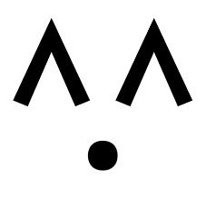 | [**ᴛʜɪɴɢ ᴀᴅᴊᴇᴄᴛɪᴠᴇ**](nasin-nimi.md#thing-adjective) | **suwi** | ᴀᴅᴊᴇᴄᴛɪᴠᴇ **sweet** →  ɴᴏᴜɴ [**sweets**](sonja.md#lesson-16) |

Members of the same ᴡᴏʀᴅ ꜰᴀᴍɪʟʏ belong to the same [**ᴡᴏʀᴅ ᴄʟᴀꜱꜱ**](nasin-nimi.md). Antonyms are separated by a dash (—).

| ꜱɪᴛᴇʟᴇɴ | ᴡᴏʀᴅ ᴄʟᴀꜱꜱ | ᴡᴏʀᴅ ꜰᴀᴍɪʟʏ | … |
|:-|:-|:-|:-|
|  | [**ꜱɪᴍᴘʟᴇ ᴀᴅᴊᴇᴄᴛɪᴠᴇ**](nasin-nimi.md#simple-adjective) | **pona** – ike, nasa, pakala, utala | … |
|  | [**ꜱɪᴍᴘʟᴇ ᴀᴅᴊᴇᴄᴛɪᴠᴇ**](nasin-nimi.md#simple-adjective) | pona — **ike**, nasa, pakala, utala | … |
|  | [**ꜱɪᴍᴘʟᴇ ᴀᴅᴊᴇᴄᴛɪᴠᴇ**](nasin-nimi.md#simple-adjective) | pona — ike, **nasa**, pakala, utala | … |
| 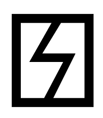 | [**ꜱɪᴍᴘʟᴇ ᴀᴅᴊᴇᴄᴛɪᴠᴇ**](nasin-nimi.md#simple-adjective) | pona — ike, nasa, **pakala**, utala | … |
|  | [**ꜱɪᴍᴘʟᴇ ᴀᴅᴊᴇᴄᴛɪᴠᴇ**](nasin-nimi.md#simple-adjective) | pona — ike, nasa, pakala, **utala** | … |

This document discourages from using ᴏᴘᴛɪᴏɴᴀʟ abbreviations, e.g. "sinpin" for "sinpin lawa" or "sinpin sijelo", when context might be insufficient, but it encourages to be fluent in ᴘᴏɴᴀ style, i.e. conflating two words into one, e.g. "(lon) noka" instead of "(lon) anpa". On the other hand, it encourages to be aware of possible ᴇxᴘᴇʀɪᴍᴇɴᴛᴀʟ reclassifications of words for the sake of symmetry. For example, "sama" and "ante" are antonyms (i.e. "same" and "different"), but only "sama" is a ᴘʀᴇᴘᴏsɪᴛɪᴏɴ, whereas "ante" is just an ᴀᴅᴊᴇᴄᴛɪᴠᴇ. "ante" as an ᴇxᴘᴇʀɪᴍᴇɴᴛᴀʟ ᴘʀᴇᴘᴏsɪᴛɪᴏɴ meaning "(different) than" restores the symmetry with "sama".

| (ᴘᴜ) sinpin lawa ⇒ (ꜱᴏɴᴊᴀ) sinpin | (ᴜɴ-ᴘᴏɴᴀ) lon anpa ⇒ (ᴘᴏɴᴀ) lon noka | (ᴜɴ-ᴘᴏɴᴀ) jan li suli mute ante mani. ⇒ (ᴘᴏɴᴀ) jan li suli mute. mani li suli lili. |
|:-|:-|:-|
| *face* | *under* | *People are more important than money.* |

---

| ꜱɪᴛᴇʟᴇɴ | ᴋᴏɴ |
|:-|:-|
| 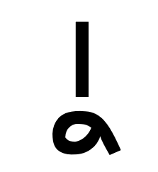 | [**ɪɴᴛᴇʀᴊᴇᴄᴛɪᴏɴ**](nasin-nimi.md#interjection) mu — **a**, ala  ᴘᴀʀᴛɪᴄʟᴇ **(emphasis, emotion or confirmation)**, [**(emotion word)**](sonja.md#lesson-10)  ᴀᴅᴊᴇᴄᴛɪᴠᴇ *indeed*, [**so**](sonja.md#lesson-10) →  ꜱᴇɴᴛᴇɴᴄᴇ [**ha**](sonja.md#lesson-10), [**wow**](sonja.md#lesson-10), [**yay**](sonja.md#lesson-13), *yes* |
|  | [**ʟɪꜰᴇ-ꜰᴏʀᴍ ᴀᴅᴊᴇᴄᴛɪᴠᴇ**](nasin-nimi.md#life-form-adjective) **akesi** — soweli  ᴀᴅᴊᴇᴄᴛɪᴠᴇ *cold-blooded*; *not using Toki Pona in a Toki Pona context* →  ɴᴏᴜɴ **non-cute animal**; **amphibian**, **reptile**; *monster* (⇐ *~~monsuta~~*): (*akesi e ijo lon insa lawa*) *to fear* |
|  | [**ɪɴᴛᴇʀᴊᴇᴄᴛɪᴏɴ**](nasin-nimi.md#interjection) mu — a, **ala**  ᴘᴀʀᴛɪᴄʟᴇ *(negation)*  ᴀᴅᴊᴇᴄᴛɪᴠᴇ **no**, **not**  ɴᴏᴜɴ [**nothingness**](sonja.md#lesson-6) →  ꜱᴇɴᴛᴇɴᴄᴇ *no* |
| | [**ɴᴜᴍʙᴇʀ ᴀᴅᴊᴇᴄᴛɪᴠᴇ**](nasin-nimi.md#number-adjective) **ala**, ale, esun, luka, mute, tu, wan  ᴀᴅᴊᴇᴄᴛɪᴠᴇ [**0**](sonja.md#lesson-12), **zero** →  ɴᴏᴜɴ [**zero**](sonja.md#famous-quotations) |
|  | [**ꜱɪᴍᴘʟᴇ ᴠᴇʀʙ**](nasin-nimi.md#simple-verb) **alasa**, pali, olin, unpa  ᴠᴇʀʙ **to hunt**, **forage** |
|  | [**ᴄᴏʀʀᴇʟᴀᴛɪᴠᴇ**](nasin-nimi.md#correlative) **ale**, ni, seme, wan  ᴀᴅᴊᴇᴄᴛɪᴠᴇ (*~~mute~~ ale*) **all**, **every**; (*~~wan~~ ale*) **all** →  ɴᴏᴜɴ **everything** |
| | [**ɴᴜᴍʙᴇʀ ᴀᴅᴊᴇᴄᴛɪᴠᴇ**](nasin-nimi.md#number-adjective) ala, **ale**, esun, luka, mute, tu, wan  ᴀᴅᴊᴇᴄᴛɪᴠᴇ [**∞**](sonja.md#lesson-12), **countless**; [**100**](sonja.md#lesson-12) →  ɴᴏᴜɴ [**infinity**](sonja.md#famous-quotations) |
| | [**ᴛʜɪɴɢ ᴀᴅᴊᴇᴄᴛɪᴠᴇ**](nasin-nimi.md#thing-adjective) lili — **ale**, mute, suli, wawa  ᴀᴅᴊᴇᴄᴛɪᴠᴇ **abundant**, **bountiful**, **plentiful**  ɴᴏᴜɴ **abundance** →  ɴᴏᴜɴ **life**, **universe** |
|  | [**ꜱᴘᴀᴛɪᴀʟ ᴀᴅᴊᴇᴄᴛɪᴠᴇ**](nasin-nimi.md#spatial-adjective) **anpa** — sewi, noka — lawa  ᴀᴅᴊᴇᴄᴛɪᴠᴇ **bowing down**, **downward**, **humble**, **lowly**, [**powerless**](sonja.md#short-obligatory-prayer); **dependent** →  ɴᴏᴜɴ (⇒ *noka*) |
|  | [**ᴘʀᴇᴘᴏꜱɪᴛɪᴏɴ**](nasin-nimi.md#preposition) **ante** — sama  ᴀᴅᴊᴇᴄᴛɪᴠᴇ **altered**, **changed**, **different**; (⇐ *esun*) **other**  ᴠᴇʀʙ (⇐ *esun*) *to replace*  ɴᴏᴜɴ (*~~kama~~ ante*) [**change**](sonja.md#toki-pona-proverbs) →  ᴘʀᴇᴘᴏꜱɪᴛɪᴏɴ (⇒ *poka*); (⇐ *esun*) *instead of* |
|  | [**ᴄᴏɴᴊᴜɴᴄᴛɪᴏɴ**](nasin-nimi.md#conjunction) **anu** — en  ᴘᴀʀᴛɪᴄʟᴇ *(alternative)*, **or** |
|  | [**ꜱᴘᴀᴛɪᴀʟ ᴀᴅᴊᴇᴄᴛɪᴠᴇ**](nasin-nimi.md#spatial-adjective) + [**ᴘʀᴇ-ᴠᴇʀʙ**](nasin-nimi.md#pre-verb) **awen**, kama — pini, open — selo  ᴀᴅᴊᴇᴄᴛɪᴠᴇ **enduring**, **kept**, **protected**, **safe**; (*~~pi tenpo~~ awen*) *present*; (*awen ~~lon~~*) **staying**, **waiting**  ᴠᴇʀʙ [**to help in peril**](sonja.md#short-obligatory-prayer), [**protect**](sonja.md#lesson-15) →  ɴᴏᴜɴ *duration*: (*lon ~~awen~~*) [**during**](sonja.md#lesson-14) +  ᴘʀᴇ-ᴠᴇʀʙ **to continue to**  ᴠᴇʀʙ *to continue* |
| 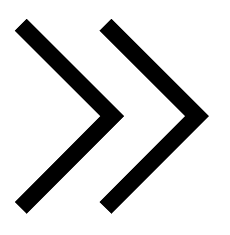 | [**ᴘʜʀᴀꜱᴇ ᴍᴀʀᴋᴇʀ**](nasin-nimi.md#phrase-marker) **e**, li, o, pi  ᴘᴀʀᴛɪᴄʟᴇ **(before the direct object)** |
|  | [**ᴄᴏɴᴊᴜɴᴄᴛɪᴏɴ**](nasin-nimi.md#conjunction) anu — **en**  ᴘᴀʀᴛɪᴄʟᴇ **(between multiple subjects)**, [**and**](sonja.md#lesson-16) |
|  | [**ᴘʀᴇᴘᴏꜱɪᴛɪᴏɴ**](nasin-nimi.md#preposition) **esun**, kepeken, pu  ᴀᴅᴊᴇᴄᴛɪᴠᴇ (⇒ *ante*)  ᴠᴇʀʙ (⇒ *ante*)  ɴᴏᴜɴ (*~~kama~~ esun*) **business transaction**; (*~~tomo pi kama~~ esun*) **shop**; (*~~ma tomo pi kama~~ esun*) **bazaar**, **fair**, **market** →  ᴘʀᴇᴘᴏꜱɪᴛɪᴏɴ (⇒ *ante*) |
| | [**ɴᴜᴍʙᴇʀ ᴀᴅᴊᴇᴄᴛɪᴠᴇ**](nasin-nimi.md#number-adjective) ala, ale, **esun**, luka, mute, tu, wan  ᴀᴅᴊᴇᴄᴛɪᴠᴇ *7*, *seven* →  ɴᴏᴜɴ *sevenfold amount* |
|  | [**ꜱɪᴍᴘʟᴇ ɴᴏᴜɴ**](nasin-nimi.md#noun) **ijo**, ilo, jan, tenpo  ɴᴏᴜɴ [**being**](sonja.md#lesson-2), **matter**, **object**, **phenomenon**, [**something**](sonja.md#lesson-2), **thing**; *area*; *case* |
|  | [**ꜱɪᴍᴘʟᴇ ᴀᴅᴊᴇᴄᴛɪᴠᴇ**](nasin-nimi.md#simple-adjective) pona — **ike**, nasa, pakala, utala  ᴀᴅᴊᴇᴄᴛɪᴠᴇ **bad**, [**harmful**](sonja.md#toki-pona-proverbs), [**hostile**](sonja.md#famous-quotations), [**needless**](sonja.md#famous-quotations), **negative**; (*~~sin~~ ike*) **irrelevant**, **non-essential**  ɴᴏᴜɴ [**bad things**](sonja.md#toki-pona-proverbs), [**evil**](sonja.md#toki-pona-proverbs), [**fault**](sonja.md#toki-pona-proverbs), [**negativity**](sonja.md#toki-pona-proverbs), [**non-essentials**](sonja.md#famous-quotations) |
|  | [**ꜱɪᴍᴘʟᴇ ɴᴏᴜɴ**](nasin-nimi.md#noun) ijo, **ilo**, jan, tenpo  ɴᴏᴜɴ **device**, **implement**, **machine**, **tool**; *body part* |
|  | [**ᴛʜɪɴɢ ᴀᴅᴊᴇᴄᴛɪᴠᴇ**](nasin-nimi.md#thing-adjective) + [**ꜱᴘᴀᴛɪᴀʟ ᴀᴅᴊᴇᴄᴛɪᴠᴇ**](nasin-nimi.md#spatial-adjective) **insa** — monsi, poka, sinpin  ᴀᴅᴊᴇᴄᴛɪᴠᴇ →  ɴᴏᴜɴ **centre**, *core*, *heart*, *middle*; (*insa ~~sijelo~~*) **internal organ**, **stomach**, [**womb**](sonja.md#lesson-15) +  ᴀᴅᴊᴇᴄᴛɪᴠᴇ →  ɴᴏᴜɴ **content**: (*lon insa*) [**within**](sonja.md#toki-pona-proverbs), **inside**: (*lon insa*) ***inside***, (*lon ~~insa~~*) [**in**](sonja.md#lesson-8); (*lon insa*) **between**, (*lon ~~insa~~*) [**(tangentially) between**](sonja.md#famous-quotations) |
|  | [**ᴛʜɪɴɢ ᴀᴅᴊᴇᴄᴛɪᴠᴇ**](nasin-nimi.md#thing-adjective) **jaki** — suwi  ᴀᴅᴊᴇᴄᴛɪᴠᴇ **disgusting**, **obscene**, **sickly**, **toxic**, **unclean**, **unsanitary**, [**yucky**](sonja.md#lesson-1) →  ɴᴏᴜɴ *dirt*, *poison*, *waste* |
|  | [**ꜱɪᴍᴘʟᴇ ɴᴏᴜɴ**](nasin-nimi.md#noun) ijo, ilo, **jan**, tenpo  ɴᴏᴜɴ [**folks**](sonja.md#toki-pona-proverbs), [**guy**](sonja.md#lesson-9), **human being**, **person**/[**people**](sonja.md#lesson-9), **somebody** |
| 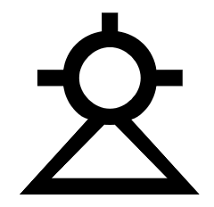 | [**ꜱɪᴍᴘʟᴇ ᴀᴅᴊᴇᴄᴛɪᴠᴇ**](nasin-nimi.md#simple-adjective) **jelo**, laso, loje  ᴀᴅᴊᴇᴄᴛɪᴠᴇ **yellow**, (*jelo ~~mu~~*) **yellowish** |
| 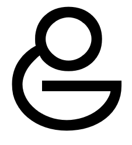 | [**ꜱɪᴍᴘʟᴇ ᴠᴇʀʙ**](nasin-nimi.md#simple-verb) **jo**, pana  ᴠᴇʀʙ **to have**; **carry**, **contain**, **hold**; (*kama jo e ijo tan …*) *fetch*, *pick* |
|  | [**ʟɪꜰᴇ-ꜰᴏʀᴍ ᴀᴅᴊᴇᴄᴛɪᴠᴇ**](nasin-nimi.md#life-form-adjective) **kala**, kasi, pipi, waso  ᴀᴅᴊᴇᴄᴛɪᴠᴇ *diving*, *swimming* →  ɴᴏᴜɴ **fish**, **marine animal**, **sea creature** |
| 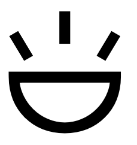 | [**ꜱɪᴍᴘʟᴇ ᴀᴅᴊᴇᴄᴛɪᴠᴇ**](nasin-nimi.md#simple-adjective) **kalama**  ᴀᴅᴊᴇᴄᴛɪᴠᴇ **producing a sound**  ᴠᴇʀʙ **to recite**, **utter aloud**  ɴᴏᴜɴ [**noise**](sonja.md#lesson-18) |
|  | [**ꜱᴘᴀᴛɪᴀʟ ᴀᴅᴊᴇᴄᴛɪᴠᴇ**](nasin-nimi.md#spatial-adjective) + [**ᴘʀᴇ-ᴠᴇʀʙ**](nasin-nimi.md#pre-verb) awen, **kama** — pini, open — selo  ᴀᴅᴊᴇᴄᴛɪᴠᴇ (*~~pi tenpo~~ kama*) **future** →  ɴᴏᴜɴ (⇒ *open*) +  ᴘʀᴇ-ᴠᴇʀʙ **to become**: (*kama ~~lon~~*) **arriving**, **being summoned**, **coming**, [**emerging**](sonja.md#preface); *begin to*, *start to*; (*kama ~~pini~~*) **manage to**, **succeed in**  ᴠᴇʀʙ (⇒ *open*) |
|  | [**ʟɪꜰᴇ-ꜰᴏʀᴍ ᴀᴅᴊᴇᴄᴛɪᴠᴇ**](nasin-nimi.md#life-form-adjective) kala, **kasi**, pipi, waso  ᴀᴅᴊᴇᴄᴛɪᴠᴇ *vegetating*; *growing* →  ɴᴏᴜɴ **plant**, **vegetation**; **herb**, **leaf** |
|  | [**ꜱɪᴍᴘʟᴇ ᴀᴅᴊᴇᴄᴛɪᴠᴇ**](nasin-nimi.md#simple-adjective) + [**ᴘʀᴇ-ᴠᴇʀʙ**](nasin-nimi.md#pre-verb) **ken**, wile  ᴀᴅᴊᴇᴄᴛɪᴠᴇ **possible** +  ᴘʀᴇ-ᴠᴇʀʙ **to be able to**, **be allowed to**, **can**, **may**  ᴠᴇʀʙ *to allow*, *allow for* |
|  | [**ᴘʀᴇᴘᴏꜱɪᴛɪᴏɴ**](nasin-nimi.md#preposition) esun, **kepeken**, pu  ᴀᴅᴊᴇᴄᴛɪᴠᴇ *usufructuary* →  ᴘʀᴇᴘᴏꜱɪᴛɪᴏɴ **by means of**, **using**, **with** |
|  | [**ᴛʜɪɴɢ ᴀᴅᴊᴇᴄᴛɪᴠᴇ**](nasin-nimi.md#thing-adjective) **kili**, pan  ᴀᴅᴊᴇᴄᴛɪᴠᴇ *hanging* →  ɴᴏᴜɴ **fruit**; [**banana**](sonja.md#lesson-2), [**blueberry**](sonja.md#lesson-2), [**kiwi**](sonja.md#lesson-4), [**kumquat**](sonja.md#what-is-toki-pona), [**lingonberry**](sonja.md#what-is-toki-pona), [**orange**](sonja.md#lesson-5); **mushroom**, **vegetable**; [**turnip**](sonja.md#what-is-toki-pona) |
| 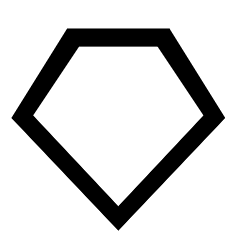 | [**ᴛʜɪɴɢ ᴀᴅᴊᴇᴄᴛɪᴠᴇ**](nasin-nimi.md#thing-adjective) **kiwen**, ko, kon, sewi, telo  ᴀᴅᴊᴇᴄᴛɪᴠᴇ *hard* →  ɴᴏᴜɴ **hard object**, **metal**, **rock**, **stone** |
|  | [**ᴛʜɪɴɢ ᴀᴅᴊᴇᴄᴛɪᴠᴇ**](nasin-nimi.md#thing-adjective) kiwen, **ko**, kon, sewi, telo  ᴀᴅᴊᴇᴄᴛɪᴠᴇ *semi-solid* →  ɴᴏᴜɴ **clay**, **clinging form**, **dough**, **semi-solid**, **paste**, **powder** |
| 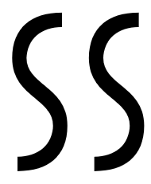 | [**ᴛʜɪɴɢ ᴀᴅᴊᴇᴄᴛɪᴠᴇ**](nasin-nimi.md#thing-adjective) kiwen, ko, **kon**, sewi, telo  ᴀᴅᴊᴇᴄᴛɪᴠᴇ *floating*, *hovering* →  ɴᴏᴜɴ **air**, **breath**; **essence**, **spirit**; (*kon ~~insa~~*) *meaning*, [**soul**](sonja.md#preface); **hidden reality**, **unseen agent** |
|  | [**ꜱɪᴍᴘʟᴇ ᴀᴅᴊᴇᴄᴛɪᴠᴇ**](nasin-nimi.md#simple-adjective) **kule** — walo  ᴀᴅᴊᴇᴄᴛɪᴠᴇ **colourful**, **painted**; **pigmented**; *brown*, (*kule ~~mu~~*) *brownish* |
|  | [**ᴛʜɪɴɢ ᴀᴅᴊᴇᴄᴛɪᴠᴇ**](nasin-nimi.md#thing-adjective) **kulupu** — sijelo  ᴀᴅᴊᴇᴄᴛɪᴠᴇ *reciprocal* →  ɴᴏᴜɴ *relationship*; (*kulupu ~~jan~~*) **community**, **company**, **group**, **nation**, **society**, **tribe**; (⇐ *mute*) *multitude*, *set*; (⇐ *lawa*) *arrangement*, *organization* |
|  | [**ᴛᴏᴏʟ ᴠᴇʀʙ**](nasin-nimi.md#tool-verb) **kute**, lawa, len, luka, noka, palisa, poki, selo, tomo, uta  ᴠᴇʀʙ **to hear**, **listen**; (*kute ~~insa~~*) [**listen to**](sonja.md#lesson-5), **pay attention to**, **obey** →  ɴᴏᴜɴ **ear** |
| 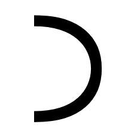 | [**ꜱᴇɴᴛᴇɴᴄᴇ ᴍᴀʀᴋᴇʀ**](nasin-nimi.md#sentence-marker) **la**, taso  ᴘᴀʀᴛɪᴄʟᴇ **(between the context phrase and the main sentence)**, [**(separates context from main sentence)**](sonja.md#lesson-14) |
|  | [**ꜱɪᴍᴘʟᴇ ᴀᴅᴊᴇᴄᴛɪᴠᴇ**](nasin-nimi.md#simple-adjective) **lape**, moli, musi  ᴀᴅᴊᴇᴄᴛɪᴠᴇ **resting**, **sleeping**  ɴᴏᴜɴ [**sleep**](sonja.md#toki-pona-proverbs) |
|  | [**ꜱɪᴍᴘʟᴇ ᴀᴅᴊᴇᴄᴛɪᴠᴇ**](nasin-nimi.md#simple-adjective) jelo, **laso**, loje  ᴀᴅᴊᴇᴄᴛɪᴠᴇ **blue**, (*laso ~~mu~~*) *bluish*, **green**, (*laso ~~mu~~*) *greenish*; *immature* |
| 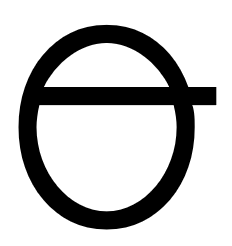 | [**ꜱᴘᴀᴛɪᴀʟ ᴀᴅᴊᴇᴄᴛɪᴠᴇ**](nasin-nimi.md#spatial-adjective) anpa — sewi, noka — **lawa**  ᴀᴅᴊᴇᴄᴛɪᴠᴇ (⇒ *sewi*); *main* →  ɴᴏᴜɴ (⇒ *sewi*) |
| | [**ᴛᴏᴏʟ ᴠᴇʀʙ**](nasin-nimi.md#tool-verb) kute, **lawa**, len, luka, noka, palisa, poki, selo, tomo, uta  ᴠᴇʀʙ **to control**, **direct**, **guide**, **lead**, **own**, **plan**, **regulate**, **rule**; *arange*, *organize*  ɴᴏᴜɴ [**guidance**](sonja.md#toki-pona-proverbs); (⇒ *mute*) →  ɴᴏᴜɴ **head**, **mind** |
|  | [**ᴛᴏᴏʟ ᴠᴇʀʙ**](nasin-nimi.md#tool-verb) kute, lawa, **len**, luka, noka, palisa, poki, selo, tomo, uta  ᴠᴇʀʙ *to hide* →  ɴᴏᴜɴ **cloth**, **clothing**, **fabric**, **textile**, [**vest**](sonja.md#lesson-17); **cover**, **layer of privacy** |
|  | [**ᴛʜɪɴɢ ᴀᴅᴊᴇᴄᴛɪᴠᴇ**](nasin-nimi.md#thing-adjective) **lete** — seli  ᴀᴅᴊᴇᴄᴛɪᴠᴇ **cold**, **cool**; **uncooked**, **raw** →  ɴᴏᴜɴ *frost*, *ice* |
|  | [**ᴘʜʀᴀꜱᴇ ᴍᴀʀᴋᴇʀ**](nasin-nimi.md#phrase-marker) e, **li**, o, pi  ᴘᴀʀᴛɪᴄʟᴇ **(between any subject except mi alone or sina alone and its predicate; also to introduce a new predicate for the same subject)** |
|  | [**ᴛʜɪɴɢ ᴀᴅᴊᴇᴄᴛɪᴠᴇ**](nasin-nimi.md#thing-adjective) **lili** — ale, mute, suli, wawa  ᴀᴅᴊᴇᴄᴛɪᴠᴇ **little**, [**momentary**](sonja.md#toki-pona-proverbs), [**micro-**](sonja.md#preface), [**narrow**](sonja.md#lesson-13), **small**, **short**, [**temporary**](sonja.md#toki-pona-proverbs); [**120**](sonja.md#preface), **few**; **a bit**; (*~~pi sike suno~~ lili*) **young**; (⇒ *pona*) →  ɴᴏᴜɴ (⇒ *wan*) |
|  | [**ᴛʜɪɴɢ ᴀᴅᴊᴇᴄᴛɪᴠᴇ**](nasin-nimi.md#thing-adjective) **linja** — palisa  ᴀᴅᴊᴇᴄᴛɪᴠᴇ *long and flexible* →  ɴᴏᴜɴ **long and flexible thing**, [**long flexible thing**](sonja.md#lesson-17); **cord**, (*linja ~~lawa~~*) **hair**, **rope**, [**string**](sonja.md#lesson-17), **thread**, **yarn** |
|  | [**ᴛʜɪɴɢ ᴀᴅᴊᴇᴄᴛɪᴠᴇ**](nasin-nimi.md#thing-adjective) **lipu**, nena, sike  ᴀᴅᴊᴇᴄᴛɪᴠᴇ *flat*, *thin* →  ɴᴏᴜɴ **flat object**; **book**, **card**, [**clay tablet**](sonja.md#what-is-toki-pona), **document**, **paper**, [**piece of paper**](sonja.md#lesson-2), [**postcard**](sonja.md#what-is-toki-pona), [**printed book**](sonja.md#what-is-toki-pona), **record**, **website** |
| 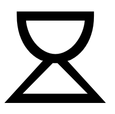 | [**ꜱɪᴍᴘʟᴇ ᴀᴅᴊᴇᴄᴛɪᴠᴇ**](nasin-nimi.md#simple-adjective) jelo, laso, **loje**  ᴀᴅᴊᴇᴄᴛɪᴠᴇ **red**, (*loje ~~mu~~*) **reddish** |
|  | [**ᴘʀᴇᴘᴏꜱɪᴛɪᴏɴ**](nasin-nimi.md#preposition) **lon**, tan, tawa  ᴀᴅᴊᴇᴄᴛɪᴠᴇ **existing**, **real**; **true** →  ᴘʀᴇᴘᴏꜱɪᴛɪᴏɴ [**at**](sonja.md#lesson-8), **located at**, **present at**; *in case of*: (*lon ni:*) [**if**](sonja.md#lesson-14); [**in the context of**](sonja.md#lesson-14); (⇐ *pu*) *according to*, *along* |
|  | [**ᴛᴏᴏʟ ᴠᴇʀʙ**](nasin-nimi.md#tool-verb) kute, lawa, len, **luka**, noka, palisa, poki, selo, tomo, uta  ᴠᴇʀʙ *to manipulate*, *touch* →  ɴᴏᴜɴ **arm**, [**fingers**](sonja.md#writings-of-baháulláh), **hand**, **tactile organ** |
| | [**ɴᴜᴍʙᴇʀ ᴀᴅᴊᴇᴄᴛɪᴠᴇ**](nasin-nimi.md#number-adjective) ala, ale, esun, **luka**, mute, tu, wan  ᴀᴅᴊᴇᴄᴛɪᴠᴇ [**5**](sonja.md#lesson-12), **five** →  ɴᴏᴜɴ *fivefold amount* |
|  | [**ᴛᴏᴏʟ ᴠᴇʀʙ**](nasin-nimi.md#tool-verb) + [**ᴘʀᴇ-ᴠᴇʀʙ**](nasin-nimi.md#pre-verb) **lukin**, pilin  ᴠᴇʀʙ **to look at**, **see**; (*lukin ~~wawa~~*) **examine**, **observe**, **read**, [**search**](sonja.md#preface), **watch** →  ɴᴏᴜɴ **eye** (⇐ (*oko*)) +  ᴘʀᴇ-ᴠᴇʀʙ [**to seek to**](sonja.md#lesson-13), **try to**  ᴠᴇʀʙ **to look for**, **seek**; *care for* |
|  | [**ᴛʜɪɴɢ ᴀᴅᴊᴇᴄᴛɪᴠᴇ**](nasin-nimi.md#thing-adjective) **lupa**, nasin  ᴀᴅᴊᴇᴄᴛɪᴠᴇ *hollow* →  ɴᴏᴜɴ (*lupa ~~tomo~~*) **door**, **hole**, **orifice**, (*lupa ~~suno~~*) **window**; [**womb**](sonja.md#toki-pona-proverbs) |
| 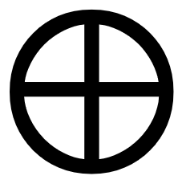 | [**ᴛʜɪɴɢ ᴀᴅᴊᴇᴄᴛɪᴠᴇ**](nasin-nimi.md#thing-adjective) **ma**, mun  ᴀᴅᴊᴇᴄᴛɪᴠᴇ *vast* →  ɴᴏᴜɴ **earth**, **land**; **outdoors**, **world**; **country**, **territory**; **soil**; (*~~sike~~ ma*) [**planet**](sonja.md#toki-pona-proverbs) |
|  | [**ᴘᴇʀꜱᴏɴ ᴀᴅᴊᴇᴄᴛɪᴠᴇ**](nasin-nimi.md#person-adjective) **mama**  ᴀᴅᴊᴇᴄᴛɪᴠᴇ *original*; [**birth giving**](sonja.md#the-quran) →  ɴᴏᴜɴ **ancestor**, **parent**; [**father**](sonja.md#the-gospel), ***mother***; **creator**, **originator**; **caretaker**, **sustainer** |
| 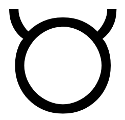 | [**ᴛʜɪɴɢ ᴀᴅᴊᴇᴄᴛɪᴠᴇ**](nasin-nimi.md#thing-adjective) **mani**  ᴀᴅᴊᴇᴄᴛɪᴠᴇ *refined*; *valueable* →  ɴᴏᴜɴ **large domesticated animal**; **cash**, **money**, **savings**, **wealth** |
|  | [**ᴘᴇʀꜱᴏɴ ᴀᴅᴊᴇᴄᴛɪᴠᴇ**](nasin-nimi.md#person-adjective) **meli** — mije  ᴀᴅᴊᴇᴄᴛɪᴠᴇ [**female**](sonja.md#lesson-3) →  ɴᴏᴜɴ **female**, **feminine person**, **woman**; **wife** |
|  | [**ᴘʀᴏɴᴏᴜɴ**](nasin-nimi.md#noun) ona — **mi**, sina  ɴᴏᴜɴ **I**/**me**/[**myself**](sonja.md#toki-pona-proverbs), **we**/**us**/*ourselves*  ᴀᴅᴊᴇᴄᴛɪᴠᴇ *my*, *our* |
|  | [**ᴘᴇʀꜱᴏɴ ᴀᴅᴊᴇᴄᴛɪᴠᴇ**](nasin-nimi.md#person-adjective) meli — **mije**  ᴀᴅᴊᴇᴄᴛɪᴠᴇ →  ɴᴏᴜɴ **male**, **man**, **masculine person**; **husband** |
|  | [**ᴛʜɪɴɢ ᴠᴇʀʙ**](nasin-nimi.md#thing-verb) **moku**  ᴠᴇʀʙ **to consume**, **drink**, **eat**, **ingest**, **swallow** →  ɴᴏᴜɴ *mouthful*; *food* |
|  | [**ꜱɪᴍᴘʟᴇ ᴀᴅᴊᴇᴄᴛɪᴠᴇ**](nasin-nimi.md#simple-adjective) lape, **moli**, musi  ᴀᴅᴊᴇᴄᴛɪᴠᴇ **dead**, (*~~kama~~ moli*) **dying** |
|  | [**ᴛʜɪɴɢ ᴀᴅᴊᴇᴄᴛɪᴠᴇ**](nasin-nimi.md#thing-adjective) + [**ꜱᴘᴀᴛɪᴀʟ ᴀᴅᴊᴇᴄᴛɪᴠᴇ**](nasin-nimi.md#spatial-adjective) insa — **monsi**, poka, sinpin  ᴀᴅᴊᴇᴄᴛɪᴠᴇ *dorsal*; *backing*, *endorsing* →  ɴᴏᴜɴ (*monsi ~~sijelo~~*) **back**; *backbone* +  ᴀᴅᴊᴇᴄᴛɪᴠᴇ →  ɴᴏᴜɴ [**area behind**](sonja.md#lesson-15), **back**, **rear**: (*lon monsi*) **behind** |
|  | [**ɪɴᴛᴇʀᴊᴇᴄᴛɪᴏɴ**](nasin-nimi.md#interjection) **mu** — a, ala | ᴘᴀʀᴛɪᴄʟᴇ **(animal noise or communication)**; *(indifference)*  ᴀᴅᴊᴇᴄᴛɪᴠᴇ (*~~mu~~*) *-ish*, *sort-of* →  ꜱᴇɴᴛᴇɴᴄᴇ [**cock-a-doodle-doo**](sonja.md#lesson-11), [**moo**](sonja.md#lesson-1); *blah* |

| ꜱɪᴛᴇʟᴇɴ | ... | ... | ... |
|:-|:-|:-|:-|
|                                                                  | [**ᴛʜɪɴɢ ᴀᴅᴊᴇᴄᴛɪᴠᴇ**](nasin-nimi.md#thing-adjective) | ma, **mun**                                                               | ᴀᴅᴊᴇᴄᴛɪᴠᴇ *sky-walking at night* →  ɴᴏᴜɴ **moon**, **night sky object**, **star** |
|                                                              | [**ꜱɪᴍᴘʟᴇ ᴀᴅᴊᴇᴄᴛɪᴠᴇ**](nasin-nimi.md#simple-adjective) | lape, moli, **musi**                                                     | ᴀᴅᴊᴇᴄᴛɪᴠᴇ **artistic**, **entertaining**, **frivolous**, **playful**, **recreational** |
|                                                              | [**ᴛʜɪɴɢ ᴀᴅᴊᴇᴄᴛɪᴠᴇ**](nasin-nimi.md#thing-adjective) | lili — ale, **mute**, suli, wawa                                         | ᴀᴅᴊᴇᴄᴛɪᴠᴇ [**3+**](sonja.md#lesson-12), [**20**](sonja.md#lesson-12), **a lot**, **many**, **several**; **much**, **very**; (*mute ~~sin~~*) **more**  ᴠᴇʀʙ [**to multiply**](sonja.md#toki-pona-proverbs)  ɴᴏᴜɴ **quantity** →  ɴᴏᴜɴ (⇒ *kulupu*) |
| | [**ɴᴜᴍʙᴇʀ ᴀᴅᴊᴇᴄᴛɪᴠᴇ**](nasin-nimi.md#number-adjective) | ala, ale, esun, luka, **mute**, tu, wan                                                     | ᴀᴅᴊᴇᴄᴛɪᴠᴇ *3*, *three* →  ɴᴏᴜɴ *threefold amount* |
| 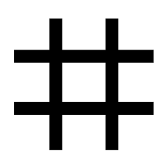                                                             | [**ᴛʜɪɴɢ ᴀᴅᴊᴇᴄᴛɪᴠᴇ**](nasin-nimi.md#thing-adjective) | **nanpa**                                                                 | ᴀᴅᴊᴇᴄᴛɪᴠᴇ (*~~pi~~ nanpa ~~ni~~*) *current* →  ɴᴏᴜɴ (*~~nimi~~ nanpa*) **number**: (*pi nanpa awen*) *current*, (*pi nanpa kama*) *next*, (*pi nanpa pini*) *previous*; *last* |
| | [**ꜱɪᴍᴘʟᴇ ᴘᴀʀᴛɪᴄʟᴇ**](nasin-nimi.md#simple-particle) | **nanpa**                                                                   | ᴘᴀʀᴛɪᴄʟᴇ **(ordinal number-adjective)**, **-th** |
|                                                              | [**ꜱɪᴍᴘʟᴇ ᴀᴅᴊᴇᴄᴛɪᴠᴇ**](nasin-nimi.md#simple-adjective) | pona — ike, **nasa**, pakala, utala                                       | ᴀᴅᴊᴇᴄᴛɪᴠᴇ **strange**, [**unconventional**](sonja.md#toki-pona-proverbs), **unusual**; (*~~sona~~ nasa*) **crazy**, **foolish**; (*~~pilin~~ nasa*) **drunk**, **intoxicated** |
| 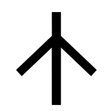                                                             | [**ᴛʜɪɴɢ ᴀᴅᴊᴇᴄᴛɪᴠᴇ**](nasin-nimi.md#thing-adjective) | lupa, **nasin**                                                           | ᴀᴅᴊᴇᴄᴛɪᴠᴇ *cracked* →  ɴᴏᴜɴ *line*, *solution*; **custom**, **doctrine**, **method**, **path**, **road**, [**street**](sonja.md#lesson-9), [**system**](sonja.md#preface), **way**, [**way of doing things**](sonja.md#toki-pona-proverbs) |
|                                                                | [**ᴛʜɪɴɢ ᴀᴅᴊᴇᴄᴛɪᴠᴇ**](nasin-nimi.md#thing-adjective) | lipu, **nena**, sike                                                       | ᴀᴅᴊᴇᴄᴛɪᴠᴇ *outstanding*, *thick* →  ɴᴏᴜɴ **bump**, **hill**, **mountain**, **protuberance**; **button**, *key*; (*nena ~~pi sinpin lawa~~*) **nose** |
|                                                                    | [**ᴄᴏʀʀᴇʟᴀᴛɪᴠᴇ**](nasin-nimi.md#correlative) | ale, **ni**, seme, wan                                                       | ᴀᴅᴊᴇᴄᴛɪᴠᴇ **this**/**that** →  ɴᴏᴜɴ *this/that one*, (*ni:*) [**the following**](sonja.md#lesson-17); (*~~awen~~ ni*) *now* |
|                                                                | [**ᴛʜɪɴɢ ᴠᴇʀʙ**](nasin-nimi.md#thing-verb) | **nimi**, sitelen, toki                                                             | ᴠᴇʀʙ *to define*, *name* →  ɴᴏᴜɴ *definition*, **name**; **word**; (*mute nimi* ⇒ *kulupu nimi*) *clause*, *phrase*, *sentence* |
|                                                                | [**ᴛᴏᴏʟ ᴠᴇʀʙ**](nasin-nimi.md#tool-verb) | kute, lawa, len, luka, **noka**, palisa, poki, selo, tomo, uta                         | ᴠᴇʀʙ *to step on*, *kick* →  ɴᴏᴜɴ **foot**, **leg**, **organ of locomotion** |
| | [**ꜱᴘᴀᴛɪᴀʟ ᴀᴅᴊᴇᴄᴛɪᴠᴇ**](nasin-nimi.md#spatial-adjective) | anpa — sewi, **noka** — lawa                                           | ᴀᴅᴊᴇᴄᴛɪᴠᴇ *lower* →  ɴᴏᴜɴ **lowest part**; *base*, **bottom**, [**foundation**](sonja.md#lesson-15): (*lon noka*) [**at the bottom of**](sonja.md#lesson-15); (⇐ *anpa*) [**area below or under**](sonja.md#lesson-15): (*lon noka*) *under*; ***dependence*** |
|                                                                    | [**ᴘʜʀᴀꜱᴇ ᴍᴀʀᴋᴇʀ**](nasin-nimi.md#phrase-marker) | e, li, **o**, pi                                                           | ᴘᴀʀᴛɪᴄʟᴇ *(vocative, imperative or volitive)* ⇒ **(vocative or imperative)**, [**(call or command)**](sonja.md#lesson-10), [**(call, command/request or wish/desire)**](sonja.md#lesson-10), **hey**, **o** |
|                                                              | [**ꜱɪᴍᴘʟᴇ ᴠᴇʀʙ**](nasin-nimi.md#simple-verb) | alasa, pali, **olin**, unpa                                                         | ᴠᴇʀʙ [**to be a fan of**](sonja.md#preface), **have compassion for**, **love**, **respect**, **show affection to**  ɴᴏᴜɴ *loving*, ᴀᴅᴊᴇᴄᴛɪᴠᴇ [**beloved**](sonja.md#lesson-18) |
|                                                                  | [**ᴘʀᴏɴᴏᴜɴ**](nasin-nimi.md#noun) | **ona** — mi, sina                                                                           | ɴᴏᴜɴ **he**/*him*, **it**, **she**/*her*, **they**/*them*  ᴀᴅᴊᴇᴄᴛɪᴠᴇ *her*, *his*, *its*, *their* |
|                                                                | [**ꜱᴘᴀᴛɪᴀʟ ᴀᴅᴊᴇᴄᴛɪᴠᴇ**](nasin-nimi.md#spatial-adjective) + [**ᴘʀᴇ-ᴠᴇʀʙ**](nasin-nimi.md#pre-verb) | awen, kama — pini, **open** — selo | ᴀᴅᴊᴇᴄᴛɪᴠᴇ ***open***  ᴠᴇʀʙ **to open**, [**unseal**](sonja.md#writings-of-baháulláh) →  ɴᴏᴜɴ *entrance*; *premise*, *setup*: (*lon ~~open~~*) *on the premise*, (*lon ~~open~~ ni:*) *if*; (⇐ *kama*) *upcoming*: (*lon ~~open~~*) *before*, *in the beginning* +  ᴘʀᴇ-ᴠᴇʀʙ *to be ready to*  ᴠᴇʀʙ *to set up*, **turn on**; (⇐ *kama*) **begin**, **start**; *achieve*; *let* |
|                                                          | [**ꜱɪᴍᴘʟᴇ ᴀᴅᴊᴇᴄᴛɪᴠᴇ**](nasin-nimi.md#simple-adjective) | pona — ike, nasa, **pakala**, utala                                       | ᴀᴅᴊᴇᴄᴛɪᴠᴇ **botched**, **broken**, **damaged**, **harmed**, **messed up** |
| 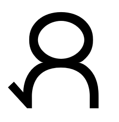                                                               | [**ꜱɪᴍᴘʟᴇ ᴠᴇʀʙ**](nasin-nimi.md#simple-verb) | alasa, **pali**, olin, unpa                                                         | ᴠᴇʀʙ **to do**, **take action on**, **work on**; (*pali ~~ale~~*) **build**, **make**, **prepare**  ɴᴏᴜɴ [**action**](sonja.md#toki-pona-proverbs) |
|                                                            | [**ᴛʜɪɴɢ ᴀᴅᴊᴇᴄᴛɪᴠᴇ**](nasin-nimi.md#thing-adjective) | linja — **palisa**                                                         | ᴀᴅᴊᴇᴄᴛɪᴠᴇ *long and hard* →  ɴᴏᴜɴ **long hard thing**; [**antler**](sonja.md#lesson-17), **branch**, **rod**, **stick** |
| | [**ᴛᴏᴏʟ ᴠᴇʀʙ**](nasin-nimi.md#tool-verb) | kute, lawa, len, luka, noka, **palisa**, poki, selo, tomo, uta                         | ᴠᴇʀʙ *to point at* →  ɴᴏᴜɴ *finger* |
|                                                                  | [**ᴛʜɪɴɢ ᴀᴅᴊᴇᴄᴛɪᴠᴇ**](nasin-nimi.md#thing-adjective) | kili, **pan**                                                             | ᴀᴅᴊᴇᴄᴛɪᴠᴇ *falling* →  ɴᴏᴜɴ *seed*, **cereal**, **grain**; **barley**, **corn**, **oat**, **rice**, **wheat**; **bread**, **pasta** |
|                                                                | [**ꜱɪᴍᴘʟᴇ ᴠᴇʀʙ**](nasin-nimi.md#simple-verb) | jo, **pana**                                                                       | ᴠᴇʀʙ **to emit**, **give**, [**grant**](sonja.md#toki-pona-proverbs), **provide**, (*pana e ijo lon …*) **put**, **release**, (*pana e ijo tawa …*) **send**, [**send out**](sonja.md#toki-pona-proverbs), [**serve**](sonja.md#lesson-14) |
|                                                                | [**ᴘʜʀᴀꜱᴇ ᴍᴀʀᴋᴇʀ**](nasin-nimi.md#phrase-marker) | e, li, o, **pi**                                                           | ᴘᴀʀᴛɪᴄʟᴇ  [**(to divide a second ɴᴏᴜɴ-ᴘʜʀᴀꜱᴇ that describes a first ɴᴏᴜɴ-ᴘʜʀᴀꜱᴇ)**](sonja.md#lesson-11), **of** |
|                                                            | [**ᴛᴏᴏʟ ᴠᴇʀʙ**](nasin-nimi.md#tool-verb) + [**ᴘʀᴇ-ᴠᴇʀʙ**](nasin-nimi.md#pre-verb) | lukin, **pilin**                                   | ᴠᴇʀʙ ***to feel (a direct experience)***, *sense*  ᴀᴅᴊᴇᴄᴛɪᴠᴇ **feeling (a direct experience)** →  ɴᴏᴜɴ **heart (physical or emotional)** +  ᴘʀᴇ-ᴠᴇʀʙ *to feel like*; (*pilin pona*) *to be happy*  ᴠᴇʀʙ ***to feel (an emotion)***, *have the impression that*, [**think**](sonja.md#writings-of-baháulláh)  ᴀᴅᴊᴇᴄᴛɪᴠᴇ **feeling (an emotion)** |
|                                                            | [**ꜱɪᴍᴘʟᴇ ᴀᴅᴊᴇᴄᴛɪᴠᴇ**](nasin-nimi.md#simple-adjective) | **pimeja** — walo                                                         | ᴀᴅᴊᴇᴄᴛɪᴠᴇ **black**, (*pimeja ~~mu~~*) *blackish* |
| | [**ᴛʜɪɴɢ ᴀᴅᴊᴇᴄᴛɪᴠᴇ**](nasin-nimi.md#thing-adjective) | **pimeja** — suno                                                         | ᴀᴅᴊᴇᴄᴛɪᴠᴇ **dark**, **unlit** →  ɴᴏᴜɴ *shadow* |
|                                                              | [**ꜱᴘᴀᴛɪᴀʟ ᴀᴅᴊᴇᴄᴛɪᴠᴇ**](nasin-nimi.md#spatial-adjective) + [**ᴘʀᴇ-ᴠᴇʀʙ**](nasin-nimi.md#pre-verb) | awen, kama — **pini**, open — selo   | ᴀᴅᴊᴇᴄᴛɪᴠᴇ **ago**, **completed**, **ended**, **finished**; (*~~pi tenpo~~ pini*) **past**; (*pini ~~lon~~*) *to disappear*; (⇐ *selo*) ***closed***, [***sealed***](sonja.md#writings-of-baháulláh)  ᴠᴇʀʙ ***to complete***, ***end***, ***finish***; (⇐ *selo*) ***to close***, [***seal***](sonja.md#writings-of-baháulláh) →  ɴᴏᴜɴ *end*: (*lon ~~pini~~*) *after*, *in the end*; (⇐ *selo*) *conclusion*, *decision*, *outcome*, *result*: (*lon ~~pini~~ ni:*) *given that* +  ᴘʀᴇ-ᴠᴇʀʙ *to stop -ing*  ᴠᴇʀʙ *to interrupt*, *stop* |
|                                                              | [**ʟɪꜰᴇ-ꜰᴏʀᴍ ᴀᴅᴊᴇᴄᴛɪᴠᴇ**](nasin-nimi.md#life-form-adjective) | kala, kasi, **pipi**, waso                                         | ᴀᴅᴊᴇᴄᴛɪᴠᴇ *crawling*, *creeping* →  ɴᴏᴜɴ **ant**, **bug**, **insect**, **spider** |
|                                                              | [**ᴛʜɪɴɢ ᴀᴅᴊᴇᴄᴛɪᴠᴇ**](nasin-nimi.md#thing-adjective) + [**ꜱᴘᴀᴛɪᴀʟ ᴀᴅᴊᴇᴄᴛɪᴠᴇ**](nasin-nimi.md#spatial-adjective) | insa — monsi, **poka**, sinpin | ᴀᴅᴊᴇᴄᴛɪᴠᴇ →  ɴᴏᴜɴ **side**; (*poka ~~sijelo~~*) **hip** +  ᴀᴅᴊᴇᴄᴛɪᴠᴇ ***close***, **nearby**, (⇐ *sike*) *surrounding* →  ɴᴏᴜɴ [**area beside**](sonja.md#lesson-15): (*lon poka*) **next to**; (*lon ~~nasin~~ poka*) *parallel to*; **vicinity**: (*lon poka*) ***close to***, (*lon ~~poka~~*) [**with**](sonja.md#lesson-8); *facet*: (*lon poka* ⇐ *ante*) *than*, *unlike*; (⇐ *sike*) *area surrounding*: (*lon poka*) *around*; (*lon ~~nasin~~ poka*) *circling* |
| 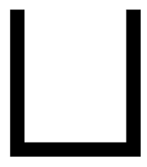                                                             | [**ᴛᴏᴏʟ ᴠᴇʀʙ**](nasin-nimi.md#tool-verb) | kute, lawa, len, luka, noka, palisa, **poki**, selo, tomo, uta                         | ᴠᴇʀʙ *to be full of*, *collect*, *contain* →  ɴᴏᴜɴ *bladder*; **bag**, **bowl**, **box**, **container**, **cup**, **cupboard**, **drawer**, **vessel** |
|                                                                | [**ꜱɪᴍᴘʟᴇ ᴀᴅᴊᴇᴄᴛɪᴠᴇ**](nasin-nimi.md#simple-adjective) | **pona** – ike, nasa, pakala, utala                                       | ᴀᴅᴊᴇᴄᴛɪᴠᴇ [**beneficial**](sonja.md#toki-pona-proverbs), [**beautiful**](sonja.md#toki-pona-proverbs), **good**, [**great**](sonja.md#toki-pona-proverbs), [**OK**](sonja.md#toki-pona-proverbs), **positive**, [**right**](sonja.md#lesson-14), **useful**; **friendly**, **peaceful**; (⇐ *lili*) *basic*, *elementary*, *primitive*, **simple**; ɴᴏᴜɴ [**good**](sonja.md#lesson-10), [**peace**](sonja.md#lesson-10), [**simplicity**](sonja.md#famous-quotations), [**sophistication**](sonja.md#famous-quotations)  ᴠᴇʀʙ [**to improve**](sonja.md#lesson-6), [**tidy**](sonja.md#lesson-18) |
|                                                                  | [**ᴘʀᴇᴘᴏꜱɪᴛɪᴏɴ**](nasin-nimi.md#preposition) | esun, kepeken, **pu**                                                             | ᴀᴅᴊᴇᴄᴛɪᴠᴇ **interacting with the official Toki Pona book** →  ᴘʀᴇᴘᴏꜱɪᴛɪᴏɴ (⇒ *lon*) |
| | [**ꜱɪᴍᴘʟᴇ ᴘᴀʀᴛɪᴄʟᴇ**](nasin-nimi.md#simple-particle) | **Pu**                                                                     | ᴘᴀʀᴛɪᴄʟᴇ *name of the official Toki Pona book* |
|                                                                | [**ᴘʀᴇᴘᴏꜱɪᴛɪᴏɴ**](nasin-nimi.md#preposition) | ante — **sama**                                                                     | ᴀᴅᴊᴇᴄᴛɪᴠᴇ **same**, **similar**; ***harmonic***; *-self*, *-selves*; **each other**; **fellow**; (*jan sama*) **peer**; (*jan sama ~~pi kulupu mama~~*) **sibling**  ɴᴏᴜɴ [**harmony**](sonja.md#famous-quotations) →  ᴘʀᴇᴘᴏꜱɪᴛɪᴏɴ **as**, **like** |
|                                                                | [**ᴛʜɪɴɢ ᴀᴅᴊᴇᴄᴛɪᴠᴇ**](nasin-nimi.md#thing-adjective) | lete — **seli**                                                           | ᴀᴅᴊᴇᴄᴛɪᴠᴇ *warm*; *cooked* →  ɴᴏᴜɴ **chemical reaction**, **fire**, **heat source**; **cooking element**  ᴠᴇʀʙ [**to cook**](sonja.md#lesson-18) |
|                                                                | [**ᴛᴏᴏʟ ᴠᴇʀʙ**](nasin-nimi.md#tool-verb) | kute, lawa, len, luka, noka, palisa, poki, **selo**, tomo, uta                         | ᴠᴇʀʙ *to form* →  ɴᴏᴜɴ [**form**](sonja.md#preface), **outer form**, **outer layer**; **bark**, **peel**, **shell**, **skin**; **boundary** |
| | [**ꜱᴘᴀᴛɪᴀʟ ᴀᴅᴊᴇᴄᴛɪᴠᴇ**](nasin-nimi.md#spatial-adjective) + [**ᴘʀᴇ-ᴠᴇʀʙ**](nasin-nimi.md#pre-verb) | awen, kama — pini, open — **selo** | ᴀᴅᴊᴇᴄᴛɪᴠᴇ (⇒ *pini*)  ᴠᴇʀʙ (⇒ *pini*) →  ɴᴏᴜɴ (⇒ *pini*) +  ᴘʀᴇ-ᴠᴇʀʙ (⇒ *wile*)  ᴠᴇʀʙ (⇒ *wile*) |
|                                                              | [**ᴄᴏʀʀᴇʟᴀᴛɪᴠᴇ**](nasin-nimi.md#correlative) | ale, ni, **seme**, wan                                                       | ᴀᴅᴊᴇᴄᴛɪᴠᴇ **what**, **which** →  ɴᴏᴜɴ [**what**](sonja.md#lesson-7), which one |
|                                                              | [**ꜱᴘᴀᴛɪᴀʟ ᴀᴅᴊᴇᴄᴛɪᴠᴇ**](nasin-nimi.md#spatial-adjective) | anpa — **sewi**, noka — lawa                                           | ᴀᴅᴊᴇᴄᴛɪᴠᴇ *high*; *upper* (⇐ *lawa*) →  ɴᴏᴜɴ **area above**: (*lon sewi*) *above*, *over*; [**sky**](sonja.md#lesson-15); **something elevated**; (⇐ *lawa*) **highest part**: (*lon sewi*) *at the top of* |
| | [**ᴛʜɪɴɢ ᴀᴅᴊᴇᴄᴛɪᴠᴇ**](nasin-nimi.md#thing-adjective) | kiwen, ko, kon, **sewi**, telo                                             | ᴀᴅᴊᴇᴄᴛɪᴠᴇ **awe-inspiring**, **divine**, **sacred**, **supernatural** →  ɴᴏᴜɴ [**the Divine**](sonja.md#preface), [**God**](sonja.md#lesson-6), [**the Lord**](sonja.md#the-torah) |
|                                                            | [**ᴛʜɪɴɢ ᴀᴅᴊᴇᴄᴛɪᴠᴇ**](nasin-nimi.md#thing-adjective) | kulupu — **sijelo**                                                       | ᴀᴅᴊᴇᴄᴛɪᴠᴇ *individual*; *alive* →  ɴᴏᴜɴ **body (of person or animal)**, **torso**; *life-form*; [**health**](sonja.md#lesson-13), **physical state** |
|                                                            | [**ᴛʜɪɴɢ ᴀᴅᴊᴇᴄᴛɪᴠᴇ**](nasin-nimi.md#thing-adjective) | lipu, nena, **sike**                                                     | ᴀᴅᴊᴇᴄᴛɪᴠᴇ *round or circular* →  ɴᴏᴜɴ **round or circular thing**; **ball**, **circle**, **sphere**, **wheel** |
| | [**ꜱᴘᴀᴛɪᴀʟ ᴀᴅᴊᴇᴄᴛɪᴠᴇ**](nasin-nimi.md#spatial-adjective) | **sike** — weka                                                       | ᴀᴅᴊᴇᴄᴛɪᴠᴇ (⇒ *poka*) →  ɴᴏᴜɴ (⇒ *poka*) |
| | [**ᴛɪᴍᴇ ᴀᴅᴊᴇᴄᴛɪᴠᴇ**](nasin-nimi.md#time-adjective) | **sike**                                                                   | ᴀᴅᴊᴇᴄᴛɪᴠᴇ *cyclic*  ᴠᴇʀʙ *to fulfil* →  ɴᴏᴜɴ **cycle**; *age*; *lap*, (*sike ~~suno~~*, *~~sike~~ suno*) *year* ᴀᴅᴊᴇᴄᴛɪᴠᴇ (*sike ~~suno~~*) **of one year** |
|                                                                | [**ᴘʀᴇᴘᴏꜱɪᴛɪᴏɴ**](nasin-nimi.md#preposition) | **sin** — taso                                                                     | ᴀᴅᴊᴇᴄᴛɪᴠᴇ **new**, **fresh**; (⇐ *(namako)*) **additional**, **another**, **extra**; (*~~sike~~ sin*) *iteration*, *repetition* →  ᴘʀᴇᴘᴏꜱɪᴛɪᴏɴ *in addition to*, *with* |
| 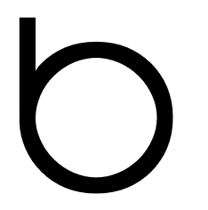                                                             | [**ᴘʀᴏɴᴏᴜɴ**](nasin-nimi.md#noun) | ona — mi, **sina**                                                                           | ɴᴏᴜɴ **you**/*thou*/*thee*/[**thyself**](sonja.md#toki-pona-proverbs); [**the person who**](sonja.md#famous-quotations)  ᴀᴅᴊᴇᴄᴛɪᴠᴇ *your*/[**thy**](sonja.md#toki-pona-proverbs) |
|                                                          | [**ᴛʜɪɴɢ ᴀᴅᴊᴇᴄᴛɪᴠᴇ**](nasin-nimi.md#thing-adjective) + [**ꜱᴘᴀᴛɪᴀʟ ᴀᴅᴊᴇᴄᴛɪᴠᴇ**](nasin-nimi.md#spatial-adjective) | insa — monsi, poka, **sinpin** | ᴀᴅᴊᴇᴄᴛɪᴠᴇ *upright*; (⇐ *~~pake~~*) *barring*, *blocking* →  ɴᴏᴜɴ *something upright*, **front**, **wall**; (*sinpin ~~sijelo~~*) [**chest**](sonja.md#lesson-15), (*sinpin ~~lawa~~*) **face** +  ᴀᴅᴊᴇᴄᴛɪᴠᴇ **foremost** →  ɴᴏᴜɴ [**area in front**](sonja.md#lesson-15): (*lon sinpin*) [**in front of**](sonja.md#lesson-15) |
|                                                        | [**ᴛʜɪɴɢ ᴠᴇʀʙ**](nasin-nimi.md#thing-verb) | nimi, **sitelen**, toki                                                             | ᴠᴇʀʙ *to draw*, *indicate*, *project*, *represent*, *sculpture* →  ɴᴏᴜɴ **image**, **picture**, *projection*, **representation**, *sculpture*, **symbol**, **mark**, **writing** |
|                                                              | [**ᴛʜɪɴɢ ᴠᴇʀʙ**](nasin-nimi.md#thing-verb) + [**ᴘʀᴇ-ᴠᴇʀʙ**](nasin-nimi.md#pre-verb) | **sona**                                         | ᴠᴇʀʙ [**to be knowledgeable of**](sonja.md#lesson-5), **be wise about**, **have information on**, **know**, (*~~toki e~~ sona*) [**testify**](sonja.md#short-obligatory-prayer) →  ɴᴏᴜɴ [**insight**](sonja.md#writings-of-baháulláh), *knowledge*, [**wisdom**](sonja.md#toki-pona-proverbs) +  ᴘʀᴇ-ᴠᴇʀʙ **to know how to**  ᴠᴇʀʙ **to be skilled in** |
|                                                            | [**ʟɪꜰᴇ-ꜰᴏʀᴍ ᴀᴅᴊᴇᴄᴛɪᴠᴇ**](nasin-nimi.md#life-form-adjective) | akesi — **soweli**                                                 | ᴀᴅᴊᴇᴄᴛɪᴠᴇ *warm-blooded* →  ɴᴏᴜɴ *cute animal*, (*soweli tomo*) *pet*; **animal**, **beast**, **land mammal**; [**badger**](sonja.md#lesson-12), [**gerbil**](sonja.md#lesson-12), [**hare**](sonja.md#lesson-18), [**moose**](sonja.md#lesson-17); [**meat**](sonja.md#lesson-5) |
|                                                              | [**ᴛʜɪɴɢ ᴀᴅᴊᴇᴄᴛɪᴠᴇ**](nasin-nimi.md#thing-adjective) | lili — ale, mute, **suli**, wawa                                         | ᴀᴅᴊᴇᴄᴛɪᴠᴇ **big**, **heavy**, **large**, **long**, **tall**; **important**; **adult**  ᴠᴇʀʙ [**enlarge**](sonja.md#lesson-6) →  ɴᴏᴜɴ *cargo* |
|                                                                | [**ᴛʜɪɴɢ ᴀᴅᴊᴇᴄᴛɪᴠᴇ**](nasin-nimi.md#thing-adjective) | pimeja — **suno**                                                         | ᴀᴅᴊᴇᴄᴛɪᴠᴇ *bright*, ***lit*** →  ɴᴏᴜɴ **sun**; **brightness**, **glow**, **light**, **radiance**, **shine**; **light source** |
|                                                              | [**ꜱᴘᴀᴛɪᴀʟ ᴀᴅᴊᴇᴄᴛɪᴠᴇ**](nasin-nimi.md#spatial-adjective) | **supa**                                                               | ᴀᴅᴊᴇᴄᴛɪᴠᴇ *horizontal* →  ɴᴏᴜɴ **horizontal surface**: (*lon supa*) *on*; **thing to put or rest something on**: (*lon supa*) *lying on*, *sitting on*; *bed*, *chair*, *shelf*, [**sofa**](sonja.md#lesson-18), *table*; (*mute supa*) *stairs* |
|                                                              | [**ᴛʜɪɴɢ ᴀᴅᴊᴇᴄᴛɪᴠᴇ**](nasin-nimi.md#thing-adjective) | jaki — **suwi**                                                           | ᴀᴅᴊᴇᴄᴛɪᴠᴇ **fragrant**, **sweet**; **adorable**, **cute**, **innocent** →  ɴᴏᴜɴ [**sweets**](sonja.md#lesson-16) |
|                                                                  | [**ᴘʀᴇᴘᴏꜱɪᴛɪᴏɴ**](nasin-nimi.md#preposition) | lon, **tan**, tawa                                                                 | ᴀᴅᴊᴇᴄᴛɪᴠᴇ *departing*  ɴᴏᴜɴ (⇒ *tawa*) →  ᴘʀᴇᴘᴏꜱɪᴛɪᴏɴ **because of**, **by**, **from**, *made in*, (*tan ~~pini~~*) *since* |
|                                                            | [**ᴘʀᴇᴘᴏꜱɪᴛɪᴏɴ**](nasin-nimi.md#preposition) | sin — **taso**                                                                     | ᴀᴅᴊᴇᴄᴛɪᴠᴇ *just*, **only**; (*taso ~~pona~~*) *pure*; (*taso ~~ike~~*) *sheer*; *free* →  ᴘʀᴇᴘᴏꜱɪᴛɪᴏɴ *free from*, *independent from*, *without*; (*taso ni la* ⇒ *taso*) |
| | [**ꜱᴇɴᴛᴇɴᴄᴇ ᴍᴀʀᴋᴇʀ**](nasin-nimi.md#sentence-marker) | la, **taso**                                                       | ᴘᴀʀᴛɪᴄʟᴇ  (*taso* ⇐ *taso ni la*) **but**, **however** |
|                                                            | [**ᴘʀᴇᴘᴏꜱɪᴛɪᴏɴ**](nasin-nimi.md#preposition) | lon, tan, **tawa**                                                                 | ᴀᴅᴊᴇᴄᴛɪᴠᴇ *going*, **moving**, (*tawa ~~wawa~~*) [**running**](sonja.md#lesson-17), *traveling*  ɴᴏᴜɴ *movement*, *voyage*; (*~~kama~~ tawa* ⇐ *tan*) [**departure**](sonja.md#lesson-10) →  ᴘʀᴇᴘᴏꜱɪᴛɪᴏɴ **going to**, [**to**](sonja.md#lesson-8), [**moving to**](sonja.md#lesson-8), **toward**; (*tawa ~~kama~~*) *until* ; **for**, [**in order to**](sonja.md#short-obligatory-prayer); **from the perspective of** |
| 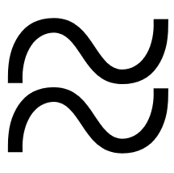                                                             | [**ᴛʜɪɴɢ ᴀᴅᴊᴇᴄᴛɪᴠᴇ**](nasin-nimi.md#thing-adjective) | kiwen, ko, kon, sewi, **telo**                                             | ᴀᴅᴊᴇᴄᴛɪᴠᴇ *fluid*, *liquid*, *wet* →  ɴᴏᴜɴ **fluid**, **liquid**, (*telo ~~suli~~*) [**lake**](sonja.md#lesson-9), **water**, **wet substance**; **beverage**  ᴠᴇʀʙ [**to water**](sonja.md#lesson-18), [**water**](sonja.md#lesson-11) |
|                                                              | [**ꜱɪᴍᴘʟᴇ ɴᴏᴜɴ**](nasin-nimi.md#noun) | ijo, ilo, jan, **tenpo**                                                                   | ɴᴏᴜɴ **duration**, *experience*, **moment**, **occasion**, **period**, **situation**, **time** |
|                                                                | [**ᴛʜɪɴɢ ᴠᴇʀʙ**](nasin-nimi.md#thing-verb) | nimi, sitelen, **toki**                                                             | ᴠᴇʀʙ **to communicate**, [**explain**](sonja.md#famous-quotations), **say**, **speak**, **talk**, **use language**; *be of the opinion that*, *mean*, **think**  ɴᴏᴜɴ [**communication**](sonja.md#toki-pona-proverbs), [**language**](sonja.md#lesson-5): (*lon toki*) [**in**](sonja.md#lesson-8), [**speech**](sonja.md#lesson-5) →  ɴᴏᴜɴ *message*, *news* |
|                                                                | [**ᴛᴏᴏʟ ᴠᴇʀʙ**](nasin-nimi.md#tool-verb) | kute, lawa, len, luka, noka, palisa, poki, selo, **tomo**, uta                         | ᴠᴇʀʙ *to protect*, *shield*; *house* →  ɴᴏᴜɴ *skeleton*, *thorax*; [**indoor compartment**](sonja.md#lesson-5), **indoor space**; **building**, [**hall**](sonja.md#lesson-5), **home**, **house**, **room**, [**shed**](sonja.md#lesson-14) |
|                                                                    | [**ɴᴜᴍʙᴇʀ ᴀᴅᴊᴇᴄᴛɪᴠᴇ**](nasin-nimi.md#number-adjective) | ala, ale, esun, luka, mute, **tu**, wan                                                     | ᴀᴅᴊᴇᴄᴛɪᴠᴇ [**2**](sonja.md#lesson-12), **two** →  ɴᴏᴜɴ *twofold amount*; *pair* |
|                                                                | [**ꜱɪᴍᴘʟᴇ ᴠᴇʀʙ**](nasin-nimi.md#simple-verb) | alasa, pali, olin, **unpa**                                                         | ᴠᴇʀʙ **to have sexual or marital relations with** |
|                                                                | [**ᴛᴏᴏʟ ᴠᴇʀʙ**](nasin-nimi.md#tool-verb) | kute, lawa, len, luka, noka, palisa, selo, **uta**                                     | ᴠᴇʀʙ [**to kiss**](sonja.md#lesson-18), *suck*, *taste* →  ɴᴏᴜɴ **jaw**, **lips**, **mouth**, **oral cavity** |
|                                                              | [**ꜱɪᴍᴘʟᴇ ᴀᴅᴊᴇᴄᴛɪᴠᴇ**](nasin-nimi.md#simple-adjective) | pona — ike, nasa, pakala, **utala**                                       | ᴀᴅᴊᴇᴄᴛɪᴠᴇ *aggressive*  ᴠᴇʀʙ *to attack*, **battle**, **challenge**, **compete against**, [**fight**](sonja.md#lesson-9), provoke, **struggle against**  ɴᴏᴜɴ [**battle**](sonja.md#lesson-14), [**fighting**](sonja.md#toki-pona-proverbs) |
|                                                              | [**ꜱɪᴍᴘʟᴇ ᴀᴅᴊᴇᴄᴛɪᴠᴇ**](nasin-nimi.md#simple-adjective) | pimeja — **walo**                                                         | ᴀᴅᴊᴇᴄᴛɪᴠᴇ **white**, (*walo ~~mu~~*) **whitish** |
| | [**ꜱɪᴍᴘʟᴇ ᴀᴅᴊᴇᴄᴛɪᴠᴇ**](nasin-nimi.md#simple-adjective) | kule — **walo**                                                           | ᴀᴅᴊᴇᴄᴛɪᴠᴇ **light-coloured**, **pale** |
|                                                                  | [**ɴᴜᴍʙᴇʀ ᴀᴅᴊᴇᴄᴛɪᴠᴇ**](nasin-nimi.md#number-adjective) | ala, ale, esun, luka, mute, tu, **wan**                                                     | ᴀᴅᴊᴇᴄᴛɪᴠᴇ [**1**](sonja.md#lesson-12), **one**; (*wan ~~ale~~*) **united**; (*wan taso*) *alone*; (*wan taso mute*, *wan taso tu*) *divided*  ᴠᴇʀʙ (*wan ~~ale~~*) ***to unite*** →  ɴᴏᴜɴ *onefold amount*; *singleton* |
| | [**ᴄᴏʀʀᴇʟᴀᴛɪᴠᴇ**](nasin-nimi.md#correlative) | ale, ni, seme, **wan**                                                       | ᴀᴅᴊᴇᴄᴛɪᴠᴇ (*~~wan~~*) *certain*, *specific*; **unique** →  ɴᴏᴜɴ *something specific*; *something unique*; *building block*, *detail*, *element*, *member*, *unit*; (⇐ *lili* ⇐ *~~kipisi~~*) *part*, *particle*, *piece*: (*wan tu*) *to cut* |
| 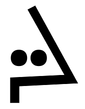                                                               | [**ʟɪꜰᴇ-ꜰᴏʀᴍ ᴀᴅᴊᴇᴄᴛɪᴠᴇ**](nasin-nimi.md#life-form-adjective) | kala, kasi, pipi, **waso**                                         | ᴀᴅᴊᴇᴄᴛɪᴠᴇ *flying*, *winging* →  ɴᴏᴜɴ **bird**, **flying creature**, **winged animal** |
| 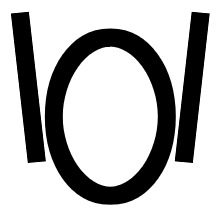                                                             | [**ᴛʜɪɴɢ ᴀᴅᴊᴇᴄᴛɪᴠᴇ**](nasin-nimi.md#thing-adjective) | lili — ale, mute, suli, **wawa**                                         | ᴀᴅᴊᴇᴄᴛɪᴠᴇ **energetic**; [**mighty**](sonja.md#short-obligatory-prayer), **powerful**, [**stable**](sonja.md#lesson-15), **strong**; [**independent**](sonja.md#the-quran); (*~~sona~~ wawa*) *certain*, [**dependable**](sonja.md#lesson-4), [**reliable**](sonja.md#lesson-5), **sure**; (*~~toki~~ wawa*) **confident**; (*tawa wawa*) *fast*, (*kalama wawa*) [**loud**](sonja.md#lesson-17), **intense**  ɴᴏᴜɴ [**might**](sonja.md#writings-of-baháulláh), [**power**](sonja.md#writings-of-baháulláh)  ᴠᴇʀʙ  [**strengthen**](sonja.md#lesson-6); (*~~toki~~ wawa ~~e sona wawa~~*) [**to bear witness that**](sonja.md#writings-of-baháulláh) →  ɴᴏᴜɴ *force* |
|                                                                | [**ꜱᴘᴀᴛɪᴀʟ ᴀᴅᴊᴇᴄᴛɪᴠᴇ**](nasin-nimi.md#spatial-adjective) | sike — **weka**                                                       | ᴀᴅᴊᴇᴄᴛɪᴠᴇ **absent**, **away**, *distant*, [***remote***](sonja.md#toki-pona-proverbs); **ignored**  ᴠᴇʀʙ [**to eliminate**](sonja.md#famous-quotations), [**erase**](sonja.md#toki-pona-proverbs), ***ignore***, [***isolate***](sonja.md#toki-pona-proverbs), [**omit**](sonja.md#famous-quotations), [**remove**](sonja.md#toki-pona-proverbs)  ɴᴏᴜɴ ***absence***, *vacuum*, *void*; (*weka ~~ma~~*) *space*; [**isolation**](sonja.md#toki-pona-proverbs): (*lon weka*) *without* →  ɴᴏᴜɴ *distance*: (*lon weka*) *away from* |
|  | [**ꜱɪᴍᴘʟᴇ ᴀᴅᴊᴇᴄᴛɪᴠᴇ**](nasin-nimi.md#simple-adjective) + [**ᴘʀᴇ-ᴠᴇʀʙ**](nasin-nimi.md#pre-verb) | ken, **wile**                                                                               | ᴀᴅᴊᴇᴄᴛɪᴠᴇ *inevitable*, *necessary*  ᴠᴇʀʙ *to enforce* +  ᴘʀᴇ-ᴠᴇʀʙ **must**, **need**, **require**, **should**, **want**, **wish**; (⇐ *selo*) *to be bound to*, *can't help but*  ᴠᴇʀʙ *to need*, *require*, *want*, *wish*; (⇐ *selo*) *to conclude*, *decide* |

