# Fictional Toki Pona (ᴛᴇᴘᴀɴ)
*([Toki Pona](README.md) Sin)*

This creative work by Stephan Schneider is based on [the official Toki Pona book](http://www.amazon.com/gp/product/0978292308) and website: [http://tokipona.org](http://tokipona.org)

[***Toki Pona Prequels***](#prequels)  and [***Toki Pona Sequels***](#sequels) are fictional [***Toki Pona***](README.md) dialects of the past and the future respectively, whereas [***Toki Pona Spin-Offs***](#spin-offs) are fictional co-existing [***Toki Pona***](README.md) dialects of the present. [***Fictional Toki Pona***](#dialects) goes beyond [**Frontier Toki Pona**](#frontier-toki-pona) and should therefore not be mixed with ordinary [***Toki Pona***](README.md). (Cf. [***Enhanced Toki Pona***](toki-namako.md).)

## Dialects

| | |
|:-|:-|
| [**Prequels**](#prequels) | [Tok Bona](#tok-bona) ([Ijo Ŝin Bona](#ijo-ŝin-bona)) |
| [**Sequels**](#sequels) | [Toki Bona](#toki-bona) ([Toĥi Bona](#toĥi-bona)) |
| | |
| [**Spin-Offs**](#spin-offs) | [Tok Bon](#tok-bon), [Toko Bona](#toko-bona) |

### Prequels
*([toki pona](#dialects) mama)*

| |
|:-|
| [Tok Bona](#tok-bona) ([Ijo Ŝin Bona](#ijo-ŝin-bona)) |

#### Tok Bona
*([Toki Pona Prequel](#prequels) with Preserved Etymological Forms)*

Words in ***Tok Bona*** are very close to their etymological origin.

| ꜱɪᴛᴇʟᴇɴ | ᴏʀɪɢɪɴ | ***Tok Bona*** | ***Toki Pona*** |
|:-|:-|:-|:-|
 | *FR* couleur | **kuler** | kule |
 | *HR* rúka | **ruka** | luka |
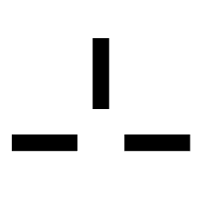 | *ZH* 新 /xīn/ | **ŝin** | sin |
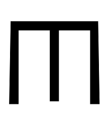 | *HR* tijelo | **tijelo** | sijelo |

##### Ijo Ŝin Bona
*([Toki Pona Prequel](#prequels) without Compound Hieroglyphs)*

***Ijo Ŝin Bona*** is a prequel of ***Tok Bona*** with less vocabulary. For instance, **ijo ŝin** (meaning *message*, *news*) is used instead of **tok**.

| ꜱɪᴛᴇʟᴇɴ | ***Ijo Ŝin Bona*** | ***Tok Bona*** | ***Toki Pona*** |
|:-|:-|:-|:-|
 | **kuler suno** | **jelo** | jelo |
 | **kuler kasvi** | **glas** | laso |
 | **kuler usta** | **roje** | loje |
 | **kuler ara** | **pimea** | pimeja |
 | **kuler vahva** | **valko** | walo |
 | **loŋ ruka e ilo** | **ĥebrejken** | kepeken |
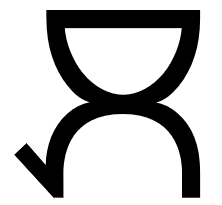 | **loŋ ruka e usta** | **mogu** | moku |
 | **loŋ ruka e ijo** | **fari** | pali |
 | **loŋ ruka ŝin** | **pana** | pana |
 | **usta vahva** | **galama** | kalama |
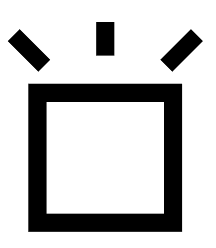 | **loŋ lipu vahva** | **ĉodna** | sona |
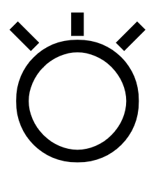 | **ijo ŝin** | **tok** | toki |
 | **multe ijo** | **kulupu** | kulupu |
 | **pilim e pilim** | **volim** | olin |
 | **loŋ lipu biloŋ ijo ŝin bona** | **buk** | pu |
 | **(mi) loŋ mi** | **jou** | jo |

Animals are expressed by means of **tijelo**.

| ꜱɪᴛᴇʟᴇɴ | ***Ijo Ŝin Bona*** | ***Tok Bona*** | ***Toki Pona*** |
|:-|:-|:-|:-|
 | **tijelo biloŋ pilim fret** | **hagedis** | akesi |
 | **tijelo delo** | **kala** | kala |
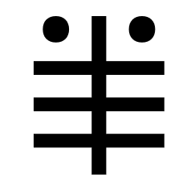 | **tijelo maa** | **bibit** | pipi |
 | **tijelo biloŋ pilim ĉeli** | **ĉoveli** | soweli |
 | **tijelo koŋ** | **wazo** | waso |

### Sequels
*([toki pona](#dialects) lili)*

| |
|:-|
| [Toki Bona](#toki-bona): ([Toĥi Bona](#toĥi-bona)) |

#### Toki Bona
*([Toki Pona Sequel](#sequels) with Voiced Consonants)*

The consonant starting off a ᴀᴅᴊᴇᴄᴛɪᴠᴇ is voiced.

| | ***Toki Pona*** | ***Toki Bona*** |
|:-|:-|:-|
| *friend* | jan pona | **jan bona** |
| *car* | tomo tawa | **tomo dawa** |

##### Toĥi Bona
*([Toki Pona Sequel](#sequels) with More Fricatives)*

Before **e** or **i**, the consonants **p**, **t**, **k** become the fricatives **f**, **ĉ**, **ĥ**, whereas **s** becomes **ŝ**.

| | ***Toki Pona*** | ***Toĥi Bona*** |
|:-|:-|:-|
| *heart* | pilin | **filin** |
| *time* | tenpo | **ĉenpo** |
| *fruit* | kili | **ĥili** |
| *skin* | selo | **ŝelo** |

When voiced, **f**, **ĉ**, **ĥ** and **ŝ** become **v**, **ĝ**, **h** and **ĵ**.

| | ***Toki Pona*** | ***Toĥi Bona*** |
|:-|:-|:-|
| *past* | tenpo pini | **ĉenpo vini** |
| *bathroom* | tomo telo | **tomo ĝelo** |
| *religion* | nasin sewi | **naŝin ĵewi** |
| *sand* | ko kiwen | **ko hiwen** |

Additionaly, the vowels **u** and **i** can merge with **o** and **e**.

| | ***Toki Pona*** | ***Toĥi Bona*** → ***Toĥe Bona*** |
|:-|:-|:-|
| *two* | tu | **tu** → **to** |
| *I* | mi | **mi** → **me** |
| *recreational* | musi | **muŝi** → **muŝe** |

### Spin-Offs
*([toki pona](#dialects) sama)*

| |
|:-|
| [Tok Bon](#tok-bon) |
| [Toko Bona](#toko-bona) |

#### Tok Bon
*([Toki Pona Spin-Off](#spin-offs) with Declension)*

Final vowels (+ consonant) are dropped, except if the word is monosyllabic.

| | ***Toki Pona*** | ***Tok Bon*** |
|:-|:-|:-|
| *she* | ona | **on** |
| *I* | mi | **mi** |
| *reptile* | akesi | **haged** |
| *eye* | lukin | **luk** |

The ᴘᴀʀᴛɪᴄʟᴇs **biloŋ** and **li** become the ending **-i**.

| | ***Toki Pona*** | ***Tok Bon*** |
|:-|:-|:-|
| *bar* | tomo pi telo nasa | **dom deli nas** |
| *People are working.* | jan li pali. | **jan fari.** |

The ᴘᴀʀᴛɪᴄʟᴇs **ho** and **e** become the endings **-o** and **-e**.

| | ***Toki Pona*** | ***Tok Bon*** |
|:-|:-|:-|
| *I should eat something good.* | mi o moku e ijo pona | **mi mogo ije bon.** |

The ꜱᴜʙᴊᴇᴄᴛ **mi** and **sina** alone become the endings **-im** and **-is**.

| | ***Toki Pona*** | ***Tok Bon*** |
|:-|:-|:-|
| *I love you.* | mi olin e sina. | **volim sine.** |
| *You are new.* | sina sin. | **ŝinis.** |

The final remaining syllable (vowel + consonant) of a ᴘʀᴇᴘᴏꜱɪᴛɪᴏɴ becomes an ending.

| | ***Toki Pona*** | ***Tok Bon*** |
|:-|:-|:-|
| *She went home by car like you.* | ona li tawa tomo kepeken tomo tawa sama sina. | **oni domaw domen daw sinam.** |

The ᴄᴏɴᴊᴜɴᴄᴛɪᴏɴ **la** becomes the ending **-a**.

| | ***Toki Pona*** | ***Tok Bon*** |
|:-|:-|:-|
| *Why is she at home?* | tan seme la ona li lon tomo? | **ŝenmana oni domon?** |

##### Toko Bona
*([Toki Pona Spin-Off](#spin-offs) à la Esperanto)*

***Toko Bona*** has the grammar and the phonetics of ***Esperanto***. It keeps all words of ***Tok Bona*** except for **la** (which becomes the definite article) and adds **est-** from ***Esperanto***.

| | ***Toki Pona*** | ***Toko Bona*** |
|:-|:-|:-|
| *The friend is in the house.* | jan pona li lon tomo. | **la jano bona estas lon la domo.** |

Monosyllabic ***Tok Bona*** stems lose their vocalic ending, except for ɪɴᴛᴇʀᴊᴇᴄᴛɪᴏɴs.

| | ***Toki Pona*** | ***Toko Bona*** |
|:-|:-|:-|
| *town* | ma tomo | **mo doma** |
| *The animal bleats.* | soweli li mu. | **la ĉovelo muas.** |

ɴᴜᴍʙᴇʀs end in **-u** (and **-ua**).

| | ***Toki Pona*** | ***Toko Bona*** |
|:-|:-|:-|
| *la unua lingvo* | toki nanpa wan | **la toko nambo wanu** → **la toko wanua** |

ᴄᴏʀʀᴇʟᴀᴛɪᴠᴇs end in **-iu**.

| | ***Toki Pona*** | ***Toko Bona*** |
|:-|:-|:-|
| *what* | seme | **ŝenmiu** |
| *that* | ni | **niu** |
| *every* | ale | **aliu** |
| *no* | ala | **ariu** |

ᴘʀᴏɴᴏᴜɴs end in **-i**.

| | ***Toki Pona*** | ***Toko Bona*** |
|:-|:-|:-|
| *I* | mi | **mi** |
| *you* | sina | **sini** |
| *she* | ona | **oni** |

# Frontier Toki Pona

A ɴᴜᴍʙᴇʀ can be used like a ᴛʜɪɴɢ ɴᴏᴜɴ implying *mute pi ijo …*, i.e. an *amount*.

| ɴᴜᴍʙᴇʀ tu | wan en wan sama tu |
|:-|:-|
| ᴀᴅᴊᴇᴄᴛɪᴠᴇ *two*: (*~~mute pi ijo~~ tu*) *pair* | *A singleton and a singleton are equal to a pair.* → *One plus one equals two.* |

ɴᴜᴍʙᴇʀs are multiplied rather than added (not using ꜱᴏɴᴊᴀ's ["more complex and precise counting system"](pu.md#lesson-12)).

| tu tu | tu en tu sama tu tu |
|:-|:-|
| *two pairs* → *four* | *A pair and a pair are equal to two pairs.* – *Two plus two equals four.* |

As a ɴᴜᴍʙᴇʀ, **mute** means exactly *three*.

| ɴᴜᴍʙᴇʀ mute |
|:-|
| ᴀᴅᴊᴇᴄᴛɪᴠᴇ *three* |

Outside of ordinary ꜱᴇɴᴛᴇɴᴄᴇ structures, **sama** be used instead of **li**.

| tu en wan li mute. → tu en wan sama mute |
|:-|
| *Two plus one equals three.* |

ꜰʀᴀɢᴍᴇɴᴛs can be used as **ɴᴀᴍᴇ**s. ᴘᴀʀᴛɪᴄʟᴇs and ᴘʀᴇᴘᴏꜱɪᴛɪᴏɴs in ꜰʀᴀɢᴍᴇɴᴛs aren't as restricted as in ꜱᴇɴᴛᴇɴᴄᴇs.

| lipu "utala en pona" | sitelen tawa "weka lon toki ante" | sitelen tawa mute "sona wawa pi kama pi ijo ale" |
|:-|:-|:-|
| *the book "War and Piece"* | *the film "Lost in Translation"* | *the series "Big Bang Theory"* |

# Enhanced Toki Pona (ᴛᴇᴘᴀɴ)
*([Toki Pona](README.md) Namako)*

This creative work by Stephan Schneider is based on [the official Toki Pona book](http://www.amazon.com/gp/product/0978292308) and website: [http://tokipona.org](http://tokipona.org)

[***Enhanced Toki Pona***](#toki-namako) goes beyond [***Frontier Toki Pona***](sin.md) and should therefore not be mixed with ordinary [***Toki Pona***](README.md). (Cf. [***Fictional Toki Pona***](toki-sin.md).)

## Punctuation

For didactical purposes, safely removed *commas* remain.

| ona li lili, li lete. | o pilin pona, o pu! |
|:-|:-|
| *It is small and cold.* | *Be happy and read the official Toki Pona book!* |

For didactical purposes, omitted words are represented by *hiphens*, *apostrophes* and other symbols.

| | |
|:-|:-|
| **toki ~~pi~~ pona** | **toki-pona** |
| **~~ijo~~ ale li pona.** | **'-ale li pona.** |
| **~~jan~~ mije li sona ~~e ijo~~.** | **'-mije li sona '.** |
| **ni li wile: ona li lape.** | **ona li wile÷lape.** |
| **mi ~~li~~ sin.** | **mi: sin.** |

For didactical purposes, ꜱᴏᴜɴᴅ ᴘᴀʀᴛɪᴄʟᴇs following a ɴᴏᴜɴ ᴘʜʀᴀꜱᴇ have a *colon*. ᴘʀᴇᴘᴏꜱɪᴛɪᴏɴᴀʟ ᴘʜʀᴀꜱᴇs describing a *perception* also have a *colon*.

| |
|:-|
| **jan:Sonja** |
| **toki:nanpa:wan** |
| **mi lukin e meli-pimeja: lon sinpin-tomo.** |

## Orthography
*(nasin sitelen pi [toki pona](README.md))*

| |
|:-|
| [Ascii](#ascii) |
| [Playful Hieroglyphs](#playful-hieroglyphs) |
| [Emoji](#emoji) |

### Ascii

| nanpa wan la o pu. → `#1)` o pu. |
|:-|
| *First, consult the official Toki Pona book.* |

| tu tu → `4` → `2×2` | tu en tu sama tu tu → `2+2 = 2×2` |
|:-|:-|
| *four* | *two plus two equals four* |

#### Ascii Art (WIP)

* `a!` `Ä` `∅` `Đ` `∞` `(anpa)` `≠` `Y`/`γ` `Λ` `≫` `+` `7`
* `O` `:(` `Ŧ` `(insa)` `β`/`𝔹` `Ω` `Δ(suno)` `G` `α` `D(wawa)` `(kama)` `(kasi)`
* `κ` `5Ŧ` `` `♦` `(ko)` `SS` `Δ` `(kulupu)` `(kute)` `)` `(lape)` `Δ(kasi)`
* `Ø`/`0` `(len)` `*` `>` `v` `~` `□` `ΔD` `≐` `5` `(lukin)` `∪`
* `⊕` `8` `Ö` `(meli)` `p` `(mije)` `5D` `xx` `.[` `(mu)` `(mun)` `Ü`
* `3` `#` `@` `(nasin)` `∩` `(ni)` `"`/`(nimi)` `(noka)` `o!` `♥♥` `σ` `(open)`
* `↯` `5O` `|` `(pan)` `5(sin)` `∟` `♥` `Δ∅` `I` `(pipi)`/`Ï` `(poka)`/`(poki).` `(poki)` `:)`
* `□O(sin):)` `=` `(seli)` `(selo)` `?` `µ` `E` `(sike)` `(sin)` `b` `].` `□.`
* `□(wawa)` `ℙ` `V` `(suno)` `π` `^.^` `(tan)` `⊥` `λ` `≈` `(tenpo)` `O(sin)`
* `^` `2` `(unpa)` `D` `(utala)` `Δ(wawa)` `1` `4` `(wawa)` `(weka)` `ω`

* `a!` = `(a)` = `ª`
* `o!` = `(o)` = `º`

* `♦` = `(kiwen)`
* `♣`
* `♥` = `(pilin)` = `<3`
* `♠`

* `4` = `(waso)`
* `7` = `(esun)` = `£`
* `8` = `(mama)`

* `p` = `6`
* `b` = `9`

### Playful Hieroglyphs
*(sitelen pona musi)*

|  |  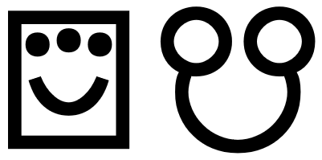 |  | 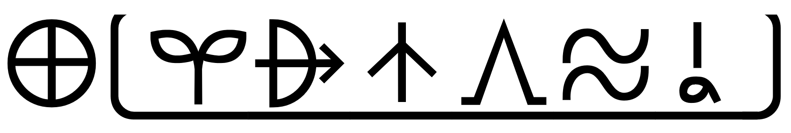 |  |
|:--:|:--:|:--:|:--:|:--:|
| **toki pona** | **sitelen pona musi** | **sina suli a!** | **ma Kanata** | **toki nanpa wan** |

ᴄᴏʀʀᴇʟᴀᴛɪᴠᴇs, ɴᴜᴍʙᴇʀs, ᴘʀᴏɴᴏᴜɴs and simple ɴᴏᴜɴs don't become part of another ɴᴏᴜɴ in general. They can only become part of another simple ɴᴏᴜɴ.

|  |
|:--:| 
| **mi weka e ike jan, la mi weka e ike mi.** |

Click [here](musi/sitelen-pona-musi.md) for more examples.

#### Content Words

ᴘʀᴇᴘᴏꜱɪᴛɪᴏɴs are written above.

| 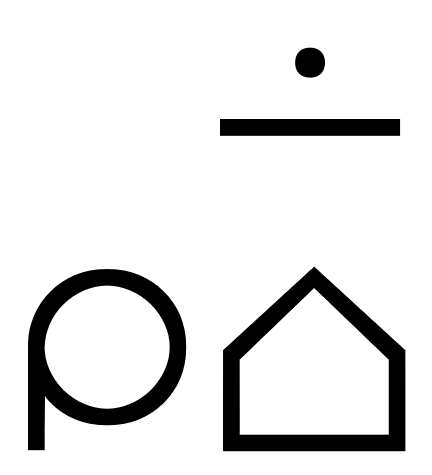 |  |  | 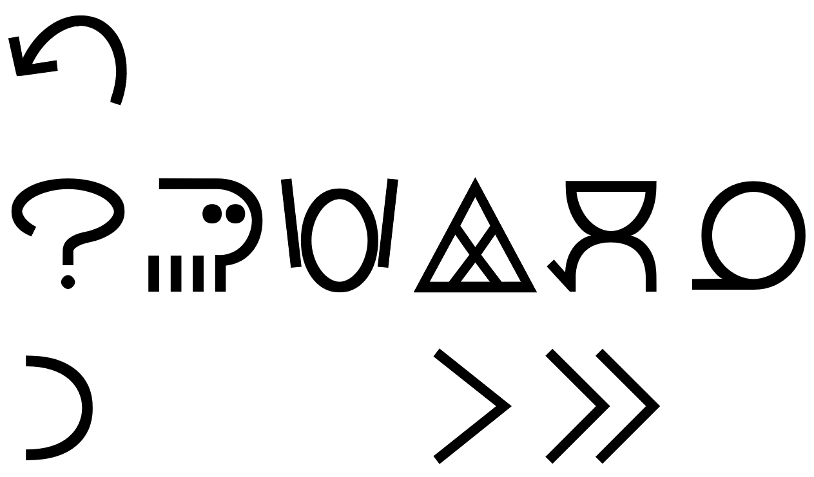 |
|:--:|:--:|:--:|:--:| 
| **mi lon tomo.** | **wawa li lon insa.** | **mi pana e kala tawa ona lon tomo.** | **tan seme la soweli wawa pimeja li moku e ona?** |

ᴘʀᴇ-ᴠᴇʀʙs are written above.

| 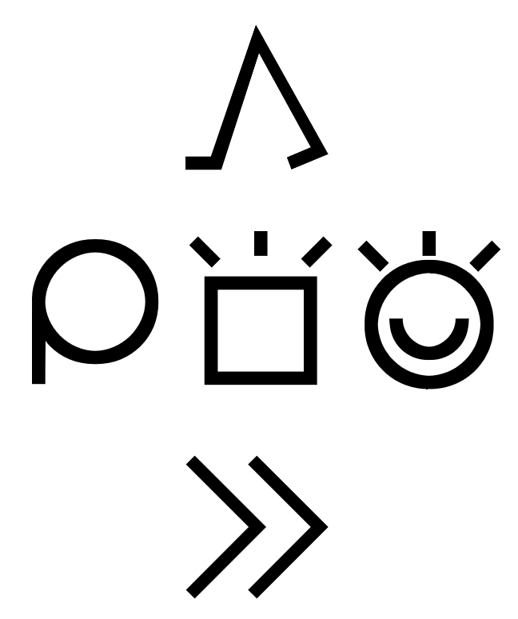 |
|:--:| 
| **mi kama sona e toki pona.** |

ꜱᴜʙᴏʀᴅɪɴᴀᴛᴇ ᴄʟᴀᴜꜱᴇs after a colon are written below.

|  |
|:--:| 
| **mi sona e ni: mi anpa.** |

If **ni:** is missing, the ꜱᴜʙᴏʀᴅɪɴᴀᴛᴇ ᴄʟᴀᴜꜱᴇ is not written below.

| 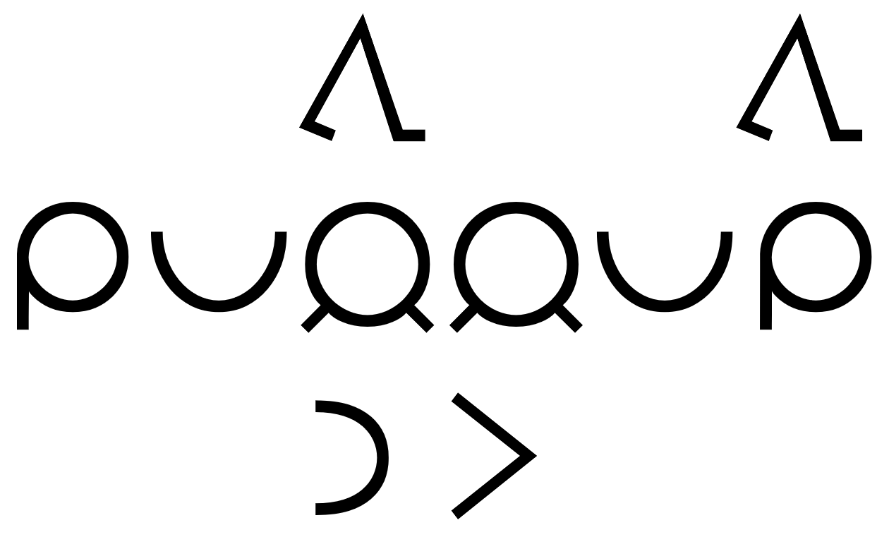 |
|:--:| 
| *~~lon ni:~~ mi pona tawa jan, la jan li pona tawa mi.** |

**taso** is written above.

|  |
|:--:| 
| **taso mije en meli li pali li pilin pona.** |

#### Particles

ᴘʜʀᴀꜱᴇ ᴍᴀʀᴋᴇʀs are written below.

|  |  |  |  |
|:--:|:--:|:--:|:--:|
| **ale li pona.** | **jan ala li ike.** | **mi o moku e ijo pona.** | **o kute e mama sina.** |

### Emoji

| | | | | | | | | | | | |
|:-:|:-:|:-:|:-:|:-:|:-:|:-:|:-:|:-:|:-:|:-:|:-:|
| ❗ | 🐊 | 0️⃣  | 🏹 | ♾ | ⬇️ | 🔀 | ✖️ | ⏸️ | ⏩ | ➕ | 🛒 |
| a | akesi | ala | alasa | ale | anpa | ante | anu | awen | e | en | esun |
| ⚛️ | 👎 | 🔨 | 🎯  | 💩 | 👤 | 💛️ | 👜 | 🐟 | 🔉 | ⏮️ | 🌱 |
| ijo | ike | ilo | insa | jaki | jan | jelo | jo | kala | kalama | kama | kasi |
| 🇰 | 🔧 | 🍏 | 💎 | 🧹 | 💨 | 🌈 | 👥 | 👂 | ◀️ | 😴 | 💙 |
| ken | kepeken | kili | kiwen | ko | kon | kule | kulupu | kute | la | lape | laso |
| 🗿 | 👗 | ❄️ | ▶️ | 👶 | 🧵 | 📄 | ❤️ | ↕️ | 🖐️ | 👁️ | 🕳️ |
| lawa | len | lete | li | lili | linja | lipu | loje | lon | luka | lukin | lupa |
| 🏝 | 👪 | 💰 | 👩 | 👈 | 👨 | 🍽 | 💀 | ⬅️ | 😹 | 🌜 | 🃏 |
| ma | mama | mani | meli | mi | mije | moku | moli | monsi | mu | mun | musi |
| 3️⃣ | #️⃣ | 🌀 | ⛖ | 🗻 | 👇 | 💬 | 🦶 | ⏺ | 💕️ | 👆 | 🔓 |
| mute | nanpa | nasa | nasin | nena | ni | nimi | noka | o | olin | ona | open |
| 💥 | ✊ | 📏 | 🍞 | 🎁 | ⏹️ | 💗 | ⚫ | ⏭ | 🦟 | ↔️ | 📦 |
| pakala | pali | palisa | pan | pana | pi | pilin | pimeja | pini | pipi | poka | poki |
| 👍 | 📖 | 🔁 | 🔥 | 🔲 | ❓ | ⬆️ | 🏃 | ⭕ | 🌟 | 👉 | ➡️ |
| pona | pu | sama | seli | selo | seme | sewi | sijelo | sike | sin | sina | sinpin |
| 🖼 | ℹ️ | 🐈 | 🧓 | 🌞️ | 🛏 | 🍭 | ↩️ | ⏪ | ↪️ | 💧 | 🕒 |
| sitelen | sona | soweli | suli | suno | supa | suwi | tan | taso | tawa | telo | tenpo |
| 🗣 | 🏠 | 2️⃣ | 💏 | 👄 | ⚔️ | ⚪ | 1️⃣ | 🐤 | ⚡ | ➖ | 🇼 |
| toki | tomo | tu | unpa | uta | utala | walo | wan | waso | wawa | weka | wile |

* ❤️ 💙 💛 → 🔴 🔵 🟡
* 🖤 🤍 → ⚫ ⚪

## Toki Namako
*([Toki Pona](README.md) with Extended Vocabulary)*

***Toki Namako*** is an intermediate, less ***pona*** variant of [***Toki Pona***](README.md). It is for more abstract descriptions, typically in written form only.

|  | 
|:--| 
| *toki namako* |

***Toki Namako*** relies heavily on [punctuation](#punctuation).

| jan-sona |
|:-|
| *a knowledgeable person* |

***Toki Namako*** avoids omissions. (The ~~strikethrough~~ *italic* dictionary forms (in parenthesis) apply.)

| sinpin ⇒ sinpin, sinpin-*sijelo*, sinpin-*lawa* | mute ⇒ mute, mute-*namako* | jan-lawa ⇒ jan-lawa, jan-lawa-*wan* |
|:-|:-|:-|
| *wall*, *chest*, *face* | *many*, *more* | *a/the ruler*, *a certain ruler* |

For the same reason, synonyms are avoided. (The *italic* dictionary forms with a double arrow ⇐ (in parenthesis) apply.)

| lon noka ⇒ lon noka, lon *anpa* |
|:-|
| *at the bottom of*, *under* |

In ***Toki Namako***, **namako** is a synonym of **sin** meaning *additional*, *another*, *extra*. Other (extinct) synonyms can be used as well, but they are a strong indicator for a lack of ***pona***-ness. (Cf. [ᴘɪᴊᴇ](pije.md#oko).)

| ꜱɪᴛᴇʟᴇɴ | ᴋᴏɴ |
|:-|:-|
|  | [**ᴀᴅᴊᴇᴄᴛɪᴠᴇ**](#nasin-nimi.md##modifier) *jaki* — **sin**, *suwi*  ᴀᴅᴊᴇᴄᴛɪᴠᴇ **new**, **fresh** |
|  | [**ᴘʀᴇᴘᴏꜱɪᴛɪᴏɴ**](#nasin-nimi.md#preposition) **namako** — *taso*  ᴘʀᴇᴘᴏꜱɪᴛɪᴏɴ [*in addition to*, *with*](sin.md#preposition)  ᴀᴅᴊᴇᴄᴛɪᴠᴇ **additional**, **another**, **extra** |
| | |
|  | [**ᴠᴇʀʙ**](#verb) **lukin**  ᴠᴇʀʙ **to look at**, **see**; (*lukin ~~wawa~~*) **examine**, **observe**, **read**, [**search**](pu.md#preface), **watch** |
|  | [**ɴᴏᴜɴ**](#noun) **oko**  ɴᴏᴜɴ **eye** |

## Toki Nasa
*([Toki Pona Spin-Off](#spin-offs) with un-pona predicates and modifiers)*

ᴘʀᴇᴘᴏꜱɪᴛɪᴏɴᴀʟ ᴘʜʀᴀꜱᴇs can be used as ᴠᴇʀʙs. (Cf. [ᴋɪᴘᴏ](kipo.md#e).)

| sina ' pana e ilo-tenpo lon poka-seme? → sina ' *lon poka-seme* e ilo-tenpo? |
|:-|
| *Where did you put the clock next to?* |

***TODO*** pre-verbs can be used after pi: jan pi kama-sona = jan pi kama÷sona

ᴘʀᴇ-ᴠᴇʀʙs can go between another ᴘʀᴇ-ᴠᴇʀʙ and its ᴍᴀɪɴ ᴠᴇʀʙ.

| mi ' wile÷sona e toki-pona. → mi ' wile÷*kama*÷sona e toki-pona. |
|:-|
| *I want to know Toki Pona.* → *I want to learn Toki Pona.* |

### SUBORDINATE CLAUSE

A ꜱᴜʙᴏʀᴅɪɴᴀᴛᴇ ᴄʟᴀᴜꜱᴇ can be a question with **seme**, yielding a ʀᴇʟᴀᴛɪᴠᴇ ᴄʟᴀᴜꜱᴇ.

| ' o toki e ni: mani li lon seme. |
|:-|
| *Tell me where the money is.* |

A ꜱᴜʙᴏʀᴅɪɴᴀᴛᴇ ᴄʟᴀᴜꜱᴇ can describe a *degree* or an *extent*.

| mi ' pali pi mute-ni: mi ' wile÷lape. |
|:-|
| *I worked so much, I need to sleep.* |

ꜱᴜʙᴏʀᴅɪɴᴀᴛᴇ ᴄʟᴀᴜꜱᴇs can follow a ɴᴏᴜɴ-ᴘʜʀᴀꜱᴇ directly.

| jan:Isa li toki e ni: "mama-mi o!" tawa sewi. |
|:-|
| *Jesus prayed: "My Father!"* |

When there is enough context, a ʀᴇʟᴀᴛɪᴠᴇ ᴄʟᴀᴜꜱᴇ can be reduced to its ᴘʀᴇᴅɪᴄᴀᴛᴇ (and the direct ᴏʙᴊᴇᴄᴛ can be omitted). Therefore, ᴘʀᴇᴘᴏꜱɪᴛɪᴏɴs, ᴠᴇʀʙs and ᴘʀᴇ-ᴠᴇʀʙs can be used as ꜱᴜʙᴏʀᴅɪɴᴀᴛᴇ ᴄʟᴀᴜꜱᴇs.

| meli-pimeja: *lon* sinpin-tomo, li kute e kalama-musi. |
|:-|
| *A black lady in front of the building is listening to music.* |

| jan: *sona* e ijo |
|:-|
| *a person who knows something* |

| ona li jan-pona: *kama*÷jo e len-kule lon esun. |
|:-|
| *She is a friend who bought red pants.* |

| jan: mi ' sona |
|:-|
| *a person that I know* |

### PASSIVE

ᴠᴇʀʙs used as ɴᴏᴜɴs omit **ijo**. Without omitting **ijo**, ᴘᴀꜱꜱɪᴠᴇ is expressed.

| soweli li moku e kala. → kala li *ijo-moku* lon soweli. |
|:-|
| *The fish is being eaten by the cat.* |

## Toki Ike

ꜱᴏᴜɴᴅ ᴘᴀʀᴛɪᴄʟᴇs and [**ꜱᴜʙᴏʀᴅɪɴᴀᴛᴇ ᴄʟᴀᴜꜱᴇ**](#subordinate-clause)s can be used as ᴀᴅᴊᴇᴄᴛɪᴠᴇs. (Cf. [ᴘɪᴊᴇ](pije.md#pi) and [ᴋɪᴘᴏ](kipo.md#pi).)

| toki:nanpa:wan → toki *pi* nanpa:wan | meli-pimeja: lon sinpin-tomo → meli-pimeja *pi* lon sinpin-tomo |
|:-|:-|
| *the first language* | *a black lady in front of the building* |

The ɴᴏᴜɴ-ᴘʜʀᴀꜱᴇ after **pi** can consist of a single word. **pi**-ᴘʜʀᴀꜱᴇs can be ᴘʀᴇᴅɪᴄᴀᴛᴇs. (Cf. [ᴘɪᴊᴇ](pije.md#pi).)

| toki pona → toki *pi* pona | kili li ijo mi. → kili li *pi* mi. |
|:-|:-|
| *language of good* | *The apple is mine.* |

**ni:** at the beginning of a ꜱᴇɴᴛᴇɴᴄᴇ is always omitted.

| ni: ~~mi~~ ' lukin e sitelen-tawa, li pona tawa mi. → lukin e sitelen tawa li pona tawa mi. |
|:-|
| *I like watching movies.* |

Any ᴠᴇʀʙ can be used as a ᴘʀᴇ-ᴠᴇʀʙ.

| mi pilin e ni: mi wile÷lape. → mi *pilin*÷wile÷lape. |
|:-|
| *I feel like sleeping.* |

An **e**-ᴘʜʀᴀꜱᴇ can be turned into a **pi**-ᴘʜʀᴀꜱᴇ (or a ᴀᴅᴊᴇᴄᴛɪᴠᴇ).

| mi ante e toki pi sitelen-tawa. → mi ante-*toki* *e* sitelen-tawa. |
|:-|
| *I translated the movie.* |

An abbrevated question can be used instead of a relative clause.

| mi sona ala e *tan seme*. |
|:-|
| *I don't know why.* |

A ᴘʀᴇᴘᴏꜱɪᴛɪᴏɴ can be used as a ɴᴏᴜɴ meaning the ᴘʀᴇᴘᴏꜱɪᴛɪᴏɴ's argument. (Cf. [ᴘɪᴊᴇ](pije.md#tan), [ᴋɪᴘᴏ](kipo.md#prepositions)).)

| mi sona ala e *tan*. |
|:-|
| *I don't know why.* |

You can convert any ɴᴏᴜɴ into an ᴀᴅᴊᴇᴄᴛɪᴠᴇ meaning *interacting with*.

| mi kala. | mi jan. |
|:-|:-|
| *I'm interacting with fish.* = *I'm fishing.* | *I'm interacting with people.* = *I'm socializing.* |

## Appendix: Phrases and Sentences

### Phrases

Nouns, adjectives and prepositions are the building blocks of phrases. For example, the ɴᴏᴜɴ ᴘʜʀᴀꜱᴇ *friendly person* consists of the ᴀᴅᴊᴇᴄᴛɪᴠᴇ *friendly* + the ɴᴏᴜɴ *person*. Noun phrases act like nouns. For example, the ɴᴏᴜɴ ᴘʜʀᴀꜱᴇ *friendly person* can be replaced with the ɴᴏᴜɴ *friend*.

Adjective phrases act like adjectives. For example, the ᴀᴅᴊᴇᴄᴛɪᴠᴇ ᴘʜʀᴀꜱᴇ *very friendly* consisting of the ᴀᴅᴠᴇʀʙ *very* and the ᴀᴅᴊᴇᴄᴛɪᴠᴇ *friendly* can be replaced with the ᴀᴅᴊᴇᴄᴛɪᴠᴇ *affectionate*.

In combination with a noun phrase, prepositions form phrases that act like adjectives or adverbs. For example, the ᴘʀᴇᴘᴏꜱɪᴛɪᴏɴᴀʟ ᴘʜʀᴀꜱᴇ *on the inside* consists of the ᴘʀᴇᴘᴏꜱɪᴛɪᴏɴ *on* and its argument, the ɴᴏᴜɴ ᴘʜʀᴀꜱᴇ *the inside*, and can be replaced with the ᴀᴅᴊᴇᴄᴛɪᴠᴇ *inner*. For example, the ɴᴏᴜɴ ᴘʜʀᴀꜱᴇ *the light on the inside* acts like the ɴᴏᴜɴ ᴘʜʀᴀꜱᴇ *the inner light*.

#### Conjunctions

Conjunctions combine two phrases into one. For example, the ɴᴏᴜɴ ᴘʜʀᴀꜱᴇ *a woman or a man* consists of the ɴᴏᴜɴ ᴘʜʀᴀꜱᴇ *a woman*, the ᴄᴏɴᴊᴜɴᴄᴛɪᴏɴ *or*, and the ɴᴏᴜɴ ᴘʜʀᴀꜱᴇ *a man* and acts like the ɴᴏᴜɴ ᴘʜʀᴀꜱᴇ *an adult*.

#### Onomatopeia

Onomatopeia can be added to a noun phrase. For example, the ɴᴏᴜɴ ᴘʜʀᴀꜱᴇ *the name "Sonja"* has the ᴏɴᴏᴍᴀᴛᴏᴘᴇɪᴀ *"Sonja"* added to the ɴᴏᴜɴ ᴘʜʀᴀꜱᴇ *the name*, indicating that *the name* in question has the sound *"Sonja"*. Onomatopeia can act like nouns. For example, the ᴏɴᴏᴍᴀᴛᴏᴘᴇɪᴀ *"Sonja"* can act like the ɴᴏᴜɴ ᴘʜʀᴀꜱᴇ *the name "Sonja"*, and the ᴏɴᴏᴍᴀᴛᴏᴘᴇɪᴀ *"moo"* can act like the ɴᴏᴜɴ ᴘʜʀᴀꜱᴇ *the sound "moo"*.

### Sentences

Phrases are the building blocks of sentences (with a little help from markers). Typically, sentences have a subject and a predicate. For example, the ꜱᴇɴᴛᴇɴᴄᴇ *a friend is coming* has the ɴᴏᴜɴ ᴘʜʀᴀꜱᴇ *a friend* as the ꜱᴜʙᴊᴇᴄᴛ + the ᴀᴅᴊᴇᴄᴛɪᴠᴇ *coming* (with a little help from the ᴍᴀʀᴋᴇʀ *is*) as the ᴘʀᴇᴅɪᴄᴀᴛᴇ. Adjectives with predicate markers act like verbs. For example, the ᴘʀᴇᴅɪᴄᴀᴛᴇ *is coming* can be replaced with the ᴠᴇʀʙ *comes*, so the ꜱᴇɴᴛᴇɴᴄᴇ *a friend is coming* acts like the ꜱᴇɴᴛᴇɴᴄᴇ *a friend comes*.

#### Objects

Verbs can have noun phrases as their argument, i.e. the sentence's object. For example, the ꜱᴇɴᴛᴇɴᴄᴇ *a friend bought a bicycle* has the ɴᴏᴜɴ ᴘʜʀᴀꜱᴇ *a friend* as the ꜱᴜʙᴊᴇᴄᴛ, the ᴠᴇʀʙ *bought* as the ᴘʀᴇᴅɪᴄᴀᴛᴇ, and the ɴᴏᴜɴ ᴘʜʀᴀꜱᴇ *a bicycle* as the ᴏʙᴊᴇᴄᴛ.

Verbs with an object, like the ᴠᴇʀʙ *bought*, are called "transitive" — in contrast to "intransitive" verbs without object, like the ᴠᴇʀʙ *comes*.

Verbs can have prepositional phrases as their secondary argument, i.e. the sentence's indirect object. For example, the ꜱᴇɴᴛᴇɴᴄᴇ *a friend bought a bicycle for her son* has the ᴘʀᴇᴘᴏꜱɪᴛɪᴏɴᴀʟ ᴘʜʀᴀꜱᴇ *for her son* with the ɴᴏᴜɴ ᴘʜʀᴀꜱᴇ *her son* as the ɪɴᴅɪʀᴇᴄᴛ ᴏʙᴊᴇᴄᴛ.

(In contrast to a sentence's indirect object, a verb's primary argument is also called "direct" object. The indirect object can be used without preposition before the direct object, so the ꜱᴇɴᴛᴇɴᴄᴇ *she bought a bicycle for her son* acts like the ꜱᴇɴᴛᴇɴᴄᴇ *she bought her son a bicycle*.)

#### Pre-Verbs

ᴘʀᴇ-ᴠᴇʀʙs combine with a ᴠᴇʀʙ. For example, the ꜱᴇɴᴛᴇɴᴄᴇ *a friend can come* has the ɴᴏᴜɴ ᴘʜʀᴀꜱᴇ *a friend* as the ꜱᴜʙᴊᴇᴄᴛ, and the ᴠᴇʀʙ ᴘʜʀᴀꜱᴇ *can come* as the ᴘʀᴇᴅɪᴄᴀᴛᴇ, consisting of the ᴘʀᴇ-ᴠᴇʀʙ *can* and the ᴍᴀɪɴ ᴠᴇʀʙ *come*.

