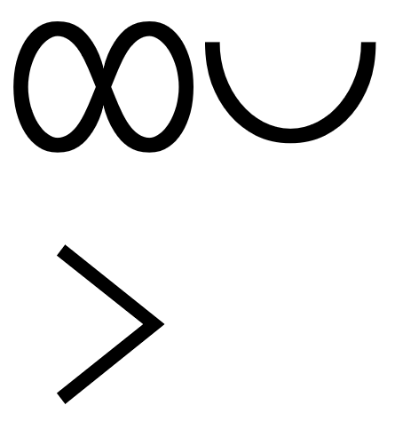
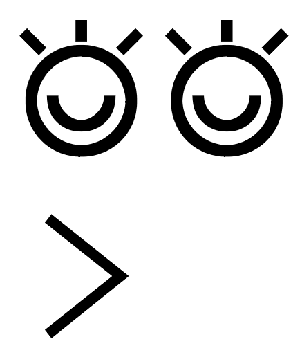
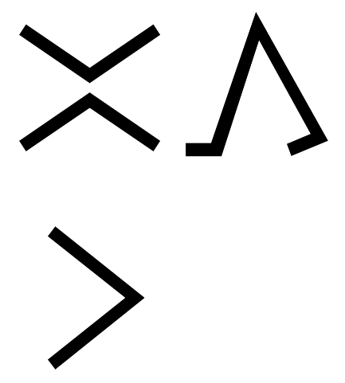
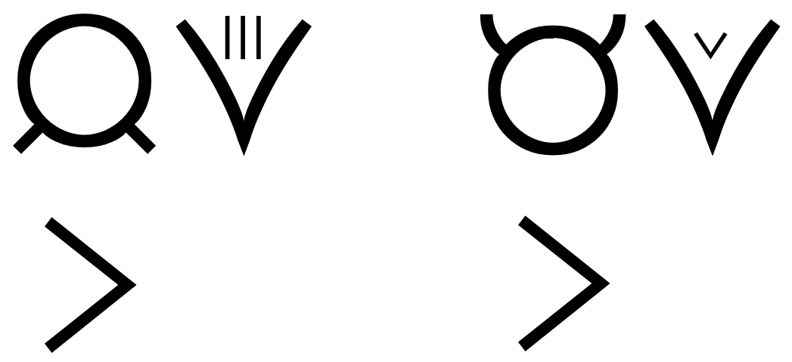
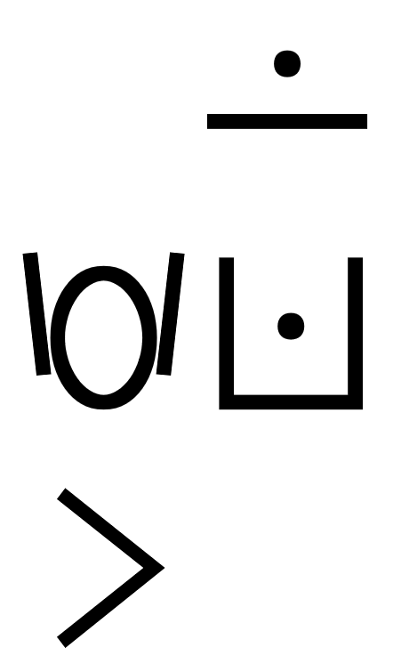
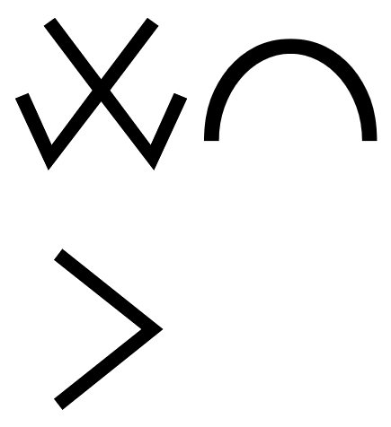
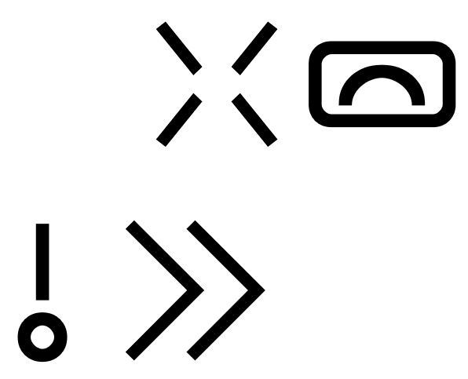

# Community Toki Pona ([ꜱᴏɴᴊᴀ](http://www.amazon.com/gp/product/0978292308))

## ɴᴏᴜɴ to ᴠᴇʀʙ

The ***direct object*** of **pana** / the ***object*** of **kepeken** can become a [ᴠᴇʀʙ](#verb).

| ona li pana e telo tawa kasi. / ona li kepeken telo lon kasi. → ona li telo e kasi. |
|:-|
| *She gives water to the plant.* / *She uses water on the plant.* → *She waters the plant.* |

## Terminology

[ꜱᴏɴᴊᴀ](sonja.md#lesson-11) introduces [ɴᴏᴜɴ](#noun)s and (simple) [ɴᴏᴜɴ-ᴘʜʀᴀꜱᴇ](#noun)s as [ɴᴏᴜɴ-ɢʀᴏᴜᴘ](#noun)s.

...

[ꜱᴏɴᴊᴀ](#lesson-6) introduces ᴀᴅᴠᴇʀʙs as ᴀᴅᴊᴇᴄᴛɪᴠᴇs. Apparently, she conflates ᴀᴅᴊᴇᴄᴛɪᴠᴇs with ᴍᴏᴅɪꜰɪᴇʀs (i.e. ᴀᴅᴊᴇᴄᴛɪᴠᴇs and ᴀᴅᴠᴇʀʙs).

| mute | pona mute |
|:-|:-|
| ᴀᴅᴠᴇʀʙ ⇒ ᴀᴅᴊᴇᴄᴛɪᴠᴇ *very* | *very good* |

[ꜱᴏɴᴊᴀ](#what-is-toki-pona) introduces ***predicates*** as ᴠᴇʀʙs. Apparently, she conflates ᴠᴇʀʙs with ᴠᴇʀʙ slots (i.e. ***predicates***).

| li lete |
|:-|
| ***predicate*** → ᴠᴇʀʙ *is cold* |

[ꜱᴏɴᴊᴀ](#lesson-9) introduces proper names as ᴀᴅᴊᴇᴄᴛɪᴠᴇs. Yet, multiple consecutive proper name elements don't need **pi**. Apparently, ꜱᴏɴᴊᴀ conflates ᴀᴅᴊᴇᴄᴛɪᴠᴇs with ɪɴᴛʀᴀɴꜱɪᴛɪᴠᴇ ᴘᴀʀᴛɪᴄʟᴇs for names.

| nimi ona li Epawan Linkan. | jan Epawan Linkan | tomo nanpa wan |
|:-|:-|:-|
| *His name was Abraham Lincoln.* | *Abraham Lincoln* | *room #1* |

## Corpus

### Preface

| toki insa |
|:-|
| *thought* |

| ilo lipu | lipu sona |
|:-|:-|
| ~~the Web~~; *browser*, *editor* | *web page*, *the Web* |

### What Is Toki Pona?

### Limitations

| waso wawa | waso nasa |
|:-|:-|
| *eagle* | *chicken* |

| tomo tawa | ilo tawa | kiwen tawa |
|:-|:-|:-|
| *car* | *car* | *car*, *hard object that moves*, 👍 *projectile* |

### Lesson 1
*(Letters and Sounds)*

### Lesson 2
*(Words and Sentences)*

### Lesson 3
*(Nouns and Adjectives)*

| tomo suli |
|:-|
| *palace* |

| jan pona |
|:-|
| *friend* |

| meli lili | telo suli |
|:-|:-|
| *girl* | *sea* |

| telo kili | tomo telo |
|:-|:-|
| *juice* | *bathroom* |

| soweli lili | jan lili |
|:-|:-|
| *kitten* | *baby* |

| kili telo |
|:-|
| *watermelon* |

### Lesson 4
*(You and I)*

* tomo soweli - doghouse
* tomo lipu - library

### Lesson 5
*(Verbs)*

* jan toki - messenger
* tomo sona - school
* jan pali - worker

### Lesson 6
*(More Adjectives)*

* jan sona - scholar
* kute ike - to mishear
* 👍 nasa ike - annoying
* jan ala - nobody

### Lesson 7
*(Questions and Answers)*

* ilo toki - telephone
* kala wawa - shark
* ilo moku - spoon

### Lesson 8
*(Prepositions)*

* jan toki - speaker
* jan kute - listener

### Lesson 9
*(Proper Names)*

* ma tomo - city
* nena sewi - hill sanctuary

### Lesson 10
*(Greetings and Feelings)*

* kama pona! - Welcome!
* tawa pona! - Good departure!
* pilin ike - sad
* pona! - Thank you!
* pilin pona - happy

### Lesson 11
*(pi)*

* mije sona - scholar
* tenpo suno ni - today
* pona mute - excellent
* sijelo pona - healthy
* ilo tenpo suno - sundial
* mama mama - grandparents
* tomo tawa - vehicle
* ma kasi - garden
* ma utala - battlefield

### Lesson 12
*(Numbers)*

* jan ale - everyone
* nanpa wan - first
* nanpa tu tu - fourth
* jan utala - warrior
* nanpa luka - fifth
* tu tu - four
* jan ale - everybody

### Lesson 13
*(Pre-Verbs)*

* kama sona - learning
* kama awen lon - settling
* jan lili - children
* tawa lon telo - swimming
* ma mama - motherland

### Lesson 14
*(Colours and la)*

* tenpo pimeja ni - tonight
* soweli wawa - bear
* tenpo suno kama - tomorrow
* pilin pona - feeling good

### Lesson 15
*(Spatial Nouns)*

* 👍 pi noka suli - deep
* telo suli - ocean

### Lesson 16
*(Particles and Perspective)*

* ma mama - fatherland
* nanpa tu - second

### Lesson 17
*(Hunting Adventure)*

* kama tawa tomo jan - to visit someone
* ma kasi - forest
* ilo alasa - bow

### Lesson 18
*(Cooking Adventure)*

* lape lili - napping
* soweli lili - hare
* moku pona - bon appétit

### Lesson 19
*(The Frontier)*

* 👍 o pilin pona o pu!

### Toki Pona Proverbs

* ante li kama. - Times change.
* jan sona - sage
* jan nasa - fool
* jan sona - genius
* jan poka - neighbour
* pali li pana e sona. - One learns by experience.
* kama jo - receive
* wile sona - curious
* (toki e) wile sona - asking questions
* weka e ike - cleanse
* pana e pona - love, take care of

|  | 
|:--| 
| *ale li jo e tenpo.* |

|  | 
|:--| 
| *ale li pona.* | 

|  | 
|:--| 
| *toki pona li toki pona.* | 

|  | 
|:--| 
| *ante li kama.* | 

|  | 
|:--| 
| *ike li kama.* | 

|  | 
|:--| 
| *jan li suli mute. mani li suli lili.* | 

|  | 
|:--| 
| *jan sona li jan nasa.* | 

|  | 
|:--| 
| *lupa meli li mama pi ijo ale.* | 

|  | 
|:--| 
| *mi pona e ale mi, la mi pona e mi.* | 

|  | 
|:--| 
| *nasin pona li mute.* | 

|  | 
|:--| 
| *o olin e jan poka.* | 

|  | 
|:--| 
| *o sona e sina.* | 

|  | 
|:--| 
| *pali li pana e sona.* | 

|  | 
|:--| 
| *pilin pona li pana e sijelo pona.* | 

|  | 
|:--| 
| *sina pana e ike, la sina kama jo e ike.* | 

|  | 
|:--| 
| *wawa li lon insa.* | 

|  | 
|:--| 
| *weka lili li pona tawa lawa.* | 

|  | 
|:--| 
| *wile sona li mute e sona.* | 

|  | 
|:--| 
| *jan lili li sona ala e ike.* | 

|  | 
|:--| 
| *meli li nasa e mije.* | 

|  | 
|:--| 
| *mi weka e ike jan, la mi weka e ike mi.* | 

|  | 
|:--| 
| *nasin ante li pona tawa jan ante.* | 

|  | 
|:--| 
| *telo li pona.* | 

|  | 
|:--| 
| *lape li pona.* | 

|  | 
|:--| 
| *toki li pona.* | 

|  | 
|:--| 
| *o pana e pona tawa ma.* | 

|  | 
|:--| 
| *utala li ike.* | 

### Famous Quotations

* nanpa wan - fundamental
* nanpa wan - ultimate

|  | 
|:--| 
| *o weka e nimi ike.* | 

|  | 
|:--| 
| *sina sona e toki wan taso, la sina sona ala e toki ni.* | 

|  | 
|:--| 
| *toki sina en pali sina li sama, la sina pilin pona.* | 

|  | 
|:--| 
| *sewi li lon ala, li lon ale.* | 

|  | 
|:--| 
| *sina wile ante e ale, la o ante e sina.* | 

|  | 
|:--| 
| *wile sona nanpa wan li ni: ale li pona anu ike?* | 

|  | 
|:--| 
| *sona pona li ni: o weka e ike.* | 

|  | 
|:--| 
| *nasin pona li pona nanpa wan.* | 

|  | 
|:--| 
| *sina ken ala toki e ijo lon toki pona, la sina sona pona ala e ona.* | 

### The Torah

### The Gospel

* tawa lili - to go on a little farther
* toki tawa sewi - to pray
* jan lawa - ruler
* jan sona - teacher
* kama lon tenpo sewi - to inherit eternal life
* 👍 pana e nimi pona tawa - to praise
* jan ala - no one
* ijo ala - nothing

### The Qur'an

* kalama sewi - recital

### The Ant's Chapter

### Writings of Bahá'u'lláh

* nasin lawa - code of laws
* ilo sitelen - pen
* toki sewi - revelation
* kepeken sona - meditating
* jo lili - poor
* jo mute - wealthy
* lon la sina lon. - You [are] the Self-Subsisting.

### Short Obligatory Prayer

### Official Toki Pona Dictionary

--

+ kama ante (change)

--

🤔 [**Sonja**](lipu-pi-toki-pona.md#the-quran) doesn't use "ala" as a ᴄᴏʀʀᴇʟᴀᴛɪᴠᴇ, i.e. she distinguishes between "nothing" ("ijo ala") and "nothingness" (ala). ([**Pije**](http://tokipona.net/tp/janpije/okamasona8.php) doesn't make that distinction and uses "ala" as a ᴄᴏʀʀᴇʟᴀᴛɪᴠᴇ, i.e. it implies "ijo" by default.)

| ala li sama ona. → ijo ala li sama ona. | sewi li lon ala, li lon ale. |
|:-|:-|
| *Nothing is like [God].* | *God is the tangential point between zero and infinity. (Alfred Jarry)* |

🤔 Between two [ɴᴜᴍʙᴇʀ](#number)s, the **comma** is omitted.

| palisa luka, tu → palisa luka tu |
|:-|
| *seven fingers* |

🤔 **Sonja** uses "pilin ike" and "pilin pona" as [predicate](#subject-and-predicate)s without introducing "pilin" as a ᴘʀᴇ-ᴠᴇʀʙ.
  
| jan Sulu li pilin e ni: ona li pona. → jan Sulu li pilin: pona. |
|:-|
| *Mr. Sulu is happy.* |

🤔 With "utala", the [ᴘʀᴇᴘᴏꜱɪᴛɪᴏɴ](#preposition) "tawa" becomes the ᴘᴀʀᴛɪᴄʟᴇ "e".

| ona li utala tawa jan ike. → ona li utala e jan ike. |
|:-|
| *She fights the enemy.* |

🤔 [**Sonja**](lipu-pi-toki-pona.md#short-obligatory-prayer) avoids interrupting a sentence with a **vocative**.

| mi toki wawa e ni, jan sewi o: … → jan sewi o! mi toki wawa e ni: … |
|:-|
| *I bear witness, O my God, that …* |

🤔 In front of words and after the same words negated, the ᴘᴀʀᴛɪᴄʟᴇ "anu" is omitted.

| ona li mama ala anu mama? → ona li mama ala mama? |
|:-|
| *Is she a parent?* |

🤔 — Suggested context/alternative.

| moli | ona li kama moli. → ona li moli. |
|:-|:-|
| ᴀᴅᴊᴇᴄᴛɪᴠᴇ 🤔 (kama -) **dying** | *He died.* |

🤔

| ona li pana e telo tawa kasi. → ona li telo e kasi. |
|:-|
| *She gives water to the plant.* → *She waters the plant.* |

---

