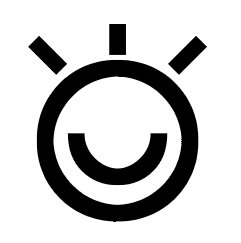
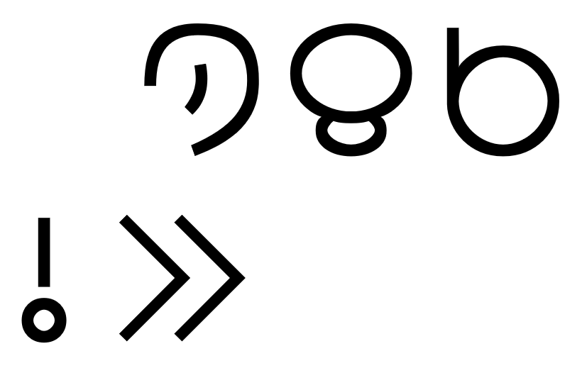
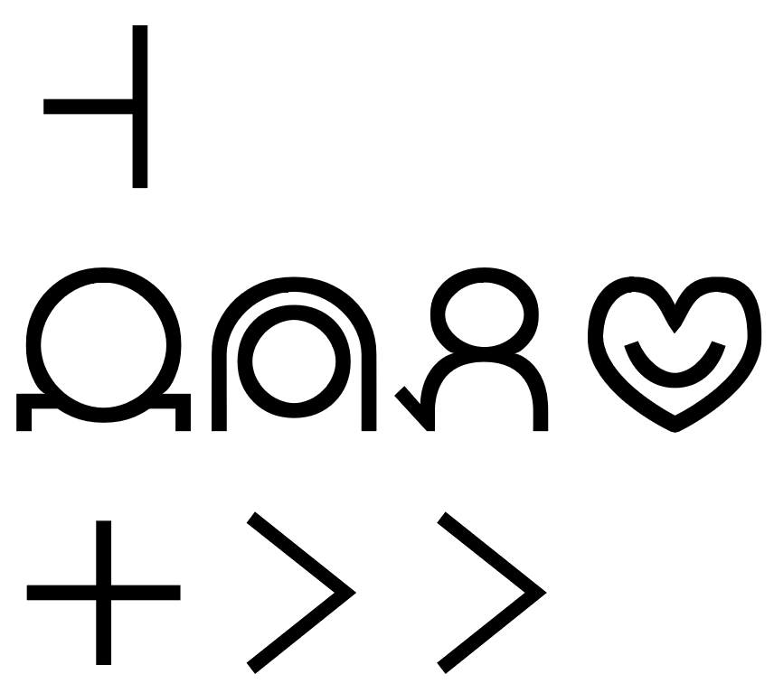

# Frontier Toki Pona (ᴛᴇᴘᴀɴ)

| |
|:-|
| [Grammar](#grammar): [ᴀᴜxɪʟɪᴀʀʏ](#auxiliary), [ꜱᴜʙᴏʀᴅɪɴᴀᴛᴇ ᴄʟᴀᴜꜱᴇ](#subordinate-clause), [ᴘᴀꜱꜱɪᴠᴇ](#passive), [ᴄᴏɴᴛᴇxᴛ](#context) |
| [Vocabulary](#vocabulary) |
| [Dictionary](#dictionary) |
| [Punctuation](#punctuation) |
| [Orthography](#orthography) |

# Grammar

A *comma* between two ᴠᴏʟɪᴛɪᴠᴇ or ɪᴍᴘᴇʀᴀᴛɪᴠᴇ ᴘʜʀᴀꜱᴇs can be safely removed.

| o pilin pona! o pu! → o pilin pona, o pu! → o pilin pona o pu! |
|:-|
| *Be happy and read the official Toki Pona book!* |

## AUXILIARY

A ᴍᴀɪɴ ᴠᴇʀʙ can have more than one ᴀᴜxɪʟɪᴀʀʏ.

| mi wile sona e toki pona. → mi wile kama sona e toki pona. |
|:-|
| I want to learn Toki Pona.

## SUBORDINATE CLAUSE

A ꜱᴜʙᴏʀᴅɪɴᴀᴛᴇ ᴄʟᴀᴜꜱᴇ can describe a *degree* or an *extent*.

| mi pali mute. tan ni la mi wile lape. → mi pali pi mute ni: mi wile lape. |
|:-|
| *I worked so much, I need to sleep.* |

A ꜱᴜʙᴏʀᴅɪɴᴀᴛᴇ ᴄʟᴀᴜꜱᴇ can be a question with **seme**, yielding a ʀᴇʟᴀᴛɪᴠᴇ ᴄʟᴀᴜꜱᴇ.

| mani li lon seme? o toki e ni. → o toki e ni: mani li lon seme. |
|:-|
| *Tell me where the money is.* |

When there is enough context, a ʀᴇʟᴀᴛɪᴠᴇ ᴄʟᴀᴜꜱᴇ can be reduced to its ᴘʀᴇᴅɪᴄᴀᴛᴇ, and the direct ᴏʙᴊᴇᴄᴛ can be omitted.

| jan ni li tawa musi lon poka pi soweli alasa. ona li … → jan ni: tawa musi lon poka pi soweli alasa, li … |
|:-|
| *The person that is dancing with wolves …* |

| mi sona e jan ni: ona li … → jan ni: mi sona, li … |
|:-|
| *The person that I know …* |

## PASSIVE

ᴠᴇʀʙs used as ɴᴏᴜɴs omit **ijo**. Without omitting **ijo**, ᴘᴀꜱꜱɪᴠᴇ can be expressed.

| soweli li moku e kala. → kala li ijo moku lon soweli. |
|:-|
| *The fish is being eaten by the cat.* |

## CONTEXT

Outside of ordinary ꜱᴇɴᴛᴇɴᴄᴇ structures, ᴘʀᴇᴘᴏꜱɪᴛɪᴏɴs can be used freely. Therefore, a *comma* between two ᴘʀᴇᴘᴏꜱɪᴛɪᴏɴᴀʟ ᴘʜʀᴀꜱᴇs can't be safely removed.

| weka lon toki ante | sewi lon ala, lon ale |
|:-|:-|
| *Lost in Translation* | *God between Zero and Infinity* |

Outside of ordinary ꜱᴇɴᴛᴇɴᴄᴇ structures and after ᴘʀᴇᴘᴏꜱɪᴛɪᴏɴs, the ᴄᴏɴᴊᴜɴᴄᴛɪᴏɴ **en** can be used freely.

| utala en pona | sewi li lon ala, li lon ale. → sewi li lon ala en ale. |
|:-|:-|
| *War and Peace* | *God is the tangential point between zero and infinity.* |

Outside of ordinary ꜱᴇɴᴛᴇɴᴄᴇ structures, the ɢᴇɴɪᴛɪᴠᴇ ᴍᴀʀᴋᴇʀ **pi** can be used freely. Therefore, a *comma* between two ɢᴇɴɪᴛɪᴠᴇ ᴘʜʀᴀꜱᴇs can't be safely removed.

| sona wawa pi kama pi ijo ale | tomo pi telo nasa, pi ma ante |
|:-|:-|
| *Big Bang Theory* | *The Foreign Bar* |

Outside of ordinary ꜱᴇɴᴛᴇɴᴄᴇ structures, **sama** be used instead of **li**.

| wan en wan li tu. → wan en wan sama tu |
|:-|
| *One and one equals two.* |

# Vocabulary

## Counting

A ɴᴜᴍʙᴇʀ can be used like a ᴛʜɪɴɢ ɴᴏᴜɴ implying *mute pi ijo …*, i.e. an *amount*.

| ɴᴜᴍʙᴇʀ tu | wan en wan sama tu |
|:-|:-|
| ᴀᴅᴊᴇᴄᴛɪᴠᴇ *two*: (*~~mute pi ijo~~ tu*) *pair* | *A singleton and a singleton are equal to a pair.* → *One plus one equals two.* |

ɴᴜᴍʙᴇʀs are multiplied rather than added (not using ꜱᴏɴᴊᴀ's ["more complex and precise counting system"](sonja.md#lesson-12)).

| tu tu | tu en tu sama tu tu |
|:-|:-|
| *two pairs* → *four* | *A pair and a pair are equal to two pairs.* – *Two plus two equals four.* |

As a ɴᴜᴍʙᴇʀ, **mute** means exactly *three*.

| tu en wan sama mute |
|:-|
| *A pair and a singleton are equal to a set.* → *Two plus one equals three.* |

## Calendar

### Week

| mun | tenpo suno pi sike esun |
|:-|:-|
| **mun**  *Moon* | **tenpo suno Mun**  *Monday* |
| **ma Seli**  *Mars* | **tenpo suno Seli**  *Tuesday* |
| **ma Telo**  *Mercury* | **tenpo suno Telo**  *Wednesday* |
| **ma Kasi**  *Jupiter* | **tenpo suno Kasi**  *Thursday* |
| **ma Kiwen**  *Venus* | **tenpo suno Kiwen**  *Friday* |
| **ma Ma**  *Saturn* | **tenpo suno Ma**  *Saturday* |
| **suno**  *Sun* | **tenpo suno Suno**  *Sunday* |

### Month

| sike mun |
|:-|
| **sike mun nanpa wan**  *January* |
| **sike mun nanpa tu**  *February* |
| **sike mun nanpa mute**  *March* |
| **sike mun nanpa tu tu**  *April* |
| **sike mun nanpa luka**  *Mai* |
| **sike mun nanpa mute tu**  *June* |
| **sike mun nanpa esun**  *July* |
| **sike mun nanpa tu tu tu**  *August* |
| **sike mun nanpa mute mute**  *September* |
| **sike mun nanpa luka tu**  *October* |
| **sike mun nanpa luka tu en wan**  *November* |
| **sike mun nanpa luka tu en tu**  *December* |

### Year

| sike suno nanpa luka tu&nbsp; luka tu&nbsp; luka tu&nbsp; tu en luka tu en tu tu |
|:-|
| *the year 2014* |

# Dictionary

| | |
|:-|:-|
| ɴᴏᴜɴ **kulupu** | *relationship* |
| ᴠᴇʀʙ **lawa** | *to arrange*, *organize* |
| ɴᴏᴜɴ **ma** | *area* |
| ɴᴏᴜɴ **monsi** | *backbone* |
| ᴀᴅᴊᴇᴄᴛɪᴠᴇ **sama** | *-self*, *-selves*; *reciprocal* |
| ɴᴏᴜɴ **tomo** | *roof* |

## [CONTENT WORD](nasin-nimi.md#content-word)

### [NOUN](nasin-nimi.md#noun)

| ɴᴏᴜɴ | ɴᴏᴜɴ | ᴀᴅᴊᴇᴄᴛɪᴠᴇ |
|:-|:-|:-|
| **ijo** | - | *something's* |

#### [PERSON](nasin-nimi.md#person)

| ᴘᴇʀꜱᴏɴ | ɴᴏᴜɴ | ᴀᴅᴊᴇᴄᴛɪᴠᴇ |
|:-|:-|:-|
| **mama** | *mother* | *of origin* |
| **mije** | - | *masculine* |

#### [THING](nasin-nimi.md#thing)

| ᴛʜɪɴɢ | ɴᴏᴜɴ | ᴀᴅᴊᴇᴄᴛɪᴠᴇ |
|:-|:-|:-|
| **jaki** | *dirt*, *poison*, *waste* | - |
| **kili** | - | *hanging* |
| **ko** | - | *semi-solid* |
| **kon** | - | *floating*, *hovering* |
| **linja** | - | *long and flexible* |
| **lipu** | - | *flat*, *thin* |
| **lete** | *frost*, *ice* | - |
| **lupa** | - | *hollow* |
| **ma** | - | *firm*: *to tie* |
| **mani** | - | *domesticated*, *refined*; *valuable* |
| **monsi** | - | *dorsal*; *endorsing* |
| **mun** | - | *sky-walking* |
| **nasin** | - | *ordinary*, *usual* |
| **nena** | - | *outstanding*, *thick* |
| **palisa** | - | *long and hard* |
| **pan** | *seed* | *falling* |
| **pimeja** | *shadow* | - |
| **poka** | - | *lateral* |
| **sijelo** | *life-form* | *alive* |
| **sinpin** | *something upright* | *upright*; *barring*, *blocking* |
| **suli** | *cargo* | *responsible* |
| **wawa** | *force* | - |

##### [AREA](nasin-nimi.md#area)

| ᴀʀᴇᴀ | ɴᴏᴜɴ | ᴀᴅᴊᴇᴄᴛɪᴠᴇ |
|:-|:-|:-|
| **awen** | …: *as long as*, *while* | *present*; *current* |
| **kama** | *upcoming*: *before*, *in the beginning* | *next* |
| **open** | *entrance* | - |
| **pini** | *end*: *after*, *in the end* | *previous*, *last*; *disappearing*; *closed*, *sealed* |
| | | |
| **nanpa** | *someone's turn* | *to be someone's turn* |
| **tenpo** | …: *for* | *transitory* |

| ᴀʀᴇᴀ | ɴᴏᴜɴ | ᴀᴅᴊᴇᴄᴛɪᴠᴇ |
|:-|:-|:-|
| **supa** | …: *on*; (lon ~~supa~~ supa) *lying* | *horizontal* |
| **weka** | *distance*: *away from* | - |

##### [TOOL](nasin-nimi.md#tool)

| ᴛᴏᴏʟ | ɴᴏᴜɴ | ᴠᴇʀʙ |
|:-|:-|:-|
| **len** | - | *to hide* |
| **luka** | - | *to manipulate*, *touch* |
| **noka** | - | *to step on*, *kick* |
| **palisa** | *finger* | *to point at* |
| **poki** | *bladder* | *to be full of*, *collect* |
| **selo** | - | *to form* |

##### [LIFE-FORM](nasin-nimi.md#life-form)

| ʟɪꜰᴇ-ꜰᴏʀᴍ | ɴᴏᴜɴ | ᴀᴅᴊᴇᴄᴛɪᴠᴇ |
|:-|:-|:-|
| **akesi** | *monster*: *to fear* | *cold-blooded* |
| **kala** | - | *diving*, *swimming* |
| **kasi** | - | *vegetating*; *growing* |
| **pipi** | - | *crawling*, *creeping* |
| **soweli** | *cute animal*; *Procyonidae* | *warm-blooded* |
| **waso** | - | *flying*, *winging* |

### [MODIFIER](nasin-nimi.md#modifier)

| ᴍᴏᴅɪꜰɪᴇʀ | ᴀᴅᴊᴇᴄᴛɪᴠᴇ |
|:-|:-|
| **ike** | *to deceive* |

#### [NUMBER](nasin-nimi.md#number)

| ɴᴜᴍʙᴇʀ | ᴀᴅᴊᴇᴄᴛɪᴠᴇ |
|:-|:-|
| **esun** | *7*, *seven* |
| **mute** | *3*, *three*: *set* |

#### [AUXILIARY](nasin-nimi.md#auxiliary)

| ᴀᴜxɪʟɪᴀʀʏ | ᴀᴜxɪʟɪᴀʀʏ | ᴠᴇʀʙ |
|:-|:-|:-|
| **pilin** | *to feel like* | *to have the impression that* |

| ᴀᴜxɪʟɪᴀʀʏ | ᴀᴜxɪʟɪᴀʀʏ | ᴠᴇʀʙ |
|:-|:-|:-|
| **awen** | - | *to continue* |
| **kama** | - | *achieve*; *let* |
| **open** | *to be ready to* | *to set up* |
| **pini** | *to stop -ing* | - |
| | | |
| **nanpa** | *to be someone's turn to* | *to iterate*; *count*; *calculate* |
| **tenpo** | *to be busy with* | - |

#### [PREPOSITION](nasin-nimi.md#preposition)

| ᴘʀᴇᴘᴏꜱɪᴛɪᴏɴ | ᴘʀᴇᴘᴏꜱɪᴛɪᴏɴ | ᴀᴅᴊᴇᴄᴛɪᴠᴇ |
|:-|:-|:-|
| **ante** | *instead of* | : *than*, *unlike* |
| **esun** | - | : *exchange* |
| **sin** | *in addition to*, *with* | - |
| **taso** | *free from*, *independent from*, *without* | *just* |

## [PARTICLE](nasin-nimi.md#particle)

### [PHRASE MARKER](nasin-nimi.md#phrase-marker)

### [CONJUNCTION](nasin-nimi.md#conjunction)

### [SOUND](nasin-nimi.md#sound)

| ꜱᴏᴜɴᴅ | ᴘᴀʀᴛɪᴄʟᴇ | ᴀᴅᴠᴇʀʙ |
|:-|:-|:-|
| **a** | - | *indeed*; *still*, *too*; *yes* |
| **ala** | *(negation)* | *not*, *no* |
| **mu** | *(indifference)* | *-ish*, *sort-of*; *blah* |

## Synonyms

| | | | |
|:-|:-|:-|:-|
| **ante** | *altered*, *changed*, *different* | **esun** | *other* |
| **kulupu** | *community*, *company*, *group*, *nation*, *society*, *tribe* | **mute** | *multitude*, *set* |
| | | **lawa** | *arrangement*, *organization* |
| **noka** | *lowest part* | **anpa** | *area below or under* |
| **open** | *to turn on* | **kama** | *to begin*, *start* |
| **sewi** | *area above* | **lawa** | *highest part* |
| **tawa** | *moving* | **tan** | *departure* |

# Punctuation

For didactical purposes, safely removed *commas* remain.

| ona li lili, li lete. |
|:-|
| *It is small and cold.* |

For didactical purposes, omitted words are represented by *hiphens*, *apostrophes* and other symbols.

| | |
|:-|:-|
| **toki ~~pi~~ pona** | **toki-pona** |
| **mi ~~li~~ sin.** | **mi ' sin.** |
| **mije li sona ~~e ijo~~.** | **mije li sona '.** |
| **~~ijo~~ ale li pona.** | **'-ale li pona.** |
| **ona li wile ~~e ni: ona li~~ lape.** | **ona li wile÷lape.** |

For didactical purposes, ꜱᴏᴜɴᴅ ᴘᴀʀᴛɪᴄʟᴇs following a ɴᴏᴜɴ ᴘʜʀᴀꜱᴇ have a *colon*. ᴘʀᴇᴘᴏꜱɪᴛɪᴏɴᴀʟ ᴘʜʀᴀꜱᴇs describing a *perception* also have a *colon*.

| |
|:-|
| **jan:Sonja** |
| **toki:nanpa:wan** |
| **mi lukin e meli-pimeja: lon sinpin-tomo.** |

# Orthography
*(nasin sitelen pi [toki pona](README.md))*

| |
|:-|
| [Ascii](#ascii) |
| [Playful Hieroglyphs](#playful-hieroglyphs) |
| [Emoji](#emoji) |

## Ascii

| nanpa wan la o pu. → `#1)` o pu. |
|:-|
| *First, consult the official Toki Pona book.* |

| tu tu → `4` → `2×2` | tu en tu sama tu tu → `2+2 = 2×2` |
|:-|:-|
| *four* | *two plus two equals four* |

## Playful Hieroglyphs
*(sitelen pona musi)*

|  |   |  |  |  |
|:--:|:--:|:--:|:--:|:--:|
| **toki pona** | **sitelen pona musi** | **sina suli a!** | **ma Kanata** | **toki nanpa wan** |

ᴘʜʀᴀꜱᴇ ᴍᴀʀᴋᴇʀs are written below.

|  |  |  |  |
|:--:|:--:|:--:|:--:|
| **ale li pona.** | **jan ala li ike.** | **mi o moku e ijo pona.** | **o kute e mama sina.** |

ᴘʀᴇᴘᴏꜱɪᴛɪᴏɴs are written above.

|  |  |  |  |
|:--:|:--:|:--:|:--:| 
| **mi lon tomo.** | **wawa li lon insa.** | **mi pana e kala tawa ona lon tomo.** | **tan seme la soweli wawa pimeja li moku e ona?** |

ᴀᴜxɪʟɪᴀʀɪᴇs are written above.

|  |
|:--:| 
| **mi kama sona e toki pona.** |

ꜱᴜʙᴏʀᴅɪɴᴀᴛᴇ ᴄʟᴀᴜꜱᴇs are written below **ni**.

|  |
|:--:| 
| **mi sona e ni: mi anpa.** |

If **ni:** is missing, the ꜱᴜʙᴏʀᴅɪɴᴀᴛᴇ ᴄʟᴀᴜꜱᴇ is not written below.

|  |
|:--:| 
| *~~lon ni,~~ mi pona tawa jan, la jan li pona tawa mi.** |

**taso** is written above.

|  |
|:--:| 
| **taso mije en meli li pali li pilin pona.** |

ᴄᴏʀʀᴇʟᴀᴛɪᴠᴇs, ɴᴜᴍʙᴇʀs, ᴘʀᴏɴᴏᴜɴs and simple ɴᴏᴜɴs don't become part of another ɴᴏᴜɴ in general. They can only become part of another simple ɴᴏᴜɴ.

|  |
|:--:| 
| **mi weka e ike jan, la mi weka e ike mi.** |

## Toki Pona Proverbs

|  | 
|:--| 
| **ale li jo e tenpo.** |

|  | 
|:--| 
| **ale li pona.** | 

|  | 
|:--| 
| **toki pona li toki pona.** | 

|  | 
|:--| 
| **ante li kama.** | 

|  | 
|:--| 
| **ike li kama.** | 

|  | 
|:--| 
| **jan li suli mute. mani li suli lili.** | 

|  | 
|:--| 
| **jan sona li jan nasa.** | 

|  | 
|:--| 
| **lupa meli li mama pi ijo ale.** | 

|  | 
|:--| 
| **mi pona e ale mi, la mi pona e mi.** | 

|  | 
|:--| 
| **nasin pona li mute.** | 

|  | 
|:--| 
| **o olin e jan poka.** | 

|  | 
|:--| 
| **o sona e sina.** | 

|  | 
|:--| 
| **pali li pana e sona.** | 

|  | 
|:--| 
| **pilin pona li pana e sijelo pona.** | 

|  | 
|:--| 
| **sina pana e ike, la sina kama jo e ike.** | 

|  | 
|:--| 
| **wawa li lon insa.** | 

|  | 
|:--| 
| **weka lili li pona tawa lawa.** | 

|  | 
|:--| 
| **wile sona li mute e sona.** | 

|  | 
|:--| 
| **jan lili li sona ala e ike.** | 

|  | 
|:--| 
| **meli li nasa e mije.** | 

|  | 
|:--| 
| **mi weka e ike jan, la mi weka e ike mi.** | 

|  | 
|:--| 
| **nasin ante li pona tawa jan ante.** | 

|  | 
|:--| 
| **telo li pona.** | 

|  | 
|:--| 
| **lape li pona.** | 

|  | 
|:--| 
| **toki li pona.** | 

|  | 
|:--| 
| **o pana e pona tawa ma.** | 

|  | 
|:--| 
| **utala li ike.** | 

## Famous Quotations

|  | 
|:--| 
| **o weka e nimi ike.** | 

|  | 
|:--| 
| **sina sona e toki wan taso, la sina sona ala e toki ni.** | 

|  | 
|:--| 
| **toki sina en pali sina li sama, la sina pilin pona.** | 

|  | 
|:--| 
| **sewi li lon ala, li lon ale.** | 

|  | 
|:--| 
| **sina wile ante e ale, la o ante e sina.** | 

|  | 
|:--| 
| **wile sona nanpa wan li ni: ale li pona anu ike?** | 

|  | 
|:--| 
| **sona pona li ni: o weka e ike.** | 

|  | 
|:--| 
| **nasin pona li pona nanpa wan.** | 

|  | 
|:--| 
| **sina ken ala toki e ijo lon toki pona, la sina sona pona ala e ona.** | 

## Emoji

| | | | | | | | | | | | |
|:-:|:-:|:-:|:-:|:-:|:-:|:-:|:-:|:-:|:-:|:-:|:-:|
| ❗ | 🐊 | 0️⃣  | 🏹 | ♾ | ⬇️ | 🔀 | ✖️ | ⏸️ | ⏩ | ➕ | 🛒 |
| a | akesi | ala | alasa | ale | anpa | ante | anu | awen | e | en | esun |
| ⚛️ | 👎 | 🔨 | 🎯  | 💩 | 👤 | 💛️ | 👜 | 🐟 | 🔉 | ⏮️ | 🌱 |
| ijo | ike | ilo | insa | jaki | jan | jelo | jo | kala | kalama | kama | kasi |
| 🇰 | 🔧 | 🍏 | 💎 | 🧹 | 💨 | 🌈 | 👥 | 👂 | ◀️ | 😴 | 💙 |
| ken | kepeken | kili | kiwen | ko | kon | kule | kulupu | kute | la | lape | laso |
| 🗿 | 👗 | ❄️ | ▶️ | 👶 | 🧵 | 📄 | ❤️ | ↕️ | 🖐️ | 👁️ | 🕳️ |
| lawa | len | lete | li | lili | linja | lipu | loje | lon | luka | lukin | lupa |
| 🏝 | 👪 | 💰 | 👩 | 👈 | 👨 | 🍽 | 💀 | ⬅️ | 😹 | 🌜 | 🃏 |
| ma | mama | mani | meli | mi | mije | moku | moli | monsi | mu | mun | musi |
| 3️⃣ | #️⃣ | 🌀 | ⛖ | 🗻 | 👇 | 💬 | 🦶 | ⏺ | 💕️ | 👆 | 🔓 |
| mute | nanpa | nasa | nasin | nena | ni | nimi | noka | o | olin | ona | open |
| 💥 | ✊ | 📏 | 🍞 | 🎁 | ⏹️ | 💗 | ⚫ | ⏭ | 🦟 | ↔️ | 📦 |
| pakala | pali | palisa | pan | pana | pi | pilin | pimeja | pini | pipi | poka | poki |
| 👍 | 📖 | 🔁 | 🔥 | 🔲 | ❓ | ⬆️ | 🏃 | ⭕ | 🌟 | 👉 | ➡️ |
| pona | pu | sama | seli | selo | seme | sewi | sijelo | sike | sin | sina | sinpin |
| 🖼 | ℹ️ | 🐈 | 🧓 | 🌞️ | 🛏 | 🍭 | ↩️ | ⏪ | ↪️ | 💧 | 🕒 |
| sitelen | sona | soweli | suli | suno | supa | suwi | tan | taso | tawa | telo | tenpo |
| 🗣 | 🏠 | 2️⃣ | 💏 | 👄 | ⚔️ | ⚪ | 1️⃣ | 🐤 | ⚡ | ➖ | 🇼 |
| toki | tomo | tu | unpa | uta | utala | walo | wan | waso | wawa | weka | wile |

* ❤️ 💙 💛 → 🔴 🔵 🟡
* 🖤 🤍 → ⚫ ⚪

